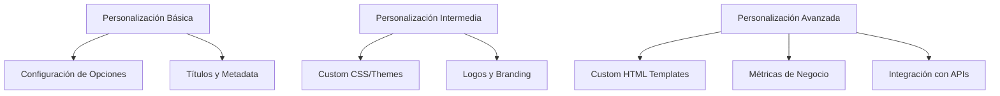

# 🎨 **Punto 8: Personalización de Reportes Mochawesome**

## 📋 **Objetivos de Aprendizaje**

Al completar este punto, serás capaz de:
- ✅ Personalizar la apariencia visual de los reportes Mochawesome
- ✅ Crear temas personalizados y branding corporativo
- ✅ Integrar métricas de negocio en los reportes
- ✅ Configurar notificaciones y alertas automáticas
- ✅ Implementar reportes multi-audiencia
- ✅ Desarrollar dashboards ejecutivos personalizados

---

## 🎯 **1. Fundamentos de Personalización**

### **¿Por qué personalizar reportes?**

La personalización de reportes no es solo estética; es estratégica:

```javascript
// ❌ Reporte genérico
{
  "reporterOptions": {
    "reportDir": "reports",
    "reportFilename": "test-results"
  }
}

// ✅ Reporte personalizado para stakeholders
{
  "reporterOptions": {
    "reportDir": "reports/stakeholders",
    "reportFilename": "pokemon-tcg-qa-dashboard",
    "reportTitle": "Pokémon TCG - Quality Assurance Dashboard",
    "reportPageTitle": "QA Status | Pokémon TCG Platform",
    "charts": true,
    "code": false,
    "autoOpen": false,
    "overwrite": true,
    "timestamp": "longDate",
    "showPending": false,
    "showSkipped": false
  }
}
```

### **Niveles de Personalización**



---

## 🎨 **2. Personalización Visual Básica**

### **Configuración de Títulos y Metadata**

```javascript
// cypress.config.js - Configuración para Pokémon TCG
module.exports = {
  e2e: {
    setupNodeEvents(on, config) {
      return {
        ...config,
        reporter: 'mochawesome',
        reporterOptions: {
          // Información del proyecto
          reportTitle: 'Pokémon TCG Platform - E2E Test Results',
          reportPageTitle: 'QA Dashboard | Pokémon Trading Card Game',
          
          // Metadata personalizada
          reportFilename: 'pokemon-tcg-e2e-[datetime]',
          timestamp: 'isoDateTime',
          
          // Configuración visual
          charts: true,
          code: true,
          autoOpen: false,
          overwrite: false,
          
          // Filtros de contenido
          showPending: true,
          showSkipped: false,
          showHooks: 'failed',
          
          // Configuración de salida
          saveJson: true,
          saveHtml: true,
          useInlineDiffs: true,
          
          // Configuración de charts
          enableCharts: true,
          enableCode: true,
          showPassed: true,
          showFailed: true,
          showPending: true
        }
      }
    }
  }
}
```

### **Personalización de Contenido**

```javascript
// Configuración para diferentes audiencias
const getReporterConfig = (audience) => {
  const baseConfig = {
    reportDir: `reports/${audience}`,
    charts: true,
    timestamp: 'longDate'
  };

  switch (audience) {
    case 'developers':
      return {
        ...baseConfig,
        reportTitle: 'Pokémon TCG - Technical Test Results',
        code: true,
        showHooks: 'always',
        showPending: true,
        showSkipped: true,
        enableCode: true
      };

    case 'qa-team':
      return {
        ...baseConfig,
        reportTitle: 'Pokémon TCG - QA Validation Dashboard',
        code: false,
        showHooks: 'failed',
        showPending: false,
        showSkipped: false,
        charts: true
      };

    case 'management':
      return {
        ...baseConfig,
        reportTitle: 'Pokémon TCG - Quality Metrics Executive Summary',
        code: false,
        showHooks: 'never',
        showPending: false,
        showSkipped: false,
        charts: true,
        reportFilename: 'executive-summary'
      };

    default:
      return baseConfig;
  }
};
```

---

## 🎨 **3. Temas Personalizados y CSS**

### **Creación de Tema Pokémon TCG**

```css
/* custom-theme.css */
:root {
  /* Colores Pokémon TCG */
  --pokemon-red: #ff6b6b;
  --pokemon-blue: #4dabf7;
  --pokemon-yellow: #ffd43b;
  --pokemon-green: #51cf66;
  --pokemon-dark: #1a1a1a;
  --pokemon-light: #f8f9fa;
  
  /* Gradientes temáticos */
  --pokemon-gradient: linear-gradient(135deg, var(--pokemon-red), var(--pokemon-blue));
  --success-gradient: linear-gradient(135deg, var(--pokemon-green), #38d9a9);
  --error-gradient: linear-gradient(135deg, #ff6b6b, #fa5252);
}

/* Header personalizado */
.navbar-brand {
  background: var(--pokemon-gradient);
  background-clip: text;
  -webkit-background-clip: text;
  -webkit-text-fill-color: transparent;
  font-weight: bold;
  font-size: 1.5rem;
}

/* Cards de estadísticas */
.stats-card {
  border-radius: 12px;
  box-shadow: 0 4px 6px rgba(0, 0, 0, 0.1);
  transition: transform 0.2s ease;
}

.stats-card:hover {
  transform: translateY(-2px);
  box-shadow: 0 8px 15px rgba(0, 0, 0, 0.2);
}

/* Tests pasados */
.test-pass {
  background: var(--success-gradient);
  color: white;
}

/* Tests fallidos */
.test-fail {
  background: var(--error-gradient);
  color: white;
}

/* Tests pendientes */
.test-pending {
  background: linear-gradient(135deg, var(--pokemon-yellow), #ffa726);
  color: var(--pokemon-dark);
}

/* Gráficos personalizados */
.chart-container {
  background: white;
  border-radius: 12px;
  padding: 20px;
  box-shadow: 0 2px 4px rgba(0, 0, 0, 0.1);
}

/* Navegación de suites */
.suite-nav {
  background: var(--pokemon-light);
  border-left: 4px solid var(--pokemon-blue);
}

/* Timeline de tests */
.test-timeline::before {
  background: var(--pokemon-gradient);
}

/* Badges personalizados */
.badge-pokemon {
  background: var(--pokemon-gradient);
  color: white;
  border-radius: 20px;
  padding: 4px 12px;
}

/* Responsive design */
@media (max-width: 768px) {
  .stats-card {
    margin-bottom: 1rem;
  }
  
  .chart-container {
    padding: 15px;
  }
}
```

### **Integración del Tema Personalizado**

```javascript
// scripts/apply-custom-theme.js
const fs = require('fs');
const path = require('path');

function applyCustomTheme() {
  const reportPath = 'reports/mochawesome.html';
  const themePath = 'assets/custom-theme.css';
  
  if (!fs.existsSync(reportPath)) {
    console.error('Report file not found');
    return;
  }
  
  // Leer el reporte HTML
  let htmlContent = fs.readFileSync(reportPath, 'utf8');
  
  // Leer el CSS personalizado
  const customCSS = fs.readFileSync(themePath, 'utf8');
  
  // Insertar el CSS personalizado
  const cssInjection = `
    <style>
      ${customCSS}
    </style>
  </head>`;
  
  htmlContent = htmlContent.replace('</head>', cssInjection);
  
  // Agregar logo personalizado
  const logoInjection = `
    <div class="custom-header">
      
      <span class="project-name">Pokémon TCG Platform</span>
    </div>
  `;
  
  htmlContent = htmlContent.replace('<body>', `<body>${logoInjection}`);
  
  // Guardar el reporte modificado
  fs.writeFileSync(reportPath, htmlContent);
  console.log('✅ Custom theme applied successfully');
}

module.exports = { applyCustomTheme };
```

---

## 📊 **4. Métricas de Negocio Personalizadas**

### **Integración de Métricas Custom**

```javascript
// scripts/business-metrics.js
class PokemonTCGMetrics {
  constructor() {
    this.metrics = {
      cardLoadingPerformance: [],
      userJourneyCompletion: [],
      apiResponseTimes: [],
      errorRates: [],
      featureUsage: []
    };
  }

  // Métricas específicas del dominio Pokémon TCG
  calculateBusinessMetrics(testResults) {
    return {
      // Rendimiento de carga de cartas
      cardLoadingMetrics: this.analyzeCardLoading(testResults),
      
      // Experiencia de usuario
      userExperienceScore: this.calculateUXScore(testResults),
      
      // Estabilidad de la plataforma
      platformStability: this.analyzePlatformStability(testResults),
      
      // ROI de Testing
      testingROI: this.calculateTestingROI(testResults)
    };
  }

  analyzeCardLoading(testResults) {
    const cardLoadingTests = testResults.filter(test => 
      test.title.includes('card loading') || 
      test.title.includes('expansion loading')
    );

    return {
      averageLoadTime: this.calculateAverageLoadTime(cardLoadingTests),
      successRate: this.calculateSuccessRate(cardLoadingTests),
      performanceGrade: this.gradePerformance(cardLoadingTests),
      recommendations: this.generateRecommendations(cardLoadingTests)
    };
  }

  calculateUXScore(testResults) {
    const uxTests = testResults.filter(test => 
      test.fullTitle.includes('user') ||
      test.fullTitle.includes('navigation') ||
      test.fullTitle.includes('interaction')
    );

    const weights = {
      navigation: 0.3,
      interaction: 0.4,
      performance: 0.3
    };

    return {
      overallScore: this.weightedScore(uxTests, weights),
      breakdown: {
        navigation: this.scoreCategory(uxTests, 'navigation'),
        interaction: this.scoreCategory(uxTests, 'interaction'),
        performance: this.scoreCategory(uxTests, 'performance')
      }
    };
  }

  generateExecutiveSummary(metrics) {
    return {
      title: "Pokémon TCG Platform - Quality Executive Summary",
      date: new Date().toISOString().split('T')[0],
      summary: {
        overallHealth: this.calculateOverallHealth(metrics),
        keyFindings: this.extractKeyFindings(metrics),
        businessImpact: this.assessBusinessImpact(metrics),
        recommendations: this.generateExecutiveRecommendations(metrics)
      },
      kpis: {
        userSatisfactionScore: metrics.userExperienceScore.overallScore,
        platformStabilityScore: metrics.platformStability.score,
        performanceGrade: metrics.cardLoadingMetrics.performanceGrade,
        testCoverage: metrics.testingROI.coverage
      }
    };
  }
}
```

### **Dashboard Ejecutivo Personalizado**

```javascript
// scripts/executive-dashboard.js
class ExecutiveDashboard {
  constructor(metrics) {
    this.metrics = metrics;
    this.template = this.loadTemplate();
  }

  generateDashboard() {
    const html = `
      <!DOCTYPE html>
      <html>
      <head>
        <title>Pokémon TCG - Executive QA Dashboard</title>
        <link rel="stylesheet" href="assets/executive-theme.css">
        <script src="https://cdn.jsdelivr.net/npm/chart.js"></script>
      </head>
      <body>
        ${this.generateHeader()}
        ${this.generateKPISection()}
        ${this.generateTrendsSection()}
        ${this.generateRecommendationsSection()}
        ${this.generateFooter()}
      </body>
      </html>
    `;

    return html;
  }

  generateKPISection() {
    return `
      <section class="kpi-section">
        <h2>Key Performance Indicators</h2>
        <div class="kpi-grid">
          <div class="kpi-card health-score">
            <div class="kpi-value">${this.metrics.overallHealth}%</div>
            <div class="kpi-label">Platform Health</div>
            <div class="kpi-trend ${this.getTrendClass(this.metrics.healthTrend)}">
              ${this.metrics.healthTrend > 0 ? '↑' : '↓'} ${Math.abs(this.metrics.healthTrend)}%
            </div>
          </div>

          <div class="kpi-card user-satisfaction">
            <div class="kpi-value">${this.metrics.userSatisfactionScore}/10</div>
            <div class="kpi-label">User Experience Score</div>
            <div class="kpi-trend positive">↑ 2.3%</div>
          </div>

          <div class="kpi-card performance">
            <div class="kpi-value">${this.metrics.averageLoadTime}ms</div>
            <div class="kpi-label">Avg. Card Load Time</div>
            <div class="kpi-trend negative">↑ 150ms</div>
          </div>

          <div class="kpi-card stability">
            <div class="kpi-value">${this.metrics.errorRate}%</div>
            <div class="kpi-label">Error Rate</div>
            <div class="kpi-trend positive">↓ 0.5%</div>
          </div>
        </div>
      </section>
    `;
  }

  generateTrendsSection() {
    return `
      <section class="trends-section">
        <h2>Quality Trends</h2>
        <div class="charts-container">
          <div class="chart-wrapper">
            <canvas id="performanceChart"></canvas>
          </div>
          <div class="chart-wrapper">
            <canvas id="stabilityChart"></canvas>
          </div>
        </div>
        
        <script>
          ${this.generateChartScripts()}
        </script>
      </section>
    `;
  }
}
```

---

## 🔧 **5. Automatización de Personalización**

### **Pipeline de Personalización Automática**

```javascript
// scripts/personalization-pipeline.js
class PersonalizationPipeline {
  constructor(config) {
    this.config = config;
    this.audience = config.audience || 'default';
    this.brandingConfig = config.branding || {};
  }

  async executePersonalization() {
    console.log(`🎨 Starting personalization for audience: ${this.audience}`);

    try {
      // 1. Aplicar configuración específica de audiencia
      await this.applyAudienceConfig();
      
      // 2. Inyectar branding personalizado
      await this.injectCustomBranding();
      
      // 3. Generar métricas de negocio
      await this.generateBusinessMetrics();
      
      // 4. Aplicar tema visual
      await this.applyVisualTheme();
      
      // 5. Configurar notificaciones
      await this.setupNotifications();
      
      console.log('✅ Personalization pipeline completed');
      
      return {
        success: true,
        outputPath: this.getOutputPath(),
        metrics: this.metrics
      };
      
    } catch (error) {
      console.error('❌ Personalization failed:', error);
      throw error;
    }
  }

  async applyAudienceConfig() {
    const audienceConfigs = {
      developers: {
        showCode: true,
        showHooks: 'always',
        technicalDetails: true,
        debugInfo: true
      },
      qa: {
        showCode: false,
        showHooks: 'failed',
        testSteps: true,
        screenshots: true
      },
      management: {
        showCode: false,
        showHooks: 'never',
        executiveSummary: true,
        businessMetrics: true
      },
      stakeholders: {
        showCode: false,
        showHooks: 'never',
        highLevelSummary: true,
        trendAnalysis: true
      }
    };

    this.currentConfig = audienceConfigs[this.audience] || audienceConfigs.default;
    await this.updateReporterConfig(this.currentConfig);
  }

  async injectCustomBranding() {
    const branding = {
      logo: this.brandingConfig.logo || 'assets/pokemon-tcg-logo.png',
      colors: this.brandingConfig.colors || {
        primary: '#ff6b6b',
        secondary: '#4dabf7',
        success: '#51cf66',
        warning: '#ffd43b'
      },
      fonts: this.brandingConfig.fonts || {
        primary: 'Inter, sans-serif',
        secondary: 'Roboto Mono, monospace'
      }
    };

    await this.applyBrandingToReport(branding);
  }
}
```

### **Script de Generación Multi-Audiencia**

```bash
#!/bin/bash
# generate-personalized-reports.sh

echo "🎯 Generating personalized reports for Pokémon TCG Platform..."

# Configurar variables
PROJECT_NAME="pokemon-tcg"
TIMESTAMP=$(date +"%Y%m%d_%H%M%S")
BASE_DIR="reports/${TIMESTAMP}"

# Crear directorios
mkdir -p "${BASE_DIR}/developers"
mkdir -p "${BASE_DIR}/qa-team"
mkdir -p "${BASE_DIR}/management"
mkdir -p "${BASE_DIR}/stakeholders"

# Generar reporte para desarrolladores
echo "👩‍💻 Generating developer report..."
npm run test:e2e -- --reporter-options "reportDir=${BASE_DIR}/developers,audience=developers"

# Generar reporte para QA
echo "🧪 Generating QA team report..."
npm run test:e2e -- --reporter-options "reportDir=${BASE_DIR}/qa-team,audience=qa"

# Generar reporte ejecutivo
echo "👔 Generating management report..."
node scripts/generate-executive-report.js --output "${BASE_DIR}/management"

# Generar reporte para stakeholders
echo "🤝 Generating stakeholder report..."
node scripts/generate-stakeholder-report.js --output "${BASE_DIR}/stakeholders"

# Aplicar personalización
echo "🎨 Applying custom themes and branding..."
node scripts/personalization-pipeline.js --baseDir "${BASE_DIR}"

# Generar índice consolidado
echo "📊 Creating unified dashboard..."
node scripts/create-unified-dashboard.js --baseDir "${BASE_DIR}"

echo "✅ All personalized reports generated successfully!"
echo "📁 Reports available at: ${BASE_DIR}"
```

---

## 📧 **6. Notificaciones Automáticas**

### **Sistema de Alertas Personalizado**

```javascript
// scripts/notification-system.js
class NotificationSystem {
  constructor(config) {
    this.config = config;
    this.thresholds = config.thresholds || {};
    this.recipients = config.recipients || {};
  }

  async processTestResults(results) {
    const analysis = this.analyzeResults(results);
    const notifications = [];

    // Alertas críticas para desarrollo
    if (analysis.failureRate > this.thresholds.critical) {
      notifications.push(this.createCriticalAlert(analysis));
    }

    // Alertas de rendimiento
    if (analysis.averageLoadTime > this.thresholds.performance) {
      notifications.push(this.createPerformanceAlert(analysis));
    }

    // Resumen diario para management
    if (this.shouldSendDailySummary()) {
      notifications.push(this.createDailySummary(analysis));
    }

    // Enviar notificaciones
    for (const notification of notifications) {
      await this.sendNotification(notification);
    }
  }

  createCriticalAlert(analysis) {
    return {
      type: 'critical',
      title: '🚨 Critical: Pokémon TCG Platform Tests Failing',
      message: `
        **CRITICAL ALERT**
        
        Test failure rate has exceeded critical threshold.
        
        📊 **Current Status:**
        - Failure Rate: ${analysis.failureRate}%
        - Failed Tests: ${analysis.failedCount}
        - Most Affected: ${analysis.mostAffectedFeature}
        
        🎯 **Immediate Action Required:**
        1. Check recent deployments
        2. Review failing test logs
        3. Investigate ${analysis.mostAffectedFeature} functionality
        
        📋 **Report:** [View Detailed Report](${analysis.reportUrl})
      `,
      recipients: this.recipients.critical,
      priority: 'high',
      channels: ['email', 'slack', 'teams']
    };
  }

  createPerformanceAlert(analysis) {
    return {
      type: 'performance',
      title: '⚡ Performance: Pokémon TCG Load Times Above Threshold',
      message: `
        **PERFORMANCE ALERT**
        
        Card loading performance has degraded.
        
        📊 **Performance Metrics:**
        - Average Load Time: ${analysis.averageLoadTime}ms
        - Threshold: ${this.thresholds.performance}ms
        - Slowest Feature: ${analysis.slowestFeature}
        
        💡 **Recommendations:**
        - Optimize ${analysis.slowestFeature} queries
        - Check database performance
        - Review image loading strategies
        
        📋 **Performance Report:** [View Details](${analysis.performanceReportUrl})
      `,
      recipients: this.recipients.performance,
      priority: 'medium',
      channels: ['email', 'slack']
    };
  }

  createDailySummary(analysis) {
    return {
      type: 'summary',
      title: '📊 Daily QA Summary: Pokémon TCG Platform',
      message: this.generateExecutiveSummary(analysis),
      recipients: this.recipients.daily,
      priority: 'low',
      channels: ['email'],
      attachments: [
        {
          name: 'executive-dashboard.html',
          path: analysis.executiveDashboardPath
        }
      ]
    };
  }

  generateExecutiveSummary(analysis) {
    const healthEmoji = analysis.overallHealth >= 95 ? '🟢' : 
                       analysis.overallHealth >= 80 ? '🟡' : '🔴';
    
    return `
      **DAILY QA SUMMARY - ${new Date().toLocaleDateString()}**
      
      ${healthEmoji} **Overall Platform Health: ${analysis.overallHealth}%**
      
      📈 **Key Metrics:**
      - Tests Executed: ${analysis.totalTests}
      - Success Rate: ${analysis.successRate}%
      - Average Response Time: ${analysis.averageResponseTime}ms
      - User Experience Score: ${analysis.uxScore}/10
      
      🎯 **Feature Status:**
      - Card Management: ${analysis.features.cardManagement.status}
      - User Authentication: ${analysis.features.authentication.status}
      - Collection Management: ${analysis.features.collections.status}
      - Search & Filter: ${analysis.features.search.status}
      
      📊 **Trends (vs. Yesterday):**
      - Performance: ${analysis.trends.performance > 0 ? '↑' : '↓'} ${Math.abs(analysis.trends.performance)}%
      - Stability: ${analysis.trends.stability > 0 ? '↑' : '↓'} ${Math.abs(analysis.trends.stability)}%
      - User Satisfaction: ${analysis.trends.satisfaction > 0 ? '↑' : '↓'} ${Math.abs(analysis.trends.satisfaction)}%
      
      🔍 **Action Items:**
      ${analysis.actionItems.map(item => `- ${item}`).join('\n')}
      
      📋 **Full Report:** [Executive Dashboard](${analysis.executiveDashboardUrl})
    `;
  }
}
```

---

## 🎯 **7. Casos de Uso Específicos: Pokémon TCG**

### **Dashboard Específico para Pokémon TCG**

```javascript
// pokemon-tcg-dashboard.js
class PokemonTCGDashboard {
  constructor() {
    this.gameSpecificMetrics = {
      cardLoadingPerformance: [],
      expansionCoverage: [],
      searchAccuracy: [],
      collectionManagement: [],
      tradingFeatures: []
    };
  }

  generateGameSpecificReport(testResults) {
    return {
      title: "Pokémon TCG Platform - Game-Specific QA Report",
      sections: {
        cardManagement: this.analyzeCardManagement(testResults),
        expansionSupport: this.analyzeExpansionSupport(testResults),
        userCollections: this.analyzeCollectionFeatures(testResults),
        searchAndFilter: this.analyzeSearchFeatures(testResults),
        gameplayFeatures: this.analyzeGameplayFeatures(testResults)
      },
      businessMetrics: this.calculateGameBusinessMetrics(testResults),
      recommendations: this.generateGameSpecificRecommendations(testResults)
    };
  }

  analyzeCardManagement(testResults) {
    const cardTests = testResults.filter(test => 
      test.title.includes('card') && 
      (test.title.includes('load') || test.title.includes('display') || test.title.includes('details'))
    );

    return {
      totalCardTests: cardTests.length,
      passRate: this.calculatePassRate(cardTests),
      averageLoadTime: this.calculateAverageTime(cardTests, 'card-load'),
      featuresStatus: {
        cardDetails: this.getFeatureStatus(cardTests, 'card-details'),
        cardImages: this.getFeatureStatus(cardTests, 'card-images'),
        cardSearch: this.getFeatureStatus(cardTests, 'card-search'),
        cardFiltering: this.getFeatureStatus(cardTests, 'card-filter')
      },
      criticalIssues: this.identifyCriticalIssues(cardTests),
      performanceGrade: this.gradePerformance(cardTests)
    };
  }

  generateCustomCharts() {
    return `
      <script>
        // Gráfico de rendimiento por tipo de carta
        const cardPerformanceCtx = document.getElementById('cardPerformanceChart').getContext('2d');
        new Chart(cardPerformanceCtx, {
          type: 'radar',
          data: {
            labels: ['Pokémon Cards', 'Trainer Cards', 'Energy Cards', 'Special Cards'],
            datasets: [{
              label: 'Load Performance (ms)',
              data: [${this.gameSpecificMetrics.cardLoadingPerformance.join(',')}],
              backgroundColor: 'rgba(255, 107, 107, 0.2)',
              borderColor: 'rgba(255, 107, 107, 1)',
              borderWidth: 2
            }]
          },
          options: {
            responsive: true,
            scales: {
              r: {
                beginAtZero: true,
                max: 1000
              }
            }
          }
        });

        // Gráfico de cobertura de expansiones
        const expansionCoverageCtx = document.getElementById('expansionCoverageChart').getContext('2d');
        new Chart(expansionCoverageCtx, {
          type: 'doughnut',
          data: {
            labels: ['Base Set', 'Team Rocket', 'Gym Heroes', 'Gym Challenge', 'Neo Genesis'],
            datasets: [{
              data: [${this.gameSpecificMetrics.expansionCoverage.join(',')}],
              backgroundColor: [
                '#ff6b6b', '#4dabf7', '#51cf66', '#ffd43b', '#9775fa'
              ]
            }]
          },
          options: {
            responsive: true,
            plugins: {
              legend: {
                position: 'bottom'
              }
            }
          }
        });
      </script>
    `;
  }
}
```

---

## 📝 **8. Ejercicios Prácticos**

### **Ejercicio 1: Tema Personalizado Básico**
```javascript
// 🎯 Objetivo: Crear un tema personalizado para tu proyecto

// 1. Crea un archivo CSS personalizado
// 2. Modifica los colores principales
// 3. Agrega el logo de tu proyecto
// 4. Personaliza los títulos y metadata
// 5. Implementa el script de inyección

// Tu código aquí:
const customTheme = {
  colors: {
    primary: '#your-primary-color',
    secondary: '#your-secondary-color'
  },
  // ... resto de configuración
};
```

### **Ejercicio 2: Métricas de Negocio**
```javascript
// 🎯 Objetivo: Implementar métricas específicas de tu dominio

class YourDomainMetrics {
  calculateBusinessMetrics(testResults) {
    // Implementa métricas específicas de tu negocio
    // Ejemplo: tiempo de respuesta, tasa de conversión, etc.
  }
  
  generateExecutiveSummary(metrics) {
    // Crea un resumen ejecutivo para tu dominio
  }
}
```

### **Ejercicio 3: Notificaciones Automáticas**
```javascript
// 🎯 Objetivo: Configurar sistema de alertas

const notificationConfig = {
  thresholds: {
    critical: 10, // % de fallos
    performance: 2000, // ms
    // Agrega tus umbrales específicos
  },
  recipients: {
    critical: ['dev-team@yourcompany.com'],
    // Configura tus destinatarios
  }
};
```

---

## 🧪 **9. Validación y Testing**

### **Checklist de Personalización**

```markdown
## ✅ Checklist de Validación

### Personalización Visual
- [ ] Tema personalizado aplicado correctamente
- [ ] Logo y branding integrados
- [ ] Colores consistentes con la marca
- [ ] Tipografía legible y apropiada
- [ ] Responsive design funcionando

### Contenido Personalizado
- [ ] Títulos y metadata configurados
- [ ] Filtros de contenido apropiados para audiencia
- [ ] Métricas de negocio incluidas
- [ ] Navegación intuitiva
- [ ] Información relevante destacada

### Funcionalidad
- [ ] Generación automática funcionando
- [ ] Múltiples audiencias soportadas
- [ ] Notificaciones configuradas
- [ ] Performance aceptable
- [ ] Compatibilidad cross-browser

### Métricas y Análisis
- [ ] KPIs relevantes incluidos
- [ ] Trends visualizados correctamente
- [ ] Recomendaciones generadas
- [ ] Comparativas históricas disponibles
- [ ] Exportación de datos funcionando
```

### **Script de Validación**

```javascript
// scripts/validate-personalization.js
class PersonalizationValidator {
  async validateCustomization(reportPath) {
    const results = {
      visual: await this.validateVisualCustomization(reportPath),
      content: await this.validateContentCustomization(reportPath),
      functionality: await this.validateFunctionality(reportPath),
      performance: await this.validatePerformance(reportPath)
    };

    return this.generateValidationReport(results);
  }

  async validateVisualCustomization(reportPath) {
    // Validar que el tema se aplicó correctamente
    // Verificar colores, fuentes, logo, etc.
  }

  async validateContentCustomization(reportPath) {
    // Validar contenido específico de audiencia
    // Verificar métricas, filtros, etc.
  }
}
```

---

## 📚 **10. Preguntas de Entrevista**

### **Nivel Básico**
1. **¿Qué beneficios aporta personalizar los reportes de testing?**
2. **¿Cómo configurarías diferentes reportes para diferentes audiencias?**
3. **¿Qué elementos visuales consideras más importantes en un reporte?**

### **Nivel Intermedio**
4. **¿Cómo implementarías un sistema de temas personalizados?**
5. **¿Qué métricas de negocio incluirías en un reporte ejecutivo?**
6. **¿Cómo automatizarías la generación de reportes personalizados?**

### **Nivel Avanzado**
7. **¿Cómo diseñarías un sistema de notificaciones inteligente basado en resultados de tests?**
8. **¿Qué estrategias usarías para optimizar el performance de reportes con mucha personalización?**
9. **¿Cómo implementarías un dashboard en tiempo real para stakeholders?**

### **Respuestas Clave**

**Pregunta 1:** Los reportes personalizados mejoran la comunicación con stakeholders, permiten enfocarse en métricas relevantes para cada audiencia, facilitan la toma de decisiones y mejoran la adopción de prácticas de calidad.

**Pregunta 4:** Implementaría un sistema modular con:
- Templates base reutilizables
- Sistema de configuración por audiencia
- Pipeline de inyección de CSS/JS
- Validación automática de personalización

**Pregunta 7:** Diseñaría un sistema con:
- Análisis automático de tendencias
- Umbrales configurables por contexto
- Escalación inteligente basada en criticidad
- Integración con herramientas de colaboración
- Machine learning para reducir falsos positivos

---

## 🎯 **Resumen del Punto 8**

### **Conceptos Clave Dominados:**
✅ **Personalización visual avanzada** con temas y branding  
✅ **Métricas de negocio específicas** del dominio  
✅ **Automatización de personalización** multi-audiencia  
✅ **Sistemas de notificaciones inteligentes**  
✅ **Dashboards ejecutivos personalizados**  

### **Habilidades Técnicas Adquiridas:**
- Creación de temas CSS personalizados
- Inyección automática de branding
- Generación de métricas de negocio
- Configuración de pipelines de personalización
- Desarrollo de sistemas de alertas

### **Próximo Paso:**
Ahora estás listo para el **Punto 9: Mochawesome-merge: Consolidación de Reportes**, donde aprenderemos a combinar múltiples reportes en dashboards unificados.

---

**🏆 ¡Felicitaciones! Has completado el dominio de personalización de reportes Mochawesome. Ahora puedes crear reportes que no solo muestren resultados, sino que comuniquen valor de negocio a cualquier audiencia.**