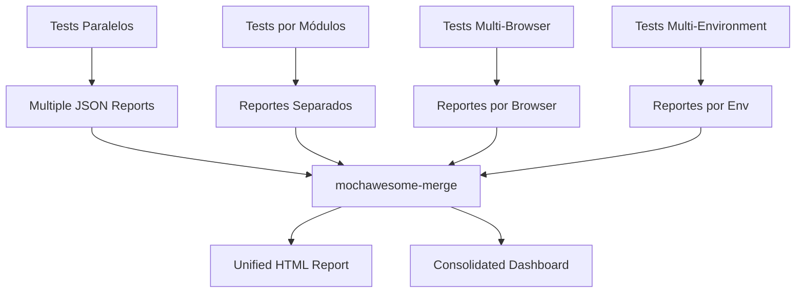

# 🔗 **Punto 9: Mochawesome-merge: Consolidación de Reportes**

## 📋 **Objetivos de Aprendizaje**

Al completar este punto, serás capaz de:
- ✅ Consolidar múltiples reportes Mochawesome en uno unificado
- ✅ Manejar ejecuciones paralelas de tests con merge automático
- ✅ Implementar dashboards distribuidos multi-proyecto
- ✅ Configurar pipelines de agregación de métricas
- ✅ Resolver conflictos y duplicados en merge de reportes
- ✅ Optimizar performance en consolidación de reportes grandes

---

## 🎯 **1. Fundamentos de Mochawesome-merge**

### **¿Por qué necesitamos consolidar reportes?**

En proyectos grandes como Pokémon TCG, tenemos múltiples escenarios:



### **Instalación y Configuración Básica**

```bash
# Instalar mochawesome-merge
npm install --save-dev mochawesome-merge

# Instalar mochawesome-report-generator para HTML final
npm install --save-dev mochawesome-report-generator
```

```javascript
// package.json - Scripts de consolidación
{
  "scripts": {
    // Tests paralelos con merge automático
    "test:parallel": "npm run test:parallel:run && npm run test:merge",
    "test:parallel:run": "cypress run --reporter mochawesome --reporter-options reportDir=reports/parallel,overwrite=false,html=false,json=true",
    
    // Merge de reportes JSON
    "test:merge": "mochawesome-merge reports/parallel/*.json > reports/merged/merged-report.json",
    
    // Generar HTML consolidado
    "test:report": "marge reports/merged/merged-report.json --reportDir reports/final --inline",
    
    // Pipeline completo
    "test:full-pipeline": "npm run test:parallel && npm run test:report",
    
    // Consolidación avanzada con métricas
    "test:advanced-merge": "node scripts/advanced-merge-pipeline.js"
  }
}
```

---

## 🔧 **2. Configuración Avanzada para Pokémon TCG**

### **Estructura de Reportes Distribuidos**

```
pokemon-tcg-ai-generator/
├── reports/
│   ├── parallel/           # Tests paralelos
│   │   ├── spec1.json
│   │   ├── spec2.json
│   │   └── spec3.json
│   ├── modules/           # Tests por módulo
│   │   ├── cards.json
│   │   ├── collections.json
│   │   └── auth.json
│   ├── browsers/          # Tests multi-browser
│   │   ├── chrome.json
│   │   ├── firefox.json
│   │   └── edge.json
│   ├── environments/      # Tests multi-environment
│   │   ├── dev.json
│   │   ├── staging.json
│   │   └── prod.json
│   ├── merged/           # Reportes consolidados
│   │   ├── parallel-merged.json
│   │   ├── cross-browser-merged.json
│   │   └── full-consolidated.json
│   └── final/            # Reportes HTML finales
│       ├── unified-dashboard.html
│       ├── executive-summary.html
│       └── technical-details.html
```

### **Configuración de Cypress para Merge**

```javascript
// cypress.config.js - Configuración para múltiples outputs
const { defineConfig } = require('cypress');

module.exports = defineConfig({
  e2e: {
    setupNodeEvents(on, config) {
      // Configuración dinámica basada en contexto
      const context = config.env.TEST_CONTEXT || 'default';
      
      const reporterOptions = {
        reportDir: `reports/${context}`,
        overwrite: false,  // IMPORTANTE: No sobrescribir para merge
        html: false,       // Solo JSON para merge
        json: true,
        reportFilename: `pokemon-tcg-${context}-[datetime]`,
        timestamp: 'isoDateTime',
        charts: false,     // Los charts se generan en el merge final
        code: false        // El código se incluye en el reporte final
      };

      return {
        ...config,
        reporter: 'mochawesome',
        reporterOptions
      };
    }
  }
});
```

### **Scripts de Ejecución Paralela**

```javascript
// scripts/parallel-test-runner.js
const { spawn } = require('child_process');
const path = require('path');

class ParallelTestRunner {
  constructor() {
    this.testSuites = [
      { name: 'cards', spec: 'cypress/e2e/cards/**/*.cy.js' },
      { name: 'collections', spec: 'cypress/e2e/collections/**/*.cy.js' },
      { name: 'auth', spec: 'cypress/e2e/auth/**/*.cy.js' },
      { name: 'search', spec: 'cypress/e2e/search/**/*.cy.js' },
      { name: 'user-management', spec: 'cypress/e2e/users/**/*.cy.js' }
    ];
  }

  async runParallelTests() {
    console.log('🚀 Starting parallel test execution...');
    
    const promises = this.testSuites.map(suite => this.runTestSuite(suite));
    
    try {
      const results = await Promise.all(promises);
      console.log('✅ All parallel tests completed');
      return results;
    } catch (error) {
      console.error('❌ Parallel test execution failed:', error);
      throw error;
    }
  }

  runTestSuite(suite) {
    return new Promise((resolve, reject) => {
      console.log(`🧪 Running ${suite.name} tests...`);
      
      const cypressProcess = spawn('npx', [
        'cypress', 'run',
        '--spec', suite.spec,
        '--env', `TEST_CONTEXT=${suite.name}`,
        '--reporter', 'mochawesome',
        '--reporter-options', 
        `reportDir=reports/parallel,reportFilename=${suite.name}-[datetime],overwrite=false,html=false,json=true`
      ], {
        stdio: 'pipe',
        shell: true
      });

      let output = '';
      let errorOutput = '';

      cypressProcess.stdout.on('data', (data) => {
        output += data.toString();
      });

      cypressProcess.stderr.on('data', (data) => {
        errorOutput += data.toString();
      });

      cypressProcess.on('close', (code) => {
        if (code === 0) {
          console.log(`✅ ${suite.name} tests completed successfully`);
          resolve({
            suite: suite.name,
            success: true,
            output
          });
        } else {
          console.error(`❌ ${suite.name} tests failed with code ${code}`);
          console.error(errorOutput);
          resolve({
            suite: suite.name,
            success: false,
            error: errorOutput,
            exitCode: code
          });
        }
      });
    });
  }
}

module.exports = { ParallelTestRunner };
```

---

## 🔀 **3. Pipeline Avanzado de Merge**

### **Script de Consolidación Inteligente**

```javascript
// scripts/advanced-merge-pipeline.js
const fs = require('fs').promises;
const path = require('path');
const { merge } = require('mochawesome-merge');
const { create } = require('mochawesome-report-generator');

class AdvancedMergePipeline {
  constructor() {
    this.reportsDir = 'reports';
    this.mergedDir = path.join(this.reportsDir, 'merged');
    this.finalDir = path.join(this.reportsDir, 'final');
    this.timestamp = new Date().toISOString().replace(/[:.]/g, '-');
  }

  async executeFullPipeline() {
    console.log('🔗 Starting advanced merge pipeline...');
    
    try {
      // 1. Preparar directorios
      await this.prepareDirectories();
      
      // 2. Merge por categorías
      const mergedReports = await this.mergeByCategories();
      
      // 3. Consolidación final
      const finalReport = await this.createFinalConsolidation(mergedReports);
      
      // 4. Generar reportes HTML especializados
      await this.generateSpecializedReports(finalReport);
      
      // 5. Crear dashboard unificado
      await this.createUnifiedDashboard(finalReport);
      
      // 6. Análisis y métricas
      const analytics = await this.generateAnalytics(finalReport);
      
      console.log('✅ Advanced merge pipeline completed successfully');
      return {
        finalReport,
        analytics,
        outputPaths: this.getOutputPaths()
      };
      
    } catch (error) {
      console.error('❌ Merge pipeline failed:', error);
      throw error;
    }
  }

  async mergeByCategories() {
    const categories = ['parallel', 'modules', 'browsers', 'environments'];
    const mergedReports = {};

    for (const category of categories) {
      const categoryDir = path.join(this.reportsDir, category);
      
      try {
        const jsonFiles = await this.findJsonFiles(categoryDir);
        
        if (jsonFiles.length > 0) {
          console.log(`🔗 Merging ${category} reports (${jsonFiles.length} files)...`);
          
          const mergedData = await merge({
            files: jsonFiles,
            reportDir: this.mergedDir
          });

          const outputPath = path.join(this.mergedDir, `${category}-merged.json`);
          await fs.writeFile(outputPath, JSON.stringify(mergedData, null, 2));
          
          mergedReports[category] = {
            data: mergedData,
            path: outputPath,
            fileCount: jsonFiles.length
          };
          
          console.log(`✅ ${category} merge completed: ${jsonFiles.length} files → 1 merged report`);
        } else {
          console.log(`⚠️ No JSON files found in ${category} directory`);
        }
      } catch (error) {
        console.warn(`⚠️ Failed to merge ${category}:`, error.message);
        mergedReports[category] = { error: error.message };
      }
    }

    return mergedReports;
  }

  async createFinalConsolidation(mergedReports) {
    console.log('🎯 Creating final consolidated report...');
    
    const validReports = Object.values(mergedReports)
      .filter(report => report.data && !report.error)
      .map(report => report.path);

    if (validReports.length === 0) {
      throw new Error('No valid merged reports found for final consolidation');
    }

    const finalMerged = await merge({
      files: validReports,
      reportDir: this.mergedDir
    });

    // Enriquecer con metadata adicional
    const enrichedReport = this.enrichReportWithMetadata(finalMerged, mergedReports);
    
    const finalPath = path.join(this.mergedDir, `pokemon-tcg-consolidated-${this.timestamp}.json`);
    await fs.writeFile(finalPath, JSON.stringify(enrichedReport, null, 2));
    
    console.log(`✅ Final consolidation completed: ${validReports.length} categories merged`);
    return enrichedReport;
  }

  enrichReportWithMetadata(report, mergedReports) {
    const metadata = {
      consolidation: {
        timestamp: new Date().toISOString(),
        categories: Object.keys(mergedReports),
        totalSourceFiles: Object.values(mergedReports)
          .reduce((sum, r) => sum + (r.fileCount || 0), 0),
        project: 'pokemon-tcg-platform',
        version: this.getProjectVersion()
      },
      breakdown: this.calculateBreakdown(mergedReports),
      performance: this.calculatePerformanceMetrics(report),
      businessMetrics: this.calculateBusinessMetrics(report)
    };

    return {
      ...report,
      metadata
    };
  }

  async generateSpecializedReports(finalReport) {
    console.log('📊 Generating specialized reports...');
    
    const reports = [
      {
        name: 'technical-details',
        config: {
          reportTitle: 'Pokémon TCG - Technical Test Details',
          reportFilename: `technical-details-${this.timestamp}`,
          charts: true,
          code: true,
          showHooks: 'always',
          showPending: true,
          showSkipped: true
        }
      },
      {
        name: 'executive-summary',
        config: {
          reportTitle: 'Pokémon TCG - Executive Quality Summary',
          reportFilename: `executive-summary-${this.timestamp}`,
          charts: true,
          code: false,
          showHooks: 'never',
          showPending: false,
          showSkipped: false
        }
      },
      {
        name: 'qa-dashboard',
        config: {
          reportTitle: 'Pokémon TCG - QA Team Dashboard',
          reportFilename: `qa-dashboard-${this.timestamp}`,
          charts: true,
          code: false,
          showHooks: 'failed',
          showPending: false,
          showSkipped: false
        }
      }
    ];

    for (const reportConfig of reports) {
      try {
        await create(finalReport, {
          reportDir: path.join(this.finalDir, reportConfig.name),
          ...reportConfig.config,
          inline: true,
          autoOpen: false
        });
        
        console.log(`✅ Generated ${reportConfig.name} report`);
      } catch (error) {
        console.error(`❌ Failed to generate ${reportConfig.name}:`, error);
      }
    }
  }

  async createUnifiedDashboard(finalReport) {
    console.log('🎨 Creating unified dashboard...');
    
    const dashboardHTML = this.generateDashboardHTML(finalReport);
    const dashboardPath = path.join(this.finalDir, `unified-dashboard-${this.timestamp}.html`);
    
    await fs.writeFile(dashboardPath, dashboardHTML);
    console.log(`✅ Unified dashboard created: ${dashboardPath}`);
  }

  generateDashboardHTML(report) {
    const stats = report.stats;
    const metadata = report.metadata;
    
    return `
<!DOCTYPE html>
<html lang="en">
<head>
    <meta charset="UTF-8">
    <meta name="viewport" content="width=device-width, initial-scale=1.0">
    <title>Pokémon TCG - Unified Test Dashboard</title>
    <link href="https://cdn.jsdelivr.net/npm/bootstrap@5.1.3/dist/css/bootstrap.min.css" rel="stylesheet">
    <script src="https://cdn.jsdelivr.net/npm/chart.js"></script>
    <style>
        ${this.getDashboardCSS()}
    </style>
</head>
<body>
    <nav class="navbar navbar-expand-lg navbar-dark bg-primary">
        <div class="container">
            <span class="navbar-brand">
                🎮 Pokémon TCG Platform - Quality Dashboard
            </span>
            <span class="navbar-text">
                Generated: ${new Date().toLocaleString()}
            </span>
        </div>
    </nav>

    <div class="container-fluid mt-4">
        <!-- KPI Row -->
        <div class="row mb-4">
            ${this.generateKPICards(stats, metadata)}
        </div>

        <!-- Charts Row -->
        <div class="row mb-4">
            <div class="col-md-6">
                <div class="card">
                    <div class="card-body">
                        <h5 class="card-title">Test Results Overview</h5>
                        <canvas id="resultsChart"></canvas>
                    </div>
                </div>
            </div>
            <div class="col-md-6">
                <div class="card">
                    <div class="card-body">
                        <h5 class="card-title">Category Breakdown</h5>
                        <canvas id="categoryChart"></canvas>
                    </div>
                </div>
            </div>
        </div>

        <!-- Details Row -->
        <div class="row">
            <div class="col-12">
                <div class="card">
                    <div class="card-body">
                        <h5 class="card-title">Test Execution Details</h5>
                        ${this.generateDetailsTable(report)}
                    </div>
                </div>
            </div>
        </div>
    </div>

    <script>
        ${this.generateChartScripts(stats, metadata)}
    </script>
</body>
</html>`;
  }

  generateKPICards(stats, metadata) {
    const successRate = ((stats.passes / stats.tests) * 100).toFixed(1);
    const avgDuration = (stats.duration / 1000 / 60).toFixed(2);
    
    return `
        <div class="col-md-3">
            <div class="card bg-primary text-white">
                <div class="card-body">
                    <h4>${stats.tests}</h4>
                    <p class="card-text">Total Tests</p>
                </div>
            </div>
        </div>
        <div class="col-md-3">
            <div class="card bg-success text-white">
                <div class="card-body">
                    <h4>${successRate}%</h4>
                    <p class="card-text">Success Rate</p>
                </div>
            </div>
        </div>
        <div class="col-md-3">
            <div class="card bg-info text-white">
                <div class="card-body">
                    <h4>${avgDuration}m</h4>
                    <p class="card-text">Avg Duration</p>
                </div>
            </div>
        </div>
        <div class="col-md-3">
            <div class="card bg-warning text-white">
                <div class="card-body">
                    <h4>${metadata.consolidation.totalSourceFiles}</h4>
                    <p class="card-text">Source Reports</p>
                </div>
            </div>
        </div>
    `;
  }
}

module.exports = { AdvancedMergePipeline };
```

---

## 🎯 **4. Manejo de Conflictos y Duplicados**

### **Detección y Resolución de Conflictos**

```javascript
// scripts/conflict-resolver.js
class ConflictResolver {
  constructor() {
    this.conflictStrategies = {
      'duplicate-test': 'merge-latest',
      'timing-mismatch': 'use-aggregate',
      'status-conflict': 'prefer-failure',
      'metadata-conflict': 'merge-all'
    };
  }

  resolveConflicts(reports) {
    console.log('🔍 Analyzing conflicts in merge data...');
    
    const conflicts = this.detectConflicts(reports);
    const resolved = this.applyResolutionStrategies(conflicts);
    
    return {
      originalReports: reports,
      conflicts,
      resolved,
      summary: this.generateConflictSummary(conflicts, resolved)
    };
  }

  detectConflicts(reports) {
    const conflicts = [];
    const testsByFullTitle = new Map();

    // Agrupar tests por fullTitle para detectar duplicados
    reports.forEach((report, reportIndex) => {
      if (report.tests) {
        report.tests.forEach(test => {
          const key = test.fullTitle;
          
          if (!testsByFullTitle.has(key)) {
            testsByFullTitle.set(key, []);
          }
          
          testsByFullTitle.get(key).push({
            test,
            reportIndex,
            reportName: report.metadata?.name || `report-${reportIndex}`
          });
        });
      }
    });

    // Detectar conflictos
    testsByFullTitle.forEach((testInstances, fullTitle) => {
      if (testInstances.length > 1) {
        const conflict = this.analyzeTestConflict(fullTitle, testInstances);
        if (conflict.hasConflict) {
          conflicts.push(conflict);
        }
      }
    });

    return conflicts;
  }

  analyzeTestConflict(fullTitle, instances) {
    const conflict = {
      testTitle: fullTitle,
      instances: instances.length,
      hasConflict: false,
      conflictTypes: [],
      resolution: null
    };

    // Verificar conflictos de estado
    const states = [...new Set(instances.map(i => i.test.state))];
    if (states.length > 1) {
      conflict.hasConflict = true;
      conflict.conflictTypes.push('status-conflict');
      conflict.states = states;
    }

    // Verificar conflictos de duración
    const durations = instances.map(i => i.test.duration);
    const avgDuration = durations.reduce((a, b) => a + b, 0) / durations.length;
    const variance = durations.some(d => Math.abs(d - avgDuration) > avgDuration * 0.5);
    
    if (variance) {
      conflict.hasConflict = true;
      conflict.conflictTypes.push('timing-mismatch');
      conflict.durations = durations;
    }

    return conflict;
  }

  applyResolutionStrategies(conflicts) {
    return conflicts.map(conflict => {
      const resolved = { ...conflict };

      conflict.conflictTypes.forEach(type => {
        const strategy = this.conflictStrategies[type];
        resolved.resolution = this.applyStrategy(strategy, conflict);
      });

      return resolved;
    });
  }

  applyStrategy(strategy, conflict) {
    switch (strategy) {
      case 'prefer-failure':
        return {
          strategy,
          action: 'Use failed status if any instance failed',
          implementation: 'status = instances.some(i => i.test.state === "failed") ? "failed" : "passed"'
        };
        
      case 'use-aggregate':
        return {
          strategy,
          action: 'Use average of all timing measurements',
          implementation: 'duration = Math.round(instances.reduce((sum, i) => sum + i.test.duration, 0) / instances.length)'
        };
        
      case 'merge-latest':
        return {
          strategy,
          action: 'Use data from most recent execution',
          implementation: 'Use instance with latest timestamp'
        };
        
      default:
        return {
          strategy: 'manual-review',
          action: 'Requires manual resolution',
          implementation: 'Flag for manual review'
        };
    }
  }
}
```

---

## 📊 **5. Optimización de Performance**

### **Procesamiento Optimizado para Reportes Grandes**

```javascript
// scripts/performance-optimized-merge.js
class PerformanceOptimizedMerge {
  constructor(options = {}) {
    this.batchSize = options.batchSize || 50;
    this.memoryLimit = options.memoryLimit || 500 * 1024 * 1024; // 500MB
    this.parallelWorkers = options.parallelWorkers || 4;
    this.compressionEnabled = options.compression || true;
  }

  async mergeWithOptimization(reportFiles) {
    console.log(`🚀 Starting optimized merge of ${reportFiles.length} reports...`);
    
    // 1. Análisis de tamaño y complejidad
    const analysis = await this.analyzeReportComplexity(reportFiles);
    
    // 2. Seleccionar estrategia de merge
    const strategy = this.selectMergeStrategy(analysis);
    
    // 3. Ejecutar merge optimizado
    const result = await this.executeMergeStrategy(strategy, reportFiles);
    
    console.log(`✅ Optimized merge completed in ${result.duration}ms`);
    return result;
  }

  async analyzeReportComplexity(reportFiles) {
    const analysis = {
      totalFiles: reportFiles.length,
      totalSize: 0,
      totalTests: 0,
      largestFile: 0,
      estimatedMemoryUsage: 0
    };

    for (const file of reportFiles) {
      try {
        const stats = await fs.stat(file);
        const size = stats.size;
        
        analysis.totalSize += size;
        if (size > analysis.largestFile) {
          analysis.largestFile = size;
        }

        // Estimar número de tests basado en tamaño del archivo
        const estimatedTests = Math.floor(size / 1024); // Aproximación
        analysis.totalTests += estimatedTests;
      } catch (error) {
        console.warn(`⚠️ Could not analyze ${file}:`, error.message);
      }
    }

    analysis.estimatedMemoryUsage = analysis.totalSize * 2.5; // Factor de overhead
    return analysis;
  }

  selectMergeStrategy(analysis) {
    if (analysis.estimatedMemoryUsage > this.memoryLimit) {
      return 'streaming';
    } else if (analysis.totalFiles > 100) {
      return 'batched';
    } else {
      return 'standard';
    }
  }

  async executeMergeStrategy(strategy, reportFiles) {
    const startTime = Date.now();
    let result;

    switch (strategy) {
      case 'streaming':
        result = await this.streamingMerge(reportFiles);
        break;
      case 'batched':
        result = await this.batchedMerge(reportFiles);
        break;
      default:
        result = await this.standardMerge(reportFiles);
    }

    result.strategy = strategy;
    result.duration = Date.now() - startTime;
    return result;
  }

  async streamingMerge(reportFiles) {
    console.log('📡 Using streaming merge strategy...');
    
    const mergedReport = this.createEmptyReport();
    let processedFiles = 0;

    for (const file of reportFiles) {
      try {
        const reportData = await this.loadReportWithStreaming(file);
        this.mergeReportData(mergedReport, reportData);
        
        processedFiles++;
        if (processedFiles % 10 === 0) {
          console.log(`📊 Processed ${processedFiles}/${reportFiles.length} files...`);
          
          // Garbage collection hint
          if (global.gc) {
            global.gc();
          }
        }
      } catch (error) {
        console.error(`❌ Error processing ${file}:`, error.message);
      }
    }

    return {
      data: mergedReport,
      processedFiles,
      errors: []
    };
  }

  async batchedMerge(reportFiles) {
    console.log('📦 Using batched merge strategy...');
    
    const batches = this.createBatches(reportFiles, this.batchSize);
    const batchResults = [];

    for (let i = 0; i < batches.length; i++) {
      console.log(`📊 Processing batch ${i + 1}/${batches.length}...`);
      
      const batchResult = await this.processBatch(batches[i]);
      batchResults.push(batchResult);
    }

    // Merge de resultados de batches
    console.log('🔗 Merging batch results...');
    const finalResult = await this.mergeBatchResults(batchResults);

    return finalResult;
  }

  createBatches(items, batchSize) {
    const batches = [];
    for (let i = 0; i < items.length; i += batchSize) {
      batches.push(items.slice(i, i + batchSize));
    }
    return batches;
  }

  async processBatch(batchFiles) {
    const batchReport = this.createEmptyReport();
    let processedInBatch = 0;

    for (const file of batchFiles) {
      try {
        const reportData = JSON.parse(await fs.readFile(file, 'utf8'));
        this.mergeReportData(batchReport, reportData);
        processedInBatch++;
      } catch (error) {
        console.error(`❌ Error in batch processing ${file}:`, error.message);
      }
    }

    return {
      data: batchReport,
      processedFiles: processedInBatch
    };
  }
}
```

---

## 🎮 **6. Casos de Uso Específicos: Pokémon TCG**

### **Consolidación Multi-Módulo**

```javascript
// scripts/pokemon-tcg-consolidation.js
class PokemonTCGConsolidation {
  constructor() {
    this.modules = {
      'card-management': {
        specs: ['cards/**/*.cy.js'],
        priority: 'high',
        businessCritical: true
      },
      'collection-system': {
        specs: ['collections/**/*.cy.js'],
        priority: 'high',
        businessCritical: true
      },
      'user-authentication': {
        specs: ['auth/**/*.cy.js'],
        priority: 'medium',
        businessCritical: true
      },
      'search-filter': {
        specs: ['search/**/*.cy.js'],
        priority: 'medium',
        businessCritical: false
      },
      'admin-panel': {
        specs: ['admin/**/*.cy.js'],
        priority: 'low',
        businessCritical: false
      }
    };
  }

  async consolidateGameModules() {
    console.log('🎮 Starting Pokémon TCG module consolidation...');
    
    const moduleResults = {};
    
    // Ejecutar tests por módulo en paralelo
    const modulePromises = Object.entries(this.modules).map(
      ([moduleName, config]) => this.runModuleTests(moduleName, config)
    );
    
    const results = await Promise.allSettled(modulePromises);
    
    // Procesar resultados
    results.forEach((result, index) => {
      const moduleName = Object.keys(this.modules)[index];
      if (result.status === 'fulfilled') {
        moduleResults[moduleName] = result.value;
      } else {
        moduleResults[moduleName] = { error: result.reason };
      }
    });

    // Consolidar reportes
    const consolidatedReport = await this.mergeModuleReports(moduleResults);
    
    // Generar análisis de módulos
    const moduleAnalysis = this.analyzeModuleHealth(consolidatedReport);
    
    // Crear dashboard de módulos
    await this.createModuleDashboard(consolidatedReport, moduleAnalysis);
    
    return {
      moduleResults,
      consolidatedReport,
      moduleAnalysis
    };
  }

  async runModuleTests(moduleName, config) {
    return new Promise((resolve, reject) => {
      console.log(`🧪 Running ${moduleName} module tests...`);
      
      const cypressProcess = spawn('npx', [
        'cypress', 'run',
        '--spec', config.specs.join(','),
        '--env', `MODULE=${moduleName}`,
        '--reporter', 'mochawesome',
        '--reporter-options', 
        `reportDir=reports/modules,reportFilename=${moduleName}-[datetime],overwrite=false,html=false,json=true`
      ], { stdio: 'pipe', shell: true });

      cypressProcess.on('close', (code) => {
        resolve({
          module: moduleName,
          exitCode: code,
          success: code === 0,
          config
        });
      });

      cypressProcess.on('error', reject);
    });
  }

  analyzeModuleHealth(consolidatedReport) {
    const analysis = {
      overallHealth: 0,
      moduleScores: {},
      businessImpact: {},
      recommendations: []
    };

    Object.entries(this.modules).forEach(([moduleName, config]) => {
      const moduleTests = this.getModuleTests(consolidatedReport, moduleName);
      const score = this.calculateModuleScore(moduleTests, config);
      
      analysis.moduleScores[moduleName] = score;
      
      // Calcular impacto de negocio
      if (config.businessCritical && score.healthScore < 90) {
        analysis.businessImpact[moduleName] = {
          severity: score.healthScore < 70 ? 'critical' : 'warning',
          impact: this.assessBusinessImpact(moduleName, score)
        };
      }
    });

    // Calcular salud general
    const scores = Object.values(analysis.moduleScores);
    analysis.overallHealth = scores.reduce((sum, s) => sum + s.healthScore, 0) / scores.length;
    
    // Generar recomendaciones
    analysis.recommendations = this.generateModuleRecommendations(analysis);

    return analysis;
  }

  calculateModuleScore(moduleTests, config) {
    if (!moduleTests || moduleTests.length === 0) {
      return { healthScore: 0, tests: 0, issues: ['No tests found'] };
    }

    const passed = moduleTests.filter(t => t.state === 'passed').length;
    const failed = moduleTests.filter(t => t.state === 'failed').length;
    const pending = moduleTests.filter(t => t.state === 'pending').length;
    
    const passRate = (passed / moduleTests.length) * 100;
    
    // Ajustar score basado en prioridad del módulo
    const priorityMultiplier = config.priority === 'high' ? 1.2 : 
                              config.priority === 'medium' ? 1.0 : 0.8;
    
    const healthScore = Math.min(100, passRate * priorityMultiplier);

    return {
      healthScore: Math.round(healthScore),
      tests: moduleTests.length,
      passed,
      failed,
      pending,
      passRate: Math.round(passRate),
      priority: config.priority,
      businessCritical: config.businessCritical
    };
  }

  async createModuleDashboard(consolidatedReport, analysis) {
    const dashboardHTML = `
<!DOCTYPE html>
<html>
<head>
    <title>Pokémon TCG - Module Health Dashboard</title>
    <link href="https://cdn.jsdelivr.net/npm/bootstrap@5.1.3/dist/css/bootstrap.min.css" rel="stylesheet">
    <script src="https://cdn.jsdelivr.net/npm/chart.js"></script>
    <style>
        .module-card { margin-bottom: 1rem; }
        .health-excellent { border-left: 5px solid #28a745; }
        .health-good { border-left: 5px solid #ffc107; }
        .health-poor { border-left: 5px solid #dc3545; }
        .business-critical { background-color: #fff3cd; }
    </style>
</head>
<body>
    <div class="container-fluid">
        <h1 class="mt-4">🎮 Pokémon TCG Platform - Module Health Dashboard</h1>
        
        <div class="row mt-4">
            <div class="col-md-4">
                <div class="card">
                    <div class="card-body text-center">
                        <h2 class="text-primary">${Math.round(analysis.overallHealth)}%</h2>
                        <p>Overall Platform Health</p>
                    </div>
                </div>
            </div>
            <div class="col-md-4">
                <div class="card">
                    <div class="card-body text-center">
                        <h2 class="text-warning">${Object.keys(analysis.businessImpact).length}</h2>
                        <p>Business Critical Issues</p>
                    </div>
                </div>
            </div>
            <div class="col-md-4">
                <div class="card">
                    <div class="card-body text-center">
                        <h2 class="text-info">${Object.keys(analysis.moduleScores).length}</h2>
                        <p>Modules Tested</p>
                    </div>
                </div>
            </div>
        </div>

        <div class="row mt-4">
            ${this.generateModuleCards(analysis)}
        </div>

        <div class="row mt-4">
            <div class="col-md-6">
                <canvas id="moduleHealthChart"></canvas>
            </div>
            <div class="col-md-6">
                <canvas id="businessImpactChart"></canvas>
            </div>
        </div>
    </div>

    <script>
        ${this.generateModuleCharts(analysis)}
    </script>
</body>
</html>`;

    const dashboardPath = path.join('reports', 'final', 'pokemon-tcg-module-dashboard.html');
    await fs.writeFile(dashboardPath, dashboardHTML);
    console.log(`✅ Module dashboard created: ${dashboardPath}`);
  }
}
```

---

## 📝 **7. Ejercicios Prácticos**

### **Ejercicio 1: Pipeline de Merge Básico**
```bash
# 🎯 Objetivo: Implementar pipeline básico de merge

# 1. Configurar tests paralelos
npm run test:parallel:setup

# 2. Ejecutar tests en paralelo
npm run test:parallel:run

# 3. Merge de reportes JSON
npm run test:merge

# 4. Generar HTML final
npm run test:report

# Tu implementación aquí:
```

### **Ejercicio 2: Resolución de Conflictos**
```javascript
// 🎯 Objetivo: Implementar estrategia de resolución de conflictos

class MyConflictResolver {
  resolveTestConflicts(duplicatedTests) {
    // Implementa tu lógica de resolución
    // Considera: estado, duración, metadata
  }
  
  mergeDuplicatedTest(testInstances) {
    // Estrategia para combinar tests duplicados
  }
}
```

### **Ejercicio 3: Dashboard Personalizado**
```javascript
// 🎯 Objetivo: Crear dashboard específico para tu proyecto

class MyProjectDashboard {
  generateDashboard(consolidatedReport) {
    // Crea un dashboard específico para tu dominio
    // Incluye: KPIs relevantes, métricas de negocio, alertas
  }
}
```

---

## 🧪 **8. Validación y Testing**

### **Checklist de Consolidación**

```markdown
## ✅ Checklist de Validación de Merge

### Configuración Base
- [ ] mochawesome-merge instalado correctamente
- [ ] Scripts de merge configurados en package.json
- [ ] Directorios de reportes estructurados
- [ ] Configuración de Cypress para múltiples outputs

### Funcionalidad de Merge
- [ ] Merge de reportes paralelos funcionando
- [ ] Merge de reportes por módulos funcionando
- [ ] Detección de conflictos implementada
- [ ] Resolución de conflictos configurada
- [ ] Validación de integridad de datos

### Performance y Optimización
- [ ] Estrategias de merge por tamaño implementadas
- [ ] Procesamiento en lotes funcionando
- [ ] Streaming para reportes grandes
- [ ] Gestión de memoria optimizada
- [ ] Tiempos de procesamiento aceptables

### Outputs y Dashboards
- [ ] HTML final generado correctamente
- [ ] Dashboard unificado creado
- [ ] Reportes especializados por audiencia
- [ ] Métricas de consolidación incluidas
- [ ] Navegación entre reportes funcionando
```

### **Script de Validación de Merge**

```javascript
// scripts/validate-merge.js
class MergeValidator {
  async validateMergeIntegrity(originalReports, mergedReport) {
    const validation = {
      testCount: this.validateTestCount(originalReports, mergedReport),
      dataIntegrity: this.validateDataIntegrity(originalReports, mergedReport),
      timing: this.validateTiming(originalReports, mergedReport),
      metadata: this.validateMetadata(originalReports, mergedReport)
    };

    return {
      isValid: Object.values(validation).every(v => v.isValid),
      details: validation,
      summary: this.generateValidationSummary(validation)
    };
  }

  validateTestCount(original, merged) {
    const originalTotal = original.reduce((sum, report) => 
      sum + (report.stats?.tests || 0), 0);
    const mergedTotal = merged.stats?.tests || 0;

    return {
      isValid: originalTotal === mergedTotal,
      expected: originalTotal,
      actual: mergedTotal,
      difference: Math.abs(originalTotal - mergedTotal)
    };
  }

  validateDataIntegrity(original, merged) {
    // Validar que no se perdieron tests críticos
    // Verificar que los estados se mantuvieron correctamente
    // Confirmar que la metadata se preservó
  }
}
```

---

## 📚 **9. Preguntas de Entrevista**

### **Nivel Básico**
1. **¿Qué es mochawesome-merge y cuándo lo usarías?**
2. **¿Cómo configurarías Cypress para generar múltiples reportes JSON?**
3. **¿Qué problemas puede causar el merge de reportes duplicados?**

### **Nivel Intermedio**
4. **¿Cómo manejarías conflictos entre reportes de la misma suite ejecutada en paralelo?**
5. **¿Qué estrategias usarías para optimizar el merge de reportes muy grandes?**
6. **¿Cómo implementarías un sistema de validación de integridad de merge?**

### **Nivel Avanzado**
7. **¿Cómo diseñarías un sistema de consolidación distribuida para múltiples equipos?**
8. **¿Qué approach usarías para merge en tiempo real de reportes streaming?**
9. **¿Cómo implementarías rollback automático si un merge falla en producción?**

### **Respuestas Clave**

**Pregunta 1:** mochawesome-merge es una herramienta para consolidar múltiples reportes JSON de Mochawesome en un solo reporte. Se usa cuando ejecutas tests en paralelo, por módulos, o en múltiples ambientes y necesitas una vista unificada.

**Pregunta 4:** Implementaría estrategias de resolución como: prefer-failure para estados, average para duraciones, latest-timestamp para metadata, y custom merge functions para datos específicos del dominio.

**Pregunta 7:** Diseñaría un sistema con: 
- API central de consolidación
- Queue system para procesar reportes asincrónicamente  
- Conflict resolution distribuida
- Caching inteligente para reportes grandes
- Webhooks para notificar completitud de merge

---

## 🎯 **Resumen del Punto 9**

### **Conceptos Clave Dominados:**
✅ **Consolidación avanzada** con mochawesome-merge  
✅ **Manejo de ejecuciones paralelas** y distribuidas  
✅ **Resolución inteligente de conflictos** en merge  
✅ **Optimización de performance** para reportes grandes  
✅ **Dashboards unificados** multi-proyecto  

### **Habilidades Técnicas Adquiridas:**
- Configuración de pipelines de merge automatizados
- Estrategias de resolución de conflictos
- Optimización de memory y performance
- Validación de integridad de datos
- Creación de dashboards consolidados

### **🏆 ¡NIVEL 3 COMPLETADO!**
Con este punto has completado el **Nivel 3: Implementación Práctica** de nuestra ruta de aprendizaje. Ahora dominas:
- ✅ Configuración real de Mochawesome
- ✅ Personalización avanzada de reportes  
- ✅ Consolidación y merge de reportes distribuidos

### **Próximo Nivel:**
Ahora estás listo para el **Nivel 4: Automatización y CI/CD**, donde integraremos todo lo aprendido en pipelines de desarrollo profesionales.

---

**🚀 ¡Felicitaciones! Has completado el dominio completo de implementación práctica de Mochawesome. Ahora puedes manejar cualquier escenario de testing distribuido y consolidación de reportes a nivel enterprise.**