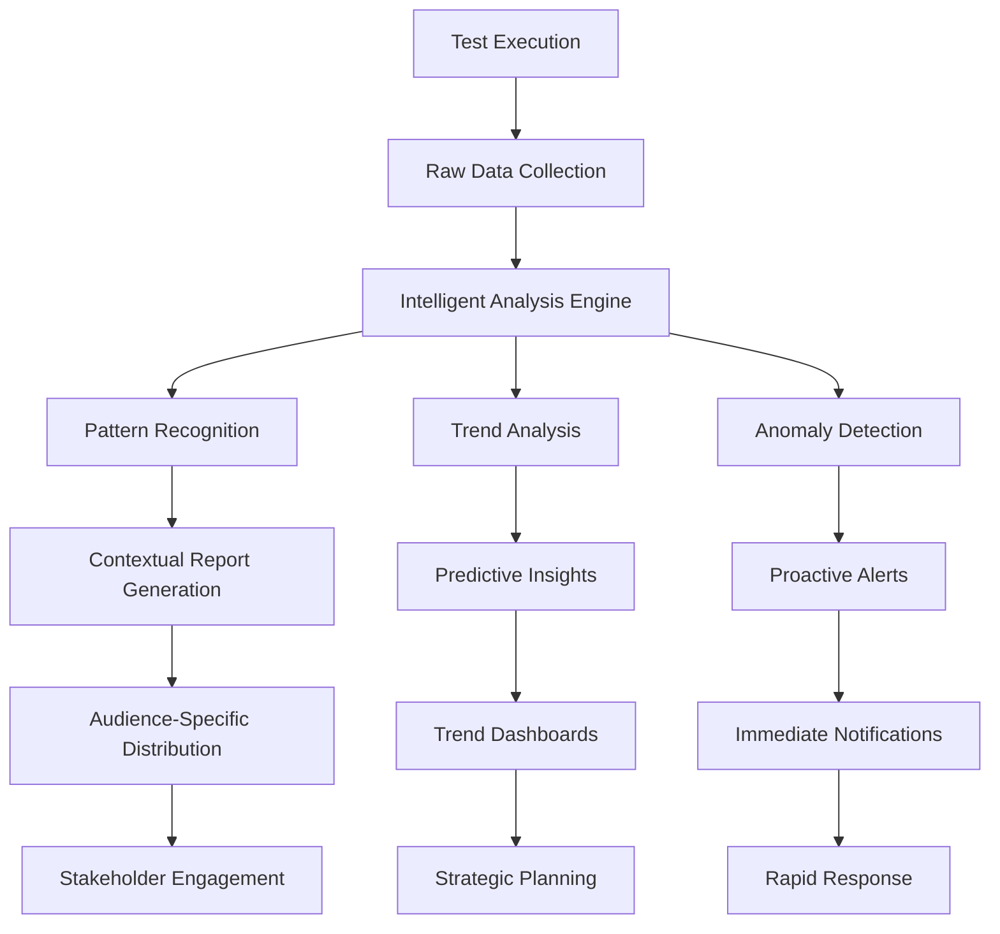

# 🤖 **Punto 11: Automatización de Reportes**

## 📋 **Objetivos de Aprendizaje**

Al completar este punto, serás capaz de:
- ✅ Implementar generación automática de reportes contextuales
- ✅ Crear sistemas de análisis predictivo de tendencias
- ✅ Configurar dashboards dinámicos que se actualizan en tiempo real
- ✅ Desarrollar alertas proactivas basadas en patrones de comportamiento
- ✅ Automatizar distribución inteligente de reportes por audiencia
- ✅ Implementar machine learning básico para detección de anomalías

---

## 🎯 **1. Fundamentos de Automatización Inteligente**

### **¿Por qué automatizar reportes de manera inteligente?**



### **Arquitectura del Sistema de Automatización**

```typescript
// Arquitectura conceptual para Pokémon TCG Platform
interface AutomationSystem {
  dataCollectors: {
    testResults: TestResultCollector;
    metrics: MetricsCollector;
    environmentData: EnvironmentCollector;
    businessEvents: BusinessEventCollector;
  };
  
  analysisEngines: {
    trendAnalyzer: TrendAnalysisEngine;
    anomalyDetector: AnomalyDetectionEngine;
    patternRecognizer: PatternRecognitionEngine;
    predictiveModeler: PredictiveModelEngine;
  };
  
  reportGenerators: {
    contextualReporter: ContextualReportGenerator;
    executiveDashboard: ExecutiveDashboardGenerator;
    technicalReporter: TechnicalReportGenerator;
    businessMetrics: BusinessMetricsGenerator;
  };
  
  distributionSystem: {
    audienceRouter: AudienceBasedRouter;
    channelManager: MultiChannelDistributor;
    scheduleManager: ScheduleBasedDistributor;
    triggerManager: EventTriggeredDistributor;
  };
}
```

---

## 🔧 **2. Sistema de Análisis Inteligente**

### **Engine de Análisis de Tendencias**

```javascript
// scripts/intelligent-analysis/trend-analyzer.js
class TrendAnalysisEngine {
  constructor() {
    this.historicalData = [];
    this.analysisWindow = 30; // días
    this.confidenceThreshold = 0.85;
  }

  async analyzeTrends(currentResults) {
    console.log('📈 Starting trend analysis for Pokémon TCG Platform...');
    
    // Cargar datos históricos
    await this.loadHistoricalData();
    
    // Análisis multidimensional
    const trends = {
      performance: await this.analyzePerformanceTrends(currentResults),
      stability: await this.analyzeStabilityTrends(currentResults),
      coverage: await this.analyzeCoverageTrends(currentResults),
      businessMetrics: await this.analyzeBusinessTrends(currentResults)
    };

    // Generar insights y predicciones
    const insights = await this.generateInsights(trends);
    const predictions = await this.generatePredictions(trends);

    return {
      trends,
      insights,
      predictions,
      recommendations: this.generateRecommendations(trends, insights),
      confidence: this.calculateConfidence(trends)
    };
  }

  async analyzePerformanceTrends(currentResults) {
    const historical = this.getHistoricalPerformanceData();
    const current = this.extractPerformanceMetrics(currentResults);

    return {
      avgResponseTime: {
        current: current.avgResponseTime,
        trend: this.calculateTrend(historical.avgResponseTime, current.avgResponseTime),
        prediction: this.predictNextValue(historical.avgResponseTime),
        status: this.evaluateStatus(current.avgResponseTime, historical.avgResponseTime)
      },
      successRate: {
        current: current.successRate,
        trend: this.calculateTrend(historical.successRate, current.successRate),
        prediction: this.predictNextValue(historical.successRate),
        status: this.evaluateStatus(current.successRate, historical.successRate)
      },
      cardLoadingPerformance: {
        current: current.cardLoadingTime,
        trend: this.calculateTrend(historical.cardLoadingTime, current.cardLoadingTime),
        prediction: this.predictNextValue(historical.cardLoadingTime),
        status: this.evaluateStatus(current.cardLoadingTime, historical.cardLoadingTime),
        breakdown: this.analyzeCardTypePerformance(currentResults)
      }
    };
  }

  analyzeCardTypePerformance(results) {
    const cardTypes = ['pokemon', 'trainer', 'energy'];
    const performance = {};

    cardTypes.forEach(type => {
      const typeTests = results.tests.filter(test => 
        test.title.toLowerCase().includes(type) ||
        test.fullTitle.toLowerCase().includes(type)
      );

      if (typeTests.length > 0) {
        const avgDuration = typeTests.reduce((sum, test) => sum + test.duration, 0) / typeTests.length;
        const successRate = (typeTests.filter(t => t.state === 'passed').length / typeTests.length) * 100;

        performance[type] = {
          avgDuration: Math.round(avgDuration),
          successRate: Math.round(successRate * 100) / 100,
          testCount: typeTests.length,
          trend: this.getHistoricalTrend(type, avgDuration),
          status: this.categorizePerformance(avgDuration, successRate)
        };
      }
    });

    return performance;
  }

  calculateTrend(historical, current) {
    if (!historical || historical.length < 2) {
      return { direction: 'insufficient_data', confidence: 0 };
    }

    const recentValues = historical.slice(-7); // Últimos 7 valores
    const slope = this.calculateLinearRegression(recentValues).slope;
    const direction = slope > 0.05 ? 'improving' : 
                     slope < -0.05 ? 'degrading' : 'stable';

    return {
      direction,
      slope: slope.toFixed(4),
      confidence: this.calculateTrendConfidence(recentValues),
      changePercentage: this.calculatePercentageChange(historical[historical.length - 1], current)
    };
  }

  generateInsights(trends) {
    const insights = [];

    // Insight de rendimiento
    if (trends.performance.avgResponseTime.trend.direction === 'degrading') {
      insights.push({
        type: 'performance_degradation',
        severity: 'warning',
        title: '⚠️ Performance Degradation Detected',
        description: `Average response time has increased by ${trends.performance.avgResponseTime.trend.changePercentage}% over the last week.`,
        impact: 'User experience may be affected',
        recommendation: 'Investigate database queries and API endpoints',
        confidence: trends.performance.avgResponseTime.trend.confidence
      });
    }

    // Insight de estabilidad de cartas
    Object.entries(trends.performance.cardLoadingPerformance.breakdown).forEach(([cardType, metrics]) => {
      if (metrics.trend.direction === 'degrading') {
        insights.push({
          type: 'card_performance_issue',
          severity: 'medium',
          title: `🎴 ${cardType.toUpperCase()} Card Loading Issues`,
          description: `${cardType} card loading performance has degraded by ${metrics.trend.changePercentage}%`,
          impact: `${cardType} card browsing experience affected`,
          recommendation: `Optimize ${cardType} card queries and caching`,
          confidence: metrics.trend.confidence
        });
      }
    });

    // Insight de patrones de fallo
    const failurePatterns = this.detectFailurePatterns(trends);
    if (failurePatterns.length > 0) {
      insights.push({
        type: 'failure_pattern',
        severity: 'high',
        title: '🔍 Recurring Failure Pattern Detected',
        description: `Pattern detected: ${failurePatterns[0].pattern}`,
        impact: 'Systematic issues may be present',
        recommendation: failurePatterns[0].recommendation,
        confidence: failurePatterns[0].confidence
      });
    }

    return insights;
  }

  generatePredictions(trends) {
    return {
      nextWeek: {
        successRate: this.predictValue(trends.stability.successRate, 7),
        avgResponseTime: this.predictValue(trends.performance.avgResponseTime, 7),
        cardLoadingTime: this.predictValue(trends.performance.cardLoadingPerformance, 7)
      },
      nextMonth: {
        successRate: this.predictValue(trends.stability.successRate, 30),
        avgResponseTime: this.predictValue(trends.performance.avgResponseTime, 30),
        cardLoadingTime: this.predictValue(trends.performance.cardLoadingPerformance, 30)
      },
      riskAssessment: this.assessRisks(trends)
    };
  }

  detectFailurePatterns(trends) {
    const patterns = [];
    
    // Patrón de fallos en horarios específicos
    const timeBasedFailures = this.analyzeTimeBasedFailures();
    if (timeBasedFailures.confidence > 0.7) {
      patterns.push({
        pattern: `Failures spike during ${timeBasedFailures.timeRange}`,
        confidence: timeBasedFailures.confidence,
        recommendation: 'Investigate resource usage during peak hours'
      });
    }

    // Patrón de fallos después de deployments
    const deploymentFailures = this.analyzeDeploymentCorrelation();
    if (deploymentFailures.confidence > 0.8) {
      patterns.push({
        pattern: 'Increased failures after deployments',
        confidence: deploymentFailures.confidence,
        recommendation: 'Enhance pre-deployment testing and rollback procedures'
      });
    }

    return patterns;
  }
}
```

### **Detector de Anomalías con Machine Learning**

```javascript
// scripts/intelligent-analysis/anomaly-detector.js
class AnomalyDetectionEngine {
  constructor() {
    this.models = {
      performance: new PerformanceAnomalyModel(),
      success_rate: new SuccessRateAnomalyModel(),
      business_metrics: new BusinessMetricsAnomalyModel()
    };
    this.alertThresholds = {
      low: 0.3,
      medium: 0.6,
      high: 0.8,
      critical: 0.9
    };
  }

  async detectAnomalies(currentData, historicalData) {
    console.log('🔍 Detecting anomalies in Pokémon TCG Platform metrics...');

    const anomalies = {};

    // Detectar anomalías en cada modelo
    for (const [modelName, model] of Object.entries(this.models)) {
      try {
        const modelData = this.prepareModelData(currentData, historicalData, modelName);
        const anomalyScore = await model.detectAnomaly(modelData);
        
        if (anomalyScore > this.alertThresholds.low) {
          anomalies[modelName] = {
            score: anomalyScore,
            severity: this.categorizeSeverity(anomalyScore),
            details: await model.explainAnomaly(modelData),
            recommendations: await model.generateRecommendations(modelData)
          };
        }
      } catch (error) {
        console.warn(`⚠️ Error in ${modelName} anomaly detection:`, error.message);
      }
    }

    return {
      timestamp: new Date().toISOString(),
      anomalies,
      summary: this.generateAnomalySummary(anomalies),
      alertLevel: this.calculateOverallAlertLevel(anomalies)
    };
  }

  categorizeSeverity(score) {
    if (score >= this.alertThresholds.critical) return 'critical';
    if (score >= this.alertThresholds.high) return 'high';
    if (score >= this.alertThresholds.medium) return 'medium';
    return 'low';
  }
}

// Modelo específico para anomalías de rendimiento
class PerformanceAnomalyModel {
  constructor() {
    this.featureWeights = {
      avgResponseTime: 0.3,
      cardLoadingTime: 0.25,
      searchResponseTime: 0.2,
      authResponseTime: 0.15,
      dbQueryTime: 0.1
    };
  }

  async detectAnomaly(data) {
    // Implementación simplificada de detección de anomalías
    const features = this.extractFeatures(data);
    const normalizedFeatures = this.normalizeFeatures(features, data.historical);
    
    // Calcular score de anomalía usando distancia euclidiana ponderada
    let anomalyScore = 0;
    
    Object.entries(normalizedFeatures).forEach(([feature, value]) => {
      const weight = this.featureWeights[feature] || 0.1;
      const historicalMean = this.calculateMean(data.historical[feature]);
      const historicalStd = this.calculateStd(data.historical[feature]);
      
      // Z-score normalizado
      const zScore = Math.abs((value - historicalMean) / historicalStd);
      anomalyScore += (zScore * weight);
    });

    // Normalizar score entre 0 y 1
    return Math.min(1, anomalyScore / 3);
  }

  async explainAnomaly(data) {
    const explanations = [];
    const features = this.extractFeatures(data);
    
    Object.entries(features).forEach(([feature, value]) => {
      const historical = data.historical[feature];
      const mean = this.calculateMean(historical);
      const std = this.calculateStd(historical);
      const zScore = (value - mean) / std;
      
      if (Math.abs(zScore) > 2) {
        explanations.push({
          feature,
          currentValue: value,
          historicalMean: mean.toFixed(2),
          deviation: `${(zScore > 0 ? '+' : '')}${zScore.toFixed(2)} standard deviations`,
          impact: this.getFeatureImpact(feature, zScore)
        });
      }
    });

    return explanations;
  }

  getFeatureImpact(feature, zScore) {
    const impacts = {
      avgResponseTime: zScore > 0 ? 'Slower overall platform response' : 'Faster overall platform response',
      cardLoadingTime: zScore > 0 ? 'Cards loading slower than usual' : 'Cards loading faster than usual',
      searchResponseTime: zScore > 0 ? 'Search functionality degraded' : 'Search functionality improved',
      authResponseTime: zScore > 0 ? 'User authentication slower' : 'User authentication faster',
      dbQueryTime: zScore > 0 ? 'Database performance issues' : 'Database performance improved'
    };
    
    return impacts[feature] || 'Unknown impact';
  }
}
```

---

## 📊 **3. Generación de Reportes Contextuales**

### **Motor de Reportes Contextuales**

```javascript
// scripts/report-automation/contextual-report-generator.js
class ContextualReportGenerator {
  constructor() {
    this.templates = {
      executive: new ExecutiveReportTemplate(),
      technical: new TechnicalReportTemplate(),
      business: new BusinessReportTemplate(),
      incident: new IncidentReportTemplate()
    };
    
    this.contextRules = {
      timeOfDay: this.getTimeBasedContext(),
      dayOfWeek: this.getDayBasedContext(),
      releasePhase: this.getReleasePhaseContext(),
      businessCycle: this.getBusinessCycleContext()
    };
  }

  async generateContextualReport(data, context = {}) {
    console.log('🎯 Generating contextual report for Pokémon TCG Platform...');

    // Determinar contexto automáticamente si no se proporciona
    const reportContext = {
      ...this.detectContext(data),
      ...context
    };

    // Seleccionar template apropiado
    const template = this.selectTemplate(reportContext);
    
    // Generar contenido contextual
    const contextualContent = await this.generateContextualContent(data, reportContext);
    
    // Aplicar template y generar reporte final
    const report = await template.generate(contextualContent);

    return {
      report,
      context: reportContext,
      metadata: this.generateReportMetadata(data, reportContext)
    };
  }

  detectContext(data) {
    const now = new Date();
    const context = {
      timestamp: now.toISOString(),
      timeOfDay: this.categorizeTimeOfDay(now),
      dayOfWeek: this.categorizeDayOfWeek(now),
      seasonality: this.detectSeasonality(now),
      recentDeployment: this.detectRecentDeployment(data),
      businessEvent: this.detectBusinessEvent(now),
      alertLevel: this.calculateAlertLevel(data)
    };

    // Contexto específico de Pokémon TCG
    context.gameContext = {
      activeExpansions: this.getActiveExpansions(data),
      playerActivity: this.analyzePlayerActivity(data),
      cardReleases: this.checkRecentCardReleases(now),
      tournamentSeason: this.detectTournamentSeason(now)
    };

    return context;
  }

  async generateContextualContent(data, context) {
    const content = {
      summary: await this.generateContextualSummary(data, context),
      insights: await this.generateContextualInsights(data, context),
      recommendations: await this.generateContextualRecommendations(data, context),
      alerts: await this.generateContextualAlerts(data, context)
    };

    // Agregar secciones específicas según contexto
    if (context.recentDeployment) {
      content.deploymentImpact = await this.analyzeDeploymentImpact(data, context);
    }

    if (context.businessEvent) {
      content.businessEventAnalysis = await this.analyzeBusinessEventImpact(data, context);
    }

    if (context.gameContext.tournamentSeason) {
      content.tournamentReadiness = await this.analyzeTournamentReadiness(data, context);
    }

    return content;
  }

  generateContextualSummary(data, context) {
    const summary = {
      title: this.generateContextualTitle(context),
      overview: this.generateOverview(data, context),
      keyMetrics: this.selectRelevantMetrics(data, context),
      statusIndicator: this.generateStatusIndicator(data, context)
    };

    // Personalizar según contexto temporal
    if (context.timeOfDay === 'after-hours') {
      summary.overview += ' This automated report covers activity during off-peak hours.';
    }

    if (context.recentDeployment) {
      summary.overview += ` Post-deployment analysis included (deployed ${context.deploymentTime}).`;
    }

    // Personalizar según contexto de negocio
    if (context.gameContext.tournamentSeason) {
      summary.overview += ' Tournament season performance metrics highlighted.';
    }

    return summary;
  }

  generateContextualTitle(context) {
    const baseTitle = 'Pokémon TCG Platform - Quality Report';
    const modifiers = [];

    if (context.timeOfDay === 'peak-hours') {
      modifiers.push('Peak Performance');
    } else if (context.timeOfDay === 'after-hours') {
      modifiers.push('Off-Peak Analysis');
    }

    if (context.recentDeployment) {
      modifiers.push('Post-Deployment');
    }

    if (context.alertLevel === 'critical') {
      modifiers.push('CRITICAL ALERT');
    }

    if (context.gameContext.tournamentSeason) {
      modifiers.push('Tournament Ready');
    }

    return modifiers.length > 0 ? 
      `${baseTitle} - ${modifiers.join(' | ')}` : 
      baseTitle;
  }

  selectRelevantMetrics(data, context) {
    const baseMetrics = ['successRate', 'avgResponseTime', 'totalTests'];
    const contextualMetrics = [...baseMetrics];

    // Métricas específicas por contexto temporal
    if (context.timeOfDay === 'peak-hours') {
      contextualMetrics.push('concurrentUsers', 'loadHandling', 'scalabilityScore');
    }

    // Métricas de deployment
    if (context.recentDeployment) {
      contextualMetrics.push('deploymentSuccessRate', 'rollbackMetrics', 'migrationStatus');
    }

    // Métricas de negocio gaming
    if (context.gameContext.playerActivity === 'high') {
      contextualMetrics.push('cardSearchPerformance', 'collectionManagement', 'tradingSystem');
    }

    // Métricas de torneo
    if (context.gameContext.tournamentSeason) {
      contextualMetrics.push('deckBuilderPerformance', 'cardValidation', 'rulesetCompliance');
    }

    return contextualMetrics.map(metric => ({
      name: metric,
      value: this.getMetricValue(data, metric),
      context: this.getMetricContext(metric, context),
      interpretation: this.interpretMetricInContext(metric, data, context)
    }));
  }
}
```

### **Templates de Reportes Especializados**

```javascript
// scripts/report-automation/specialized-templates.js
class ExecutiveReportTemplate {
  async generate(content) {
    return `
<!DOCTYPE html>
<html>
<head>
    <title>${content.summary.title}</title>
    <style>${this.getExecutiveCSS()}</style>
</head>
<body>
    <div class="executive-header">
        <h1>🎮 ${content.summary.title}</h1>
        <div class="status-indicator ${content.summary.statusIndicator.class}">
            ${content.summary.statusIndicator.text}
        </div>
    </div>

    <div class="executive-summary">
        <h2>📊 Executive Summary</h2>
        <p class="overview">${content.summary.overview}</p>
        
        <div class="kpi-dashboard">
            ${this.generateKPIDashboard(content.summary.keyMetrics)}
        </div>
    </div>

    <div class="insights-section">
        <h2>💡 Strategic Insights</h2>
        ${this.generateInsightsSection(content.insights)}
    </div>

    <div class="recommendations-section">
        <h2>🎯 Strategic Recommendations</h2>
        ${this.generateRecommendationsSection(content.recommendations)}
    </div>

    <div class="alerts-section">
        <h2>🚨 Priority Alerts</h2>
        ${this.generateAlertsSection(content.alerts)}
    </div>

    ${content.deploymentImpact ? this.generateDeploymentSection(content.deploymentImpact) : ''}
    ${content.tournamentReadiness ? this.generateTournamentSection(content.tournamentReadiness) : ''}
</body>
</html>`;
  }

  generateKPIDashboard(metrics) {
    return metrics.map(metric => `
        <div class="kpi-card">
            <div class="kpi-value">${metric.value}</div>
            <div class="kpi-label">${this.formatMetricName(metric.name)}</div>
            <div class="kpi-interpretation">${metric.interpretation}</div>
        </div>
    `).join('');
  }

  generateInsightsSection(insights) {
    return insights.map(insight => `
        <div class="insight-card ${insight.severity}">
            <h3>${insight.title}</h3>
            <p>${insight.description}</p>
            <div class="insight-impact">
                <strong>Business Impact:</strong> ${insight.impact}
            </div>
            <div class="insight-confidence">
                Confidence: ${(insight.confidence * 100).toFixed(1)}%
            </div>
        </div>
    `).join('');
  }
}

class TechnicalReportTemplate {
  async generate(content) {
    return `
<!DOCTYPE html>
<html>
<head>
    <title>${content.summary.title} - Technical Details</title>
    <style>${this.getTechnicalCSS()}</style>
    <script src="https://cdn.jsdelivr.net/npm/chart.js"></script>
</head>
<body>
    <div class="technical-header">
        <h1>🔧 ${content.summary.title}</h1>
        <div class="build-info">
            <span>Build: ${content.metadata.buildNumber || 'N/A'}</span>
            <span>Environment: ${content.metadata.environment || 'Unknown'}</span>
        </div>
    </div>

    <div class="metrics-dashboard">
        <h2>📈 Performance Metrics</h2>
        <div class="charts-container">
            <canvas id="performanceChart"></canvas>
            <canvas id="trendsChart"></canvas>
        </div>
    </div>

    <div class="test-breakdown">
        <h2>🧪 Test Execution Breakdown</h2>
        ${this.generateTestBreakdown(content)}
    </div>

    <div class="anomalies-section">
        <h2>🔍 Anomaly Detection</h2>
        ${this.generateAnomaliesSection(content.anomalies)}
    </div>

    <div class="performance-analysis">
        <h2>⚡ Performance Analysis</h2>
        ${this.generatePerformanceAnalysis(content)}
    </div>

    <script>
        ${this.generateTechnicalCharts(content)}
    </script>
</body>
</html>`;
  }

  generateTestBreakdown(content) {
    return `
        <div class="test-grid">
            <div class="test-category">
                <h3>🎴 Card Management Tests</h3>
                <div class="test-stats">
                    <!-- Estadísticas específicas de cartas -->
                </div>
            </div>
            <div class="test-category">
                <h3>👤 User Authentication Tests</h3>
                <div class="test-stats">
                    <!-- Estadísticas de autenticación -->
                </div>
            </div>
            <div class="test-category">
                <h3>🔍 Search & Filter Tests</h3>
                <div class="test-stats">
                    <!-- Estadísticas de búsqueda -->
                </div>
            </div>
        </div>
    `;
  }
}

class IncidentReportTemplate {
  async generate(content) {
    return `
<!DOCTYPE html>
<html>
<head>
    <title>🚨 INCIDENT REPORT - ${content.summary.title}</title>
    <style>${this.getIncidentCSS()}</style>
</head>
<body>
    <div class="incident-header critical">
        <h1>🚨 INCIDENT DETECTED</h1>
        <div class="incident-severity">${content.alerts.maxSeverity}</div>
        <div class="incident-time">${new Date().toLocaleString()}</div>
    </div>

    <div class="incident-summary">
        <h2>📋 Incident Summary</h2>
        <div class="incident-details">
            <p><strong>Platform:</strong> Pokémon TCG Platform</p>
            <p><strong>Affected Systems:</strong> ${this.getAffectedSystems(content)}</p>
            <p><strong>Impact Level:</strong> ${this.calculateImpactLevel(content)}</p>
            <p><strong>Estimated Users Affected:</strong> ${this.estimateAffectedUsers(content)}</p>
        </div>
    </div>

    <div class="incident-timeline">
        <h2>⏱️ Incident Timeline</h2>
        ${this.generateIncidentTimeline(content)}
    </div>

    <div class="immediate-actions">
        <h2>🎯 Immediate Actions Required</h2>
        ${this.generateImmediateActions(content)}
    </div>

    <div class="technical-details">
        <h2>🔧 Technical Details</h2>
        ${this.generateTechnicalDetails(content)}
    </div>
</body>
</html>`;
  }

  getAffectedSystems(content) {
    const systems = [];
    
    if (content.alerts.some(alert => alert.category === 'authentication')) {
      systems.push('User Authentication');
    }
    if (content.alerts.some(alert => alert.category === 'card-management')) {
      systems.push('Card Management');
    }
    if (content.alerts.some(alert => alert.category === 'search')) {
      systems.push('Search & Filter');
    }
    if (content.alerts.some(alert => alert.category === 'database')) {
      systems.push('Database Layer');
    }

    return systems.length > 0 ? systems.join(', ') : 'Unknown';
  }

  generateImmediateActions(content) {
    const actions = [
      '🔍 Investigate root cause of detected anomalies',
      '📞 Notify on-call team and stakeholders',
      '📊 Monitor key metrics closely',
      '🔄 Prepare rollback procedures if needed'
    ];

    // Acciones específicas basadas en el tipo de incidente
    content.alerts.forEach(alert => {
      if (alert.category === 'performance') {
        actions.push('⚡ Scale infrastructure resources');
      }
      if (alert.category === 'database') {
        actions.push('🗄️ Check database connection pools');
      }
      if (alert.category === 'authentication') {
        actions.push('🔐 Verify authentication service status');
      }
    });

    return actions.map(action => `<div class="action-item">${action}</div>`).join('');
  }
}
```

---

## 🔄 **4. Sistema de Distribución Inteligente**

### **Router de Audiencias Automatizado**

```javascript
// scripts/report-automation/audience-router.js
class AudienceBasedRouter {
  constructor() {
    this.audienceProfiles = {
      developers: {
        interests: ['technical_details', 'code_coverage', 'performance_metrics', 'error_details'],
        urgencyThreshold: 'medium',
        channels: ['slack', 'email'],
        schedule: 'immediate',
        format: 'technical'
      },
      qa_team: {
        interests: ['test_results', 'coverage_reports', 'regression_analysis', 'automation_metrics'],
        urgencyThreshold: 'low',
        channels: ['slack', 'dashboard'],
        schedule: 'daily',
        format: 'technical'
      },
      management: {
        interests: ['business_metrics', 'quality_trends', 'risk_assessment', 'resource_needs'],
        urgencyThreshold: 'high',
        channels: ['email', 'executive_dashboard'],
        schedule: 'weekly',
        format: 'executive'
      },
      product_owners: {
        interests: ['feature_quality', 'user_impact', 'business_value', 'release_readiness'],
        urgencyThreshold: 'medium',
        channels: ['email', 'dashboard'],
        schedule: 'bi_weekly',
        format: 'business'
      },
      stakeholders: {
        interests: ['platform_health', 'business_impact', 'strategic_insights', 'roi_metrics'],
        urgencyThreshold: 'critical',
        channels: ['email'],
        schedule: 'monthly',
        format: 'executive'
      }
    };
  }

  async routeReport(reportData, context) {
    console.log('🎯 Routing report to appropriate audiences...');

    const distributions = [];

    for (const [audience, profile] of Object.entries(this.audienceProfiles)) {
      const shouldDistribute = await this.shouldDistributeToAudience(
        reportData, 
        context, 
        audience, 
        profile
      );

      if (shouldDistribute) {
        const customizedReport = await this.customizeReportForAudience(
          reportData, 
          context, 
          audience, 
          profile
        );

        distributions.push({
          audience,
          report: customizedReport,
          channels: profile.channels,
          urgency: this.calculateUrgency(reportData, profile),
          schedule: this.determineSchedule(context, profile)
        });
      }
    }

    // Ejecutar distribuciones
    const results = await Promise.all(
      distributions.map(dist => this.executeDistribution(dist))
    );

    return {
      distributionsSent: results.filter(r => r.success).length,
      distributionsFailed: results.filter(r => !r.success).length,
      details: results
    };
  }

  async shouldDistributeToAudience(reportData, context, audience, profile) {
    // Verificar si hay contenido relevante para esta audiencia
    const relevantContent = this.hasRelevantContent(reportData, profile.interests);
    
    // Verificar umbral de urgencia
    const meetsUrgencyThreshold = this.meetsUrgencyThreshold(
      reportData, 
      profile.urgencyThreshold
    );
    
    // Verificar horario de distribución
    const isScheduledTime = this.isScheduledTime(context, profile.schedule);
    
    // Verificar si es una alerta crítica (siempre se envía)
    const isCriticalAlert = this.isCriticalAlert(reportData);

    return relevantContent && (meetsUrgencyThreshold || isScheduledTime || isCriticalAlert);
  }

  async customizeReportForAudience(reportData, context, audience, profile) {
    // Filtrar contenido relevante
    const filteredContent = this.filterContentByInterests(reportData, profile.interests);
    
    // Aplicar formato específico
    const template = this.getTemplateForFormat(profile.format);
    
    // Personalizar según audiencia
    const personalizedContent = this.personalizeContent(filteredContent, audience);
    
    // Generar reporte final
    return await template.generate(personalizedContent);
  }

  filterContentByInterests(reportData, interests) {
    const filtered = { ...reportData };

    // Filtrar insights
    if (filtered.insights) {
      filtered.insights = filtered.insights.filter(insight =>
        interests.some(interest => this.contentMatchesInterest(insight, interest))
      );
    }

    // Filtrar métricas
    if (filtered.metrics) {
      filtered.metrics = Object.fromEntries(
        Object.entries(filtered.metrics).filter(([key, value]) =>
          interests.some(interest => this.metricMatchesInterest(key, interest))
        )
      );
    }

    // Filtrar alertas
    if (filtered.alerts) {
      filtered.alerts = filtered.alerts.filter(alert =>
        interests.some(interest => this.alertMatchesInterest(alert, interest))
      );
    }

    return filtered;
  }

  personalizeContent(content, audience) {
    const personalization = {
      developers: {
        greeting: "👨‍💻 Development Team",
        focus: "Technical insights and actionable improvements",
        callToAction: "Review the technical details and plan improvements"
      },
      qa_team: {
        greeting: "🧪 QA Team",
        focus: "Test quality and automation effectiveness",
        callToAction: "Analyze test patterns and optimize coverage"
      },
      management: {
        greeting: "👔 Leadership Team",
        focus: "Strategic insights and business impact",
        callToAction: "Review strategic implications and resource needs"
      },
      product_owners: {
        greeting: "📋 Product Team",
        focus: "Feature quality and user experience",
        callToAction: "Assess feature readiness and user impact"
      },
      stakeholders: {
        greeting: "🤝 Stakeholders",
        focus: "Platform health and business value",
        callToAction: "Review platform status and strategic direction"
      }
    };

    return {
      ...content,
      personalization: personalization[audience] || personalization.stakeholders
    };
  }
}
```

---

## 📱 **5. Dashboards en Tiempo Real**

### **Dashboard Dinámico con WebSockets**

```javascript
// scripts/real-time-dashboard/dashboard-server.js
const WebSocket = require('ws');
const express = require('express');
const http = require('http');

class RealTimeDashboardServer {
  constructor() {
    this.app = express();
    this.server = http.createServer(this.app);
    this.wss = new WebSocket.Server({ server: this.server });
    this.clients = new Map();
    this.latestData = {};
  }

  start(port = 3001) {
    console.log('🚀 Starting Real-Time Dashboard Server...');
    
    // Configurar rutas HTTP
    this.setupRoutes();
    
    // Configurar WebSocket
    this.setupWebSocket();
    
    // Iniciar servidor
    this.server.listen(port, () => {
      console.log(`✅ Dashboard server running on port ${port}`);
    });

    // Iniciar actualizaciones periódicas
    this.startPeriodicUpdates();
  }

  setupRoutes() {
    this.app.use(express.static('public'));
    
    this.app.get('/dashboard', (req, res) => {
      res.sendFile(__dirname + '/dashboard.html');
    });

    this.app.get('/api/latest-data', (req, res) => {
      res.json(this.latestData);
    });
  }

  setupWebSocket() {
    this.wss.on('connection', (ws, req) => {
      const clientId = this.generateClientId();
      const clientInfo = {
        id: clientId,
        ws: ws,
        connectedAt: new Date(),
        lastSeen: new Date(),
        subscriptions: []
      };

      this.clients.set(clientId, clientInfo);
      console.log(`📱 New dashboard client connected: ${clientId}`);

      // Enviar datos iniciales
      ws.send(JSON.stringify({
        type: 'initial_data',
        data: this.latestData
      }));

      // Manejar mensajes del cliente
      ws.on('message', (message) => {
        try {
          const data = JSON.parse(message);
          this.handleClientMessage(clientId, data);
        } catch (error) {
          console.error('Error processing client message:', error);
        }
      });

      // Limpiar al desconectar
      ws.on('close', () => {
        this.clients.delete(clientId);
        console.log(`📱 Dashboard client disconnected: ${clientId}`);
      });
    });
  }

  handleClientMessage(clientId, message) {
    const client = this.clients.get(clientId);
    if (!client) return;

    switch (message.type) {
      case 'subscribe':
        client.subscriptions = message.subscriptions;
        break;
        
      case 'request_update':
        this.sendUpdateToClient(clientId, message.component);
        break;
        
      case 'heartbeat':
        client.lastSeen = new Date();
        break;
    }
  }

  async startPeriodicUpdates() {
    setInterval(async () => {
      try {
        // Recopilar datos actualizados
        const newData = await this.collectLatestData();
        
        // Detectar cambios significativos
        const changes = this.detectChanges(this.latestData, newData);
        
        if (changes.hasSignificantChanges) {
          this.latestData = newData;
          
          // Broadcast a todos los clientes conectados
          this.broadcastUpdate({
            type: 'data_update',
            data: newData,
            changes: changes.details,
            timestamp: new Date().toISOString()
          });
        }
        
        // Enviar heartbeat
        this.broadcastHeartbeat();
        
      } catch (error) {
        console.error('Error in periodic update:', error);
      }
    }, 5000); // Actualizar cada 5 segundos
  }

  async collectLatestData() {
    // Simular recopilación de datos desde múltiples fuentes
    const data = {
      testResults: await this.getLatestTestResults(),
      metrics: await this.getLatestMetrics(),
      alerts: await this.getActiveAlerts(),
      systemHealth: await this.getSystemHealth(),
      gameSpecific: await this.getGameSpecificMetrics()
    };

    return data;
  }

  detectChanges(oldData, newData) {
    const changes = {
      hasSignificantChanges: false,
      details: []
    };

    // Detectar cambios en métricas clave
    if (this.hasMetricChanged(oldData.metrics, newData.metrics, 'successRate', 1)) {
      changes.hasSignificantChanges = true;
      changes.details.push({
        type: 'metric_change',
        metric: 'successRate',
        oldValue: oldData.metrics?.successRate,
        newValue: newData.metrics?.successRate
      });
    }

    // Detectar nuevas alertas
    const newAlerts = this.findNewAlerts(oldData.alerts, newData.alerts);
    if (newAlerts.length > 0) {
      changes.hasSignificantChanges = true;
      changes.details.push({
        type: 'new_alerts',
        alerts: newAlerts
      });
    }

    // Detectar cambios en el estado del sistema
    if (oldData.systemHealth?.status !== newData.systemHealth?.status) {
      changes.hasSignificantChanges = true;
      changes.details.push({
        type: 'system_status_change',
        oldStatus: oldData.systemHealth?.status,
        newStatus: newData.systemHealth?.status
      });
    }

    return changes;
  }

  broadcastUpdate(update) {
    const message = JSON.stringify(update);
    
    this.clients.forEach((client, clientId) => {
      if (client.ws.readyState === WebSocket.OPEN) {
        try {
          client.ws.send(message);
        } catch (error) {
          console.error(`Error sending update to client ${clientId}:`, error);
          this.clients.delete(clientId);
        }
      }
    });
  }

  async getGameSpecificMetrics() {
    return {
      cardManagement: {
        loadTime: Math.random() * 1000 + 500,
        searchPerformance: Math.random() * 500 + 200,
        cacheHitRate: Math.random() * 20 + 80
      },
      userActivity: {
        activeUsers: Math.floor(Math.random() * 1000 + 500),
        cardsViewed: Math.floor(Math.random() * 10000 + 5000),
        searchQueries: Math.floor(Math.random() * 2000 + 1000)
      },
      businessMetrics: {
        conversionRate: Math.random() * 5 + 15,
        userEngagement: Math.random() * 30 + 60,
        platformStability: Math.random() * 10 + 90
      }
    };
  }
}

// Dashboard HTML con WebSocket integration
const dashboardHTML = `
<!DOCTYPE html>
<html>
<head>
    <title>Pokémon TCG - Real-Time Dashboard</title>
    <style>
        body { 
            font-family: Arial, sans-serif; 
            margin: 0; 
            background: #1a1a1a; 
            color: white; 
        }
        .dashboard { 
            display: grid; 
            grid-template-columns: repeat(auto-fit, minmax(300px, 1fr)); 
            gap: 20px; 
            padding: 20px; 
        }
        .widget { 
            background: #2a2a2a; 
            border-radius: 8px; 
            padding: 20px; 
            border: 1px solid #444; 
        }
        .widget h3 { 
            margin-top: 0; 
            color: #4dabf7; 
        }
        .metric { 
            display: flex; 
            justify-content: space-between; 
            margin: 10px 0; 
        }
        .value { 
            font-weight: bold; 
        }
        .status-indicator { 
            width: 12px; 
            height: 12px; 
            border-radius: 50%; 
            display: inline-block; 
        }
        .status-online { background: #51cf66; }
        .status-warning { background: #ffd43b; }
        .status-offline { background: #ff6b6b; }
    </style>
</head>
<body>
    <div class="header">
        <h1>🎮 Pokémon TCG Platform - Real-Time Dashboard</h1>
        <div id="connection-status">
            <span class="status-indicator status-online"></span>
            Connected
        </div>
    </div>

    <div class="dashboard">
        <div class="widget">
            <h3>📊 Test Metrics</h3>
            <div id="test-metrics"></div>
        </div>

        <div class="widget">
            <h3>🎴 Card Management</h3>
            <div id="card-metrics"></div>
        </div>

        <div class="widget">
            <h3>👤 User Activity</h3>
            <div id="user-metrics"></div>
        </div>

        <div class="widget">
            <h3>🚨 Active Alerts</h3>
            <div id="alerts"></div>
        </div>
    </div>

    <script>
        class RealTimeDashboard {
            constructor() {
                this.ws = null;
                this.reconnectAttempts = 0;
                this.maxReconnectAttempts = 5;
                this.connect();
            }

            connect() {
                const wsUrl = 'ws://' + window.location.host;
                this.ws = new WebSocket(wsUrl);

                this.ws.onopen = () => {
                    console.log('Connected to dashboard server');
                    this.reconnectAttempts = 0;
                    this.updateConnectionStatus(true);
                };

                this.ws.onmessage = (event) => {
                    const message = JSON.parse(event.data);
                    this.handleMessage(message);
                };

                this.ws.onclose = () => {
                    console.log('Disconnected from dashboard server');
                    this.updateConnectionStatus(false);
                    this.attemptReconnect();
                };

                this.ws.onerror = (error) => {
                    console.error('WebSocket error:', error);
                };
            }

            handleMessage(message) {
                switch (message.type) {
                    case 'initial_data':
                    case 'data_update':
                        this.updateDashboard(message.data);
                        break;
                    case 'heartbeat':
                        // Handle heartbeat
                        break;
                }
            }

            updateDashboard(data) {
                if (data.metrics) {
                    this.updateTestMetrics(data.metrics);
                }
                if (data.gameSpecific) {
                    this.updateCardMetrics(data.gameSpecific.cardManagement);
                    this.updateUserMetrics(data.gameSpecific.userActivity);
                }
                if (data.alerts) {
                    this.updateAlerts(data.alerts);
                }
            }

            updateTestMetrics(metrics) {
                const container = document.getElementById('test-metrics');
                container.innerHTML = \`
                    <div class="metric">
                        <span>Success Rate:</span>
                        <span class="value">\${metrics.successRate || 'N/A'}%</span>
                    </div>
                    <div class="metric">
                        <span>Avg Response Time:</span>
                        <span class="value">\${metrics.avgResponseTime || 'N/A'}ms</span>
                    </div>
                    <div class="metric">
                        <span>Total Tests:</span>
                        <span class="value">\${metrics.totalTests || 'N/A'}</span>
                    </div>
                \`;
            }

            updateConnectionStatus(connected) {
                const statusElement = document.getElementById('connection-status');
                if (connected) {
                    statusElement.innerHTML = '<span class="status-indicator status-online"></span> Connected';
                } else {
                    statusElement.innerHTML = '<span class="status-indicator status-offline"></span> Disconnected';
                }
            }

            attemptReconnect() {
                if (this.reconnectAttempts < this.maxReconnectAttempts) {
                    this.reconnectAttempts++;
                    setTimeout(() => {
                        console.log(\`Attempting to reconnect (\${this.reconnectAttempts}/\${this.maxReconnectAttempts})...\`);
                        this.connect();
                    }, 5000);
                }
            }
        }

        // Inicializar dashboard
        const dashboard = new RealTimeDashboard();
    </script>
</body>
</html>
`;
```

---

## 📝 **6. Ejercicios Prácticos**

### **Ejercicio 1: Sistema de Análisis Básico**
```javascript
// 🎯 Objetivo: Implementar detector de anomalías básico

class SimpleAnomalyDetector {
  detectAnomaly(currentValue, historicalValues) {
    // Implementa detección usando z-score
    // Umbral: 2 desviaciones estándar
  }
  
  calculateTrend(values) {
    // Implementa cálculo de tendencia simple
  }
  
  generateAlert(anomaly) {
    // Crea alerta estructurada
  }
}
```

### **Ejercicio 2: Reporte Contextual**
```javascript
// 🎯 Objetivo: Crear generador de reportes contextuales

class ContextualReporter {
  detectContext(timestamp, data) {
    // Detecta contexto temporal y de negocio
  }
  
  generateContextualContent(data, context) {
    // Genera contenido adaptado al contexto
  }
  
  selectAudience(context, alertLevel) {
    // Determina audiencia apropiada
  }
}
```

### **Ejercicio 3: Dashboard en Tiempo Real**
```javascript
// 🎯 Objetivo: Implementar dashboard básico con WebSockets

class SimpleDashboard {
  constructor() {
    this.ws = new WebSocket('ws://localhost:3001');
  }
  
  handleMessage(message) {
    // Procesa mensajes del servidor
  }
  
  updateMetrics(data) {
    // Actualiza métricas en el DOM
  }
}
```

---

## 🧪 **7. Validación y Testing**

### **Checklist de Automatización de Reportes**

```markdown
## ✅ Checklist de Automatización

### Sistema de Análisis
- [ ] Engine de análisis de tendencias funcionando
- [ ] Detector de anomalías configurado
- [ ] Reconocimiento de patrones implementado
- [ ] Predicciones generándose correctamente
- [ ] Confidence scores calculándose apropiadamente

### Generación de Reportes
- [ ] Templates para diferentes audiencias creados
- [ ] Generación contextual funcionando
- [ ] Personalización por audiencia implementada
- [ ] Formato responsive para móviles
- [ ] Integración con sistemas existentes

### Distribución Inteligente
- [ ] Router de audiencias configurado
- [ ] Canales de distribución funcionando
- [ ] Horarios y triggers configurados
- [ ] Filtrado de contenido por intereses
- [ ] Sistema de notificaciones operativo

### Dashboard en Tiempo Real
- [ ] WebSocket server funcionando
- [ ] Cliente dashboard conectándose
- [ ] Actualizaciones en tiempo real
- [ ] Manejo de reconexión automática
- [ ] Performance aceptable con múltiples clientes
```

### **Tests de Sistema de Automatización**

```javascript
// scripts/test-automation-system.js
class AutomationSystemTester {
  async testFullPipeline() {
    console.log('🧪 Testing automation system...');
    
    const tests = [
      this.testTrendAnalysis(),
      this.testAnomalyDetection(),
      this.testReportGeneration(),
      this.testAudienceRouting(),
      this.testRealTimeDashboard()
    ];
    
    const results = await Promise.allSettled(tests);
    
    return {
      passed: results.filter(r => r.status === 'fulfilled').length,
      failed: results.filter(r => r.status === 'rejected').length,
      details: results
    };
  }

  async testTrendAnalysis() {
    // Simular datos históricos
    const mockData = this.generateMockHistoricalData();
    const analyzer = new TrendAnalysisEngine();
    
    const trends = await analyzer.analyzeTrends(mockData.current);
    
    // Validaciones
    assert(trends.performance, 'Performance trends should be present');
    assert(trends.insights.length >= 0, 'Insights should be generated');
    assert(trends.predictions, 'Predictions should be present');
    
    return { success: true, trends };
  }

  async testAnomalyDetection() {
    const detector = new AnomalyDetectionEngine();
    
    // Test con datos normales
    const normalData = this.generateNormalData();
    const normalResult = await detector.detectAnomalies(normalData.current, normalData.historical);
    assert(Object.keys(normalResult.anomalies).length === 0, 'No anomalies should be detected in normal data');
    
    // Test con datos anómalos
    const anomalousData = this.generateAnomalousData();
    const anomalousResult = await detector.detectAnomalies(anomalousData.current, anomalousData.historical);
    assert(Object.keys(anomalousResult.anomalies).length > 0, 'Anomalies should be detected in anomalous data');
    
    return { success: true, normalResult, anomalousResult };
  }
}
```

---

## 📚 **8. Preguntas de Entrevista**

### **Nivel Básico**
1. **¿Qué ventajas aporta la automatización de reportes de testing?**
2. **¿Cómo implementarías detección básica de anomalías en métricas?**
3. **¿Qué consideraciones hay para reportes en tiempo real?**

### **Nivel Intermedio**
4. **¿Cómo diseñarías un sistema de distribución inteligente de reportes?**
5. **¿Qué técnicas usarías para análisis predictivo de tendencias de calidad?**
6. **¿Cómo manejarías la personalización de reportes para diferentes audiencias?**

### **Nivel Avanzado**
7. **¿Cómo implementarías machine learning para detección automática de patrones de fallo?**
8. **¿Qué arquitectura usarías para un sistema de reportes distribuido a escala?**
9. **¿Cómo balancearías precisión vs. performance en sistemas de análisis en tiempo real?**

### **Respuestas Clave**

**Pregunta 1:** La automatización aporta: detección proactiva de problemas, insights contextuales, distribución optimizada, reducción de overhead manual, y análisis predictivo para prevención de issues.

**Pregunta 4:** Diseñaría con:
- Perfiles de audiencia con intereses y preferencias
- Sistema de routing basado en contexto y urgencia
- Templates personalizables por audiencia
- Canales de distribución configurables
- Scheduling inteligente basado en patrones de consumo

**Pregunta 7:** Implementaría:
- Algoritmos de clustering para agrupar fallos similares
- Análisis de series temporales para detectar patrones cíclicos
- NLP para categorizar mensajes de error
- Correlation analysis para identificar dependencies
- Feedback loop para mejorar precisión del modelo

---

## 🎯 **Resumen del Punto 11**

### **Conceptos Clave Dominados:**
✅ **Análisis inteligente** con detección de tendencias y anomalías  
✅ **Generación contextual** de reportes adaptativos  
✅ **Distribución automática** basada en audiencias  
✅ **Dashboards en tiempo real** con WebSockets  
✅ **Machine learning básico** para patrones de calidad  

### **Habilidades Técnicas Adquiridas:**
- Implementación de engines de análisis predictivo
- Sistemas de detección de anomalías automatizados
- Generación de reportes contextuales inteligentes
- Distribución multi-canal personalizada
- Dashboards reactivos en tiempo real

### **🚀 Próximo Paso:**
Ahora estás listo para el **Punto 12: Notificaciones y Alertas Avanzadas**, donde completaremos el Nivel 4 con sistemas de alertas predictivas y escalación inteligente.

---

**🏆 ¡Felicitaciones! Has dominado la automatización inteligente de reportes. Tu sistema de Pokémon TCG ahora puede generar insights proactivos y distribuir información contextual automáticamente.**