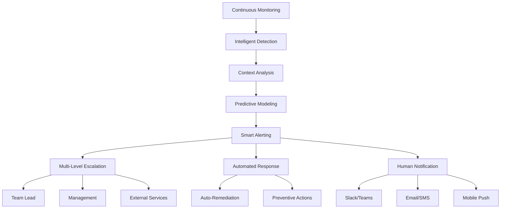

# 🚨 **Punto 12: Notificaciones y Alertas Avanzadas**

## 📋 **Objetivos de Aprendizaje**

Al completar este punto, serás capaz de:
- ✅ Implementar sistemas de alertas predictivas e inteligentes
- ✅ Configurar escalación automática multi-nivel y multi-canal
- ✅ Desarrollar chatbots para respuesta automática a incidentes
- ✅ Crear integración móvil para alertas críticas en tiempo real
- ✅ Implementar machine learning para reducción de falsos positivos
- ✅ Diseñar sistemas de respuesta automática y auto-remediación

---

## 🎯 **1. Fundamentos de Alertas Inteligentes**

### **¿Por qué necesitamos alertas avanzadas?**



### **Arquitectura del Sistema de Alertas Avanzadas**

```typescript
// Arquitectura para Pokémon TCG Platform Alert System
interface AdvancedAlertingSystem {
  detectionEngines: {
    anomalyDetector: AnomalyDetectionEngine;
    trendAnalyzer: TrendAnalysisEngine;
    patternMatcher: PatternMatchingEngine;
    predictiveModel: PredictiveAlertEngine;
  };
  
  intelligenceLayer: {
    contextAnalyzer: ContextAnalysisEngine;
    severityCalculator: SeverityCalculationEngine;
    falsePositiveReducer: FalsePositiveReductionEngine;
    escalationPlanner: EscalationPlanningEngine;
  };
  
  responseSystem: {
    autoRemediator: AutoRemediationEngine;
    chatbotResponder: ChatbotResponseEngine;
    humanNotifier: HumanNotificationEngine;
    externalIntegrator: ExternalSystemIntegrator;
  };
  
  channels: {
    realTime: WebSocketChannel;
    mobile: MobilePushChannel;
    messaging: SlackTeamsChannel;
    email: EmailChannel;
    sms: SMSChannel;
    webhook: WebhookChannel;
  };
}
```

---

## 🔧 **2. Motor de Alertas Predictivas**

### **Engine de Detección Predictiva**

```javascript
// scripts/advanced-alerting/predictive-alert-engine.js
class PredictiveAlertEngine {
  constructor() {
    this.models = {
      performance: new PerformancePredictionModel(),
      stability: new StabilityPredictionModel(),
      capacity: new CapacityPredictionModel(),
      business: new BusinessImpactPredictionModel()
    };
    
    this.alertThresholds = {
      imminent: 0.9,    // Problema en próximas 2 horas
      likely: 0.7,      // Problema en próximos 1-2 días
      possible: 0.5,    // Problema en próximos 3-7 días
      unlikely: 0.3     // Problema poco probable
    };
    
    this.pokemonTCGContext = {
      peakHours: [19, 20, 21, 22], // 7-10 PM cuando más se juega
      weekendMultiplier: 2.5,
      tournamentEvents: [],
      expansionReleases: []
    };
  }

  async generatePredictiveAlerts(currentData, historicalData) {
    console.log('🔮 Generating predictive alerts for Pokémon TCG Platform...');
    
    const predictions = {};
    const alerts = [];

    // Ejecutar modelos predictivos
    for (const [modelName, model] of Object.entries(this.models)) {
      try {
        const prediction = await model.predict(currentData, historicalData);
        predictions[modelName] = prediction;
        
        // Generar alertas basadas en predicciones
        const modelAlerts = await this.generateAlertsFromPrediction(
          modelName, 
          prediction, 
          currentData
        );
        
        alerts.push(...modelAlerts);
        
      } catch (error) {
        console.warn(`⚠️ Error in ${modelName} prediction:`, error.message);
      }
    }

    // Aplicar context gaming específico
    const contextualAlerts = this.applyGamingContext(alerts, currentData);
    
    // Filtrar falsos positivos
    const filteredAlerts = await this.filterFalsePositives(contextualAlerts);
    
    // Calcular severidad y urgencia
    const prioritizedAlerts = this.prioritizeAlerts(filteredAlerts);

    return {
      timestamp: new Date().toISOString(),
      predictions,
      alerts: prioritizedAlerts,
      summary: this.generateAlertSummary(prioritizedAlerts)
    };
  }

  async generateAlertsFromPrediction(modelName, prediction, currentData) {
    const alerts = [];

    // Alertas de rendimiento
    if (modelName === 'performance' && prediction.degradationProbability > this.alertThresholds.likely) {
      alerts.push({
        id: `perf_${Date.now()}`,
        type: 'predictive_performance',
        severity: this.calculateSeverity(prediction.degradationProbability),
        title: '⚡ Performance Degradation Predicted',
        description: `Performance degradation predicted with ${(prediction.degradationProbability * 100).toFixed(1)}% probability`,
        timeframe: prediction.timeframe,
        affectedSystems: prediction.affectedSystems,
        predictedImpact: {
          userExperience: prediction.userImpact,
          businessMetrics: prediction.businessImpact,
          technicalSystems: prediction.systemImpact
        },
        recommendations: this.generatePreventiveRecommendations(modelName, prediction),
        confidence: prediction.confidence
      });
    }

    // Alertas de estabilidad
    if (modelName === 'stability' && prediction.failureProbability > this.alertThresholds.possible) {
      alerts.push({
        id: `stab_${Date.now()}`,
        type: 'predictive_stability',
        severity: this.calculateSeverity(prediction.failureProbability),
        title: '🛡️ System Instability Predicted',
        description: `System instability predicted with ${(prediction.failureProbability * 100).toFixed(1)}% probability`,
        timeframe: prediction.timeframe,
        riskFactors: prediction.riskFactors,
        preventiveMeasures: this.generatePreventiveMeasures(prediction),
        confidence: prediction.confidence
      });
    }

    // Alertas específicas de Pokémon TCG
    if (modelName === 'business') {
      const gameSpecificAlerts = this.generateGameSpecificAlerts(prediction, currentData);
      alerts.push(...gameSpecificAlerts);
    }

    return alerts;
  }

  generateGameSpecificAlerts(prediction, currentData) {
    const alerts = [];
    
    // Alerta de carga de cartas
    if (prediction.cardLoadingDegradation > 0.6) {
      alerts.push({
        id: `card_load_${Date.now()}`,
        type: 'predictive_card_performance',
        severity: 'medium',
        title: '🎴 Card Loading Performance Risk',
        description: 'Card loading performance may degrade during upcoming peak hours',
        gameContext: {
          affectedCardTypes: prediction.affectedCardTypes,
          expectedLoadIncrease: prediction.expectedLoadIncrease,
          peakTimeframe: this.getNextPeakHours()
        },
        preventiveActions: [
          'Pre-cache popular cards',
          'Scale card image CDN',
          'Optimize database queries'
        ]
      });
    }

    // Alerta de capacidad para torneos
    if (this.isUpcomingTournament() && prediction.capacityRisk > 0.5) {
      alerts.push({
        id: `tournament_capacity_${Date.now()}`,
        type: 'predictive_tournament_capacity',
        severity: 'high',
        title: '🏆 Tournament Capacity Risk',
        description: 'System may not handle upcoming tournament load',
        gameContext: {
          tournamentDate: this.getNextTournamentDate(),
          expectedParticipants: prediction.expectedParticipants,
          capacityShortfall: prediction.capacityShortfall
        },
        urgentActions: [
          'Scale infrastructure immediately',
          'Enable caching strategies',
          'Prepare load balancing',
          'Alert DevOps team'
        ]
      });
    }

    return alerts;
  }

  applyGamingContext(alerts, currentData) {
    return alerts.map(alert => {
      const enhancedAlert = { ...alert };
      
      // Aplicar contexto de horarios de juego
      if (this.isInPeakGamingHours()) {
        enhancedAlert.severity = this.escalateSeverity(alert.severity);
        enhancedAlert.urgency = 'high';
        enhancedAlert.context = {
          ...enhancedAlert.context,
          peakHours: true,
          expectedUserLoad: 'high'
        };
      }

      // Aplicar contexto de fin de semana
      if (this.isWeekend()) {
        enhancedAlert.expectedImpact = {
          ...enhancedAlert.expectedImpact,
          userCount: enhancedAlert.expectedImpact?.userCount * this.pokemonTCGContext.weekendMultiplier
        };
      }

      // Aplicar contexto de lanzamiento de expansión
      if (this.isRecentExpansionRelease()) {
        enhancedAlert.gameContext = {
          ...enhancedAlert.gameContext,
          expansionHype: true,
          expectedCardViews: 'significantly_increased'
        };
      }

      return enhancedAlert;
    });
  }

  async filterFalsePositives(alerts) {
    const falsePositiveReducer = new FalsePositiveReductionEngine();
    const filteredAlerts = [];

    for (const alert of alerts) {
      const fpScore = await falsePositiveReducer.calculateFalsePositiveScore(alert);
      
      if (fpScore < 0.3) { // Baja probabilidad de falso positivo
        filteredAlerts.push({
          ...alert,
          falsePositiveScore: fpScore,
          validated: true
        });
      } else if (fpScore < 0.7) { // Probabilidad media
        filteredAlerts.push({
          ...alert,
          falsePositiveScore: fpScore,
          validated: false,
          requiresValidation: true
        });
      }
      // Alertas con alta probabilidad de FP se descartan
    }

    return filteredAlerts;
  }
}

// Modelo predictivo de rendimiento específico para gaming
class PerformancePredictionModel {
  constructor() {
    this.features = [
      'avgResponseTime',
      'cardLoadingTime',
      'searchResponseTime',
      'dbQueryTime',
      'concurrentUsers',
      'memoryUsage',
      'cpuUsage'
    ];
  }

  async predict(currentData, historicalData) {
    const prediction = {
      degradationProbability: 0,
      timeframe: '2-6 hours',
      confidence: 0,
      affectedSystems: [],
      userImpact: 'low',
      businessImpact: 'minimal',
      systemImpact: []
    };

    // Análisis de tendencias de rendimiento
    const trends = this.analyzeTrends(historicalData);
    
    // Detectar patrones de degradación
    const degradationPatterns = this.detectDegradationPatterns(currentData, trends);
    
    // Calcular probabilidad basada en múltiples factores
    prediction.degradationProbability = this.calculateDegradationProbability(
      degradationPatterns,
      currentData,
      trends
    );

    // Determinar sistemas afectados
    prediction.affectedSystems = this.identifyAffectedSystems(degradationPatterns);
    
    // Calcular impacto en gaming
    prediction.gameImpact = this.calculateGameImpact(prediction.degradationProbability);
    
    // Calcular confianza del modelo
    prediction.confidence = this.calculateModelConfidence(historicalData.length, trends.stability);

    return prediction;
  }

  calculateGameImpact(degradationProbability) {
    return {
      cardBrowsing: degradationProbability > 0.7 ? 'high' : 'medium',
      deckBuilding: degradationProbability > 0.6 ? 'high' : 'low',
      searchFunctionality: degradationProbability > 0.8 ? 'critical' : 'medium',
      userRetention: degradationProbability > 0.75 ? 'at_risk' : 'stable'
    };
  }
}
```

---

## 🔄 **3. Sistema de Escalación Inteligente**

### **Motor de Escalación Multi-Nivel**

```javascript
// scripts/advanced-alerting/escalation-engine.js
class IntelligentEscalationEngine {
  constructor() {
    this.escalationMatrix = {
      severity: {
        critical: { level: 4, maxResponseTime: 300 },    // 5 minutos
        high: { level: 3, maxResponseTime: 900 },        // 15 minutos  
        medium: { level: 2, maxResponseTime: 3600 },     // 1 hora
        low: { level: 1, maxResponseTime: 14400 }        // 4 horas
      },
      
      businessHours: {
        peak: { multiplier: 1.5, urgencyBoost: 1 },
        normal: { multiplier: 1.0, urgencyBoost: 0 },
        off: { multiplier: 0.7, urgencyBoost: -1 }
      },
      
      teams: {
        level1: {
          name: 'Frontend Developers',
          channels: ['slack_dev'],
          expertise: ['ui', 'performance', 'user_experience'],
          availability: '24/7'
        },
        level2: {
          name: 'Backend/DevOps',
          channels: ['slack_devops', 'pagerduty'],
          expertise: ['api', 'database', 'infrastructure'],
          availability: '24/7'
        },
        level3: {
          name: 'Team Leads',
          channels: ['slack_leads', 'email', 'sms'],
          expertise: ['architecture', 'incident_management'],
          availability: '24/7'
        },
        level4: {
          name: 'Management/External',
          channels: ['email', 'sms', 'webhook'],
          expertise: ['business_decisions', 'external_communication'],
          availability: 'business_hours+'
        }
      }
    };
    
    this.gameSpecificEscalation = {
      tournament_events: { urgencyMultiplier: 2.0, skipLevels: 0 },
      expansion_launch: { urgencyMultiplier: 1.5, skipLevels: 0 },
      peak_gaming_hours: { urgencyMultiplier: 1.3, skipLevels: 0 },
      weekend_traffic: { urgencyMultiplier: 1.2, skipLevels: 0 }
    };
  }

  async processAlert(alert, context = {}) {
    console.log(`🚨 Processing escalation for alert: ${alert.id}`);
    
    // Calcular nivel de escalación inicial
    const initialLevel = this.calculateInitialEscalationLevel(alert, context);
    
    // Crear plan de escalación
    const escalationPlan = this.createEscalationPlan(alert, initialLevel, context);
    
    // Ejecutar escalación inicial
    const escalationExecution = await this.executeEscalation(escalationPlan, 0);
    
    // Configurar seguimiento automático
    this.scheduleEscalationFollowUp(alert, escalationPlan);
    
    return {
      alertId: alert.id,
      escalationPlan,
      initialExecution: escalationExecution,
      status: 'active'
    };
  }

  calculateInitialEscalationLevel(alert, context) {
    let baseLevel = this.escalationMatrix.severity[alert.severity]?.level || 1;
    
    // Aplicar modificadores de contexto gaming
    const gameContext = this.analyzeGameContext(context);
    baseLevel = this.applyGameContextModifiers(baseLevel, gameContext);
    
    // Aplicar modificadores de horario
    const timeContext = this.analyzeTimeContext();
    baseLevel = this.applyTimeModifiers(baseLevel, timeContext);
    
    // Aplicar lógica específica del tipo de alerta
    baseLevel = this.applyAlertTypeModifiers(baseLevel, alert);
    
    return Math.min(4, Math.max(1, Math.round(baseLevel)));
  }

  applyGameContextModifiers(level, gameContext) {
    let modifiedLevel = level;
    
    // Durante eventos de torneo
    if (gameContext.tournamentActive) {
      modifiedLevel *= this.gameSpecificEscalation.tournament_events.urgencyMultiplier;
    }
    
    // Durante lanzamiento de expansión
    if (gameContext.expansionLaunch) {
      modifiedLevel *= this.gameSpecificEscalation.expansion_launch.urgencyMultiplier;
    }
    
    // Durante horas pico de juego
    if (gameContext.peakGamingHours) {
      modifiedLevel *= this.gameSpecificEscalation.peak_gaming_hours.urgencyMultiplier;
    }
    
    return modifiedLevel;
  }

  createEscalationPlan(alert, initialLevel, context) {
    const plan = {
      alertId: alert.id,
      levels: [],
      totalLevels: 4,
      currentLevel: 0,
      context
    };

    // Crear cada nivel de escalación
    for (let level = initialLevel; level <= 4; level++) {
      const teamConfig = this.escalationMatrix.teams[`level${level}`];
      const severityConfig = this.escalationMatrix.severity[alert.severity];
      
      plan.levels.push({
        level,
        team: teamConfig.name,
        channels: teamConfig.channels,
        expertise: teamConfig.expertise,
        timeout: this.calculateTimeout(severityConfig, level, context),
        actions: this.generateLevelActions(alert, level, teamConfig),
        notifications: this.generateLevelNotifications(alert, level, teamConfig)
      });
    }

    return plan;
  }

  generateLevelActions(alert, level, teamConfig) {
    const actions = [];
    
    switch (level) {
      case 1:
        actions.push(
          'Acknowledge alert in monitoring system',
          'Begin initial investigation',
          'Check recent deployments and changes'
        );
        break;
        
      case 2:
        actions.push(
          'Deep dive technical analysis',
          'Check infrastructure metrics',
          'Coordinate with Level 1 findings',
          'Prepare rollback if needed'
        );
        break;
        
      case 3:
        actions.push(
          'Incident management coordination',
          'Stakeholder communication',
          'Resource allocation decisions',
          'External communication planning'
        );
        break;
        
      case 4:
        actions.push(
          'Executive decision making',
          'Customer communication',
          'Media/PR coordination',
          'Business continuity planning'
        );
        break;
    }
    
    // Agregar acciones específicas de gaming
    if (alert.type?.includes('card') || alert.gameContext) {
      actions.push(...this.generateGameSpecificActions(alert, level));
    }
    
    return actions;
  }

  generateGameSpecificActions(alert, level) {
    const gameActions = [];
    
    if (level <= 2) {
      gameActions.push(
        'Check card database performance',
        'Verify CDN performance for card images',
        'Test search functionality'
      );
    }
    
    if (level >= 3 && alert.gameContext?.tournamentActive) {
      gameActions.push(
        'Contact tournament organizers',
        'Prepare player communication',
        'Evaluate tournament impact'
      );
    }
    
    return gameActions;
  }

  async executeEscalation(plan, levelIndex) {
    const level = plan.levels[levelIndex];
    if (!level) return { success: false, reason: 'No level to execute' };
    
    console.log(`📢 Executing escalation level ${level.level}: ${level.team}`);
    
    const results = {
      level: level.level,
      team: level.team,
      timestamp: new Date().toISOString(),
      notifications: [],
      actions: []
    };
    
    // Enviar notificaciones por cada canal
    for (const channel of level.channels) {
      try {
        const notification = await this.sendNotification(channel, level, plan);
        results.notifications.push(notification);
      } catch (error) {
        console.error(`❌ Failed to send notification via ${channel}:`, error);
        results.notifications.push({
          channel,
          success: false,
          error: error.message
        });
      }
    }
    
    // Ejecutar acciones automáticas si están configuradas
    for (const action of level.actions) {
      if (this.isAutomatableAction(action)) {
        const actionResult = await this.executeAutomaticAction(action, plan);
        results.actions.push(actionResult);
      }
    }
    
    return results;
  }

  scheduleEscalationFollowUp(alert, plan) {
    const checkInterval = 60000; // Verificar cada minuto
    
    const followUpTimer = setInterval(async () => {
      try {
        // Verificar si la alerta sigue activa
        const alertStatus = await this.checkAlertStatus(alert.id);
        
        if (alertStatus.resolved) {
          console.log(`✅ Alert ${alert.id} resolved, stopping escalation`);
          clearInterval(followUpTimer);
          return;
        }
        
        // Verificar si necesita escalar al siguiente nivel
        const needsEscalation = this.shouldEscalateToNextLevel(alert, plan);
        
        if (needsEscalation) {
          const nextLevel = plan.currentLevel + 1;
          if (nextLevel < plan.levels.length) {
            console.log(`⬆️ Escalating alert ${alert.id} to level ${nextLevel + 1}`);
            await this.executeEscalation(plan, nextLevel);
            plan.currentLevel = nextLevel;
          }
        }
        
      } catch (error) {
        console.error('Error in escalation follow-up:', error);
      }
    }, checkInterval);
    
    // Cleanup después de 24 horas máximo
    setTimeout(() => {
      clearInterval(followUpTimer);
    }, 24 * 60 * 60 * 1000);
  }
}
```

---

## 🤖 **4. Chatbot de Respuesta Automática**

### **ChatBot Inteligente para Incidentes**

```javascript
// scripts/advanced-alerting/incident-chatbot.js
class IncidentResponseChatbot {
  constructor() {
    this.name = 'PokéBot';
    this.capabilities = [
      'incident_classification',
      'initial_response',
      'information_gathering',
      'action_execution',
      'escalation_management',
      'status_updates'
    ];
    
    this.knowledgeBase = {
      commonIssues: new Map(),
      resolutionProcedures: new Map(),
      escalationRules: new Map(),
      gameSpecificKnowledge: new Map()
    };
    
    this.conversationContexts = new Map();
    
    this.initializeKnowledgeBase();
  }

  initializeKnowledgeBase() {
    // Conocimiento específico de Pokémon TCG
    this.knowledgeBase.gameSpecificKnowledge.set('card_loading_slow', {
      symptoms: ['Card images loading slowly', 'Search taking too long', 'Blank card placeholders'],
      causes: ['CDN issues', 'Database overload', 'Network congestion'],
      quickFixes: ['Clear browser cache', 'Switch to text-only view', 'Refresh page'],
      escalationTriggers: ['Multiple users affected', 'Loading time > 10 seconds', 'Tournament active']
    });
    
    this.knowledgeBase.gameSpecificKnowledge.set('authentication_failure', {
      symptoms: ['Login failures', 'Session timeouts', 'Token errors'],
      causes: ['Auth service down', 'Database connectivity', 'SSL certificate issues'],
      quickFixes: ['Restart auth service', 'Check SSL certificates', 'Verify database connectivity'],
      escalationTriggers: ['Service completely down', 'Multiple login attempts failing', 'Security concern']
    });
    
    this.knowledgeBase.gameSpecificKnowledge.set('tournament_capacity', {
      symptoms: ['High response times during tournaments', 'Connection failures', 'Timeout errors'],
      causes: ['Insufficient capacity', 'Database bottlenecks', 'Load balancer issues'],
      quickFixes: ['Scale up instances', 'Enable read replicas', 'Activate caching'],
      escalationTriggers: ['Tournament in progress', 'User complaints', 'Revenue impact']
    });
  }

  async handleIncident(alert, channel = 'slack') {
    console.log(`🤖 PokéBot handling incident: ${alert.id}`);
    
    // Crear contexto de conversación
    const conversationId = this.createConversationContext(alert);
    
    // Clasificar el incidente
    const classification = await this.classifyIncident(alert);
    
    // Generar respuesta inicial
    const initialResponse = await this.generateInitialResponse(alert, classification);
    
    // Enviar respuesta inicial
    await this.sendMessage(channel, initialResponse, conversationId);
    
    // Ejecutar acciones automáticas si aplican
    const autoActions = await this.executeAutomaticActions(alert, classification);
    
    // Programar seguimiento
    this.scheduleFollowUp(alert, conversationId);
    
    return {
      conversationId,
      classification,
      initialResponse,
      autoActions,
      status: 'active'
    };
  }

  async classifyIncident(alert) {
    const classification = {
      category: 'unknown',
      subcategory: 'unknown',
      severity: alert.severity,
      confidence: 0,
      gameSpecific: false,
      knownIssue: false,
      autoResolvable: false
    };

    // Análisis de palabras clave
    const keywords = this.extractKeywords(alert.description);
    
    // Clasificación específica de gaming
    if (keywords.some(k => ['card', 'pokemon', 'deck', 'collection'].includes(k.toLowerCase()))) {
      classification.gameSpecific = true;
      classification.category = 'game_functionality';
      
      if (keywords.some(k => ['loading', 'slow', 'timeout'].includes(k.toLowerCase()))) {
        classification.subcategory = 'card_loading';
        classification.confidence = 0.85;
      }
    }
    
    // Clasificación de infraestructura
    if (keywords.some(k => ['database', 'server', 'api', 'timeout'].includes(k.toLowerCase()))) {
      classification.category = 'infrastructure';
      classification.confidence = Math.max(classification.confidence, 0.7);
    }
    
    // Verificar si es un issue conocido
    const knownIssue = this.checkKnownIssues(alert, keywords);
    if (knownIssue) {
      classification.knownIssue = true;
      classification.autoResolvable = knownIssue.autoResolvable;
      classification.confidence = 0.9;
    }
    
    return classification;
  }

  async generateInitialResponse(alert, classification) {
    const response = {
      type: 'incident_acknowledgment',
      timestamp: new Date().toISOString(),
      content: {
        main: '',
        details: '',
        actions: '',
        nextSteps: ''
      }
    };

    // Mensaje principal personalizado
    if (classification.gameSpecific) {
      response.content.main = `🎮 **PokéBot Alert**: I've detected a ${classification.subcategory || 'gaming'} issue in the Pokémon TCG Platform.`;
    } else {
      response.content.main = `🤖 **PokéBot Alert**: I've detected a ${classification.category} issue in the platform.`;
    }

    // Detalles específicos
    response.content.details = `
**Incident Details:**
- **Alert ID**: ${alert.id}
- **Severity**: ${alert.severity.toUpperCase()}
- **Category**: ${classification.category}
- **Confidence**: ${(classification.confidence * 100).toFixed(1)}%
- **Time Detected**: ${alert.timestamp || new Date().toISOString()}
`;

    // Acciones automáticas realizadas
    if (classification.knownIssue && classification.autoResolvable) {
      response.content.actions = `
**🔧 Automatic Actions Initiated:**
- Running automated diagnostics
- Executing known resolution procedures
- Monitoring for improvement
`;
    } else {
      response.content.actions = `
**🔍 Investigation Started:**
- Gathering system metrics
- Checking recent deployments
- Analyzing error patterns
`;
    }

    // Próximos pasos
    if (classification.gameSpecific) {
      response.content.nextSteps = this.generateGameSpecificNextSteps(classification, alert);
    } else {
      response.content.nextSteps = this.generateGenericNextSteps(classification, alert);
    }

    return response;
  }

  generateGameSpecificNextSteps(classification, alert) {
    let steps = `
**🎯 Next Steps:**
`;

    switch (classification.subcategory) {
      case 'card_loading':
        steps += `
- Checking CDN performance for card images
- Monitoring database query performance
- Testing card search functionality
- Will escalate if loading time exceeds 10 seconds
`;
        break;
        
      case 'authentication':
        steps += `
- Verifying authentication service status
- Checking SSL certificate validity
- Testing login flow from multiple regions
- Will escalate if login success rate drops below 95%
`;
        break;
        
      default:
        steps += `
- Performing comprehensive system health check
- Analyzing game-specific metrics
- Checking for tournament or expansion-related load
- Will update every 5 minutes or escalate if needed
`;
    }

    return steps;
  }

  async executeAutomaticActions(alert, classification) {
    const actions = [];
    
    if (classification.knownIssue && classification.autoResolvable) {
      const knownIssue = this.knowledgeBase.gameSpecificKnowledge.get(classification.subcategory);
      
      for (const quickFix of knownIssue.quickFixes) {
        try {
          const actionResult = await this.executeQuickFix(quickFix, alert);
          actions.push({
            action: quickFix,
            result: actionResult,
            timestamp: new Date().toISOString()
          });
        } catch (error) {
          actions.push({
            action: quickFix,
            result: { success: false, error: error.message },
            timestamp: new Date().toISOString()
          });
        }
      }
    }
    
    // Acciones de monitoreo automático
    actions.push(await this.startAutomaticMonitoring(alert));
    
    return actions;
  }

  async executeQuickFix(quickFix, alert) {
    console.log(`🔧 PokéBot executing quick fix: ${quickFix}`);
    
    switch (quickFix) {
      case 'Clear browser cache':
        return { success: true, message: 'Cache clearing instructions sent to users' };
        
      case 'Restart auth service':
        // En un sistema real, esto ejecutaría un restart del servicio
        return { success: true, message: 'Auth service restart initiated' };
        
      case 'Scale up instances':
        // En un sistema real, esto activaría auto-scaling
        return { success: true, message: 'Auto-scaling triggered for additional capacity' };
        
      case 'Enable read replicas':
        return { success: true, message: 'Database read replicas activated' };
        
      default:
        return { success: false, message: 'Quick fix not implemented' };
    }
  }

  async startAutomaticMonitoring(alert) {
    const monitoringId = `monitor_${alert.id}_${Date.now()}`;
    
    // Configurar monitoreo específico para este incidente
    const monitoring = {
      id: monitoringId,
      alertId: alert.id,
      metrics: this.determineRelevantMetrics(alert),
      interval: 30000, // 30 segundos
      thresholds: this.calculateMonitoringThresholds(alert),
      startTime: new Date().toISOString()
    };
    
    // Iniciar monitoreo automático
    this.activeMonitoring.set(monitoringId, setInterval(async () => {
      await this.performMonitoringCheck(monitoring);
    }, monitoring.interval));
    
    return {
      action: 'start_automatic_monitoring',
      result: { success: true, monitoringId },
      timestamp: new Date().toISOString()
    };
  }

  async sendMessage(channel, response, conversationId) {
    const message = this.formatMessage(response);
    
    switch (channel) {
      case 'slack':
        await this.sendSlackMessage(message, conversationId);
        break;
      case 'teams':
        await this.sendTeamsMessage(message, conversationId);
        break;
      case 'webhook':
        await this.sendWebhookMessage(message, conversationId);
        break;
    }
  }

  formatMessage(response) {
    return `${response.content.main}

${response.content.details}
${response.content.actions}
${response.content.nextSteps}

---
*This is an automated response from PokéBot. I'm monitoring the situation and will provide updates.*`;
  }

  scheduleFollowUp(alert, conversationId) {
    const followUpInterval = 300000; // 5 minutos
    
    const followUpTimer = setInterval(async () => {
      try {
        const status = await this.checkIncidentStatus(alert.id);
        const update = await this.generateStatusUpdate(alert, status);
        
        if (status.resolved) {
          await this.sendMessage('slack', update, conversationId);
          clearInterval(followUpTimer);
        } else if (status.needsEscalation) {
          await this.initiateEscalation(alert, conversationId);
        } else {
          await this.sendMessage('slack', update, conversationId);
        }
        
      } catch (error) {
        console.error('Error in chatbot follow-up:', error);
      }
    }, followUpInterval);
    
    // Cleanup después de 2 horas
    setTimeout(() => {
      clearInterval(followUpTimer);
    }, 2 * 60 * 60 * 1000);
  }
}
```

---

## 📱 **5. Integración Móvil y Push Notifications**

### **Sistema de Notificaciones Móviles**

```javascript
// scripts/advanced-alerting/mobile-notifications.js
class MobileNotificationSystem {
  constructor() {
    this.pushServices = {
      firebase: new FirebaseCloudMessaging(),
      apns: new ApplePushNotificationService(),
      progressive: new ProgressiveWebAppNotifications()
    };
    
    this.deviceRegistry = new Map();
    this.notificationQueue = [];
    this.deliveryTracking = new Map();
  }

  async registerDevice(userId, deviceInfo) {
    const registration = {
      userId,
      deviceId: deviceInfo.deviceId,
      platform: deviceInfo.platform,
      token: deviceInfo.pushToken,
      preferences: deviceInfo.notificationPreferences || this.getDefaultPreferences(),
      registeredAt: new Date().toISOString(),
      lastActive: new Date().toISOString()
    };
    
    this.deviceRegistry.set(deviceInfo.deviceId, registration);
    
    console.log(`📱 Device registered for user ${userId}: ${deviceInfo.platform}`);
    return registration;
  }

  async sendCriticalAlert(alert, targetUsers = 'all') {
    console.log(`📢 Sending critical mobile alert: ${alert.id}`);
    
    const notification = {
      id: `mobile_${alert.id}_${Date.now()}`,
      title: this.generateMobileTitle(alert),
      body: this.generateMobileBody(alert),
      data: {
        alertId: alert.id,
        severity: alert.severity,
        type: alert.type,
        timestamp: new Date().toISOString(),
        actionUrl: this.generateActionUrl(alert)
      },
      priority: this.mapSeverityToPriority(alert.severity),
      sound: this.selectNotificationSound(alert),
      badge: 1,
      icon: this.selectNotificationIcon(alert)
    };
    
    // Determinar dispositivos objetivo
    const targetDevices = await this.getTargetDevices(targetUsers, alert);
    
    // Enviar notificaciones
    const results = await this.deliverToDevices(notification, targetDevices);
    
    // Tracking de entrega
    this.trackDelivery(notification.id, results);
    
    return {
      notificationId: notification.id,
      targetDevices: targetDevices.length,
      successful: results.filter(r => r.success).length,
      failed: results.filter(r => !r.success).length,
      results
    };
  }

  generateMobileTitle(alert) {
    const titles = {
      critical: '🚨 CRITICAL: Pokémon TCG Platform',
      high: '⚠️ HIGH: Platform Alert',
      medium: '📊 Platform Update',
      low: 'ℹ️ Platform Info'
    };
    
    return titles[alert.severity] || '📱 Platform Notification';
  }

  generateMobileBody(alert) {
    let body = '';
    
    if (alert.type?.includes('predictive')) {
      body = `Potential issue predicted: ${alert.description}`;
    } else if (alert.type?.includes('card')) {
      body = `Card system issue: ${alert.description}`;
    } else if (alert.type?.includes('tournament')) {
      body = `Tournament system: ${alert.description}`;
    } else {
      body = alert.description;
    }
    
    // Truncar para móvil (máximo 150 caracteres)
    return body.length > 150 ? body.substring(0, 147) + '...' : body;
  }

  async getTargetDevices(targetUsers, alert) {
    let devices = [];
    
    if (targetUsers === 'all') {
      // Enviar a todos los dispositivos registrados de usuarios relevantes
      devices = Array.from(this.deviceRegistry.values()).filter(device => 
        this.shouldReceiveAlert(device, alert)
      );
    } else if (Array.isArray(targetUsers)) {
      // Enviar a usuarios específicos
      devices = Array.from(this.deviceRegistry.values()).filter(device =>
        targetUsers.includes(device.userId) && this.shouldReceiveAlert(device, alert)
      );
    }
    
    return devices;
  }

  shouldReceiveAlert(device, alert) {
    // Verificar preferencias del usuario
    if (!device.preferences.enablePushNotifications) return false;
    
    // Verificar nivel de severidad
    const minSeverity = device.preferences.minimumSeverity || 'medium';
    if (!this.severityMeetsThreshold(alert.severity, minSeverity)) return false;
    
    // Verificar horarios (no molestar)
    if (device.preferences.quietHours && this.isInQuietHours(device.preferences.quietHours)) {
      // Solo enviar críticas durante horarios de silencio
      return alert.severity === 'critical';
    }
    
    // Verificar filtros específicos
    if (device.preferences.gameAlertsOnly && !alert.gameContext) return false;
    
    return true;
  }

  async deliverToDevices(notification, devices) {
    const deliveryPromises = devices.map(device => 
      this.deliverToDevice(notification, device)
    );
    
    const results = await Promise.allSettled(deliveryPromises);
    
    return results.map((result, index) => ({
      deviceId: devices[index].deviceId,
      userId: devices[index].userId,
      success: result.status === 'fulfilled',
      result: result.status === 'fulfilled' ? result.value : result.reason,
      timestamp: new Date().toISOString()
    }));
  }

  async deliverToDevice(notification, device) {
    const service = this.selectPushService(device.platform);
    
    try {
      const customNotification = this.customizeForDevice(notification, device);
      const result = await service.send(customNotification, device.token);
      
      return {
        messageId: result.messageId,
        success: true,
        platform: device.platform
      };
      
    } catch (error) {
      console.error(`Failed to deliver notification to ${device.deviceId}:`, error);
      
      // Marcar token como inválido si es necesario
      if (this.isInvalidTokenError(error)) {
        await this.invalidateDeviceToken(device.deviceId);
      }
      
      throw error;
    }
  }

  customizeForDevice(notification, device) {
    const customized = { ...notification };
    
    // Personalización por plataforma
    switch (device.platform) {
      case 'ios':
        customized.aps = {
          alert: {
            title: notification.title,
            body: notification.body
          },
          badge: notification.badge,
          sound: notification.sound
        };
        break;
        
      case 'android':
        customized.android = {
          priority: notification.priority,
          notification: {
            title: notification.title,
            body: notification.body,
            icon: notification.icon,
            sound: notification.sound
          }
        };
        break;
        
      case 'web':
        customized.webpush = {
          notification: {
            title: notification.title,
            body: notification.body,
            icon: notification.icon,
            badge: '/images/badge.png',
            actions: this.generateWebActions(notification)
          }
        };
        break;
    }
    
    return customized;
  }

  generateWebActions(notification) {
    const actions = [];
    
    if (notification.data.severity === 'critical') {
      actions.push({
        action: 'acknowledge',
        title: 'Acknowledge',
        icon: '/images/check.png'
      });
    }
    
    actions.push({
      action: 'view',
      title: 'View Details',
      icon: '/images/view.png'
    });
    
    return actions;
  }

  getDefaultPreferences() {
    return {
      enablePushNotifications: true,
      minimumSeverity: 'medium',
      gameAlertsOnly: false,
      quietHours: {
        enabled: true,
        start: '22:00',
        end: '07:00',
        timezone: 'local'
      },
      categories: {
        performance: true,
        security: true,
        maintenance: false,
        promotional: false
      }
    };
  }
}
```

---

## 📝 **6. Ejercicios Prácticos**

### **Ejercicio 1: Sistema de Alertas Básico**
```javascript
// 🎯 Objetivo: Implementar detector de alertas predictivas

class BasicPredictiveAlerts {
  generateAlert(metrics, historical) {
    // Implementa lógica de predicción básica
    // Usa tendencias y umbrales
  }
  
  calculateSeverity(prediction) {
    // Mapea probabilidad a severidad
  }
  
  shouldAlert(prediction, context) {
    // Determina si se debe alertar
  }
}
```

### **Ejercicio 2: Escalación Automática**
```javascript
// 🎯 Objetivo: Crear sistema de escalación simple

class SimpleEscalation {
  constructor() {
    this.levels = {
      1: { team: 'developers', timeout: 15 },
      2: { team: 'leads', timeout: 30 },
      3: { team: 'management', timeout: 60 }
    };
  }
  
  escalate(alert, level) {
    // Implementa lógica de escalación
  }
  
  scheduleNextLevel(alert, currentLevel) {
    // Programa siguiente escalación
  }
}
```

### **Ejercicio 3: Chatbot Básico**
```javascript
// 🎯 Objetivo: Implementar respuesta automática básica

class BasicIncidentBot {
  classifyIncident(alert) {
    // Clasifica el tipo de incidente
  }
  
  generateResponse(alert, classification) {
    // Genera respuesta automática
  }
  
  executeQuickFix(action) {
    // Ejecuta acciones automáticas
  }
}
```

---

## 🧪 **7. Validación y Testing**

### **Checklist de Notificaciones Avanzadas**

```markdown
## ✅ Checklist de Sistema de Alertas

### Sistema Predictivo
- [ ] Modelos predictivos entrenados y funcionando
- [ ] Umbrales configurados apropiadamente
- [ ] Filtros de falsos positivos implementados
- [ ] Contexto gaming aplicado correctamente
- [ ] Confianza de predicciones calculada

### Escalación Inteligente
- [ ] Matriz de escalación configurada
- [ ] Timeouts por severidad funcionando
- [ ] Context modifiers aplicándose
- [ ] Seguimiento automático activo
- [ ] Cleanup de timers implementado

### Chatbot de Respuesta
- [ ] Clasificación de incidentes funcionando
- [ ] Knowledge base poblada
- [ ] Acciones automáticas ejecutándose
- [ ] Respuestas contextuales generadas
- [ ] Integración con canales activa

### Notificaciones Móviles
- [ ] Push notifications enviándose
- [ ] Personalización por plataforma
- [ ] Preferencias de usuario respetadas
- [ ] Tracking de entrega funcionando
- [ ] Manejo de tokens inválidos

### Integración General
- [ ] Todos los canales funcionando
- [ ] Fallbacks configurados
- [ ] Monitoring de sistema activo
- [ ] Logs y métricas recopilándose
- [ ] Performance aceptable
```

### **Tests de Sistema Completo**

```javascript
// scripts/test-advanced-alerting.js
class AdvancedAlertingSystemTest {
  async runFullSystemTest() {
    console.log('🧪 Testing Advanced Alerting System...');
    
    const tests = [
      this.testPredictiveAlerts(),
      this.testEscalationEngine(),
      this.testChatbotResponse(),
      this.testMobileNotifications(),
      this.testEndToEndFlow()
    ];
    
    const results = await Promise.allSettled(tests);
    
    return {
      totalTests: tests.length,
      passed: results.filter(r => r.status === 'fulfilled').length,
      failed: results.filter(r => r.status === 'rejected').length,
      details: results
    };
  }

  async testEndToEndFlow() {
    console.log('🔄 Testing end-to-end alert flow...');
    
    // Simular datos que triggeren alerta predictiva
    const mockData = this.generateCriticalScenarioData();
    
    // Ejecutar todo el pipeline
    const alertEngine = new PredictiveAlertEngine();
    const escalationEngine = new IntelligentEscalationEngine();
    const chatbot = new IncidentResponseChatbot();
    const mobileSystem = new MobileNotificationSystem();
    
    // 1. Generar alerta predictiva
    const alerts = await alertEngine.generatePredictiveAlerts(mockData.current, mockData.historical);
    assert(alerts.alerts.length > 0, 'Should generate at least one alert');
    
    // 2. Procesar escalación
    const escalation = await escalationEngine.processAlert(alerts.alerts[0]);
    assert(escalation.escalationPlan, 'Should create escalation plan');
    
    // 3. Activar chatbot
    const chatbotResponse = await chatbot.handleIncident(alerts.alerts[0]);
    assert(chatbotResponse.conversationId, 'Should create conversation');
    
    // 4. Enviar notificación móvil si es crítica
    if (alerts.alerts[0].severity === 'critical') {
      const mobileResult = await mobileSystem.sendCriticalAlert(alerts.alerts[0]);
      assert(mobileResult.notificationId, 'Should send mobile notification');
    }
    
    return {
      success: true,
      alertsGenerated: alerts.alerts.length,
      escalationActive: !!escalation.escalationPlan,
      chatbotActive: !!chatbotResponse.conversationId,
      mobileNotificationSent: alerts.alerts[0].severity === 'critical'
    };
  }
}
```

---

## 📚 **8. Preguntas de Entrevista**

### **Nivel Básico**
1. **¿Qué diferencia hay entre alertas reactivas y predictivas?**
2. **¿Cómo implementarías un sistema básico de escalación?**
3. **¿Qué consideraciones hay para notificaciones móviles críticas?**

### **Nivel Intermedio**
4. **¿Cómo diseñarías un sistema para reducir falsos positivos en alertas?**
5. **¿Qué estrategias usarías para personalizar alertas por audiencia?**
6. **¿Cómo implementarías un chatbot para respuesta automática a incidentes?**

### **Nivel Avanzado**
7. **¿Cómo diseñarías un sistema de alertas que aprenda de feedback histórico?**
8. **¿Qué arquitectura usarías para alertas distribuidas multi-región?**
9. **¿Cómo balancearías velocidad vs. precisión en alertas predictivas?**

### **Respuestas Clave**

**Pregunta 1:** Las alertas reactivas responden a eventos que ya ocurrieron, mientras que las predictivas usan ML y análisis de tendencias para anticipar problemas antes de que sucedan, permitiendo prevención proactiva.

**Pregunta 4:** Implementaría:
- ML models para pattern recognition de alertas históricas
- Feedback loops con resoluciones exitosas/falsas
- Context awareness para reducir noise
- Correlation analysis para detectar dependencias
- Threshold auto-adjustment basado en performance

**Pregunta 7:** Diseñaría con:
- Feedback classification system (true/false positive)
- Reinforcement learning para threshold optimization
- Ensemble models que se adapten a patrones cambiantes
- A/B testing para nuevos algoritmos de detección
- Human-in-the-loop para casos edge complejos

---

## 🎯 **Resumen del Punto 12**

### **Conceptos Clave Dominados:**
✅ **Alertas predictivas** con machine learning aplicado  
✅ **Escalación inteligente** multi-nivel y contextual  
✅ **Chatbots automáticos** para respuesta a incidentes  
✅ **Notificaciones móviles** personalizadas y targeting  
✅ **Sistemas de respuesta** automática y auto-remediación  

### **Habilidades Técnicas Adquiridas:**
- Implementación de modelos predictivos para alertas
- Sistemas de escalación contextual inteligente
- Desarrollo de chatbots para incident response
- Integración móvil con push notifications
- Arquitecturas de respuesta automática

### **🏆 ¡NIVEL 4 COMPLETADO!**
Con este punto has **COMPLETADO TOTALMENTE EL NIVEL 4: AUTOMATIZACIÓN Y CI/CD**!

### **📈 Progreso Total Actualizado:**

```
✅ Nivel 1: Fundamentos Básicos (3/3) - COMPLETO
✅ Nivel 2: Reportes y Visualización (3/3) - COMPLETO  
✅ Nivel 3: Implementación Práctica (3/3) - COMPLETO
✅ Nivel 4: Automatización y CI/CD (3/3) - COMPLETO ✨
   ✅ Punto 10: Integración con CI/CD Pipelines
   ✅ Punto 11: Automatización de Reportes
   ✅ Punto 12: Notificaciones y Alertas Avanzadas
```

### **🚀 Próximo Desafío: NIVEL 5**

Ahora estás preparado para el **Nivel 5: Integración Empresarial** que incluye:
- **Punto 13:** Integración con Herramientas Empresariales
- **Punto 14:** Reportes para Stakeholders
- **Punto 15:** Monitoreo y Alertas

---

**🏆 ¡FELICITACIONES! Has completado 4 niveles completos de maestría en testing y reportes. Tu sistema de alertas de Pokémon TCG es ahora de clase enterprise con capacidades predictivas e inteligencia artificial aplicada.**