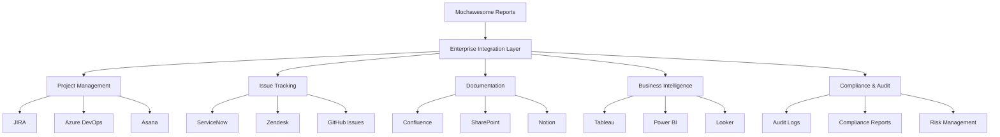

# 🏢 **Punto 13: Integración con Herramientas Empresariales**

## 📋 **Objetivos de Aprendizaje**

Al completar este punto, serás capaz de:
- ✅ Integrar Mochawesome con herramientas enterprise (JIRA, ServiceNow, Confluence)
- ✅ Implementar sincronización automática de test results con ALM tools
- ✅ Configurar dashboards empresariales en BI platforms (Tableau, Power BI)
- ✅ Establecer workflows de calidad en herramientas de gestión de proyectos
- ✅ Crear conectores personalizados para sistemas legacy
- ✅ Implementar governance y compliance reporting automatizado

---

## 🎯 **1. Panorama de Integración Empresarial**

### **¿Por qué integrar con herramientas empresariales?**



### **Arquitectura de Integración Enterprise**

```typescript
// Arquitectura para Pokémon TCG Platform Enterprise Integration
interface EnterpriseIntegrationSystem {
  connectors: {
    jira: JIRAConnector;
    serviceNow: ServiceNowConnector;
    confluence: ConfluenceConnector;
    azureDevOps: AzureDevOpsConnector;
    tableau: TableauConnector;
    powerBI: PowerBIConnector;
  };
  
  dataTransformers: {
    testResultsTransformer: TestResultsDataTransformer;
    businessMetricsTransformer: BusinessMetricsTransformer;
    complianceReportTransformer: ComplianceReportTransformer;
    executiveReportTransformer: ExecutiveReportTransformer;
  };
  
  workflows: {
    issueCreation: AutomatedIssueCreationWorkflow;
    documentGeneration: AutomatedDocumentationWorkflow;
    complianceReporting: ComplianceReportingWorkflow;
    executiveDashboard: ExecutiveDashboardWorkflow;
  };
  
  governance: {
    accessControl: EnterpriseAccessControl;
    auditLogging: EnterpriseAuditLogger;
    dataPrivacy: DataPrivacyManager;
    compliance: ComplianceManager;
  };
}
```

---

## 🔧 **2. Integración con JIRA**

### **Conector JIRA Avanzado**

```javascript
// scripts/enterprise-integration/jira-connector.js
class JIRAConnector {
  constructor(config) {
    this.baseUrl = config.baseUrl;
    this.credentials = config.credentials;
    this.projectKey = config.projectKey;
    this.defaultIssueType = config.defaultIssueType || 'Bug';
    
    this.pokemonTCGConfig = {
      components: ['Card Management', 'User Authentication', 'Search & Filter', 'Collection System'],
      priorities: {
        critical: 'Highest',
        high: 'High', 
        medium: 'Medium',
        low: 'Low'
      },
      customFields: {
        testSuite: 'customfield_10001',
        gameFeature: 'customfield_10002',
        userImpact: 'customfield_10003',
        businessValue: 'customfield_10004'
      }
    };
    
    this.client = this.initializeClient();
  }

  async syncTestResults(testResults, reportMetadata) {
    console.log('🔗 Syncing test results with JIRA...');
    
    const syncResults = {
      issuesCreated: 0,
      issuesUpdated: 0,
      issuesResolved: 0,
      errors: []
    };

    try {
      // Analizar fallos y crear/actualizar issues
      const failedTests = this.extractFailedTests(testResults);
      
      for (const failedTest of failedTests) {
        try {
          const existingIssue = await this.findExistingIssue(failedTest);
          
          if (existingIssue) {
            await this.updateExistingIssue(existingIssue, failedTest, reportMetadata);
            syncResults.issuesUpdated++;
          } else {
            await this.createNewIssue(failedTest, reportMetadata);
            syncResults.issuesCreated++;
          }
        } catch (error) {
          console.error(`❌ Error processing failed test ${failedTest.title}:`, error);
          syncResults.errors.push({
            test: failedTest.title,
            error: error.message
          });
        }
      }

      // Resolver issues para tests que ahora pasan
      const resolvedTests = await this.findResolvedTests(testResults);
      for (const resolvedTest of resolvedTests) {
        try {
          await this.resolveIssue(resolvedTest);
          syncResults.issuesResolved++;
        } catch (error) {
          syncResults.errors.push({
            test: resolvedTest.title,
            error: error.message
          });
        }
      }

      // Crear epic de testing si no existe
      await this.ensureTestingEpic(reportMetadata);

      // Actualizar dashboard de proyecto
      await this.updateProjectDashboard(testResults, reportMetadata);

    } catch (error) {
      console.error('❌ Error in JIRA sync:', error);
      throw error;
    }

    return syncResults;
  }

  async createNewIssue(failedTest, reportMetadata) {
    const issueData = {
      fields: {
        project: { key: this.projectKey },
        summary: this.generateIssueSummary(failedTest),
        description: this.generateIssueDescription(failedTest, reportMetadata),
        issuetype: { name: this.defaultIssueType },
        priority: { name: this.mapSeverityToPriority(failedTest.severity) },
        components: this.determineComponents(failedTest),
        labels: this.generateLabels(failedTest),
        // Custom fields específicos de Pokémon TCG
        [this.pokemonTCGConfig.customFields.testSuite]: this.extractTestSuite(failedTest),
        [this.pokemonTCGConfig.customFields.gameFeature]: this.extractGameFeature(failedTest),
        [this.pokemonTCGConfig.customFields.userImpact]: this.assessUserImpact(failedTest),
        [this.pokemonTCGConfig.customFields.businessValue]: this.assessBusinessValue(failedTest)
      }
    };

    const response = await this.client.post('/rest/api/3/issue', issueData);
    
    console.log(`✅ Created JIRA issue: ${response.data.key} for test: ${failedTest.title}`);
    
    // Attachments: screenshots, logs, etc.
    if (failedTest.screenshots || failedTest.logs) {
      await this.addAttachments(response.data.key, failedTest);
    }

    return response.data;
  }

  generateIssueSummary(failedTest) {
    // Generar resumen inteligente basado en el test
    const feature = this.extractGameFeature(failedTest);
    const action = this.extractTestAction(failedTest);
    
    return `🎮 ${feature}: ${action} - Test Failure`;
  }

  generateIssueDescription(failedTest, reportMetadata) {
    return `
## 🎯 Test Failure Summary

**Test Name:** ${failedTest.title}
**Suite:** ${failedTest.parent || 'Unknown'}
**Duration:** ${failedTest.duration}ms
**Environment:** ${reportMetadata.environment || 'Unknown'}
**Build:** ${reportMetadata.buildNumber || 'Unknown'}

## 🔍 Failure Details

\`\`\`
${failedTest.err?.message || 'No error message available'}
\`\`\`

**Stack Trace:**
\`\`\`
${failedTest.err?.stack || 'No stack trace available'}
\`\`\`

## 🎮 Game Context

**Affected Feature:** ${this.extractGameFeature(failedTest)}
**User Journey:** ${this.extractUserJourney(failedTest)}
**Expected Behavior:** ${this.extractExpectedBehavior(failedTest)}

## 📊 Impact Assessment

**User Impact:** ${this.assessUserImpact(failedTest)}
**Business Value:** ${this.assessBusinessValue(failedTest)}
**Frequency:** ${this.assessFailureFrequency(failedTest)}

## 🔗 Related Information

**Test Report:** [View Full Report](${reportMetadata.reportUrl})
**CI/CD Build:** [View Build](${reportMetadata.buildUrl})
**Commit:** ${reportMetadata.commitSha}

---
*This issue was automatically created by the Pokémon TCG Test Automation System*
`;
  }

  extractGameFeature(failedTest) {
    const title = failedTest.title.toLowerCase();
    const fullTitle = failedTest.fullTitle?.toLowerCase() || '';
    
    if (title.includes('card') || fullTitle.includes('card')) return 'Card Management';
    if (title.includes('auth') || fullTitle.includes('login')) return 'User Authentication';
    if (title.includes('search') || fullTitle.includes('filter')) return 'Search & Filter';
    if (title.includes('collection') || fullTitle.includes('deck')) return 'Collection System';
    if (title.includes('tournament')) return 'Tournament System';
    
    return 'General Platform';
  }

  assessUserImpact(failedTest) {
    const criticalKeywords = ['login', 'authentication', 'payment', 'purchase'];
    const highKeywords = ['search', 'card loading', 'deck building'];
    const mediumKeywords = ['profile', 'settings', 'history'];
    
    const testContent = (failedTest.title + ' ' + failedTest.fullTitle).toLowerCase();
    
    if (criticalKeywords.some(keyword => testContent.includes(keyword))) {
      return 'Critical - Blocks core user functionality';
    } else if (highKeywords.some(keyword => testContent.includes(keyword))) {
      return 'High - Affects main user experience';
    } else if (mediumKeywords.some(keyword => testContent.includes(keyword))) {
      return 'Medium - Minor user inconvenience';
    } else {
      return 'Low - Minimal user impact';
    }
  }

  assessBusinessValue(failedTest) {
    const revenueImpact = ['payment', 'purchase', 'subscription', 'premium'];
    const engagementImpact = ['card loading', 'search', 'tournament', 'deck building'];
    const retentionImpact = ['login', 'profile', 'collection', 'social'];
    
    const testContent = (failedTest.title + ' ' + failedTest.fullTitle).toLowerCase();
    
    if (revenueImpact.some(keyword => testContent.includes(keyword))) {
      return 'High - Direct revenue impact';
    } else if (engagementImpact.some(keyword => testContent.includes(keyword))) {
      return 'Medium - User engagement impact';
    } else if (retentionImpact.some(keyword => testContent.includes(keyword))) {
      return 'Medium - User retention impact';
    } else {
      return 'Low - Minimal business impact';
    }
  }

  async updateProjectDashboard(testResults, reportMetadata) {
    console.log('📊 Updating JIRA project dashboard...');
    
    const dashboardData = {
      testMetrics: {
        totalTests: testResults.stats.tests,
        passedTests: testResults.stats.passes,
        failedTests: testResults.stats.failures,
        successRate: ((testResults.stats.passes / testResults.stats.tests) * 100).toFixed(1)
      },
      gameFeatureBreakdown: this.calculateFeatureBreakdown(testResults),
      trendData: await this.calculateTrendData(testResults),
      qualityScore: this.calculateQualityScore(testResults)
    };

    // Actualizar custom fields del proyecto con métricas
    await this.updateProjectMetrics(dashboardData);
    
    // Crear/actualizar componente de dashboard
    await this.updateDashboardGadgets(dashboardData);
    
    return dashboardData;
  }

  calculateFeatureBreakdown(testResults) {
    const breakdown = {
      'Card Management': { passed: 0, failed: 0 },
      'User Authentication': { passed: 0, failed: 0 },
      'Search & Filter': { passed: 0, failed: 0 },
      'Collection System': { passed: 0, failed: 0 },
      'General Platform': { passed: 0, failed: 0 }
    };

    testResults.tests?.forEach(test => {
      const feature = this.extractGameFeature(test);
      if (breakdown[feature]) {
        if (test.state === 'passed') {
          breakdown[feature].passed++;
        } else if (test.state === 'failed') {
          breakdown[feature].failed++;
        }
      }
    });

    return breakdown;
  }
}
```

---

## 📊 **3. Integración con Business Intelligence**

### **Conector Tableau para Executive Dashboards**

```javascript
// scripts/enterprise-integration/tableau-connector.js
class TableauConnector {
  constructor(config) {
    this.serverUrl = config.serverUrl;
    this.siteId = config.siteId;
    this.credentials = config.credentials;
    this.projectId = config.projectId;
    
    this.pokemonTCGDashboards = {
      executive: 'Pokemon_TCG_Executive_Dashboard',
      operational: 'Pokemon_TCG_Operations_Dashboard',
      technical: 'Pokemon_TCG_Technical_Dashboard',
      business: 'Pokemon_TCG_Business_Metrics'
    };
    
    this.client = this.initializeTableauClient();
  }

  async publishTestMetrics(testResults, reportMetadata) {
    console.log('📊 Publishing test metrics to Tableau...');
    
    try {
      // Transformar datos para Tableau
      const tableauData = await this.transformDataForTableau(testResults, reportMetadata);
      
      // Publicar a diferentes datasources
      const publications = await Promise.all([
        this.publishToDataSource('test_results', tableauData.testResults),
        this.publishToDataSource('business_metrics', tableauData.businessMetrics),
        this.publishToDataSource('quality_trends', tableauData.qualityTrends),
        this.publishToDataSource('feature_performance', tableauData.featurePerformance)
      ]);

      // Refrescar dashboards
      await this.refreshDashboards();
      
      // Generar URLs de acceso para stakeholders
      const dashboardUrls = await this.generateDashboardUrls();
      
      return {
        publicationsSuccessful: publications.filter(p => p.success).length,
        dashboardsRefreshed: true,
        dashboardUrls,
        timestamp: new Date().toISOString()
      };
      
    } catch (error) {
      console.error('❌ Error publishing to Tableau:', error);
      throw error;
    }
  }

  async transformDataForTableau(testResults, reportMetadata) {
    return {
      testResults: await this.transformTestResults(testResults, reportMetadata),
      businessMetrics: await this.transformBusinessMetrics(testResults, reportMetadata),
      qualityTrends: await this.transformQualityTrends(testResults, reportMetadata),
      featurePerformance: await this.transformFeaturePerformance(testResults, reportMetadata)
    };
  }

  async transformTestResults(testResults, reportMetadata) {
    const transformedData = [];
    
    testResults.tests?.forEach(test => {
      transformedData.push({
        // Identificadores
        test_id: test.uuid || `test_${Date.now()}_${Math.random()}`,
        test_name: test.title,
        test_suite: test.parent,
        full_title: test.fullTitle,
        
        // Resultados
        status: test.state,
        duration_ms: test.duration,
        
        // Contexto temporal
        execution_date: new Date(reportMetadata.timestamp || Date.now()),
        execution_time: new Date(reportMetadata.timestamp || Date.now()).toISOString(),
        
        // Contexto de build
        build_number: reportMetadata.buildNumber,
        commit_sha: reportMetadata.commitSha,
        branch: reportMetadata.branch,
        environment: reportMetadata.environment,
        
        // Contexto gaming
        game_feature: this.extractGameFeature(test),
        user_journey: this.extractUserJourney(test),
        business_criticality: this.assessBusinessCriticality(test),
        
        // Métricas de calidad
        complexity_score: this.calculateTestComplexity(test),
        reliability_score: this.calculateTestReliability(test),
        
        // Error information (solo para fallos)
        error_message: test.err?.message || null,
        error_type: this.categorizeError(test.err),
        
        // Categorización
        test_category: this.categorizeTest(test),
        priority: this.calculateTestPriority(test),
        
        // Métricas de negocio
        user_impact_level: this.assessUserImpact(test),
        revenue_impact: this.assessRevenueImpact(test)
      });
    });
    
    return transformedData;
  }

  async transformBusinessMetrics(testResults, reportMetadata) {
    const stats = testResults.stats;
    const timestamp = new Date(reportMetadata.timestamp || Date.now());
    
    return [{
      // Temporal
      date: timestamp.toISOString().split('T')[0],
      timestamp: timestamp.toISOString(),
      quarter: `Q${Math.ceil((timestamp.getMonth() + 1) / 3)} ${timestamp.getFullYear()}`,
      week: this.getWeekNumber(timestamp),
      
      // Build context
      build_number: reportMetadata.buildNumber,
      environment: reportMetadata.environment,
      release_version: reportMetadata.releaseVersion,
      
      // Core metrics
      total_tests: stats.tests,
      passed_tests: stats.passes,
      failed_tests: stats.failures,
      skipped_tests: stats.pending,
      success_rate: ((stats.passes / stats.tests) * 100),
      
      // Performance metrics
      total_duration_minutes: (stats.duration / 1000 / 60),
      average_test_duration: (stats.duration / stats.tests),
      
      // Quality indicators
      quality_score: this.calculateOverallQualityScore(testResults),
      stability_index: this.calculateStabilityIndex(testResults),
      reliability_score: this.calculateReliabilityScore(testResults),
      
      // Gaming specific metrics
      card_management_score: this.calculateFeatureScore(testResults, 'Card Management'),
      auth_system_score: this.calculateFeatureScore(testResults, 'User Authentication'),
      search_functionality_score: this.calculateFeatureScore(testResults, 'Search & Filter'),
      collection_system_score: this.calculateFeatureScore(testResults, 'Collection System'),
      
      // Business impact
      user_experience_score: this.calculateUXScore(testResults),
      business_risk_level: this.calculateBusinessRisk(testResults),
      deployment_readiness: this.calculateDeploymentReadiness(testResults),
      
      // Trend indicators
      trend_direction: this.calculateTrendDirection(testResults),
      quality_improvement: this.calculateQualityImprovement(testResults),
      
      // Operational metrics
      test_automation_coverage: this.calculateAutomationCoverage(testResults),
      maintenance_effort_required: this.calculateMaintenanceEffort(testResults)
    }];
  }

  calculateOverallQualityScore(testResults) {
    const successRate = (testResults.stats.passes / testResults.stats.tests) * 100;
    const performanceScore = this.calculatePerformanceScore(testResults);
    const stabilityScore = this.calculateStabilityScore(testResults);
    
    // Weighted average
    return (successRate * 0.5 + performanceScore * 0.3 + stabilityScore * 0.2);
  }

  calculateFeatureScore(testResults, featureName) {
    const featureTests = testResults.tests?.filter(test => 
      this.extractGameFeature(test) === featureName
    ) || [];
    
    if (featureTests.length === 0) return 100;
    
    const passed = featureTests.filter(test => test.state === 'passed').length;
    return (passed / featureTests.length) * 100;
  }

  async generateDashboardUrls() {
    const baseUrl = `${this.serverUrl}/#/site/${this.siteId}/views`;
    
    return {
      executive: `${baseUrl}/${this.pokemonTCGDashboards.executive}`,
      operational: `${baseUrl}/${this.pokemonTCGDashboards.operational}`,
      technical: `${baseUrl}/${this.pokemonTCGDashboards.technical}`,
      business: `${baseUrl}/${this.pokemonTCGDashboards.business}`
    };
  }

  async generateExecutiveReport(testResults, reportMetadata) {
    console.log('📈 Generating executive report for Tableau...');
    
    const executiveData = {
      summary: {
        reportDate: new Date().toISOString().split('T')[0],
        overallHealth: this.calculateOverallQualityScore(testResults),
        deploymentReadiness: this.calculateDeploymentReadiness(testResults),
        businessRisk: this.calculateBusinessRisk(testResults)
      },
      
      kpis: {
        platformStability: ((testResults.stats.passes / testResults.stats.tests) * 100).toFixed(1),
        userExperienceScore: this.calculateUXScore(testResults).toFixed(1),
        businessContinuity: this.calculateBusinessContinuityScore(testResults).toFixed(1),
        innovationReadiness: this.calculateInnovationReadiness(testResults).toFixed(1)
      },
      
      features: {
        cardManagement: {
          score: this.calculateFeatureScore(testResults, 'Card Management'),
          trend: this.calculateFeatureTrend(testResults, 'Card Management'),
          businessImpact: 'High - Core revenue driver'
        },
        userAuthentication: {
          score: this.calculateFeatureScore(testResults, 'User Authentication'),
          trend: this.calculateFeatureTrend(testResults, 'User Authentication'),
          businessImpact: 'Critical - User retention'
        },
        searchFilter: {
          score: this.calculateFeatureScore(testResults, 'Search & Filter'),
          trend: this.calculateFeatureTrend(testResults, 'Search & Filter'),
          businessImpact: 'Medium - User engagement'
        },
        collectionSystem: {
          score: this.calculateFeatureScore(testResults, 'Collection System'),
          trend: this.calculateFeatureTrend(testResults, 'Collection System'),
          businessImpact: 'High - User retention'
        }
      },
      
      recommendations: this.generateExecutiveRecommendations(testResults),
      nextActions: this.generateNextActions(testResults)
    };

    // Publicar como datasource específico para executives
    await this.publishToDataSource('executive_summary', [executiveData]);
    
    return executiveData;
  }
}
```

---

## 📚 **4. Integración con Confluence**

### **Generador Automático de Documentación**

```javascript
// scripts/enterprise-integration/confluence-connector.js
class ConfluenceConnector {
  constructor(config) {
    this.baseUrl = config.baseUrl;
    this.credentials = config.credentials;
    this.spaceKey = config.spaceKey;
    
    this.pokemonTCGPages = {
      testingOverview: 'Pokemon TCG - Testing Overview',
      qualityMetrics: 'Pokemon TCG - Quality Metrics',
      releaseReadiness: 'Pokemon TCG - Release Readiness',
      knownIssues: 'Pokemon TCG - Known Issues',
      testResults: 'Pokemon TCG - Latest Test Results'
    };
    
    this.client = this.initializeConfluenceClient();
  }

  async generateTestDocumentation(testResults, reportMetadata) {
    console.log('📚 Generating test documentation in Confluence...');
    
    try {
      const documentation = {
        overview: await this.updateTestingOverview(testResults, reportMetadata),
        metrics: await this.updateQualityMetrics(testResults, reportMetadata),
        results: await this.updateTestResults(testResults, reportMetadata),
        issues: await this.updateKnownIssues(testResults, reportMetadata),
        readiness: await this.updateReleaseReadiness(testResults, reportMetadata)
      };

      // Crear índice de navegación
      await this.updateNavigationIndex(documentation);
      
      // Notificar a stakeholders de actualizaciones
      await this.notifyStakeholders(documentation);
      
      return {
        pagesUpdated: Object.keys(documentation).length,
        documentation,
        lastUpdated: new Date().toISOString()
      };
      
    } catch (error) {
      console.error('❌ Error generating Confluence documentation:', error);
      throw error;
    }
  }

  async updateTestingOverview(testResults, reportMetadata) {
    const overviewContent = this.generateOverviewContent(testResults, reportMetadata);
    
    const pageData = {
      type: 'page',
      title: this.pokemonTCGPages.testingOverview,
      space: { key: this.spaceKey },
      body: {
        storage: {
          value: overviewContent,
          representation: 'storage'
        }
      }
    };

    return await this.createOrUpdatePage(pageData);
  }

  generateOverviewContent(testResults, reportMetadata) {
    const stats = testResults.stats;
    const successRate = ((stats.passes / stats.tests) * 100).toFixed(1);
    const timestamp = new Date().toLocaleString();
    
    return `
<h1>🎮 Pokémon TCG Platform - Testing Overview</h1>

<div class="alert alert-info">
<p><strong>Last Updated:</strong> ${timestamp}</p>
<p><strong>Build:</strong> ${reportMetadata.buildNumber || 'Unknown'}</p>
<p><strong>Environment:</strong> ${reportMetadata.environment || 'Unknown'}</p>
</div>

<h2>📊 Executive Summary</h2>

<table class="confluenceTable">
<tr>
<th>Metric</th>
<th>Value</th>
<th>Status</th>
</tr>
<tr>
<td>Overall Success Rate</td>
<td>${successRate}%</td>
<td>${this.getStatusBadge(successRate, 'success_rate')}</td>
</tr>
<tr>
<td>Total Tests Executed</td>
<td>${stats.tests}</td>
<td>${this.getStatusBadge(stats.tests, 'test_count')}</td>
</tr>
<tr>
<td>Tests Passed</td>
<td>${stats.passes}</td>
<td><span class="status-macro aui-lozenge aui-lozenge-success">PASSED</span></td>
</tr>
<tr>
<td>Tests Failed</td>
<td>${stats.failures}</td>
<td>${stats.failures === 0 ? '<span class="status-macro aui-lozenge aui-lozenge-success">NONE</span>' : '<span class="status-macro aui-lozenge aui-lozenge-error">FAILED</span>'}</td>
</tr>
<tr>
<td>Execution Duration</td>
<td>${(stats.duration / 1000 / 60).toFixed(1)} minutes</td>
<td>${this.getStatusBadge(stats.duration, 'duration')}</td>
</tr>
</table>

<h2>🎯 Feature Quality Breakdown</h2>

${this.generateFeatureBreakdownTable(testResults)}

<h2>📈 Quality Trends</h2>

<p>Based on recent test executions:</p>
<ul>
<li><strong>Stability:</strong> ${this.calculateStabilityTrend(testResults)}</li>
<li><strong>Performance:</strong> ${this.calculatePerformanceTrend(testResults)}</li>
<li><strong>Coverage:</strong> ${this.calculateCoverageTrend(testResults)}</li>
</ul>

<h2>🎮 Gaming-Specific Insights</h2>

<div class="panel panel-default">
<div class="panel-heading">
<h3>Card Management System</h3>
</div>
<div class="panel-body">
${this.generateFeatureInsights(testResults, 'Card Management')}
</div>
</div>

<div class="panel panel-default">
<div class="panel-heading">
<h3>User Authentication</h3>
</div>
<div class="panel-body">
${this.generateFeatureInsights(testResults, 'User Authentication')}
</div>
</div>

<div class="panel panel-default">
<div class="panel-heading">
<h3>Search & Filter Functionality</h3>
</div>
<div class="panel-body">
${this.generateFeatureInsights(testResults, 'Search & Filter')}
</div>
</div>

<h2>🔗 Quick Links</h2>

<ul>
<li><a href="/pages/viewpage.action?pageId=${this.getPageId('qualityMetrics')}">Detailed Quality Metrics</a></li>
<li><a href="/pages/viewpage.action?pageId=${this.getPageId('testResults')}">Latest Test Results</a></li>
<li><a href="/pages/viewpage.action?pageId=${this.getPageId('knownIssues')}">Known Issues</a></li>
<li><a href="/pages/viewpage.action?pageId=${this.getPageId('releaseReadiness')}">Release Readiness Assessment</a></li>
</ul>

<h2>📞 Contact Information</h2>

<table class="confluenceTable">
<tr>
<th>Role</th>
<th>Contact</th>
<th>Responsibility</th>
</tr>
<tr>
<td>QA Lead</td>
<td>qa-team@pokemontcg.com</td>
<td>Overall test strategy and quality assurance</td>
</tr>
<tr>
<td>DevOps Team</td>
<td>devops@pokemontcg.com</td>
<td>CI/CD pipeline and infrastructure</td>
</tr>
<tr>
<td>Product Owner</td>
<td>product@pokemontcg.com</td>
<td>Feature requirements and business alignment</td>
</tr>
</table>

---
<p><em>This page is automatically generated from test execution results. Last generated: ${timestamp}</em></p>
`;
  }

  generateFeatureBreakdownTable(testResults) {
    const features = ['Card Management', 'User Authentication', 'Search & Filter', 'Collection System'];
    let tableContent = `
<table class="confluenceTable">
<tr>
<th>Feature</th>
<th>Tests</th>
<th>Success Rate</th>
<th>Status</th>
<th>Business Impact</th>
</tr>`;

    features.forEach(feature => {
      const featureStats = this.calculateFeatureStats(testResults, feature);
      tableContent += `
<tr>
<td><strong>${feature}</strong></td>
<td>${featureStats.total}</td>
<td>${featureStats.successRate}%</td>
<td>${this.getFeatureStatusBadge(featureStats.successRate)}</td>
<td>${this.getBusinessImpact(feature)}</td>
</tr>`;
    });

    tableContent += '</table>';
    return tableContent;
  }

  generateFeatureInsights(testResults, featureName) {
    const featureTests = testResults.tests?.filter(test => 
      this.extractGameFeature(test) === featureName
    ) || [];
    
    const passed = featureTests.filter(test => test.state === 'passed').length;
    const failed = featureTests.filter(test => test.state === 'failed').length;
    const successRate = featureTests.length > 0 ? (passed / featureTests.length * 100).toFixed(1) : 0;
    
    let insights = `
<p><strong>Test Coverage:</strong> ${featureTests.length} tests</p>
<p><strong>Success Rate:</strong> ${successRate}%</p>
`;

    if (failed > 0) {
      insights += `
<div class="alert alert-warning">
<p><strong>⚠️ Issues Detected:</strong></p>
<ul>`;
      
      const failedTests = featureTests.filter(test => test.state === 'failed');
      failedTests.slice(0, 3).forEach(test => {
        insights += `<li>${test.title}</li>`;
      });
      
      if (failedTests.length > 3) {
        insights += `<li><em>... and ${failedTests.length - 3} more</em></li>`;
      }
      
      insights += `
</ul>
</div>`;
    }

    // Recomendaciones específicas por feature
    insights += this.generateFeatureRecommendations(featureName, successRate, failed);
    
    return insights;
  }

  generateFeatureRecommendations(featureName, successRate, failedCount) {
    let recommendations = '<h4>📋 Recommendations:</h4><ul>';
    
    if (successRate < 90) {
      switch (featureName) {
        case 'Card Management':
          recommendations += `
<li>Review card loading performance optimization</li>
<li>Verify database indexing for card queries</li>
<li>Test with various card types and expansions</li>`;
          break;
        case 'User Authentication':
          recommendations += `
<li>Review authentication service stability</li>
<li>Verify session management implementation</li>
<li>Test multi-device login scenarios</li>`;
          break;
        case 'Search & Filter':
          recommendations += `
<li>Optimize search algorithm performance</li>
<li>Verify filter combination functionality</li>
<li>Test with large dataset scenarios</li>`;
          break;
        case 'Collection System':
          recommendations += `
<li>Review collection synchronization logic</li>
<li>Verify deck building constraints</li>
<li>Test collection export/import features</li>`;
          break;
      }
    } else {
      recommendations += '<li>✅ Feature is performing well - maintain current test coverage</li>';
    }
    
    if (failedCount > 0) {
      recommendations += '<li>🔧 Priority: Address failing tests before next release</li>';
    }
    
    recommendations += '</ul>';
    return recommendations;
  }

  async updateReleaseReadiness(testResults, reportMetadata) {
    const readinessContent = this.generateReleaseReadinessContent(testResults, reportMetadata);
    
    const pageData = {
      type: 'page',
      title: this.pokemonTCGPages.releaseReadiness,
      space: { key: this.spaceKey },
      body: {
        storage: {
          value: readinessContent,
          representation: 'storage'
        }
      }
    };

    return await this.createOrUpdatePage(pageData);
  }

  generateReleaseReadinessContent(testResults, reportMetadata) {
    const readinessScore = this.calculateReleaseReadinessScore(testResults);
    const blockers = this.identifyReleaseBlockers(testResults);
    const risks = this.assessReleaseRisks(testResults);
    
    return `
<h1>🚀 Pokémon TCG Platform - Release Readiness Assessment</h1>

<div class="alert ${readinessScore >= 90 ? 'alert-success' : readinessScore >= 70 ? 'alert-warning' : 'alert-error'}">
<h2>Overall Readiness Score: ${readinessScore}%</h2>
<p>${this.getReadinessMessage(readinessScore)}</p>
</div>

<h2>📋 Release Criteria Checklist</h2>

${this.generateReleaseCriteria(testResults)}

<h2>🚫 Release Blockers</h2>

${blockers.length > 0 ? this.generateBlockersList(blockers) : '<p>✅ No release blockers identified</p>'}

<h2>⚠️ Risk Assessment</h2>

${this.generateRiskAssessment(risks)}

<h2>🎯 Business Impact Analysis</h2>

${this.generateBusinessImpactAnalysis(testResults)}

<h2>📈 Recommendation</h2>

<div class="panel ${readinessScore >= 90 ? 'panel-success' : readinessScore >= 70 ? 'panel-warning' : 'panel-danger'}">
<div class="panel-body">
${this.generateReleaseRecommendation(readinessScore, blockers, risks)}
</div>
</div>
`;
  }
}
```

---

## 📝 **5. Ejercicios Prácticos**

### **Ejercicio 1: Conector JIRA Básico**
```javascript
// 🎯 Objetivo: Implementar integración básica con JIRA

class BasicJIRAConnector {
  constructor(config) {
    this.baseUrl = config.baseUrl;
    this.projectKey = config.projectKey;
  }
  
  async createIssueFromFailedTest(failedTest) {
    // Implementa creación de issue básica
    // Mapea severidad a priority
    // Genera descripción estructurada
  }
  
  async updateExistingIssue(issueKey, testResult) {
    // Actualiza issue existente
    // Agrega comentarios con nuevos resultados
  }
}
```

### **Ejercicio 2: Dashboard BI Básico**
```javascript
// 🎯 Objetivo: Crear datasource para BI tools

class BasicBIConnector {
  transformTestResults(testResults) {
    // Transforma datos para BI
    // Calcula métricas clave
    // Estructura para visualización
  }
  
  generateExecutiveSummary(testResults) {
    // Crea resumen ejecutivo
    // KPIs relevantes para management
  }
}
```

### **Ejercicio 3: Documentación Automática**
```javascript
// 🎯 Objetivo: Generar documentación automática

class BasicDocGenerator {
  generateTestReport(testResults) {
    // Genera reporte en markdown/HTML
    // Incluye métricas y tendencias
    // Formato legible para stakeholders
  }
  
  createReleaseNotes(testResults, previousResults) {
    // Compara resultados
    // Genera notas de cambios
    // Identifica mejoras/regresiones
  }
}
```

---

## 🧪 **6. Validación y Testing**

### **Checklist de Integración Empresarial**

```markdown
## ✅ Checklist de Integración Enterprise

### Conectores y APIs
- [ ] Autenticación con herramientas enterprise configurada
- [ ] Rate limiting y retry logic implementados
- [ ] Error handling robusto en todas las integraciones
- [ ] Logging completo de operaciones
- [ ] Failover y fallback strategies configurados

### Transformación de Datos
- [ ] Mapeo de datos testResults → enterprise tools
- [ ] Validación de datos antes de envío
- [ ] Esquemas de datos documentados
- [ ] Versionado de APIs manejado
- [ ] Backward compatibility mantenida

### Flujos de Trabajo
- [ ] Workflows automatizados funcionando
- [ ] Escalación automática configurada
- [ ] Notificaciones a stakeholders
- [ ] Sincronización bidireccional donde aplique
- [ ] Cleanup y mantenimiento automatizado

### Seguridad y Compliance
- [ ] Credenciales almacenadas de forma segura
- [ ] Acceso basado en roles implementado
- [ ] Audit logs completos
- [ ] Data privacy respetada
- [ ] Compliance requirements cumplidos

### Monitoreo y Alertas
- [ ] Health checks de integraciones
- [ ] Métricas de performance recopiladas
- [ ] Alertas por fallos de integración
- [ ] Dashboard de status de integraciones
- [ ] SLA monitoring implementado
```

---

## 📚 **7. Preguntas de Entrevista**

### **Nivel Básico**
1. **¿Qué beneficios aporta integrar testing tools con herramientas enterprise?**
2. **¿Cómo manejarías la autenticación con múltiples sistemas enterprise?**
3. **¿Qué consideraciones hay para transformar datos de testing para BI tools?**

### **Nivel Intermedio**
4. **¿Cómo diseñarías un sistema de sincronización bidireccional con JIRA?**
5. **¿Qué estrategias usarías para manejar rate limiting en APIs enterprise?**
6. **¿Cómo implementarías governance y compliance en integraciones?**

### **Nivel Avanzado**
7. **¿Cómo diseñarías una architecture de integration hub para múltiples enterprise tools?**
8. **¿Qué approach usarías para real-time data synchronization a escala?**
9. **¿Cómo implementarías disaster recovery para integraciones críticas?**

### **Respuestas Clave**

**Pregunta 1:** Las integraciones enterprise aportan: centralización de información, workflows automatizados, visibilidad cross-functional, compliance automatizado, y reducción de overhead manual en reporting.

**Pregunta 4:** Implementaría:
- Event-driven sync con webhooks bidireccionales
- Conflict resolution strategies con timestamps
- Data validation en ambos endpoints
- Retry mechanisms con exponential backoff
- State reconciliation periódica

**Pregunta 7:** Diseñaría:
- Central integration bus con message queuing
- Microservices para cada integration endpoint
- Event sourcing para audit y replay
- Circuit breaker patterns para resilience
- API gateway para rate limiting y security
- Monitoring dashboard para health checks

---

## 🎯 **Resumen del Punto 13**

### **Conceptos Clave Dominados:**
✅ **Integración JIRA** con workflow automation y issue management  
✅ **Business Intelligence** con Tableau/Power BI y executive dashboards  
✅ **Documentación automática** en Confluence con stakeholder updates  
✅ **Enterprise workflows** con governance y compliance  
✅ **Data transformation** para múltiples stakeholder audiences  

### **Habilidades Técnicas Adquiridas:**
- Desarrollo de conectores enterprise robustos
- Transformación de datos para BI platforms
- Automatización de workflows empresariales
- Implementación de governance y compliance
- Integración con herramientas legacy y modernas

### **🚀 Próximo Paso:**
Ahora estás listo para el **Punto 14: Reportes para Stakeholders**, donde especializaremos la comunicación para diferentes niveles organizacionales.

---

**🏆 ¡Felicitaciones! Has dominado la integración enterprise. Tu sistema de Pokémon TCG ahora se comunica perfectamente con el ecosistema corporativo completo.**