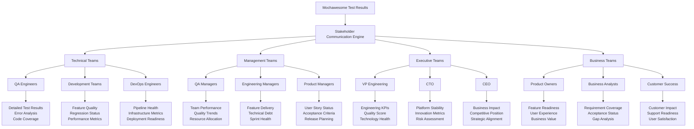

# 👥 **Punto 14: Reportes para Stakeholders**

## 📋 **Objetivos de Aprendizaje**

Al completar este punto, serás capaz de:
- ✅ Crear reportes específicos para diferentes audiencias (QA, Dev, Management, Executives)
- ✅ Adaptar métricas y visualizaciones según el nivel organizacional
- ✅ Implementar comunicación automática de resultados por canales apropiados
- ✅ Diseñar dashboards personalizados para cada stakeholder type
- ✅ Generar insights accionables específicos por rol y responsabilidad
- ✅ Automatizar la distribución de reportes según escalas de urgencia

---

## 🎯 **1. Panorama de Stakeholder Communications**

### **¿Por qué necesitamos reportes diferenciados?**



### **Arquitectura de Comunicación Multi-Stakeholder**

```typescript
// Arquitectura para Pokémon TCG Platform Stakeholder Reporting
interface StakeholderReportingSystem {
  audiences: {
    technical: TechnicalStakeholderManager;
    management: ManagementStakeholderManager;
    executive: ExecutiveStakeholderManager;
    business: BusinessStakeholderManager;
  };
  
  generators: {
    qaEngineers: QAEngineerReportGenerator;
    developers: DeveloperReportGenerator;
    managers: ManagerReportGenerator;
    executives: ExecutiveReportGenerator;
    productOwners: ProductOwnerReportGenerator;
  };
  
  distributors: {
    email: EmailDistributor;
    slack: SlackDistributor;
    dashboard: DashboardUpdater;
    confluence: ConfluencePublisher;
    jira: JiraUpdater;
  };
  
  formatters: {
    detailed: DetailedTechnicalFormatter;
    summary: SummaryFormatter;
    executive: ExecutiveSummaryFormatter;
    visual: VisualDashboardFormatter;
    narrative: BusinessNarrativeFormatter;
  };
  
  prioritization: {
    urgencyClassifier: UrgencyClassifier;
    escalationEngine: EscalationEngine;
    attentionRouter: AttentionRouter;
  };
}
```

---

## 👨‍💻 **2. Reportes para Equipos Técnicos**

### **QA Engineers - Reportes Detallados**

```javascript
// scripts/stakeholder-reports/qa-engineer-reports.js
class QAEngineerReportGenerator {
  constructor(config) {
    this.config = config;
    this.pokemonTCGContext = {
      criticalFeatures: ['Card Management', 'User Authentication', 'Payment Processing'],
      testCategories: ['Unit', 'Integration', 'E2E', 'Performance', 'Security'],
      environments: ['Development', 'Staging', 'Production'],
      platforms: ['Web', 'Mobile', 'API']
    };
  }

  async generateDetailedQAReport(testResults, reportMetadata) {
    console.log('🔬 Generating detailed QA report...');
    
    const qaReport = {
      executiveSummary: this.generateQAExecutiveSummary(testResults),
      detailedAnalysis: await this.generateDetailedAnalysis(testResults),
      testSuiteBreakdown: this.generateTestSuiteBreakdown(testResults),
      failureAnalysis: this.generateFailureAnalysis(testResults),
      performanceMetrics: this.generatePerformanceMetrics(testResults),
      coverageAnalysis: this.generateCoverageAnalysis(testResults),
      regressionAnalysis: this.generateRegressionAnalysis(testResults),
      actionItems: this.generateQAActionItems(testResults),
      recommendations: this.generateQARecommendations(testResults),
      nextSteps: this.generateQANextSteps(testResults)
    };

    // Formato para QA Engineers - muy detallado
    const formattedReport = await this.formatForQAEngineers(qaReport, reportMetadata);
    
    // Distribución automática
    await this.distributeQAReport(formattedReport, reportMetadata);
    
    return formattedReport;
  }

  generateQAExecutiveSummary(testResults) {
    const stats = testResults.stats;
    const successRate = ((stats.passes / stats.tests) * 100).toFixed(1);
    
    return {
      overallHealth: {
        successRate: `${successRate}%`,
        status: this.getQualityStatus(successRate),
        trend: this.calculateQualityTrend(testResults),
        confidence: this.calculateConfidenceLevel(testResults)
      },
      
      execution: {
        totalTests: stats.tests,
        passed: stats.passes,
        failed: stats.failures,
        skipped: stats.pending,
        duration: `${(stats.duration / 1000 / 60).toFixed(1)} minutes`,
        environment: testResults.environment || 'Unknown'
      },
      
      pokemonTCGSpecific: {
        cardManagementHealth: this.calculateFeatureHealth(testResults, 'Card Management'),
        authenticationHealth: this.calculateFeatureHealth(testResults, 'User Authentication'),
        searchFunctionalityHealth: this.calculateFeatureHealth(testResults, 'Search & Filter'),
        collectionSystemHealth: this.calculateFeatureHealth(testResults, 'Collection System'),
        tournamentSystemHealth: this.calculateFeatureHealth(testResults, 'Tournament System')
      },
      
      criticalAlerts: this.identifyCriticalAlerts(testResults),
      blockers: this.identifyQABlockers(testResults)
    };
  }

  generateDetailedAnalysis(testResults) {
    const failedTests = testResults.tests?.filter(test => test.state === 'failed') || [];
    const slowTests = testResults.tests?.filter(test => test.duration > 5000) || [];
    const flakyTests = this.identifyFlakyTests(testResults);
    
    return {
      failureBreakdown: {
        total: failedTests.length,
        byFeature: this.groupFailuresByFeature(failedTests),
        byErrorType: this.groupFailuresByErrorType(failedTests),
        bySeverity: this.groupFailuresBySeverity(failedTests),
        byEnvironment: this.groupFailuresByEnvironment(failedTests)
      },
      
      performanceIssues: {
        slowTests: slowTests.map(test => ({
          name: test.title,
          duration: test.duration,
          feature: this.extractGameFeature(test),
          impact: this.assessPerformanceImpact(test)
        })),
        averageDuration: this.calculateAverageDuration(testResults.tests),
        performanceTrend: this.calculatePerformanceTrend(testResults)
      },
      
      stabilityAnalysis: {
        flakyTests: flakyTests.map(test => ({
          name: test.title,
          failureRate: test.failureRate,
          lastFailures: test.recentFailures,
          pattern: test.failurePattern
        })),
        stabilityScore: this.calculateStabilityScore(testResults),
        reliabilityTrend: this.calculateReliabilityTrend(testResults)
      },
      
      pokemonTCGInsights: {
        cardLoadingPerformance: this.analyzeCardLoadingPerformance(testResults),
        searchPerformance: this.analyzeSearchPerformance(testResults),
        userFlowCompletion: this.analyzeUserFlowCompletion(testResults),
        dataIntegrityChecks: this.analyzeDataIntegrity(testResults)
      }
    };
  }

  generateFailureAnalysis(testResults) {
    const failedTests = testResults.tests?.filter(test => test.state === 'failed') || [];
    
    return failedTests.map(test => ({
      testInfo: {
        name: test.title,
        suite: test.parent,
        fullTitle: test.fullTitle,
        duration: test.duration
      },
      
      failureDetails: {
        errorMessage: test.err?.message || 'No error message',
        stackTrace: test.err?.stack || 'No stack trace',
        errorType: this.categorizeError(test.err),
        severity: this.assessErrorSeverity(test)
      },
      
      gameContext: {
        feature: this.extractGameFeature(test),
        userJourney: this.extractUserJourney(test),
        businessImpact: this.assessBusinessImpact(test),
        userExperienceImpact: this.assessUXImpact(test)
      },
      
      technicalContext: {
        environment: test.environment || 'Unknown',
        browser: test.browser || 'Unknown',
        platform: test.platform || 'Unknown',
        buildNumber: test.buildNumber || 'Unknown'
      },
      
      debuggingInfo: {
        screenshots: test.screenshots || [],
        logs: test.logs || [],
        networkRequests: test.networkRequests || [],
        consoleErrors: test.consoleErrors || []
      },
      
      actionItems: this.generateTestSpecificActionItems(test),
      priority: this.calculateFixPriority(test),
      estimatedEffort: this.estimateFixEffort(test)
    }));
  }

  async formatForQAEngineers(qaReport, reportMetadata) {
    const timestamp = new Date().toLocaleString();
    
    return `
# 🔬 **Pokémon TCG Platform - Detailed QA Report**

**Generated:** ${timestamp}  
**Build:** ${reportMetadata.buildNumber || 'Unknown'}  
**Environment:** ${reportMetadata.environment || 'Unknown'}  
**Commit:** ${reportMetadata.commitSha || 'Unknown'}  

---

## 📊 **Executive Summary**

### **Overall Health Status**
- **Success Rate:** ${qaReport.executiveSummary.overallHealth.successRate} (${qaReport.executiveSummary.overallHealth.status})
- **Quality Trend:** ${qaReport.executiveSummary.overallHealth.trend}
- **Confidence Level:** ${qaReport.executiveSummary.overallHealth.confidence}

### **Execution Metrics**
- **Total Tests:** ${qaReport.executiveSummary.execution.totalTests}
- **Passed:** ${qaReport.executiveSummary.execution.passed} ✅
- **Failed:** ${qaReport.executiveSummary.execution.failed} ❌
- **Skipped:** ${qaReport.executiveSummary.execution.skipped} ⏭️
- **Duration:** ${qaReport.executiveSummary.execution.duration}

### **🎮 Pokémon TCG Feature Health**
| Feature | Health Score | Status |
|---------|-------------|--------|
| Card Management | ${qaReport.executiveSummary.pokemonTCGSpecific.cardManagementHealth}% | ${this.getHealthStatusEmoji(qaReport.executiveSummary.pokemonTCGSpecific.cardManagementHealth)} |
| User Authentication | ${qaReport.executiveSummary.pokemonTCGSpecific.authenticationHealth}% | ${this.getHealthStatusEmoji(qaReport.executiveSummary.pokemonTCGSpecific.authenticationHealth)} |
| Search & Filter | ${qaReport.executiveSummary.pokemonTCGSpecific.searchFunctionalityHealth}% | ${this.getHealthStatusEmoji(qaReport.executiveSummary.pokemonTCGSpecific.searchFunctionalityHealth)} |
| Collection System | ${qaReport.executiveSummary.pokemonTCGSpecific.collectionSystemHealth}% | ${this.getHealthStatusEmoji(qaReport.executiveSummary.pokemonTCGSpecific.collectionSystemHealth)} |

---

## 🚨 **Critical Alerts & Blockers**

${this.formatCriticalAlerts(qaReport.executiveSummary.criticalAlerts)}

${this.formatBlockers(qaReport.executiveSummary.blockers)}

---

## 🔍 **Detailed Failure Analysis**

### **Failure Distribution**
- **Total Failures:** ${qaReport.detailedAnalysis.failureBreakdown.total}
- **By Feature:** ${this.formatFailuresByFeature(qaReport.detailedAnalysis.failureBreakdown.byFeature)}
- **By Error Type:** ${this.formatFailuresByErrorType(qaReport.detailedAnalysis.failureBreakdown.byErrorType)}
- **By Severity:** ${this.formatFailuresBySeverity(qaReport.detailedAnalysis.failureBreakdown.bySeverity)}

### **Individual Test Failures**

${this.formatIndividualFailures(qaReport.failureAnalysis)}

---

## ⚡ **Performance Analysis**

### **Performance Issues Detected**
${this.formatPerformanceIssues(qaReport.detailedAnalysis.performanceIssues)}

### **🎮 Game-Specific Performance Insights**
${this.formatGamePerformanceInsights(qaReport.detailedAnalysis.pokemonTCGInsights)}

---

## 🎯 **Stability & Reliability**

### **Flaky Tests Identified**
${this.formatFlakyTests(qaReport.detailedAnalysis.stabilityAnalysis.flakyTests)}

### **Stability Metrics**
- **Stability Score:** ${qaReport.detailedAnalysis.stabilityAnalysis.stabilityScore}%
- **Reliability Trend:** ${qaReport.detailedAnalysis.stabilityAnalysis.reliabilityTrend}

---

## 📋 **Action Items for QA Team**

### **High Priority Actions**
${this.formatActionItems(qaReport.actionItems.high)}

### **Medium Priority Actions**
${this.formatActionItems(qaReport.actionItems.medium)}

### **Low Priority Actions**
${this.formatActionItems(qaReport.actionItems.low)}

---

## 💡 **QA Recommendations**

${this.formatQARecommendations(qaReport.recommendations)}

---

## 🔄 **Next Steps**

${this.formatNextSteps(qaReport.nextSteps)}

---

## 📞 **Support & Resources**

- **QA Team Lead:** qa-lead@pokemontcg.com
- **Test Automation:** automation@pokemontcg.com
- **DevOps Support:** devops@pokemontcg.com
- **JIRA Project:** [Pokemon TCG Quality](https://company.atlassian.net/projects/PTCGQ)
- **Confluence:** [QA Documentation](https://company.atlassian.net/wiki/spaces/QA)

---
*This report was automatically generated by the Pokémon TCG QA Automation System*
*For questions or issues, contact the QA Engineering Team*
`;
  }

  async distributeQAReport(report, metadata) {
    console.log('📧 Distributing QA report to technical stakeholders...');
    
    const distribution = {
      email: {
        to: ['qa-team@pokemontcg.com', 'automation-engineers@pokemontcg.com'],
        subject: `🔬 Detailed QA Report - Build ${metadata.buildNumber}`,
        priority: this.calculateEmailPriority(report),
        attachments: [
          { name: 'detailed-qa-report.html', content: report },
          { name: 'test-results.json', content: JSON.stringify(metadata.rawResults) }
        ]
      },
      
      slack: {
        channel: '#qa-engineering',
        message: this.generateSlackQAMessage(report, metadata),
        thread: metadata.buildNumber // Group by build
      },
      
      jira: {
        createIssues: report.criticalAlerts.length > 0,
        updateDashboard: true,
        projectKey: 'PTCGQ'
      }
    };

    return await this.executeDistribution(distribution);
  }
}
```

---

## 👨‍💼 **3. Reportes para Management**

### **Engineering Managers - KPIs y Tendencias**

```javascript
// scripts/stakeholder-reports/management-reports.js
class ManagementReportGenerator {
  constructor(config) {
    this.config = config;
    this.pokemonTCGKPIs = {
      businessMetrics: ['User Experience Score', 'Platform Stability', 'Feature Delivery Rate'],
      technicalMetrics: ['Code Quality', 'Test Coverage', 'Performance Score'],
      operationalMetrics: ['Release Frequency', 'Bug Escape Rate', 'Time to Fix']
    };
  }

  async generateManagementReport(testResults, reportMetadata, historicalData) {
    console.log('📊 Generating management report...');
    
    const managementReport = {
      executiveSummary: this.generateMgmtExecutiveSummary(testResults, historicalData),
      kpiDashboard: this.generateKPIDashboard(testResults, historicalData),
      teamPerformance: this.generateTeamPerformance(testResults, historicalData),
      businessImpact: this.generateBusinessImpact(testResults),
      riskAssessment: this.generateRiskAssessment(testResults),
      resourceAllocation: this.generateResourceAllocation(testResults),
      strategicInsights: this.generateStrategicInsights(testResults, historicalData),
      actionItems: this.generateMgmtActionItems(testResults),
      recommendations: this.generateMgmtRecommendations(testResults)
    };

    const formattedReport = await this.formatForManagement(managementReport, reportMetadata);
    await this.distributeManagementReport(formattedReport, reportMetadata);
    
    return formattedReport;
  }

  generateKPIDashboard(testResults, historicalData) {
    return {
      qualityKPIs: {
        overallQualityScore: this.calculateOverallQualityScore(testResults),
        qualityTrend: this.calculateQualityTrend(testResults, historicalData),
        defectDensity: this.calculateDefectDensity(testResults),
        testEffectiveness: this.calculateTestEffectiveness(testResults)
      },
      
      performanceKPIs: {
        averageExecutionTime: this.calculateAvgExecutionTime(testResults),
        performanceTrend: this.calculatePerformanceTrend(testResults, historicalData),
        resourceUtilization: this.calculateResourceUtilization(testResults),
        efficiencyScore: this.calculateEfficiencyScore(testResults)
      },
      
      businessKPIs: {
        featureReadiness: this.calculateFeatureReadiness(testResults),
        userExperienceScore: this.calculateUXScore(testResults),
        platformStability: this.calculatePlatformStability(testResults),
        competitivePosition: this.calculateCompetitivePosition(testResults)
      },
      
      pokemonTCGKPIs: {
        cardManagementScore: this.calculateFeatureKPI(testResults, 'Card Management'),
        userEngagementReadiness: this.calculateEngagementReadiness(testResults),
        tournamentReadiness: this.calculateTournamentReadiness(testResults),
        monetizationReadiness: this.calculateMonetizationReadiness(testResults)
      }
    };
  }

  generateTeamPerformance(testResults, historicalData) {
    return {
      productivity: {
        testsCreated: this.calculateTestsCreated(historicalData),
        testsMaintained: this.calculateTestsMaintained(historicalData),
        automationRate: this.calculateAutomationRate(testResults),
        velocityTrend: this.calculateVelocityTrend(historicalData)
      },
      
      quality: {
        codeQualityScore: this.calculateCodeQualityScore(testResults),
        bugDiscoveryRate: this.calculateBugDiscoveryRate(testResults),
        escapeRate: this.calculateEscapeRate(testResults),
        qualityImprovementRate: this.calculateQualityImprovement(historicalData)
      },
      
      efficiency: {
        testExecutionEfficiency: this.calculateExecutionEfficiency(testResults),
        maintenanceEffort: this.calculateMaintenanceEffort(testResults),
        costPerTest: this.calculateCostPerTest(testResults),
        roiScore: this.calculateROIScore(testResults)
      },
      
      collaboration: {
        crossTeamAlignment: this.calculateCrossTeamAlignment(testResults),
        communicationEffectiveness: this.calculateCommunicationEffectiveness(testResults),
        knowledgeSharing: this.calculateKnowledgeSharing(testResults)
      }
    };
  }

  generateBusinessImpact(testResults) {
    return {
      userExperience: {
        impactScore: this.calculateUXImpactScore(testResults),
        userJourneyHealth: this.calculateUserJourneyHealth(testResults),
        featureUsabilityScore: this.calculateUsabilityScore(testResults),
        customerSatisfactionPrediction: this.predictCustomerSatisfaction(testResults)
      },
      
      revenue: {
        revenueImpactScore: this.calculateRevenueImpact(testResults),
        monetizationReadiness: this.calculateMonetizationReadiness(testResults),
        paymentSystemHealth: this.calculatePaymentSystemHealth(testResults),
        conversionOptimization: this.calculateConversionOptimization(testResults)
      },
      
      growth: {
        scalabilityScore: this.calculateScalabilityScore(testResults),
        performanceReadiness: this.calculatePerformanceReadiness(testResults),
        marketExpansionReadiness: this.calculateMarketExpansionReadiness(testResults),
        innovationCapacity: this.calculateInnovationCapacity(testResults)
      },
      
      pokemonTCGSpecific: {
        gamingExperienceScore: this.calculateGamingExperienceScore(testResults),
        cardCollectionHealth: this.calculateCardCollectionHealth(testResults),
        socialFeaturesReadiness: this.calculateSocialFeaturesReadiness(testResults),
        competitiveModeReadiness: this.calculateCompetitiveModeReadiness(testResults)
      }
    };
  }

  async formatForManagement(mgmtReport, reportMetadata) {
    const timestamp = new Date().toLocaleString();
    
    return `
# 📊 **Pokémon TCG Platform - Management Report**

**Report Period:** ${timestamp}  
**Build:** ${reportMetadata.buildNumber || 'Unknown'}  
**Environment:** ${reportMetadata.environment || 'Unknown'}  

---

## 🎯 **Executive Summary**

### **Quality Status**
- **Overall Score:** ${mgmtReport.kpiDashboard.qualityKPIs.overallQualityScore}% ${this.getTrendArrow(mgmtReport.kpiDashboard.qualityKPIs.qualityTrend)}
- **Platform Stability:** ${mgmtReport.kpiDashboard.businessKPIs.platformStability}%
- **User Experience Score:** ${mgmtReport.kpiDashboard.businessKPIs.userExperienceScore}%

### **🎮 Business Readiness**
| Metric | Score | Trend | Business Impact |
|--------|-------|-------|-----------------|
| Feature Readiness | ${mgmtReport.kpiDashboard.businessKPIs.featureReadiness}% | ${this.getTrendArrow(mgmtReport.kpiDashboard.qualityKPIs.qualityTrend)} | ${this.getBusinessImpactLevel(mgmtReport.kpiDashboard.businessKPIs.featureReadiness)} |
| Card Management | ${mgmtReport.kpiDashboard.pokemonTCGKPIs.cardManagementScore}% | ${this.getTrendArrow(mgmtReport.kpiDashboard.qualityKPIs.qualityTrend)} | High - Core Revenue Driver |
| User Engagement | ${mgmtReport.kpiDashboard.pokemonTCGKPIs.userEngagementReadiness}% | ${this.getTrendArrow(mgmtReport.kpiDashboard.qualityKPIs.qualityTrend)} | Medium - Retention Impact |
| Tournament System | ${mgmtReport.kpiDashboard.pokemonTCGKPIs.tournamentReadiness}% | ${this.getTrendArrow(mgmtReport.kpiDashboard.qualityKPIs.qualityTrend)} | High - Competitive Advantage |

---

## 📈 **Key Performance Indicators**

### **Quality & Performance**
- **Defect Density:** ${mgmtReport.kpiDashboard.qualityKPIs.defectDensity} bugs/KLOC
- **Test Effectiveness:** ${mgmtReport.kpiDashboard.qualityKPIs.testEffectiveness}%
- **Performance Trend:** ${mgmtReport.kpiDashboard.performanceKPIs.performanceTrend}
- **Resource Utilization:** ${mgmtReport.kpiDashboard.performanceKPIs.resourceUtilization}%

### **Team Productivity**
- **Automation Rate:** ${mgmtReport.teamPerformance.productivity.automationRate}%
- **Code Quality Score:** ${mgmtReport.teamPerformance.quality.codeQualityScore}%
- **Bug Discovery Rate:** ${mgmtReport.teamPerformance.quality.bugDiscoveryRate}%
- **ROI Score:** ${mgmtReport.teamPerformance.efficiency.roiScore}%

---

## 💼 **Business Impact Analysis**

### **Revenue & Growth Impact**
- **Revenue Impact Score:** ${mgmtReport.businessImpact.revenue.revenueImpactScore}%
- **Monetization Readiness:** ${mgmtReport.businessImpact.revenue.monetizationReadiness}%
- **Scalability Score:** ${mgmtReport.businessImpact.growth.scalabilityScore}%
- **Innovation Capacity:** ${mgmtReport.businessImpact.growth.innovationCapacity}%

### **🎮 Gaming Experience Metrics**
- **Gaming Experience Score:** ${mgmtReport.businessImpact.pokemonTCGSpecific.gamingExperienceScore}%
- **Card Collection Health:** ${mgmtReport.businessImpact.pokemonTCGSpecific.cardCollectionHealth}%
- **Competitive Mode Readiness:** ${mgmtReport.businessImpact.pokemonTCGSpecific.competitiveModeReadiness}%

---

## ⚠️ **Risk Assessment**

${this.formatRiskAssessment(mgmtReport.riskAssessment)}

---

## 📋 **Strategic Action Items**

### **Immediate Actions (This Sprint)**
${this.formatActionItems(mgmtReport.actionItems.immediate)}

### **Short-term Actions (Next 2-4 Weeks)**
${this.formatActionItems(mgmtReport.actionItems.shortTerm)}

### **Long-term Strategic Actions (Next Quarter)**
${this.formatActionItems(mgmtReport.actionItems.longTerm)}

---

## 💡 **Management Recommendations**

${this.formatMgmtRecommendations(mgmtReport.recommendations)}

---

## 📊 **Resource Allocation Insights**

${this.formatResourceAllocation(mgmtReport.resourceAllocation)}

---

## 🔮 **Strategic Insights & Forecasting**

${this.formatStrategicInsights(mgmtReport.strategicInsights)}

---

## 📞 **Escalation & Contacts**

- **Engineering Manager:** engineering-manager@pokemontcg.com
- **QA Manager:** qa-manager@pokemontcg.com
- **Product Manager:** product-manager@pokemontcg.com
- **DevOps Lead:** devops-lead@pokemontcg.com

---
*This management report is automatically generated and updated every build*
*For detailed technical information, refer to the QA Engineering Report*
`;
  }
}
```

---

## 👔 **4. Reportes Ejecutivos**

### **C-Level - Strategic Overview**

```javascript
// scripts/stakeholder-reports/executive-reports.js
class ExecutiveReportGenerator {
  constructor(config) {
    this.config = config;
    this.pokemonTCGStrategic = {
      businessObjectives: ['Market Leadership', 'User Growth', 'Revenue Growth', 'Innovation'],
      competitiveDifferentiators: ['Card Database', 'User Experience', 'Tournament System', 'Social Features'],
      riskFactors: ['Platform Stability', 'Security', 'Performance', 'User Retention']
    };
  }

  async generateExecutiveReport(testResults, reportMetadata, businessMetrics) {
    console.log('👔 Generating executive report...');
    
    const executiveReport = {
      businessOverview: this.generateBusinessOverview(testResults, businessMetrics),
      strategicHealth: this.generateStrategicHealth(testResults, businessMetrics),
      competitivePosition: this.generateCompetitivePosition(testResults, businessMetrics),
      riskAndOpportunity: this.generateRiskAndOpportunity(testResults, businessMetrics),
      investmentROI: this.generateInvestmentROI(testResults, businessMetrics),
      strategicRecommendations: this.generateStrategicRecommendations(testResults, businessMetrics),
      nextQuarterFocus: this.generateNextQuarterFocus(testResults, businessMetrics)
    };

    const formattedReport = await this.formatForExecutives(executiveReport, reportMetadata);
    await this.distributeExecutiveReport(formattedReport, reportMetadata);
    
    return formattedReport;
  }

  generateBusinessOverview(testResults, businessMetrics) {
    return {
      platformHealth: {
        overallScore: this.calculateOverallBusinessScore(testResults, businessMetrics),
        trend: this.calculateBusinessTrend(testResults, businessMetrics),
        businessReadiness: this.calculateBusinessReadiness(testResults, businessMetrics),
        competitiveAdvantage: this.calculateCompetitiveAdvantage(testResults, businessMetrics)
      },
      
      userExperience: {
        satisfactionScore: this.calculateUserSatisfactionScore(testResults, businessMetrics),
        engagementLevel: this.calculateEngagementLevel(testResults, businessMetrics),
        retentionPrediction: this.predictUserRetention(testResults, businessMetrics),
        npsImpact: this.calculateNPSImpact(testResults, businessMetrics)
      },
      
      businessMetrics: {
        revenueImpact: this.calculateRevenueImpact(testResults, businessMetrics),
        marketPosition: this.assessMarketPosition(testResults, businessMetrics),
        growthPotential: this.assessGrowthPotential(testResults, businessMetrics),
        valueProportion: this.assessValueProposition(testResults, businessMetrics)
      },
      
      pokemonTCGBusiness: {
        tradingCardMarketPosition: this.assessTCGMarketPosition(testResults, businessMetrics),
        userBaseGrowth: this.calculateUserBaseGrowth(testResults, businessMetrics),
        monetizationEfficiency: this.calculateMonetizationEfficiency(testResults, businessMetrics),
        brandStrength: this.assessBrandStrength(testResults, businessMetrics)
      }
    };
  }

  generateStrategicHealth(testResults, businessMetrics) {
    return {
      innovation: {
        innovationScore: this.calculateInnovationScore(testResults, businessMetrics),
        technologyAdvancement: this.assessTechnologyAdvancement(testResults, businessMetrics),
        futureReadiness: this.assessFutureReadiness(testResults, businessMetrics),
        disruptionResilience: this.assessDisruptionResilience(testResults, businessMetrics)
      },
      
      operations: {
        operationalExcellence: this.calculateOperationalExcellence(testResults, businessMetrics),
        scalabilityReadiness: this.assessScalabilityReadiness(testResults, businessMetrics),
        costEfficiency: this.calculateCostEfficiency(testResults, businessMetrics),
        deliverySpeed: this.assessDeliverySpeed(testResults, businessMetrics)
      },
      
      quality: {
        qualityLeadership: this.assessQualityLeadership(testResults, businessMetrics),
        customerTrust: this.calculateCustomerTrust(testResults, businessMetrics),
        brandReliability: this.assessBrandReliability(testResults, businessMetrics),
        serviceExcellence: this.calculateServiceExcellence(testResults, businessMetrics)
      },
      
      governance: {
        complianceScore: this.calculateComplianceScore(testResults, businessMetrics),
        riskManagement: this.assessRiskManagement(testResults, businessMetrics),
        dataGovernance: this.assessDataGovernance(testResults, businessMetrics),
        securityPosture: this.assessSecurityPosture(testResults, businessMetrics)
      }
    };
  }

  async formatForExecutives(execReport, reportMetadata) {
    const timestamp = new Date().toLocaleString();
    const quarter = `Q${Math.ceil((new Date().getMonth() + 1) / 3)} ${new Date().getFullYear()}`;
    
    return `
# 🏆 **Pokémon TCG Platform - Executive Summary**

**Reporting Period:** ${quarter}  
**Last Updated:** ${timestamp}  
**Build Version:** ${reportMetadata.buildNumber || 'Current'}  

---

## 🎯 **Business Overview**

### **Platform Health Score: ${execReport.businessOverview.platformHealth.overallScore}%** ${this.getExecutiveTrendIndicator(execReport.businessOverview.platformHealth.trend)}

| Key Metric | Score | Business Impact |
|------------|-------|-----------------|
| **User Experience** | ${execReport.businessOverview.userExperience.satisfactionScore}% | ${this.getBusinessImpactNarrative(execReport.businessOverview.userExperience.satisfactionScore, 'satisfaction')} |
| **Revenue Impact** | ${execReport.businessOverview.businessMetrics.revenueImpact}% | ${this.getBusinessImpactNarrative(execReport.businessOverview.businessMetrics.revenueImpact, 'revenue')} |
| **Market Position** | ${execReport.businessOverview.businessMetrics.marketPosition}% | ${this.getBusinessImpactNarrative(execReport.businessOverview.businessMetrics.marketPosition, 'market')} |
| **Growth Potential** | ${execReport.businessOverview.businessMetrics.growthPotential}% | ${this.getBusinessImpactNarrative(execReport.businessOverview.businessMetrics.growthPotential, 'growth')} |

### **🎮 Pokémon TCG Business Performance**
- **Market Leadership:** ${execReport.businessOverview.pokemonTCGBusiness.tradingCardMarketPosition}% - ${this.getMarketPositionNarrative(execReport.businessOverview.pokemonTCGBusiness.tradingCardMarketPosition)}
- **User Base Growth:** ${execReport.businessOverview.pokemonTCGBusiness.userBaseGrowth}% - ${this.getGrowthNarrative(execReport.businessOverview.pokemonTCGBusiness.userBaseGrowth)}
- **Monetization Efficiency:** ${execReport.businessOverview.pokemonTCGBusiness.monetizationEfficiency}% - ${this.getMonetizationNarrative(execReport.businessOverview.pokemonTCGBusiness.monetizationEfficiency)}
- **Brand Strength:** ${execReport.businessOverview.pokemonTCGBusiness.brandStrength}% - ${this.getBrandNarrative(execReport.businessOverview.pokemonTCGBusiness.brandStrength)}

---

## 📊 **Strategic Health Dashboard**

### **Innovation & Technology**
- **Innovation Score:** ${execReport.strategicHealth.innovation.innovationScore}%
- **Future Readiness:** ${execReport.strategicHealth.innovation.futureReadiness}%
- **Disruption Resilience:** ${execReport.strategicHealth.innovation.disruptionResilience}%

### **Operational Excellence** 
- **Operational Score:** ${execReport.strategicHealth.operations.operationalExcellence}%
- **Scalability Readiness:** ${execReport.strategicHealth.operations.scalabilityReadiness}%
- **Cost Efficiency:** ${execReport.strategicHealth.operations.costEfficiency}%

### **Quality Leadership**
- **Quality Score:** ${execReport.strategicHealth.quality.qualityLeadership}%
- **Customer Trust:** ${execReport.strategicHealth.quality.customerTrust}%
- **Brand Reliability:** ${execReport.strategicHealth.quality.brandReliability}%

---

## 🏁 **Competitive Position**

${this.formatCompetitivePosition(execReport.competitivePosition)}

---

## ⚡ **Risk & Opportunity Analysis**

### **🚨 Strategic Risks**
${this.formatStrategicRisks(execReport.riskAndOpportunity.risks)}

### **🚀 Growth Opportunities**
${this.formatGrowthOpportunities(execReport.riskAndOpportunity.opportunities)}

---

## 💰 **Investment ROI Analysis**

### **Technology Investment Returns**
- **Quality Investment ROI:** ${execReport.investmentROI.qualityROI}%
- **Automation Investment ROI:** ${execReport.investmentROI.automationROI}%
- **Platform Investment ROI:** ${execReport.investmentROI.platformROI}%

### **Business Value Generated**
- **Cost Savings:** $${this.formatCurrency(execReport.investmentROI.costSavings)}
- **Revenue Protection:** $${this.formatCurrency(execReport.investmentROI.revenueProtection)}
- **Market Opportunity:** $${this.formatCurrency(execReport.investmentROI.marketOpportunity)}

---

## 🎯 **Strategic Recommendations**

### **Immediate Actions (This Quarter)**
${this.formatExecutiveRecommendations(execReport.strategicRecommendations.immediate)}

### **Strategic Initiatives (Next 6 Months)**
${this.formatExecutiveRecommendations(execReport.strategicRecommendations.strategic)}

### **Long-term Vision (Next 12 Months)**
${this.formatExecutiveRecommendations(execReport.strategicRecommendations.longTerm)}

---

## 🔮 **Next Quarter Focus Areas**

${this.formatNextQuarterFocus(execReport.nextQuarterFocus)}

---

## 📈 **Key Success Metrics to Track**

| Metric | Current | Target | Timeline |
|--------|---------|--------|----------|
| User Satisfaction | ${execReport.businessOverview.userExperience.satisfactionScore}% | 95% | Q${Math.ceil((new Date().getMonth() + 1) / 3) + 1} |
| Platform Stability | ${execReport.strategicHealth.quality.brandReliability}% | 99.9% | Q${Math.ceil((new Date().getMonth() + 1) / 3) + 1} |
| Market Share | ${execReport.businessOverview.businessMetrics.marketPosition}% | 35% | End of Year |
| Revenue Growth | ${execReport.businessOverview.businessMetrics.revenueImpact}% | 40% | Annual |

---

## 📞 **Executive Escalation**

**For Strategic Issues:**
- **CTO:** cto@pokemontcg.com
- **VP Engineering:** vp-engineering@pokemontcg.com  
- **Chief Product Officer:** cpo@pokemontcg.com

**For Business Issues:**
- **CEO:** ceo@pokemontcg.com
- **CFO:** cfo@pokemontcg.com
- **Chief Revenue Officer:** cro@pokemontcg.com

---

*This executive summary provides strategic oversight of technology quality and business impact*  
*For operational details, refer to Management and Technical reports*
`;
  }
}
```

---

## 📝 **5. Ejercicios Prácticos**

### **Ejercicio 1: Reporte QA Personalizado**
```javascript
// 🎯 Objetivo: Crear reporte específico para QA Engineers

class CustomQAReporter {
  generateTestFailureReport(testResults) {
    // Extraer solo fallos con detalles técnicos
    // Agrupar por feature y severidad
    // Incluir información de debugging
  }
  
  generatePerformanceReport(testResults) {
    // Analizar tests lentos
    // Identificar patrones de performance
    // Sugerir optimizaciones
  }
}
```

### **Ejercicio 2: Dashboard de Management**
```javascript
// 🎯 Objetivo: KPIs para Engineering Managers

class ManagementDashboard {
  generateKPIReport(testResults, historicalData) {
    // Calcular métricas de team performance
    // Análisis de tendencias
    // Resource allocation insights
  }
  
  generateBusinessImpactReport(testResults) {
    // Mapear quality metrics a business impact
    // ROI calculations
    // Risk assessments
  }
}
```

### **Ejercicio 3: Executive Summary**
```javascript
// 🎯 Objetivo: Resumen estratégico para C-Level

class ExecutiveSummary {
  generateStrategicOverview(testResults, businessData) {
    // High-level business metrics
    // Competitive position
    // Strategic recommendations
  }
  
  generateROIAnalysis(testResults, investmentData) {
    // Technology investment returns
    // Business value calculations
    // Future investment recommendations
  }
}
```

---

## 🧪 **6. Validación y Testing**

### **Checklist de Reportes para Stakeholders**

```markdown
## ✅ Checklist de Stakeholder Reporting

### Contenido y Relevancia
- [ ] Métricas apropiadas para cada audiencia
- [ ] Nivel de detalle adecuado por stakeholder type
- [ ] Business context incluido donde relevante
- [ ] Technical details limitados a audiencias técnicas
- [ ] Actionable insights proporcionados

### Formatos y Presentación
- [ ] Visual design apropiado para cada audiencia
- [ ] Formato de distribución optimizado
- [ ] Responsive design para mobile viewing
- [ ] Accessibility standards cumplidos
- [ ] Brand guidelines seguidas

### Distribución y Timing
- [ ] Canales de distribución configurados
- [ ] Timing apropiado para cada stakeholder
- [ ] Escalation paths definidos
- [ ] Emergency communication protocols
- [ ] Feedback loops establecidos

### Automatización y Mantenimiento
- [ ] Generación automática funcionando
- [ ] Template maintenance procedures
- [ ] Data source validation
- [ ] Performance monitoring de reports
- [ ] User feedback incorporation process
```

---

## 📚 **7. Preguntas de Entrevista**

### **Nivel Básico**
1. **¿Qué diferencias hay entre reportes para QA Engineers vs Management?**
2. **¿Cómo adaptas métricas técnicas para audiencias de negocio?**
3. **¿Qué canales de distribución usarías para diferentes stakeholders?**

### **Nivel Intermedio**
4. **¿Cómo diseñarías un sistema de reportes escalable para múltiples audiencias?**
5. **¿Qué estrategias usarías para mantener engagement de stakeholders?**
6. **¿Cómo manejarías conflicting priorities entre different stakeholder groups?**

### **Nivel Avanzado**
7. **¿Cómo implementarías adaptive reporting basado en stakeholder behavior?**
8. **¿Qué approach usarías para predictive insights en executive reports?**
9. **¿Cómo diseñarías governance para stakeholder communication at scale?**

### **Respuestas Clave**

**Pregunta 1:** QA Engineers necesitan detalles técnicos completos, error analysis, debugging info y action items específicos. Management necesita KPIs, trends, business impact y resource allocation insights. La profundidad técnica varía inversamente con el nivel organizacional.

**Pregunta 4:** Implementaría:
- Template engine con audience-specific formatters
- Content adaptation layer basado en stakeholder profiles
- Multi-channel distribution con preferencias personalizadas
- Feedback loops para continuous improvement
- Analytics sobre report engagement y effectiveness

**Pregunta 7:** Desarrollaría:
- ML models para predecir stakeholder preferences
- Dynamic content generation basado en historical engagement
- A/B testing para report formats y timing
- Behavioral analytics para optimizar delivery
- Personalization engine con learning capabilities

---

## 🎯 **Resumen del Punto 14**

### **Conceptos Clave Dominados:**
✅ **Multi-audience reporting** con content adaptation por stakeholder type  
✅ **Technical vs Business metrics** con transformación apropiada  
✅ **Executive communication** con strategic insights y business impact  
✅ **Distribution automation** con channel optimization y timing  
✅ **Engagement optimization** con feedback loops y personalization  

### **Habilidades Técnicas Adquiridas:**
- Diseño de sistemas de reporting multi-audiencia
- Transformación de métricas técnicas a business value
- Automatización de distribución con escalation
- Executive communication con strategic context
- Performance optimization para report generation

### **🚀 Próximo Paso:**
Ahora estás listo para el **Punto 15: Monitoreo y Business Intelligence**, donde implementaremos análisis predictivo, alertas inteligentes y dashboards empresariales en tiempo real.

---

**🏆 ¡Felicitaciones! Has dominado la comunicación stakeholder-specific. Tu sistema de Pokémon TCG ahora habla el idioma de cada audiencia perfectamente.**