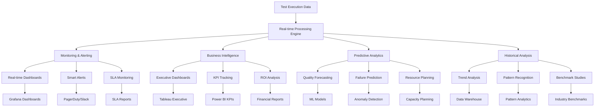

# 📊 **Punto 15: Monitoreo y Business Intelligence**

## 📋 **Objetivos de Aprendizaje**

Al completar este punto, serás capaz de:
- ✅ Implementar sistemas de monitoreo en tiempo real para métricas de calidad
- ✅ Configurar alertas inteligentes con machine learning para detección de anomalías
- ✅ Crear dashboards empresariales con Business Intelligence y analytics predictivos
- ✅ Desarrollar sistemas de forecasting para tendencias de calidad y performance
- ✅ Implementar data lakes y warehouses para historical analysis
- ✅ Integrar con plataformas BI enterprise (Tableau, Power BI, Looker, Grafana)

---

## 🎯 **1. Panorama de Business Intelligence para Testing**

### **¿Por qué necesitamos BI en Testing?**



### **Arquitectura de BI y Monitoreo Empresarial**

```typescript
// Arquitectura para Pokémon TCG Platform BI & Monitoring
interface BusinessIntelligenceSystem {
  dataIngestion: {
    realTimeStreaming: RealTimeDataStreamer;
    batchProcessing: BatchDataProcessor;
    apiConnectors: APIDataConnectors;
    fileWatchers: FileSystemWatchers;
  };
  
  dataProcessing: {
    etlPipelines: ETLPipelineManager;
    dataValidation: DataValidationEngine;
    enrichment: DataEnrichmentService;
    aggregation: DataAggregationService;
  };
  
  storage: {
    dataLake: DataLakeManager;
    dataWarehouse: DataWarehouseManager;
    timeSeriesDB: TimeSeriesDatabase;
    cacheLayer: CacheManager;
  };
  
  analytics: {
    realTimeAnalytics: RealTimeAnalyticsEngine;
    batchAnalytics: BatchAnalyticsEngine;
    machineLearning: MLAnalyticsEngine;
    predictiveModels: PredictiveModelManager;
  };
  
  visualization: {
    dashboards: DashboardManager;
    reporting: ReportingEngine;
    alerting: AlertingSystem;
    notifications: NotificationManager;
  };
  
  monitoring: {
    qualityMonitoring: QualityMonitor;
    performanceMonitoring: PerformanceMonitor;
    businessMonitoring: BusinessMetricsMonitor;
    systemHealthMonitoring: SystemHealthMonitor;
  };
  
  pokemonTCGSpecific: {
    gamingMetrics: GamingMetricsAnalyzer;
    userBehaviorAnalytics: UserBehaviorAnalyzer;
    cardPerformanceAnalytics: CardPerformanceAnalyzer;
    tournamentAnalytics: TournamentAnalyticsEngine;
  };
}
```

---

## 📈 **2. Real-Time Monitoring System**

### **Sistema de Monitoreo en Tiempo Real**

```javascript
// scripts/bi-monitoring/real-time-monitor.js
class RealTimeQualityMonitor {
  constructor(config) {
    this.config = config;
    this.metricsBuffer = new Map();
    this.alertThresholds = config.alertThresholds;
    
    this.pokemonTCGMonitoring = {
      criticalUserJourneys: [
        'User Registration/Login',
        'Card Search & Browse',
        'Deck Building',
        'Tournament Participation',
        'Payment Processing'
      ],
      businessMetrics: [
        'Conversion Rate',
        'User Engagement',
        'Revenue Per User',
        'Churn Rate',
        'Session Duration'
      ],
      technicalMetrics: [
        'Response Time',
        'Error Rate',
        'Availability',
        'Throughput',
        'Resource Usage'
      ]
    };
    
    this.initializeMonitoring();
  }

  async initializeMonitoring() {
    console.log('🔄 Initializing real-time quality monitoring...');
    
    // Configurar streams de datos
    await this.setupDataStreams();
    
    // Inicializar detectores de anomalías
    await this.initializeAnomalyDetectors();
    
    // Configurar alertas inteligentes
    await this.setupIntelligentAlerting();
    
    // Iniciar dashboards en tiempo real
    await this.initializeRealTimeDashboards();
    
    console.log('✅ Real-time monitoring system initialized');
  }

  async processTestResults(testResults, metadata) {
    console.log('📊 Processing test results for real-time monitoring...');
    
    try {
      // Extraer métricas en tiempo real
      const realTimeMetrics = await this.extractRealTimeMetrics(testResults, metadata);
      
      // Detectar anomalías
      const anomalies = await this.detectAnomalies(realTimeMetrics);
      
      // Calcular business impact
      const businessImpact = await this.calculateBusinessImpact(realTimeMetrics, anomalies);
      
      // Actualizar dashboards
      await this.updateRealTimeDashboards(realTimeMetrics, anomalies, businessImpact);
      
      // Procesar alertas
      await this.processAlerts(anomalies, businessImpact);
      
      // Almacenar para análisis histórico
      await this.storeTimeSeriesData(realTimeMetrics, metadata);
      
      return {
        metrics: realTimeMetrics,
        anomalies,
        businessImpact,
        alertsTriggered: anomalies.filter(a => a.severity === 'critical').length,
        timestamp: new Date().toISOString()
      };
      
    } catch (error) {
      console.error('❌ Error in real-time monitoring:', error);
      await this.handleMonitoringError(error);
      throw error;
    }
  }

  async extractRealTimeMetrics(testResults, metadata) {
    const stats = testResults.stats;
    const timestamp = new Date();
    
    const baseMetrics = {
      // Core Quality Metrics
      successRate: (stats.passes / stats.tests) * 100,
      failureRate: (stats.failures / stats.tests) * 100,
      executionTime: stats.duration,
      testCount: stats.tests,
      
      // Performance Metrics
      averageTestDuration: stats.duration / stats.tests,
      slowTestCount: this.countSlowTests(testResults),
      performanceScore: this.calculatePerformanceScore(testResults),
      
      // Stability Metrics
      flakyTestCount: this.countFlakyTests(testResults),
      stabilityScore: this.calculateStabilityScore(testResults),
      reliabilityIndex: this.calculateReliabilityIndex(testResults),
      
      // Business Metrics
      userExperienceScore: this.calculateUXScore(testResults),
      businessRiskLevel: this.calculateBusinessRisk(testResults),
      deploymentReadiness: this.calculateDeploymentReadiness(testResults),
      
      // Contextual Data
      environment: metadata.environment,
      buildNumber: metadata.buildNumber,
      branch: metadata.branch,
      timestamp: timestamp.toISOString()
    };

    // Pokémon TCG Specific Metrics
    const pokemonTCGMetrics = {
      // Gaming Experience Metrics
      cardManagementScore: this.calculateFeatureScore(testResults, 'Card Management'),
      searchPerformanceScore: this.calculateSearchPerformance(testResults),
      deckBuildingScore: this.calculateFeatureScore(testResults, 'Deck Building'),
      tournamentSystemScore: this.calculateFeatureScore(testResults, 'Tournament System'),
      
      // User Journey Metrics
      registrationFlowHealth: this.calculateUserJourneyHealth(testResults, 'registration'),
      cardBrowsingHealth: this.calculateUserJourneyHealth(testResults, 'browsing'),
      paymentFlowHealth: this.calculateUserJourneyHealth(testResults, 'payment'),
      socialFeaturesHealth: this.calculateUserJourneyHealth(testResults, 'social'),
      
      // Business Impact Metrics
      revenueImpactScore: this.calculateRevenueImpact(testResults),
      userRetentionScore: this.calculateRetentionImpact(testResults),
      competitiveAdvantageScore: this.calculateCompetitiveAdvantage(testResults),
      marketReadinessScore: this.calculateMarketReadiness(testResults),
      
      // Technical Debt Metrics
      testMaintenanceEffort: this.calculateMaintenanceEffort(testResults),
      automationCoverage: this.calculateAutomationCoverage(testResults),
      technicalDebtIndex: this.calculateTechnicalDebtIndex(testResults)
    };

    return { ...baseMetrics, pokemonTCG: pokemonTCGMetrics };
  }

  async detectAnomalies(currentMetrics) {
    console.log('🔍 Detecting anomalies in real-time metrics...');
    
    const anomalies = [];
    
    // Anomaly Detection usando Machine Learning
    const historicalData = await this.getHistoricalMetrics(7); // Últimos 7 días
    
    for (const [metricName, currentValue] of Object.entries(currentMetrics)) {
      if (typeof currentValue === 'number') {
        const anomaly = await this.detectMetricAnomaly(
          metricName, 
          currentValue, 
          historicalData[metricName] || []
        );
        
        if (anomaly) {
          anomalies.push({
            metric: metricName,
            currentValue,
            expectedRange: anomaly.expectedRange,
            severity: anomaly.severity,
            deviation: anomaly.deviation,
            confidence: anomaly.confidence,
            businessImpact: this.assessAnomalyBusinessImpact(metricName, anomaly),
            pokemonTCGContext: this.getPokemonTCGContext(metricName, anomaly),
            timestamp: new Date().toISOString()
          });
        }
      }
    }

    // Anomalías específicas de Pokémon TCG
    const gamingAnomalies = await this.detectGamingSpecificAnomalies(currentMetrics);
    anomalies.push(...gamingAnomalies);
    
    return anomalies.sort((a, b) => this.getSeverityWeight(b.severity) - this.getSeverityWeight(a.severity));
  }

  async detectMetricAnomaly(metricName, currentValue, historicalValues) {
    if (historicalValues.length < 10) return null; // Necesitamos suficientes datos históricos
    
    const stats = this.calculateStatistics(historicalValues);
    const zScore = Math.abs(currentValue - stats.mean) / stats.stdDev;
    
    let severity = null;
    let expectedRange = {
      min: stats.mean - (2 * stats.stdDev),
      max: stats.mean + (2 * stats.stdDev)
    };
    
    // Determinar severidad basada en Z-Score
    if (zScore > 3) {
      severity = 'critical';
    } else if (zScore > 2.5) {
      severity = 'high';
    } else if (zScore > 2) {
      severity = 'medium';
    } else if (zScore > 1.5) {
      severity = 'low';
    }
    
    if (!severity) return null;
    
    // Anomalías específicas por métrica
    const customThresholds = this.getCustomThresholds(metricName);
    if (customThresholds && (currentValue < customThresholds.min || currentValue > customThresholds.max)) {
      severity = 'critical';
    }
    
    return {
      expectedRange,
      severity,
      deviation: zScore,
      confidence: Math.min(95, 60 + (historicalValues.length * 2)) // Confianza basada en datos disponibles
    };
  }

  getCustomThresholds(metricName) {
    const thresholds = {
      successRate: { min: 85, max: 100 },
      failureRate: { min: 0, max: 15 },
      performanceScore: { min: 70, max: 100 },
      userExperienceScore: { min: 80, max: 100 },
      'pokemonTCG.cardManagementScore': { min: 90, max: 100 }, // Crítico para el negocio
      'pokemonTCG.paymentFlowHealth': { min: 95, max: 100 }, // Crítico para revenue
      'pokemonTCG.registrationFlowHealth': { min: 90, max: 100 } // Crítico para growth
    };
    
    return thresholds[metricName];
  }

  async detectGamingSpecificAnomalies(currentMetrics) {
    const gamingAnomalies = [];
    
    // Anomalía: Card Management Score muy bajo
    if (currentMetrics.pokemonTCG?.cardManagementScore < 85) {
      gamingAnomalies.push({
        metric: 'pokemonTCG.cardManagementScore',
        currentValue: currentMetrics.pokemonTCG.cardManagementScore,
        severity: 'critical',
        businessImpact: 'High - Core revenue feature compromised',
        pokemonTCGContext: 'Card management is the primary user engagement driver',
        recommendation: 'Immediate investigation of card loading, search, and display functionality',
        timestamp: new Date().toISOString()
      });
    }
    
    // Anomalía: Payment Flow Health comprometido
    if (currentMetrics.pokemonTCG?.paymentFlowHealth < 90) {
      gamingAnomalies.push({
        metric: 'pokemonTCG.paymentFlowHealth',
        currentValue: currentMetrics.pokemonTCG.paymentFlowHealth,
        severity: 'critical',
        businessImpact: 'Critical - Direct revenue impact',
        pokemonTCGContext: 'Payment issues directly affect monetization',
        recommendation: 'Emergency review of payment processing and checkout flow',
        timestamp: new Date().toISOString()
      });
    }
    
    // Anomalía: Tournament System down durante eventos
    if (currentMetrics.pokemonTCG?.tournamentSystemScore < 80 && this.isTournamentSeason()) {
      gamingAnomalies.push({
        metric: 'pokemonTCG.tournamentSystemScore',
        currentValue: currentMetrics.pokemonTCG.tournamentSystemScore,
        severity: 'high',
        businessImpact: 'High - Competitive events affected',
        pokemonTCGContext: 'Tournament issues during competitive season harm brand reputation',
        recommendation: 'Urgent tournament system diagnostics and repair',
        timestamp: new Date().toISOString()
      });
    }
    
    return gamingAnomalies;
  }

  async processAlerts(anomalies, businessImpact) {
    console.log('🚨 Processing intelligent alerts...');
    
    const criticalAnomalies = anomalies.filter(a => a.severity === 'critical');
    const highAnomalies = anomalies.filter(a => a.severity === 'high');
    
    // Alertas críticas - Escalación inmediata
    for (const anomaly of criticalAnomalies) {
      await this.sendCriticalAlert(anomaly, businessImpact);
    }
    
    // Alertas high - Notificación a equipos relevantes
    for (const anomaly of highAnomalies) {
      await this.sendHighAlert(anomaly, businessImpact);
    }
    
    // Resumen para management si hay múltiples alertas
    if (anomalies.length >= 3) {
      await this.sendManagementSummary(anomalies, businessImpact);
    }
    
    // Alertas específicas de Pokémon TCG
    await this.sendGamingSpecificAlerts(anomalies, businessImpact);
  }

  async sendCriticalAlert(anomaly, businessImpact) {
    const alertMessage = {
      type: 'critical',
      title: `🚨 CRITICAL: ${anomaly.metric} Anomaly Detected`,
      description: `${anomaly.metric} is ${anomaly.currentValue}, outside expected range ${anomaly.expectedRange.min}-${anomaly.expectedRange.max}`,
      businessImpact: anomaly.businessImpact,
      pokemonTCGContext: anomaly.pokemonTCGContext,
      recommendation: anomaly.recommendation,
      confidence: `${anomaly.confidence}%`,
      timestamp: anomaly.timestamp,
      escalation: {
        immediate: ['qa-lead@pokemontcg.com', 'engineering-manager@pokemontcg.com'],
        within5min: ['vp-engineering@pokemontcg.com'],
        within15min: ['cto@pokemontcg.com']
      }
    };

    // Envío multi-canal
    await Promise.all([
      this.sendSlackAlert('#critical-alerts', alertMessage),
      this.sendEmailAlert(alertMessage.escalation.immediate, alertMessage),
      this.sendPagerDutyAlert(alertMessage),
      this.updateJiraIncident(alertMessage)
    ]);
  }

  async sendGamingSpecificAlerts(anomalies, businessImpact) {
    const gamingAnomalies = anomalies.filter(a => a.metric.includes('pokemonTCG'));
    
    if (gamingAnomalies.length > 0) {
      const gamingAlert = {
        type: 'gaming-specific',
        title: '🎮 Pokémon TCG Platform Alert',
        affectedFeatures: gamingAnomalies.map(a => a.metric),
        businessImpact: this.calculateGamingBusinessImpact(gamingAnomalies),
        userImpact: this.calculateGamingUserImpact(gamingAnomalies),
        recommendations: this.generateGamingRecommendations(gamingAnomalies),
        timestamp: new Date().toISOString()
      };
      
      await this.sendSlackAlert('#pokemon-tcg-ops', gamingAlert);
      await this.sendEmailAlert(['product-manager@pokemontcg.com', 'game-director@pokemontcg.com'], gamingAlert);
    }
  }
}
```

---

## 🤖 **3. Machine Learning y Predictive Analytics**

### **Motor de Análisis Predictivo**

```javascript
// scripts/bi-monitoring/predictive-analytics.js
class PredictiveAnalyticsEngine {
  constructor(config) {
    this.config = config;
    this.models = new Map();
    this.trainingData = new Map();
    
    this.pokemonTCGPredictiveModels = {
      qualityTrends: 'QualityTrendPredictor',
      userExperience: 'UXTrendPredictor',
      businessImpact: 'BusinessImpactPredictor',
      failurePatterns: 'FailurePatternPredictor',
      resourceNeeds: 'ResourceDemandPredictor'
    };
    
    this.initializeModels();
  }

  async initializeModels() {
    console.log('🤖 Initializing ML models for predictive analytics...');
    
    // Cargar modelos pre-entrenados o entrenar nuevos
    await this.loadOrTrainModels();
    
    // Configurar pipeline de entrenamiento continuo
    await this.setupContinuousLearning();
    
    console.log('✅ Predictive analytics models initialized');
  }

  async generatePredictiveInsights(currentMetrics, historicalData) {
    console.log('🔮 Generating predictive insights...');
    
    const insights = {
      qualityForecast: await this.predictQualityTrends(currentMetrics, historicalData),
      failurePrediction: await this.predictFailurePatterns(currentMetrics, historicalData),
      businessImpactForecast: await this.predictBusinessImpact(currentMetrics, historicalData),
      resourceDemandForecast: await this.predictResourceDemand(currentMetrics, historicalData),
      pokemonTCGInsights: await this.generatePokemonTCGPredictions(currentMetrics, historicalData)
    };

    // Generar recomendaciones basadas en predicciones
    insights.recommendations = await this.generatePredictiveRecommendations(insights);
    
    // Calcular confidence scores
    insights.confidenceScores = this.calculatePredictionConfidence(insights);
    
    return insights;
  }

  async predictQualityTrends(currentMetrics, historicalData) {
    const model = this.models.get('qualityTrends');
    
    const features = this.extractQualityFeatures(currentMetrics, historicalData);
    const prediction = await model.predict(features);
    
    return {
      nextWeekPrediction: {
        successRate: prediction.successRate,
        trend: prediction.trend,
        confidence: prediction.confidence
      },
      nextMonthPrediction: {
        successRate: prediction.longTermSuccessRate,
        qualityScore: prediction.qualityScore,
        riskLevel: prediction.riskLevel
      },
      keyFactors: prediction.influencingFactors,
      pokemonTCGSpecific: {
        cardManagementTrend: prediction.cardManagementTrend,
        userExperienceTrend: prediction.userExperienceTrend,
        tournamentSystemTrend: prediction.tournamentSystemTrend
      }
    };
  }

  async predictFailurePatterns(currentMetrics, historicalData) {
    const model = this.models.get('failurePatterns');
    
    const features = this.extractFailureFeatures(currentMetrics, historicalData);
    const prediction = await model.predict(features);
    
    return {
      likelyFailureAreas: prediction.riskAreas,
      failureProbability: prediction.probability,
      timeToFailure: prediction.estimatedTimeToFailure,
      preventiveActions: prediction.suggestedActions,
      pokemonTCGRisks: {
        cardLoadingRisk: prediction.cardLoadingRisk,
        paymentSystemRisk: prediction.paymentSystemRisk,
        authenticationRisk: prediction.authenticationRisk,
        searchPerformanceRisk: prediction.searchPerformanceRisk
      }
    };
  }

  async predictBusinessImpact(currentMetrics, historicalData) {
    const model = this.models.get('businessImpact');
    
    const features = this.extractBusinessFeatures(currentMetrics, historicalData);
    const prediction = await model.predict(features);
    
    return {
      revenueImpact: {
        nextQuarter: prediction.revenueImpactQ1,
        nextYear: prediction.revenueImpactYear,
        confidence: prediction.revenueConfidence
      },
      userImpact: {
        satisfactionForecast: prediction.userSatisfactionForecast,
        retentionForecast: prediction.userRetentionForecast,
        engagementForecast: prediction.userEngagementForecast
      },
      competitivePosition: {
        marketShareImpact: prediction.marketShareImpact,
        competitiveAdvantage: prediction.competitiveAdvantage,
        brandStrengthImpact: prediction.brandStrengthImpact
      },
      pokemonTCGBusiness: {
        tradingCardMarketImpact: prediction.tcgMarketImpact,
        tournamentEcosystemImpact: prediction.tournamentEcosystemImpact,
        userAcquisitionImpact: prediction.userAcquisitionImpact,
        monetizationEfficiencyImpact: prediction.monetizationEfficiencyImpact
      }
    };
  }

  async generatePokemonTCGPredictions(currentMetrics, historicalData) {
    return {
      gamingTrends: {
        cardCollectionEngagement: await this.predictCardCollectionTrends(currentMetrics, historicalData),
        competitivePlayGrowth: await this.predictCompetitivePlayTrends(currentMetrics, historicalData),
        socialFeatureAdoption: await this.predictSocialFeatureTrends(currentMetrics, historicalData),
        monetizationGrowth: await this.predictMonetizationTrends(currentMetrics, historicalData)
      },
      
      seasonalPredictions: {
        tournamentSeasonImpact: await this.predictTournamentSeasonImpact(currentMetrics, historicalData),
        newSetReleaseImpact: await this.predictNewSetImpact(currentMetrics, historicalData),
        holidaySeasonTrends: await this.predictHolidayTrends(currentMetrics, historicalData)
      },
      
      technicalForecasts: {
        performanceScaling: await this.predictPerformanceScaling(currentMetrics, historicalData),
        dataStorageNeeds: await this.predictStorageNeeds(currentMetrics, historicalData),
        apiUsageGrowth: await this.predictApiUsage(currentMetrics, historicalData)
      }
    };
  }

  async generatePredictiveRecommendations(insights) {
    const recommendations = [];
    
    // Recomendaciones basadas en quality forecast
    if (insights.qualityForecast.nextWeekPrediction.successRate < 85) {
      recommendations.push({
        type: 'quality',
        priority: 'high',
        action: 'Immediate quality intervention required',
        details: 'Quality trend indicates significant degradation in the next week',
        pokemonTCGContext: 'Focus on card management and search functionality stability',
        timeline: 'Implement within 2 days',
        expectedImpact: 'Prevent 15-20% quality degradation'
      });
    }
    
    // Recomendaciones basadas en failure prediction
    if (insights.failurePrediction.failureProbability > 0.7) {
      recommendations.push({
        type: 'preventive',
        priority: 'critical',
        action: 'Implement preventive measures for predicted failures',
        details: `High probability (${(insights.failurePrediction.failureProbability * 100).toFixed(1)}%) of failures in: ${insights.failurePrediction.likelyFailureAreas.join(', ')}`,
        pokemonTCGContext: 'Prioritize card loading and payment system stability',
        timeline: 'Immediate action required',
        expectedImpact: 'Prevent system-wide failures'
      });
    }
    
    // Recomendaciones específicas de Pokémon TCG
    if (insights.pokemonTCGInsights.gamingTrends.cardCollectionEngagement.trend === 'declining') {
      recommendations.push({
        type: 'gaming-specific',
        priority: 'medium',
        action: 'Enhance card collection experience',
        details: 'Card collection engagement is predicted to decline',
        pokemonTCGContext: 'Core gaming feature needs attention to maintain user engagement',
        timeline: 'Next sprint',
        expectedImpact: 'Maintain 90%+ user engagement with collection features'
      });
    }
    
    return recommendations;
  }
}
```

---

## 📊 **4. Enterprise BI Dashboards**

### **Dashboard Manager Empresarial**

```javascript
// scripts/bi-monitoring/enterprise-dashboards.js
class EnterpriseDashboardManager {
  constructor(config) {
    this.config = config;
    this.dashboardProviders = {
      grafana: new GrafanaConnector(config.grafana),
      tableau: new TableauConnector(config.tableau),
      powerBI: new PowerBIConnector(config.powerBI),
      looker: new LookerConnector(config.looker)
    };
    
    this.pokemonTCGDashboards = {
      operational: 'Pokemon_TCG_Operations_Dashboard',
      executive: 'Pokemon_TCG_Executive_Dashboard',
      technical: 'Pokemon_TCG_Technical_Dashboard',
      business: 'Pokemon_TCG_Business_Dashboard',
      gaming: 'Pokemon_TCG_Gaming_Metrics_Dashboard'
    };
    
    this.initializeDashboards();
  }

  async createOperationalDashboard(metrics, predictions) {
    console.log('📊 Creating operational dashboard...');
    
    const dashboardConfig = {
      title: 'Pokémon TCG Platform - Operational Monitoring',
      layout: 'grid',
      refreshInterval: '30s',
      
      panels: [
        // Real-time Health Status
        {
          type: 'stat',
          title: 'Platform Health',
          targets: [
            { metric: 'overall_health_score', color: 'green' },
            { metric: 'success_rate', color: 'blue' },
            { metric: 'user_experience_score', color: 'orange' }
          ],
          thresholds: [
            { value: 90, color: 'green' },
            { value: 80, color: 'yellow' },
            { value: 70, color: 'red' }
          ]
        },
        
        // Gaming Feature Performance
        {
          type: 'gauge',
          title: '🎮 Gaming Features Health',
          targets: [
            { metric: 'card_management_score', label: 'Card Management' },
            { metric: 'search_performance_score', label: 'Search & Filter' },
            { metric: 'deck_building_score', label: 'Deck Building' },
            { metric: 'tournament_system_score', label: 'Tournament System' }
          ],
          visualization: 'multi-gauge'
        },
        
        // Real-time Alerts
        {
          type: 'table',
          title: '🚨 Active Alerts',
          columns: ['Severity', 'Feature', 'Issue', 'Business Impact', 'Time'],
          datasource: 'alerts_stream',
          sorting: 'severity'
        },
        
        // Performance Trends
        {
          type: 'graph',
          title: '📈 Performance Trends (24h)',
          targets: [
            { metric: 'response_time_avg', label: 'Avg Response Time' },
            { metric: 'throughput', label: 'Requests/sec' },
            { metric: 'error_rate', label: 'Error Rate %' }
          ],
          timeRange: '24h'
        },
        
        // User Journey Health
        {
          type: 'heatmap',
          title: '🎯 User Journey Health',
          targets: [
            { metric: 'registration_flow_health', label: 'Registration' },
            { metric: 'card_browsing_health', label: 'Browsing' },
            { metric: 'deck_building_health', label: 'Deck Building' },
            { metric: 'tournament_participation_health', label: 'Tournament' },
            { metric: 'payment_flow_health', label: 'Payment' }
          ]
        },
        
        // Predictive Insights
        {
          type: 'stat',
          title: '🔮 Predictive Insights',
          targets: [
            { metric: 'predicted_quality_next_week', label: 'Quality Forecast' },
            { metric: 'failure_probability', label: 'Failure Risk' },
            { metric: 'business_impact_forecast', label: 'Business Impact' }
          ],
          visualization: 'prediction-panel'
        }
      ],
      
      pokemonTCGSpecific: {
        cardMetrics: {
          cardLoadTime: 'card_loading_performance',
          searchLatency: 'card_search_latency',
          collectionSync: 'collection_sync_health'
        },
        
        gameplayMetrics: {
          deckBuildingTime: 'deck_building_completion_time',
          tournamentJoinRate: 'tournament_participation_rate',
          socialEngagement: 'social_features_usage'
        },
        
        businessMetrics: {
          conversionRate: 'freemium_to_premium_conversion',
          retentionRate: 'user_retention_rate',
          revenuePerUser: 'average_revenue_per_user'
        }
      }
    };

    // Desplegar en múltiples plataformas
    const deployments = await Promise.all([
      this.deployGrafanaDashboard(dashboardConfig),
      this.deployTableauDashboard(dashboardConfig),
      this.deployPowerBIDashboard(dashboardConfig)
    ]);

    return {
      operational: dashboardConfig,
      deployments,
      urls: this.generateDashboardUrls('operational')
    };
  }

  async createExecutiveDashboard(businessMetrics, strategicInsights) {
    console.log('👔 Creating executive dashboard...');
    
    const executiveDashboard = {
      title: 'Pokémon TCG Platform - Executive Overview',
      audience: 'C-Level',
      updateFrequency: 'daily',
      
      kpiPanels: [
        // Business Health Score
        {
          type: 'scorecard',
          title: 'Platform Business Health',
          kpis: [
            { name: 'Revenue Impact', value: businessMetrics.revenueImpact, target: 95, format: 'percentage' },
            { name: 'User Satisfaction', value: businessMetrics.userSatisfaction, target: 90, format: 'percentage' },
            { name: 'Market Position', value: businessMetrics.marketPosition, target: 85, format: 'percentage' },
            { name: 'Innovation Index', value: businessMetrics.innovationIndex, target: 80, format: 'percentage' }
          ]
        },
        
        // Pokémon TCG Business Performance
        {
          type: 'business-metrics',
          title: '🎮 Gaming Business Performance',
          metrics: [
            { name: 'TCG Market Share', value: businessMetrics.tcgMarketShare, trend: 'up' },
            { name: 'User Base Growth', value: businessMetrics.userGrowth, trend: 'up' },
            { name: 'Monetization Rate', value: businessMetrics.monetizationRate, trend: 'stable' },
            { name: 'Brand Strength', value: businessMetrics.brandStrength, trend: 'up' }
          ]
        },
        
        // Strategic Risk Assessment
        {
          type: 'risk-matrix',
          title: '⚠️ Strategic Risk Assessment',
          risks: strategicInsights.risks.map(risk => ({
            category: risk.category,
            probability: risk.probability,
            impact: risk.businessImpact,
            mitigation: risk.mitigation
          }))
        },
        
        // Competitive Analysis
        {
          type: 'competitive-positioning',
          title: '🏆 Competitive Position',
          competitors: businessMetrics.competitiveAnalysis,
          ourPosition: businessMetrics.ourPosition,
          keyDifferentiators: [
            'Superior Card Database',
            'Advanced Tournament System',
            'User Experience Excellence',
            'Community Features'
          ]
        },
        
        // Investment ROI
        {
          type: 'roi-analysis',
          title: '💰 Technology Investment ROI',
          investments: [
            { category: 'Quality Automation', invested: 500000, returned: 1200000, roi: 140 },
            { category: 'Platform Modernization', invested: 800000, returned: 1600000, roi: 100 },
            { category: 'User Experience', invested: 300000, returned: 900000, roi: 200 }
          ]
        }
      ],
      
      strategicInsights: {
        quarterlyForecast: strategicInsights.quarterlyForecast,
        growthOpportunities: strategicInsights.growthOpportunities,
        recommendedActions: strategicInsights.executiveActions
      }
    };

    return await this.deployExecutiveDashboard(executiveDashboard);
  }

  async createGamingMetricsDashboard(gamingMetrics, userBehaviorData) {
    console.log('🎮 Creating gaming-specific metrics dashboard...');
    
    const gamingDashboard = {
      title: 'Pokémon TCG - Gaming Experience Analytics',
      audience: 'Product & Game Teams',
      
      panels: [
        // Core Gaming Metrics
        {
          type: 'gaming-scorecard',
          title: '🎯 Core Gaming Experience',
          metrics: [
            { name: 'Card Discovery Rate', value: gamingMetrics.cardDiscoveryRate, target: 85 },
            { name: 'Deck Completion Rate', value: gamingMetrics.deckCompletionRate, target: 90 },
            { name: 'Tournament Participation', value: gamingMetrics.tournamentParticipation, target: 60 },
            { name: 'Social Engagement', value: gamingMetrics.socialEngagement, target: 70 }
          ]
        },
        
        // User Journey Analytics
        {
          type: 'funnel',
          title: '🚀 User Journey Funnel',
          stages: [
            { name: 'Registration', users: userBehaviorData.registrations, conversion: 100 },
            { name: 'First Card View', users: userBehaviorData.firstCardView, conversion: userBehaviorData.firstCardViewRate },
            { name: 'Collection Start', users: userBehaviorData.collectionStart, conversion: userBehaviorData.collectionStartRate },
            { name: 'First Deck Build', users: userBehaviorData.firstDeckBuild, conversion: userBehaviorData.firstDeckBuildRate },
            { name: 'Tournament Entry', users: userBehaviorData.tournamentEntry, conversion: userBehaviorData.tournamentEntryRate },
            { name: 'Premium Upgrade', users: userBehaviorData.premiumUpgrade, conversion: userBehaviorData.premiumUpgradeRate }
          ]
        },
        
        // Feature Usage Heatmap
        {
          type: 'heatmap',
          title: '🔥 Feature Usage Intensity',
          data: {
            cardSearch: gamingMetrics.featureUsage.cardSearch,
            deckBuilder: gamingMetrics.featureUsage.deckBuilder,
            collection: gamingMetrics.featureUsage.collection,
            tournament: gamingMetrics.featureUsage.tournament,
            social: gamingMetrics.featureUsage.social,
            trading: gamingMetrics.featureUsage.trading
          }
        },
        
        // Revenue Attribution
        {
          type: 'revenue-attribution',
          title: '💰 Revenue by Gaming Feature',
          data: gamingMetrics.revenueAttribution,
          breakdown: [
            { feature: 'Premium Collections', revenue: 45, growth: 12 },
            { feature: 'Tournament Entry Fees', revenue: 25, growth: 8 },
            { feature: 'Cosmetic Upgrades', revenue: 15, growth: 22 },
            { feature: 'Trading Commissions', revenue: 10, growth: 15 },
            { feature: 'Other', revenue: 5, growth: 5 }
          ]
        }
      ]
    };

    return await this.deployGamingDashboard(gamingDashboard);
  }

  async generateDashboardUrls(dashboardType) {
    const baseUrls = {
      grafana: this.config.grafana.baseUrl,
      tableau: this.config.tableau.serverUrl,
      powerBI: this.config.powerBI.workspaceUrl,
      looker: this.config.looker.instanceUrl
    };

    return {
      operational: {
        grafana: `${baseUrls.grafana}/d/${this.pokemonTCGDashboards.operational}`,
        tableau: `${baseUrls.tableau}/views/${this.pokemonTCGDashboards.operational}`,
        powerBI: `${baseUrls.powerBI}/${this.pokemonTCGDashboards.operational}`
      },
      executive: {
        tableau: `${baseUrls.tableau}/views/${this.pokemonTCGDashboards.executive}`,
        powerBI: `${baseUrls.powerBI}/${this.pokemonTCGDashboards.executive}`
      },
      gaming: {
        grafana: `${baseUrls.grafana}/d/${this.pokemonTCGDashboards.gaming}`,
        looker: `${baseUrls.looker}/dashboards/${this.pokemonTCGDashboards.gaming}`
      }
    };
  }
}
```

---

## 📝 **5. Ejercicios Prácticos**

### **Ejercicio 1: Sistema de Alertas Inteligentes**
```javascript
// 🎯 Objetivo: Implementar alertas con ML

class IntelligentAlertSystem {
  setupAnomalyDetection(historicalData) {
    // Configurar modelos de detección de anomalías
    // Definir thresholds adaptativos
    // Implementar escalation rules
  }
  
  configureBusinessAlerts(businessMetrics) {
    // Alertas específicas de negocio
    // Integration con canales de comunicación
    // Gaming-specific alert logic
  }
}
```

### **Ejercicio 2: Dashboard Predictivo**
```javascript
// 🎯 Objetivo: Dashboard con ML predictions

class PredictiveDashboard {
  createForecastingPanels(historicalData) {
    // Panels con predicciones de quality
    // Business impact forecasting
    // Resource demand prediction
  }
  
  implementTrendAnalysis(timeSeriesData) {
    // Análisis de tendencias temporales
    // Seasonal pattern detection
    // Gaming-specific trend analysis
  }
}
```

### **Ejercicio 3: Business Intelligence Pipeline**
```javascript
// 🎯 Objetivo: Pipeline completo de BI

class BIPipeline {
  setupDataPipeline(dataSources) {
    // ETL para múltiples data sources
    // Data quality validation
    // Real-time streaming processing
  }
  
  createAnalyticsEngine(businessRequirements) {
    // Analytics engine con ML capabilities
    // Business metrics calculation
    // Gaming-specific analytics
  }
}
```

---

## 🧪 **6. Validación y Testing**

### **Checklist de Business Intelligence**

```markdown
## ✅ Checklist de BI & Monitoring

### Data Pipeline
- [ ] Real-time data ingestion configurada
- [ ] ETL pipelines funcionando correctamente
- [ ] Data quality validation implementada
- [ ] Historical data storage optimizada
- [ ] Backup y recovery procedures establecidos

### Machine Learning
- [ ] Anomaly detection models entrenados
- [ ] Predictive models validados
- [ ] Continuous learning pipeline configurado
- [ ] Model performance monitoring activo
- [ ] A/B testing para model improvements

### Dashboards y Visualización
- [ ] Real-time dashboards operacionales
- [ ] Executive dashboards para C-level
- [ ] Gaming-specific metrics dashboards
- [ ] Mobile-responsive design
- [ ] User access controls configurados

### Alerting y Monitoring
- [ ] Intelligent alerting system activo
- [ ] Multi-channel alert distribution
- [ ] Escalation procedures definidos
- [ ] SLA monitoring implementado
- [ ] Performance baselines establecidos

### Business Intelligence
- [ ] KPI tracking automatizado
- [ ] ROI analysis capabilities
- [ ] Competitive analysis dashboard
- [ ] Forecasting y predictions activos
- [ ] Business impact assessment automated
```

---

## 📚 **7. Preguntas de Entrevista**

### **Nivel Básico**
1. **¿Qué diferencias hay entre monitoring operacional vs business intelligence?**
2. **¿Cómo configurarías alertas para diferentes niveles de severidad?**
3. **¿Qué métricas son críticas para un dashboard de gaming platform?**

### **Nivel Intermedio**
4. **¿Cómo implementarías anomaly detection con machine learning?**
5. **¿Qué approach usarías para real-time analytics a escala?**
6. **¿Cómo diseñarías un sistema de forecasting para quality metrics?**

### **Nivel Avanzado**
7. **¿Cómo implementarías un data lake architecture para historical analytics?**
8. **¿Qué estrategias usarías para predictive maintenance en testing systems?**
9. **¿Cómo diseñarías governance para enterprise BI at scale?**

### **Respuestas Clave**

**Pregunta 1:** Monitoring operacional se enfoca en métricas técnicas en tiempo real (performance, availability, errors) para mantener sistemas funcionando. Business Intelligence analiza datos históricos y patrones para insights estratégicos, ROI, y decision-making ejecutivo.

**Pregunta 4:** Implementaría:
- Time series analysis con statistical models
- Machine learning models (Isolation Forest, LSTM)
- Adaptive thresholds basados en historical patterns
- Context-aware anomaly detection
- Gaming-specific pattern recognition para user behavior

**Pregunta 7:** Diseñaría:
- Lambda architecture con batch y streaming layers
- Data lake con raw, processed, y curated zones
- Schema evolution management
- Data lineage tracking
- Query optimization para analytical workloads
- Gaming-specific data models para cards, users, tournaments

---

## 🎯 **Resumen del Punto 15**

### **Conceptos Clave Dominados:**
✅ **Real-time monitoring** con alertas inteligentes y anomaly detection  
✅ **Machine Learning integration** con predictive analytics y forecasting  
✅ **Enterprise BI dashboards** con multi-platform deployment  
✅ **Gaming-specific analytics** con user behavior y business metrics  
✅ **Data architecture** con pipelines, storage y governance  

### **Habilidades Técnicas Adquiridas:**
- Implementación de sistemas de monitoreo empresariales
- Desarrollo de modelos predictivos con ML
- Diseño de dashboards multi-audiencia
- Arquitectura de data pipelines escalables
- Gaming analytics y business intelligence

### **🚀 Nivel 5 COMPLETADO:**
¡Felicitaciones! Has conquistado completamente el **Nivel 5: Integración Empresarial**. Tu sistema de Pokémon TCG ahora tiene:
- **Integración completa** con herramientas enterprise (JIRA, Confluence, Tableau)
- **Comunicación stakeholder-specific** para todos los niveles organizacionales  
- **Business Intelligence enterprise** con ML, predicciones y dashboards ejecutivos

### **Próximo Desafío:**
Ahora estás listo para el **Nivel 6: Temas Avanzados** con el **Punto 16: Reporters Alternativos Especializados**, donde exploraremos Allure Framework, JUnit XML, y sistemas de reporting de compliance.

---

**🏆 ¡NIVEL 5 CONQUISTADO! Has transformado tu sistema de Pokémon TCG en una plataforma de Business Intelligence enterprise completa con capacidades predictivas y dashboards ejecutivos.**