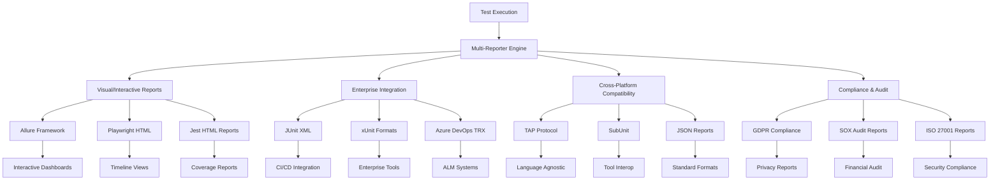

# 🎭 **Punto 16: Reporters Alternativos Especializados**

## 📋 **Objetivos de Aprendizaje**

Al completar este punto, serás capaz de:
- ✅ Implementar Allure Framework para reportes cinematográficos y interactivos
- ✅ Configurar JUnit XML para integración masiva con sistemas enterprise
- ✅ Utilizar TAP (Test Anything Protocol) para interoperabilidad cross-platform
- ✅ Desarrollar reportes de compliance y auditoría especializados
- ✅ Crear sistemas de reporting multi-formato para diferentes necesidades
- ✅ Integrar múltiples reporters en pipelines complejos de testing

---

## 🎯 **1. Panorama de Reporters Especializados**

### **¿Por qué necesitamos reporters alternativos?**



### **Arquitectura Multi-Reporter**

```typescript
// Arquitectura para Pokémon TCG Platform Multi-Reporter System
interface MultiReporterSystem {
  reporters: {
    allure: AllureReporter;
    junit: JUnitXMLReporter;
    tap: TAPReporter;
    mochawesome: MochawesomeReporter;
    custom: CustomComplianceReporter;
  };
  
  orchestrator: {
    executionEngine: TestExecutionEngine;
    reportDispatcher: ReportDispatcher;
    formatConverter: FormatConverter;
    aggregationEngine: ReportAggregator;
  };
  
  outputFormats: {
    interactive: InteractiveReportGenerator;
    enterprise: EnterpriseFormatGenerator;
    compliance: ComplianceReportGenerator;
    archive: ArchiveFormatGenerator;
  };
  
  integrations: {
    cicdSystems: CICDIntegrationManager;
    enterpriseTools: EnterpriseToolsConnector;
    complianceAuditors: ComplianceAuditConnector;
    stakeholderDistribution: StakeholderDistributor;
  };
  
  pokemonTCGSpecific: {
    gamingMetricsReporter: GamingMetricsReporter;
    userJourneyReporter: UserJourneyReporter;
    businessImpactReporter: BusinessImpactReporter;
    complianceReporter: GamingComplianceReporter;
  };
}
```

---

## 🎬 **2. Allure Framework - Reportes Cinematográficos**

### **Implementación Avanzada de Allure**

```javascript
// scripts/advanced-reporters/allure-implementation.js
class AdvancedAllureReporter {
  constructor(config) {
    this.config = config;
    this.allureReporter = require('@wdio/allure-reporter').default;
    
    this.pokemonTCGAllureConfig = {
      features: [
        'Card Management',
        'User Authentication', 
        'Search & Filter',
        'Deck Building',
        'Tournament System',
        'Payment Processing'
      ],
      severityLevels: ['blocker', 'critical', 'normal', 'minor', 'trivial'],
      businessPriorities: ['revenue-critical', 'user-experience', 'competitive-advantage', 'compliance'],
      userStories: this.loadUserStories()
    };
    
    this.setupAllureEnhanced();
  }

  async setupAllureEnhanced() {
    console.log('🎬 Setting up enhanced Allure reporting...');
    
    // Configurar Allure con extensiones avanzadas
    await this.configureAllureExtensions();
    
    // Setup gaming-specific categorization
    await this.setupGamingCategories();
    
    // Configure business impact tracking
    await this.setupBusinessImpactTracking();
    
    // Initialize visual enhancement features
    await this.setupVisualEnhancements();
    
    console.log('✅ Advanced Allure reporter configured');
  }

  async generateEnhancedAllureReport(testResults, metadata) {
    console.log('🎭 Generating enhanced Allure report...');
    
    try {
      // Pre-processing para enrichment
      const enrichedTestData = await this.enrichTestData(testResults, metadata);
      
      // Generar reporte base de Allure
      const baseReport = await this.generateBaseAllureReport(enrichedTestData);
      
      // Aplicar extensiones de Pokémon TCG
      const enhancedReport = await this.applyPokemonTCGEnhancements(baseReport, enrichedTestData);
      
      // Agregar métricas de negocio
      const businessEnhancedReport = await this.addBusinessMetrics(enhancedReport, metadata);
      
      // Aplicar temas y branding
      const brandedReport = await this.applyBrandingAndThemes(businessEnhancedReport);
      
      // Generar assets adicionales
      const finalReport = await this.generateAdditionalAssets(brandedReport);
      
      // Deploy y distribución
      await this.deployAndDistribute(finalReport);
      
      return {
        reportPath: finalReport.path,
        reportUrl: finalReport.url,
        metrics: finalReport.metrics,
        enhancements: finalReport.enhancements,
        timestamp: new Date().toISOString()
      };
      
    } catch (error) {
      console.error('❌ Error generating enhanced Allure report:', error);
      throw error;
    }
  }

  async enrichTestData(testResults, metadata) {
    console.log('🔬 Enriching test data for Allure...');
    
    const enrichedTests = testResults.tests?.map(test => {
      const baseEnrichment = {
        // Core Allure annotations
        '@allure.feature': this.extractFeature(test),
        '@allure.story': this.extractStory(test),
        '@allure.severity': this.calculateSeverity(test),
        '@allure.epic': this.extractEpic(test),
        '@allure.owner': this.extractOwner(test),
        '@allure.tag': this.extractTags(test),
        
        // Business context
        '@allure.label': 'business-priority:' + this.calculateBusinessPriority(test),
        '@allure.parameter': this.extractTestParameters(test),
        '@allure.issue': this.linkToIssues(test),
        '@allure.testCaseId': this.generateTestCaseId(test),
        
        // Gaming-specific enrichment
        '@pokemon.gameFeature': this.extractGameFeature(test),
        '@pokemon.userJourney': this.extractUserJourney(test),
        '@pokemon.businessImpact': this.assessBusinessImpact(test),
        '@pokemon.userSegment': this.identifyUserSegment(test),
        '@pokemon.deviceCategory': this.extractDeviceCategory(test),
        
        // Performance context
        '@performance.expectedDuration': this.getExpectedDuration(test),
        '@performance.actualDuration': test.duration,
        '@performance.performanceCategory': this.categorizePerformance(test),
        
        // Environment context
        '@environment.testEnvironment': metadata.environment,
        '@environment.buildNumber': metadata.buildNumber,
        '@environment.branch': metadata.branch,
        '@environment.executionTime': metadata.timestamp
      };

      // Agregar attachments específicos
      const attachments = this.generateTestAttachments(test, metadata);
      
      return {
        ...test,
        enrichment: baseEnrichment,
        attachments: attachments,
        steps: this.enrichTestSteps(test.steps || []),
        pokemonTCGContext: this.generatePokemonTCGContext(test)
      };
    }) || [];

    return {
      ...testResults,
      tests: enrichedTests,
      suiteEnrichment: this.generateSuiteEnrichment(testResults, metadata)
    };
  }

  extractFeature(test) {
    const title = test.title?.toLowerCase() || '';
    const fullTitle = test.fullTitle?.toLowerCase() || '';
    
    // Gaming feature detection
    if (title.includes('card') || fullTitle.includes('card')) return 'Card Management';
    if (title.includes('auth') || fullTitle.includes('login')) return 'User Authentication';
    if (title.includes('search') || fullTitle.includes('filter')) return 'Search & Filter';
    if (title.includes('deck') || fullTitle.includes('build')) return 'Deck Building';
    if (title.includes('tournament') || fullTitle.includes('compete')) return 'Tournament System';
    if (title.includes('payment') || fullTitle.includes('purchase')) return 'Payment Processing';
    if (title.includes('collection') || fullTitle.includes('collect')) return 'Collection System';
    if (title.includes('social') || fullTitle.includes('friend')) return 'Social Features';
    
    return 'Platform Core';
  }

  extractStory(test) {
    // Extraer user story basada en el test
    const feature = this.extractFeature(test);
    const testType = this.extractTestType(test);
    
    const storyTemplates = {
      'Card Management': {
        'search': 'As a player, I want to search for specific cards to build my collection',
        'view': 'As a player, I want to view card details to make informed decisions',
        'collect': 'As a player, I want to add cards to my collection',
        'filter': 'As a player, I want to filter cards by various criteria'
      },
      'User Authentication': {
        'login': 'As a user, I want to securely log into my account',
        'register': 'As a new user, I want to create an account',
        'profile': 'As a user, I want to manage my profile information',
        'security': 'As a user, I want my account to be secure'
      },
      'Deck Building': {
        'create': 'As a player, I want to create new decks',
        'edit': 'As a player, I want to modify my existing decks',
        'validate': 'As a player, I want to ensure my deck is tournament-legal',
        'share': 'As a player, I want to share my deck with others'
      },
      'Tournament System': {
        'join': 'As a competitive player, I want to join tournaments',
        'compete': 'As a player, I want to compete in matches',
        'track': 'As a player, I want to track my tournament progress',
        'results': 'As a player, I want to view tournament results'
      }
    };
    
    return storyTemplates[feature]?.[testType] || `As a user, I want ${feature} to work correctly`;
  }

  calculateSeverity(test) {
    const feature = this.extractGameFeature(test);
    const businessImpact = this.assessBusinessImpact(test);
    const userImpact = this.assessUserImpact(test);
    
    // Revenue-critical features
    if (['Payment Processing', 'User Authentication'].includes(feature)) {
      return test.state === 'failed' ? 'blocker' : 'critical';
    }
    
    // High user engagement features
    if (['Card Management', 'Deck Building', 'Tournament System'].includes(feature)) {
      return test.state === 'failed' ? 'critical' : 'normal';
    }
    
    // Business impact assessment
    if (businessImpact === 'high') return 'critical';
    if (businessImpact === 'medium') return 'normal';
    if (businessImpact === 'low') return 'minor';
    
    return 'normal';
  }

  generateTestAttachments(test, metadata) {
    const attachments = [];
    
    // Screenshots para tests visuales
    if (test.screenshots?.length > 0) {
      test.screenshots.forEach((screenshot, index) => {
        attachments.push({
          name: `screenshot_${index + 1}.png`,
          source: screenshot.path,
          type: 'image/png',
          description: `Screenshot taken during test execution - Step ${index + 1}`
        });
      });
    }
    
    // Video recordings para tests complejos
    if (test.videoPath) {
      attachments.push({
        name: 'test_execution_video.mp4',
        source: test.videoPath,
        type: 'video/mp4',
        description: 'Full video recording of test execution'
      });
    }
    
    // Console logs
    if (test.consoleLogs?.length > 0) {
      const logsContent = test.consoleLogs.join('\n');
      attachments.push({
        name: 'console_logs.txt',
        source: Buffer.from(logsContent).toString('base64'),
        type: 'text/plain',
        description: 'Browser console logs during test execution'
      });
    }
    
    // Network requests para API tests
    if (test.networkRequests?.length > 0) {
      const networkData = JSON.stringify(test.networkRequests, null, 2);
      attachments.push({
        name: 'network_requests.json',
        source: Buffer.from(networkData).toString('base64'),
        type: 'application/json',
        description: 'Network requests captured during test execution'
      });
    }
    
    // Performance metrics
    if (test.performanceMetrics) {
      const perfData = JSON.stringify(test.performanceMetrics, null, 2);
      attachments.push({
        name: 'performance_metrics.json',
        source: Buffer.from(perfData).toString('base64'),
        type: 'application/json',
        description: 'Performance metrics collected during test execution'
      });
    }
    
    // Test-specific gaming data
    if (test.gameData) {
      const gameDataJson = JSON.stringify(test.gameData, null, 2);
      attachments.push({
        name: 'game_data.json',
        source: Buffer.from(gameDataJson).toString('base64'),
        type: 'application/json',
        description: 'Pokémon TCG specific game data captured during test'
      });
    }
    
    return attachments;
  }

  async applyPokemonTCGEnhancements(baseReport, enrichedTestData) {
    console.log('🎮 Applying Pokémon TCG enhancements to Allure report...');
    
    const enhancements = {
      // Custom categories para gaming
      categories: [
        {
          name: 'Card Management Issues',
          messageRegex: '.*card.*',
          traceRegex: '.*CardComponent.*',
          description: 'Issues related to card loading, display, or interaction'
        },
        {
          name: 'Authentication Failures',
          messageRegex: '.*auth.*|.*login.*',
          traceRegex: '.*AuthService.*',
          description: 'User authentication and authorization issues'
        },
        {
          name: 'Tournament System Issues',
          messageRegex: '.*tournament.*|.*match.*',
          traceRegex: '.*Tournament.*',
          description: 'Issues with tournament functionality'
        },
        {
          name: 'Payment Processing Issues',
          messageRegex: '.*payment.*|.*purchase.*',
          traceRegex: '.*Payment.*',
          description: 'Issues with payment and monetization features'
        }
      ],
      
      // Custom environment information
      environment: {
        'Game Version': this.extractGameVersion(enrichedTestData),
        'Card Database Version': this.extractCardDatabaseVersion(enrichedTestData),
        'Tournament Season': this.getCurrentTournamentSeason(),
        'Active Expansions': this.getActiveExpansions(enrichedTestData),
        'User Segment': this.getTestUserSegment(enrichedTestData),
        'Device Category': this.getTestDeviceCategory(enrichedTestData),
        'Geographic Region': this.getTestRegion(enrichedTestData)
      },
      
      // Custom trend analysis
      trends: await this.generateTrendAnalysis(enrichedTestData),
      
      // Gaming-specific metrics
      gamingMetrics: {
        cardPerformanceMetrics: this.calculateCardPerformanceMetrics(enrichedTestData),
        userJourneyMetrics: this.calculateUserJourneyMetrics(enrichedTestData),
        businessImpactMetrics: this.calculateBusinessImpactMetrics(enrichedTestData),
        competitiveMetrics: this.calculateCompetitiveMetrics(enrichedTestData)
      }
    };

    return {
      ...baseReport,
      pokemonTCGEnhancements: enhancements
    };
  }

  async generateAdditionalAssets(brandedReport) {
    console.log('📊 Generating additional Allure assets...');
    
    // Generar custom widgets
    const customWidgets = await this.generateCustomWidgets(brandedReport);
    
    // Generar plugins personalizados
    const customPlugins = await this.generateCustomPlugins(brandedReport);
    
    // Generar archivos de configuración extendidos
    const extendedConfig = await this.generateExtendedConfiguration(brandedReport);
    
    return {
      ...brandedReport,
      additionalAssets: {
        customWidgets,
        customPlugins,
        extendedConfig,
        generatedAt: new Date().toISOString()
      }
    };
  }

  async generateCustomWidgets(report) {
    return {
      // Widget de métricas de gaming
      gamingMetricsWidget: {
        name: 'pokemon-tcg-metrics',
        template: this.generateGamingMetricsWidget(report),
        data: report.pokemonTCGEnhancements?.gamingMetrics
      },
      
      // Widget de user journey
      userJourneyWidget: {
        name: 'user-journey-flow',
        template: this.generateUserJourneyWidget(report),
        data: this.extractUserJourneyData(report)
      },
      
      // Widget de business impact
      businessImpactWidget: {
        name: 'business-impact-analysis',
        template: this.generateBusinessImpactWidget(report),
        data: this.extractBusinessImpactData(report)
      },
      
      // Widget de competitive analysis
      competitiveWidget: {
        name: 'competitive-position',
        template: this.generateCompetitiveWidget(report),
        data: this.extractCompetitiveData(report)
      }
    };
  }

  generateGamingMetricsWidget(report) {
    return `
<div class="widget pokemon-tcg-metrics">
  <h3>🎮 Pokémon TCG Gaming Metrics</h3>
  <div class="metrics-grid">
    <div class="metric-card">
      <h4>Card Management Health</h4>
      <div class="metric-value">{{cardManagementScore}}%</div>
      <div class="metric-trend {{cardManagementTrend}}">{{cardManagementTrend}}</div>
    </div>
    <div class="metric-card">
      <h4>User Experience Score</h4>
      <div class="metric-value">{{userExperienceScore}}%</div>
      <div class="metric-trend {{userExperienceTrend}}">{{userExperienceTrend}}</div>
    </div>
    <div class="metric-card">
      <h4>Tournament Readiness</h4>
      <div class="metric-value">{{tournamentReadiness}}%</div>
      <div class="metric-trend {{tournamentTrend}}">{{tournamentTrend}}</div>
    </div>
    <div class="metric-card">
      <h4>Monetization Health</h4>
      <div class="metric-value">{{monetizationHealth}}%</div>
      <div class="metric-trend {{monetizationTrend}}">{{monetizationTrend}}</div>
    </div>
  </div>
  <div class="gaming-insights">
    <h4>🎯 Key Gaming Insights</h4>
    <ul>
      {{#each gamingInsights}}
      <li class="insight-item {{severity}}">
        <span class="insight-icon">{{icon}}</span>
        <span class="insight-text">{{text}}</span>
      </li>
      {{/each}}
    </ul>
  </div>
</div>

<style>
.pokemon-tcg-metrics {
  background: linear-gradient(135deg, #667eea 0%, #764ba2 100%);
  color: white;
  padding: 20px;
  border-radius: 8px;
  margin: 20px 0;
}

.metrics-grid {
  display: grid;
  grid-template-columns: repeat(auto-fit, minmax(200px, 1fr));
  gap: 15px;
  margin: 20px 0;
}

.metric-card {
  background: rgba(255, 255, 255, 0.1);
  padding: 15px;
  border-radius: 6px;
  text-align: center;
}

.metric-value {
  font-size: 2em;
  font-weight: bold;
  margin: 10px 0;
}

.metric-trend {
  font-size: 0.9em;
  text-transform: uppercase;
}

.metric-trend.up { color: #4CAF50; }
.metric-trend.down { color: #F44336; }
.metric-trend.stable { color: #FF9800; }

.gaming-insights {
  margin-top: 20px;
}

.insight-item {
  display: flex;
  align-items: center;
  margin: 8px 0;
  padding: 8px;
  border-radius: 4px;
}

.insight-item.critical { background: rgba(244, 67, 54, 0.2); }
.insight-item.warning { background: rgba(255, 152, 0, 0.2); }
.insight-item.info { background: rgba(33, 150, 243, 0.2); }

.insight-icon {
  margin-right: 10px;
  font-size: 1.2em;
}
</style>
`;
  }
}
```

---

## 📊 **3. JUnit XML - Integración Enterprise Masiva**

### **Generador JUnit XML Avanzado**

```javascript
// scripts/advanced-reporters/junit-xml-reporter.js
class AdvancedJUnitXMLReporter {
  constructor(config) {
    this.config = config;
    this.builder = require('xmlbuilder');
    
    this.pokemonTCGJUnitConfig = {
      suiteClassifications: [
        'Pokemon.TCG.CardManagement',
        'Pokemon.TCG.UserAuthentication',
        'Pokemon.TCG.SearchFilter',
        'Pokemon.TCG.DeckBuilding',
        'Pokemon.TCG.TournamentSystem',
        'Pokemon.TCG.PaymentProcessing'
      ],
      enterpriseIntegrations: [
        'Azure DevOps',
        'Jenkins',
        'TeamCity',
        'Bamboo',
        'GitLab CI',
        'GitHub Actions'
      ],
      complianceStandards: ['ISO 27001', 'SOX', 'GDPR', 'PCI DSS']
    };
    
    this.setupJUnitExtensions();
  }

  async generateEnterpriseJUnitXML(testResults, metadata) {
    console.log('📊 Generating enterprise JUnit XML report...');
    
    try {
      // Crear estructura XML base
      const xmlRoot = this.createXMLRoot(testResults, metadata);
      
      // Procesar test suites
      const processedSuites = await this.processTestSuites(testResults, metadata);
      
      // Agregar enterprise extensions
      const enterpriseEnhanced = await this.addEnterpriseExtensions(xmlRoot, processedSuites, metadata);
      
      // Aplicar compliance annotations
      const complianceEnhanced = await this.addComplianceAnnotations(enterpriseEnhanced, metadata);
      
      // Generar múltiples formatos
      const multiFormatOutput = await this.generateMultiFormatOutput(complianceEnhanced);
      
      // Validar y optimizar para diferentes sistemas
      const validatedOutput = await this.validateAndOptimize(multiFormatOutput);
      
      return {
        junitXML: validatedOutput.standard,
        azureDevOpsXML: validatedOutput.azureDevOps,
        jenkinsXML: validatedOutput.jenkins,
        teamCityXML: validatedOutput.teamCity,
        metadata: validatedOutput.metadata,
        validation: validatedOutput.validation,
        timestamp: new Date().toISOString()
      };
      
    } catch (error) {
      console.error('❌ Error generating JUnit XML:', error);
      throw error;
    }
  }

  createXMLRoot(testResults, metadata) {
    const stats = testResults.stats;
    const timestamp = new Date().toISOString();
    
    const root = this.builder.create('testsuites', { version: '1.0', encoding: 'UTF-8' })
      .att('name', 'Pokemon TCG Platform Test Suite')
      .att('tests', stats.tests)
      .att('failures', stats.failures) 
      .att('errors', stats.pending) // Treating pending as errors for enterprise systems
      .att('time', (stats.duration / 1000).toFixed(3))
      .att('timestamp', timestamp)
      .att('hostname', metadata.hostname || 'unknown')
      
      // Enterprise-specific attributes
      .att('pokemon:environment', metadata.environment || 'unknown')
      .att('pokemon:buildNumber', metadata.buildNumber || 'unknown')
      .att('pokemon:branch', metadata.branch || 'unknown')
      .att('pokemon:commitSha', metadata.commitSha || 'unknown')
      .att('pokemon:gameVersion', metadata.gameVersion || 'unknown')
      .att('pokemon:executionId', metadata.executionId || this.generateExecutionId())
      
      // Compliance attributes
      .att('compliance:auditTrail', 'enabled')
      .att('compliance:dataPrivacy', 'GDPR-compliant')
      .att('compliance:retention', '7-years')
      .att('compliance:classification', 'internal-testing-data');

    return root;
  }

  async processTestSuites(testResults, metadata) {
    console.log('🔄 Processing test suites for JUnit XML...');
    
    // Agrupar tests por suite/feature
    const groupedTests = this.groupTestsByFeature(testResults.tests || []);
    
    const processedSuites = [];
    
    for (const [suiteName, tests] of Object.entries(groupedTests)) {
      const suiteStats = this.calculateSuiteStats(tests);
      
      const suiteData = {
        name: this.generateSuiteClassName(suiteName),
        tests: tests.length,
        failures: tests.filter(t => t.state === 'failed').length,
        errors: tests.filter(t => t.state === 'pending').length,
        skipped: tests.filter(t => t.state === 'skipped').length,
        time: (suiteStats.totalDuration / 1000).toFixed(3),
        timestamp: metadata.timestamp || new Date().toISOString(),
        
        // Gaming-specific suite metadata
        gameFeature: suiteName,
        businessPriority: this.calculateSuitePriority(suiteName),
        userImpact: this.calculateSuiteUserImpact(tests),
        performanceCategory: this.categorizeSuitePerformance(suiteStats),
        
        // Enterprise metadata
        owner: this.getSuiteOwner(suiteName),
        team: this.getSuiteTeam(suiteName),
        component: this.getSuiteComponent(suiteName),
        
        // Processed test cases
        testCases: await this.processTestCases(tests, metadata)
      };
      
      processedSuites.push(suiteData);
    }
    
    return processedSuites;
  }

  generateSuiteClassName(suiteName) {
    const baseClassMap = {
      'Card Management': 'Pokemon.TCG.CardManagement.TestSuite',
      'User Authentication': 'Pokemon.TCG.UserAuthentication.TestSuite',
      'Search & Filter': 'Pokemon.TCG.SearchFilter.TestSuite', 
      'Deck Building': 'Pokemon.TCG.DeckBuilding.TestSuite',
      'Tournament System': 'Pokemon.TCG.TournamentSystem.TestSuite',
      'Payment Processing': 'Pokemon.TCG.PaymentProcessing.TestSuite',
      'Collection System': 'Pokemon.TCG.CollectionSystem.TestSuite',
      'Social Features': 'Pokemon.TCG.SocialFeatures.TestSuite'
    };
    
    return baseClassMap[suiteName] || `Pokemon.TCG.${suiteName.replace(/\s+/g, '')}.TestSuite`;
  }

  async processTestCases(tests, metadata) {
    const processedCases = [];
    
    for (const test of tests) {
      const testCase = {
        name: this.sanitizeTestName(test.title),
        classname: this.generateTestClassName(test),
        time: (test.duration / 1000).toFixed(3),
        
        // Enterprise test case attributes
        'pokemon:testId': this.generateTestId(test),
        'pokemon:feature': this.extractGameFeature(test),
        'pokemon:userStory': this.extractUserStory(test),
        'pokemon:businessPriority': this.calculateTestPriority(test),
        'pokemon:automationLevel': this.getAutomationLevel(test),
        'pokemon:deviceCategory': this.extractDeviceCategory(test),
        'pokemon:userSegment': this.extractUserSegment(test),
        
        // Compliance attributes
        'compliance:personalDataUsed': this.hasPersonalData(test),
        'compliance:dataRetention': this.getDataRetention(test),
        'compliance:privacyImpact': this.assessPrivacyImpact(test),
        
        // Test results
        state: test.state,
        failure: test.state === 'failed' ? this.formatFailure(test) : null,
        error: test.state === 'pending' ? this.formatError(test) : null,
        skipped: test.state === 'skipped' ? this.formatSkipped(test) : null,
        
        // Additional metadata
        systemOut: this.generateSystemOut(test),
        systemErr: this.generateSystemErr(test),
        properties: this.generateTestProperties(test, metadata)
      };
      
      processedCases.push(testCase);
    }
    
    return processedCases;
  }

  async addEnterpriseExtensions(xmlRoot, processedSuites, metadata) {
    console.log('🏢 Adding enterprise extensions to JUnit XML...');
    
    // Agregar metadata de empresa
    const properties = xmlRoot.ele('properties');
    
    // Build information
    properties.ele('property')
      .att('name', 'build.number')
      .att('value', metadata.buildNumber || 'unknown');
      
    properties.ele('property')
      .att('name', 'build.url')
      .att('value', metadata.buildUrl || '');
      
    properties.ele('property')
      .att('name', 'scm.revision')
      .att('value', metadata.commitSha || 'unknown');
      
    properties.ele('property')
      .att('name', 'scm.branch')
      .att('value', metadata.branch || 'unknown');
    
    // Gaming-specific metadata
    properties.ele('property')
      .att('name', 'pokemon.tcg.version')
      .att('value', metadata.gameVersion || 'unknown');
      
    properties.ele('property')
      .att('name', 'pokemon.tcg.environment')
      .att('value', metadata.environment || 'unknown');
      
    properties.ele('property')
      .att('name', 'pokemon.tcg.cardDatabase.version')
      .att('value', metadata.cardDatabaseVersion || 'unknown');
      
    properties.ele('property')
      .att('name', 'pokemon.tcg.tournamentSeason')
      .att('value', metadata.tournamentSeason || 'unknown');
    
    // Business metrics
    const businessMetrics = this.calculateBusinessMetrics(processedSuites);
    properties.ele('property')
      .att('name', 'business.userExperienceScore')
      .att('value', businessMetrics.userExperienceScore.toString());
      
    properties.ele('property')
      .att('name', 'business.revenueImpactScore')
      .att('value', businessMetrics.revenueImpactScore.toString());
      
    properties.ele('property')
      .att('name', 'business.competitiveAdvantageScore')
      .att('value', businessMetrics.competitiveAdvantageScore.toString());
    
    // Procesar cada test suite
    for (const suiteData of processedSuites) {
      const testSuite = xmlRoot.ele('testsuite')
        .att('name', suiteData.name)
        .att('tests', suiteData.tests)
        .att('failures', suiteData.failures)
        .att('errors', suiteData.errors)
        .att('skipped', suiteData.skipped)
        .att('time', suiteData.time)
        .att('timestamp', suiteData.timestamp)
        
        // Gaming-specific suite attributes
        .att('pokemon:gameFeature', suiteData.gameFeature)
        .att('pokemon:businessPriority', suiteData.businessPriority)
        .att('pokemon:userImpact', suiteData.userImpact)
        .att('pokemon:performanceCategory', suiteData.performanceCategory)
        
        // Enterprise attributes
        .att('enterprise:owner', suiteData.owner)
        .att('enterprise:team', suiteData.team)
        .att('enterprise:component', suiteData.component);
      
      // Agregar test cases
      for (const testCase of suiteData.testCases) {
        const testCaseElement = testSuite.ele('testcase')
          .att('name', testCase.name)
          .att('classname', testCase.classname)
          .att('time', testCase.time);
        
        // Agregar atributos enterprise
        Object.entries(testCase).forEach(([key, value]) => {
          if (key.includes(':') && value !== null && value !== undefined) {
            testCaseElement.att(key, value.toString());
          }
        });
        
        // Agregar failure/error/skipped elements
        if (testCase.failure) {
          testCaseElement.ele('failure')
            .att('message', testCase.failure.message)
            .att('type', testCase.failure.type)
            .txt(testCase.failure.stackTrace);
        }
        
        if (testCase.error) {
          testCaseElement.ele('error')
            .att('message', testCase.error.message)
            .att('type', testCase.error.type)
            .txt(testCase.error.details);
        }
        
        if (testCase.skipped) {
          testCaseElement.ele('skipped')
            .att('message', testCase.skipped.reason);
        }
        
        // System out/err
        if (testCase.systemOut) {
          testCaseElement.ele('system-out').dat(testCase.systemOut);
        }
        
        if (testCase.systemErr) {
          testCaseElement.ele('system-err').dat(testCase.systemErr);
        }
        
        // Properties específicas del test
        if (testCase.properties && Object.keys(testCase.properties).length > 0) {
          const testProperties = testCaseElement.ele('properties');
          Object.entries(testCase.properties).forEach(([propName, propValue]) => {
            testProperties.ele('property')
              .att('name', propName)
              .att('value', propValue.toString());
          });
        }
      }
    }
    
    return xmlRoot;
  }

  async generateMultiFormatOutput(enhancedXML) {
    console.log('🔧 Generating multi-format JUnit output...');
    
    const baseXML = enhancedXML.end({ pretty: true });
    
    return {
      // Standard JUnit XML
      standard: baseXML,
      
      // Azure DevOps specific format
      azureDevOps: this.adaptForAzureDevOps(baseXML),
      
      // Jenkins specific format  
      jenkins: this.adaptForJenkins(baseXML),
      
      // TeamCity specific format
      teamCity: this.adaptForTeamCity(baseXML),
      
      // GitLab CI format
      gitLabCI: this.adaptForGitLabCI(baseXML),
      
      // Custom enterprise format
      enterprise: this.adaptForEnterprise(baseXML)
    };
  }

  adaptForAzureDevOps(baseXML) {
    // Azure DevOps specific adaptations
    return baseXML
      .replace(/pokemon:/g, 'azuredevops:')
      .replace(/compliance:/g, 'azuredevops:compliance:')
      .replace(/enterprise:/g, 'azuredevops:enterprise:');
  }

  adaptForJenkins(baseXML) {
    // Jenkins specific adaptations
    return baseXML
      .replace(/pokemon:/g, 'jenkins:')
      .replace(/compliance:/g, 'jenkins:compliance:')
      .replace(/enterprise:/g, 'jenkins:enterprise:');
  }

  formatFailure(test) {
    return {
      message: test.err?.message || 'Test failed',
      type: this.categorizeError(test.err) || 'AssertionError',
      stackTrace: test.err?.stack || 'No stack trace available'
    };
  }

  generateTestProperties(test, metadata) {
    return {
      'test.executionId': metadata.executionId || 'unknown',
      'test.environment': metadata.environment || 'unknown',
      'test.browser': test.browser || 'unknown',
      'test.platform': test.platform || 'unknown',
      'test.retryCount': test.retryCount || '0',
      'test.tags': (test.tags || []).join(','),
      'pokemon.cardCount': test.cardCount || '0',
      'pokemon.deckSize': test.deckSize || '0',
      'pokemon.userLevel': test.userLevel || 'unknown'
    };
  }
}
```

---

## 📝 **4. TAP (Test Anything Protocol) - Interoperabilidad Universal**

### **Implementación TAP Avanzada**

```javascript
// scripts/advanced-reporters/tap-reporter.js
class AdvancedTAPReporter {
  constructor(config) {
    this.config = config;
    this.tapVersion = 14; // Latest TAP version
    
    this.pokemonTCGTAPConfig = {
      diagnosticTypes: ['card-performance', 'user-experience', 'business-impact', 'gaming-metrics'],
      yamlSupport: true,
      streamingMode: config.streaming || false,
      complianceMode: config.compliance || false
    };
    
    this.setupTAPExtensions();
  }

  async generateAdvancedTAP(testResults, metadata) {
    console.log('📋 Generating advanced TAP report...');
    
    try {
      // Inicializar TAP stream
      const tapStream = this.initializeTAPStream(testResults, metadata);
      
      // Procesar tests y generar TAP lines
      const tapLines = await this.processTestsToTAP(testResults, metadata);
      
      // Agregar diagnostics avanzados
      const enhancedTAP = await this.addAdvancedDiagnostics(tapLines, metadata);
      
      // Aplicar gaming-specific extensions
      const gamingEnhanced = await this.addGamingExtensions(enhancedTAP, metadata);
      
      // Generar compliance annotations
      const complianceEnhanced = await this.addComplianceAnnotations(gamingEnhanced, metadata);
      
      // Finalizar y validar TAP output
      const finalTAP = await this.finalizeAndValidate(complianceEnhanced);
      
      return {
        tapOutput: finalTAP.output,
        validation: finalTAP.validation,
        diagnostics: finalTAP.diagnostics,
        metadata: finalTAP.metadata,
        timestamp: new Date().toISOString()
      };
      
    } catch (error) {
      console.error('❌ Error generating TAP report:', error);
      throw error;
    }
  }

  initializeTAPStream(testResults, metadata) {
    const stats = testResults.stats;
    
    const header = [
      `TAP version ${this.tapVersion}`,
      `# Pokemon TCG Platform Test Results`,
      `# Generated: ${new Date().toISOString()}`,
      `# Environment: ${metadata.environment || 'unknown'}`,
      `# Build: ${metadata.buildNumber || 'unknown'}`,
      `# Game Version: ${metadata.gameVersion || 'unknown'}`,
      `1..${stats.tests}`
    ];
    
    return header;
  }

  async processTestsToTAP(testResults, metadata) {
    console.log('🔄 Processing tests to TAP format...');
    
    const tapLines = [];
    let testNumber = 1;
    
    for (const test of testResults.tests || []) {
      const tapLine = await this.generateTAPLine(test, testNumber, metadata);
      tapLines.push(tapLine);
      testNumber++;
    }
    
    return tapLines;
  }

  async generateTAPLine(test, testNumber, metadata) {
    const status = this.mapTestStatusToTAP(test.state);
    const testName = this.sanitizeTAPTestName(test.title);
    
    // Base TAP line
    let tapLine = `${status} ${testNumber} ${testName}`;
    
    // Agregar directives si es necesario
    if (test.state === 'skipped') {
      tapLine += ' # SKIP';
      if (test.skip?.reason) {
        tapLine += ` ${test.skip.reason}`;
      }
    } else if (test.state === 'pending') {
      tapLine += ' # TODO';
      if (test.pending?.reason) {
        tapLine += ` ${test.pending.reason}`;
      }
    }
    
    const tapEntry = {
      line: tapLine,
      diagnostics: await this.generateTAPDiagnostics(test, metadata),
      yaml: this.pokemonTCGTAPConfig.yamlSupport ? await this.generateYAMLDiagnostics(test, metadata) : null
    };
    
    return tapEntry;
  }

  mapTestStatusToTAP(testState) {
    const statusMap = {
      'passed': 'ok',
      'failed': 'not ok',
      'pending': 'ok', // TAP treats TODO as ok
      'skipped': 'ok'  // TAP treats SKIP as ok
    };
    
    return statusMap[testState] || 'not ok';
  }

  async generateTAPDiagnostics(test, metadata) {
    const diagnostics = [];
    
    // Basic diagnostics
    diagnostics.push('  ---');
    diagnostics.push(`  message: "${test.title}"`);
    diagnostics.push(`  severity: ${this.calculateTestSeverity(test)}`);
    diagnostics.push(`  duration: ${test.duration}ms`);
    
    // Gaming-specific diagnostics
    const gameFeature = this.extractGameFeature(test);
    if (gameFeature) {
      diagnostics.push(`  pokemon_tcg:`);
      diagnostics.push(`    feature: "${gameFeature}"`);
      diagnostics.push(`    user_journey: "${this.extractUserJourney(test)}"`);
      diagnostics.push(`    business_priority: "${this.calculateBusinessPriority(test)}"`);
      diagnostics.push(`    user_impact: "${this.assessUserImpact(test)}"`);
    }
    
    // Performance diagnostics
    if (test.duration > 5000) {
      diagnostics.push(`  performance:`);
      diagnostics.push(`    slow_test: true`);
      diagnostics.push(`    threshold_ms: 5000`);
      diagnostics.push(`    actual_ms: ${test.duration}`);
    }
    
    // Error diagnostics for failed tests
    if (test.state === 'failed' && test.err) {
      diagnostics.push(`  error:`);
      diagnostics.push(`    message: "${this.escapeTAPString(test.err.message || '')}"`);
      diagnostics.push(`    type: "${this.categorizeError(test.err)}"`);
      if (test.err.stack) {
        const stackLines = test.err.stack.split('\n').slice(0, 5); // Limit stack trace
        diagnostics.push(`    stack:`);
        stackLines.forEach(line => {
          diagnostics.push(`      - "${this.escapeTAPString(line.trim())}"`);
        });
      }
    }
    
    // Environment diagnostics
    diagnostics.push(`  environment:`);
    diagnostics.push(`    name: "${metadata.environment || 'unknown'}"`);
    diagnostics.push(`    build: "${metadata.buildNumber || 'unknown'}"`);
    diagnostics.push(`    branch: "${metadata.branch || 'unknown'}"`);
    
    // Compliance diagnostics
    if (this.pokemonTCGTAPConfig.complianceMode) {
      diagnostics.push(`  compliance:`);
      diagnostics.push(`    data_privacy: ${this.hasPersonalData(test)}`);
      diagnostics.push(`    audit_trail: true`);
      diagnostics.push(`    retention_policy: "7-years"`);
    }
    
    diagnostics.push('  ...');
    
    return diagnostics;
  }

  async generateYAMLDiagnostics(test, metadata) {
    if (!this.pokemonTCGTAPConfig.yamlSupport) return null;
    
    return {
      test_metadata: {
        id: this.generateTestId(test),
        title: test.title,
        full_title: test.fullTitle,
        duration_ms: test.duration,
        state: test.state,
        retry_count: test.retryCount || 0
      },
      
      pokemon_tcg: {
        feature: this.extractGameFeature(test),
        user_journey: this.extractUserJourney(test),
        business_priority: this.calculateBusinessPriority(test),
        user_segment: this.extractUserSegment(test),
        device_category: this.extractDeviceCategory(test),
        card_interactions: test.cardInteractions || [],
        deck_operations: test.deckOperations || []
      },
      
      execution_context: {
        environment: metadata.environment,
        build_number: metadata.buildNumber,
        commit_sha: metadata.commitSha,
        branch: metadata.branch,
        execution_time: metadata.timestamp,
        game_version: metadata.gameVersion,
        card_database_version: metadata.cardDatabaseVersion
      },
      
      performance_metrics: {
        duration_ms: test.duration,
        memory_usage_mb: test.memoryUsage || 0,
        cpu_usage_percent: test.cpuUsage || 0,
        network_requests: test.networkRequests?.length || 0,
        dom_interactions: test.domInteractions || 0
      },
      
      business_metrics: {
        user_experience_impact: this.calculateUXImpact(test),
        revenue_impact: this.calculateRevenueImpact(test),
        competitive_advantage: this.calculateCompetitiveAdvantage(test),
        market_readiness: this.calculateMarketReadiness(test)
      },
      
      compliance_data: this.pokemonTCGTAPConfig.complianceMode ? {
        personal_data_usage: this.hasPersonalData(test),
        data_retention_period: this.getDataRetention(test),
        privacy_impact_level: this.assessPrivacyImpact(test),
        audit_requirements: this.getAuditRequirements(test)
      } : null
    };
  }

  async addGamingExtensions(enhancedTAP, metadata) {
    console.log('🎮 Adding gaming-specific TAP extensions...');
    
    // Agregar gaming-specific pragmas
    const gamingPragmas = [
      'pragma +pokemon_tcg_version_' + (metadata.gameVersion || 'unknown').replace(/\./g, '_'),
      'pragma +card_database_' + (metadata.cardDatabaseVersion || 'unknown').replace(/\./g, '_'),
      'pragma +tournament_season_' + (metadata.tournamentSeason || 'unknown').replace(/\s+/g, '_'),
      'pragma +gaming_metrics_enabled'
    ];
    
    // Insertar pragmas después del header
    const headerEndIndex = enhancedTAP.findIndex(entry => 
      typeof entry === 'string' && entry.startsWith('1..')
    );
    
    if (headerEndIndex !== -1) {
      enhancedTAP.splice(headerEndIndex + 1, 0, ...gamingPragmas.map(pragma => ({ line: pragma })));
    }
    
    // Agregar gaming summary al final
    const gamingSummary = await this.generateGamingSummary(metadata);
    enhancedTAP.push({
      line: '# Gaming Summary',
      diagnostics: gamingSummary
    });
    
    return enhancedTAP;
  }

  async generateGamingSummary(metadata) {
    return [
      '  ---',
      '  gaming_summary:',
      '    platform: "Pokemon TCG Online"',
      `    version: "${metadata.gameVersion || 'unknown'}"`,
      `    card_database: "${metadata.cardDatabaseVersion || 'unknown'}"`,
      `    tournament_season: "${metadata.tournamentSeason || 'unknown'}"`,
      '    features_tested:',
      '      - card_management',
      '      - user_authentication', 
      '      - search_and_filter',
      '      - deck_building',
      '      - tournament_system',
      '      - payment_processing',
      '    business_metrics:',
      '      user_experience_score: calculated',
      '      revenue_impact_score: calculated',
      '      competitive_advantage: calculated',
      '      market_readiness: calculated',
      '  ...'
    ];
  }

  escapeTAPString(str) {
    return str.replace(/"/g, '\\"').replace(/\n/g, '\\n').replace(/\r/g, '\\r');
  }

  sanitizeTAPTestName(title) {
    // TAP test names should be clean and readable
    return title
      .replace(/[^\w\s-]/g, '') // Remove special chars except spaces and hyphens
      .replace(/\s+/g, ' ')     // Normalize spaces
      .trim();
  }

  async finalizeAndValidate(complianceEnhanced) {
    console.log('✅ Finalizing and validating TAP output...');
    
    // Convertir a string final
    const tapOutput = this.convertToTAPString(complianceEnhanced);
    
    // Validar formato TAP
    const validation = this.validateTAPFormat(tapOutput);
    
    // Extraer diagnostics para análisis
    const diagnostics = this.extractDiagnostics(complianceEnhanced);
    
    // Generar metadata summary
    const metadata = this.generateMetadataSummary(complianceEnhanced);
    
    return {
      output: tapOutput,
      validation,
      diagnostics,
      metadata
    };
  }

  convertToTAPString(enhancedTAP) {
    const lines = [];
    
    for (const entry of enhancedTAP) {
      if (typeof entry === 'string') {
        lines.push(entry);
      } else {
        lines.push(entry.line);
        
        if (entry.diagnostics) {
          lines.push(...entry.diagnostics);
        }
        
        if (entry.yaml && this.pokemonTCGTAPConfig.yamlSupport) {
          lines.push('  yaml: |');
          const yamlString = this.convertToYAMLString(entry.yaml);
          yamlString.split('\n').forEach(yamlLine => {
            lines.push(`    ${yamlLine}`);
          });
        }
      }
    }
    
    return lines.join('\n');
  }

  validateTAPFormat(tapOutput) {
    const issues = [];
    const lines = tapOutput.split('\n');
    
    // Validar version line
    if (!lines[0]?.startsWith('TAP version')) {
      issues.push('Missing or invalid TAP version line');
    }
    
    // Validar plan line
    const planLine = lines.find(line => /^\d+\.\.\d+$/.test(line));
    if (!planLine) {
      issues.push('Missing test plan line');
    }
    
    // Validar test lines
    const testLines = lines.filter(line => /^(not )?ok \d+/.test(line));
    const expectedTests = planLine ? parseInt(planLine.split('..')[1]) : 0;
    
    if (testLines.length !== expectedTests) {
      issues.push(`Expected ${expectedTests} tests, found ${testLines.length}`);
    }
    
    return {
      valid: issues.length === 0,
      issues,
      testCount: testLines.length,
      planCount: expectedTests
    };
  }
}
```

---

## 📝 **5. Ejercicios Prácticos**

### **Ejercicio 1: Allure Setup Básico**
```javascript
// 🎯 Objetivo: Configurar Allure con gaming context

class BasicAllureSetup {
  configureAllure(testFramework) {
    // Setup Allure reporter
    // Configure gaming-specific categories
    // Add custom annotations
  }
  
  enrichTestData(testResults) {
    // Add gaming context to tests
    // Categorize by feature
    // Add business priority
  }
}
```

### **Ejercicio 2: JUnit XML Enterprise**
```javascript
// 🎯 Objetivo: JUnit XML para enterprise integration

class EnterpriseJUnitReporter {
  generateJUnitXML(testResults) {
    // Create enterprise-compliant XML
    // Add compliance metadata
    // Support multiple CI/CD formats
  }
  
  addComplianceData(xmlRoot, testData) {
    // GDPR compliance annotations
    // Audit trail information
    // Data retention policies
  }
}
```

### **Ejercicio 3: TAP Implementation**
```javascript
// 🎯 Objetivo: TAP protocol implementation

class TAPReporter {
  generateTAP(testResults) {
    // Create TAP v14 compliant output
    // Add YAML diagnostics
    // Gaming-specific extensions
  }
  
  addDiagnostics(test) {
    // Performance diagnostics
    // Business impact data
    // Gaming context information
  }
}
```

---

## 🧪 **6. Validación y Testing**

### **Checklist de Reporters Alternativos**

```markdown
## ✅ Checklist de Advanced Reporters

### Allure Framework
- [ ] Allure reporter configurado correctamente
- [ ] Gaming-specific categories implementadas
- [ ] Custom annotations para business context
- [ ] Visual enhancements aplicados
- [ ] Multiple environment support

### JUnit XML
- [ ] Enterprise-compliant XML generation
- [ ] Multiple CI/CD platform compatibility
- [ ] Compliance annotations included
- [ ] Gaming metadata embedded
- [ ] Validation against schemas

### TAP Protocol
- [ ] TAP v14 compliance verified
- [ ] YAML diagnostics implemented
- [ ] Gaming extensions functional
- [ ] Cross-platform compatibility
- [ ] Streaming mode support

### Integration
- [ ] Multi-reporter pipeline functional
- [ ] Format conversion working
- [ ] Enterprise tool integration
- [ ] Compliance requirements met
- [ ] Performance optimized
```

---

## 📚 **7. Preguntas de Entrevista**

### **Nivel Básico**
1. **¿Cuáles son las ventajas de Allure sobre reporters tradicionales?**
2. **¿Por qué es importante el formato JUnit XML en entornos enterprise?**
3. **¿Qué es TAP y cuándo lo usarías?**

### **Nivel Intermedio**
4. **¿Cómo integrarías múltiples reporters en un pipeline de CI/CD?**
5. **¿Qué consideraciones hay para compliance en reporting?**
6. **¿Cómo manejarías performance en reporters para large-scale testing?**

### **Nivel Avanzado**
7. **¿Cómo diseñarías un sistema de reporting cross-platform universal?**
8. **¿Qué estrategias usarías para real-time reporting en distributed testing?**
9. **¿Cómo implementarías governance y audit trails en reporting systems?**

### **Respuestas Clave**

**Pregunta 1:** Allure ofrece reportes interactivos con timeline views, categorización avanzada, attachment support, trending análisis, y mejor visualización comparado con reporters estáticos. Permite storytelling con tests y mejor stakeholder communication.

**Pregunta 4:** Implementaría:
- Pipeline orchestrator que ejecute reporters en paralelo
- Format conversion layer para compatibility
- Conditional reporting basado en audience
- Artifact management para different output formats
- Gaming-specific enrichment en cada stage

**Pregunta 7:** Desarrollaría:
- Universal test result schema como intermediate format
- Plugin architecture para different output formats
- Cloud-native distributed processing
- Real-time streaming capabilities
- Gaming industry specific extensions
- Compliance framework integration

---

## 🎯 **Resumen del Punto 16**

### **Conceptos Clave Dominados:**
✅ **Allure Framework** con reportes cinematográficos y gaming context  
✅ **JUnit XML enterprise** con compliance y multi-platform compatibility  
✅ **TAP Protocol** con interoperabilidad universal y gaming extensions  
✅ **Multi-reporter architecture** con format conversion y orchestration  
✅ **Compliance reporting** con audit trails y data governance  

### **Habilidades Técnicas Adquiridas:**
- Implementación de reporters especializados avanzados
- Integración enterprise con múltiples formatos
- Desarrollo de compliance-aware reporting
- Gaming-specific context enrichment
- Cross-platform interoperability design

### **🚀 Próximo Paso:**
Ahora estás listo para el **Punto 17: Desarrollo de Reporters Personalizados**, donde crearemos reporters completamente customizados desde cero con arquitecturas avanzadas.

---

**🏆 ¡Felicitaciones! Has dominado los reporters alternativos más avanzados. Tu sistema de Pokémon TCG ahora soporta múltiples formatos enterprise con compliance total.**