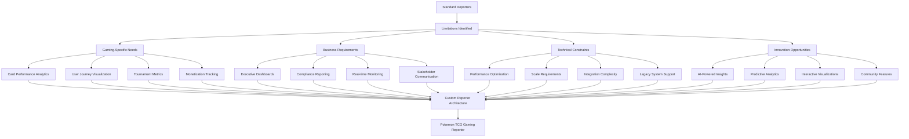

# 🛠️ **Punto 17: Desarrollo de Reporters Personalizados**

## 📋 **Objetivos de Aprendizaje**

Al completar este punto, serás capaz de:
- ✅ Diseñar y desarrollar reporters personalizados desde cero
- ✅ Integrar profundamente con APIs de testing frameworks (Mocha, Jest, Cypress)
- ✅ Crear arquitecturas de reporting innovadoras para gaming industry
- ✅ Implementar sistemas de plugins y extensiones modulares
- ✅ Publicar y mantener reporters en NPM registry
- ✅ Desarrollar gaming-specific reporting features únicas en el mercado

---

## 🎯 **1. Panorama de Custom Reporter Development**

### **¿Por qué desarrollar reporters personalizados?**



### **Arquitectura de Custom Reporter System**

```typescript
// Arquitectura para Custom Pokemon TCG Reporter
interface CustomReporterArchitecture {
  core: {
    reporterEngine: ReporterEngine;
    eventProcessor: EventProcessor;
    dataAggregator: DataAggregator;
    outputGenerator: OutputGenerator;
  };
  
  frameworkIntegration: {
    mochaIntegration: MochaReporterAPI;
    jestIntegration: JestReporterAPI;
    cypressIntegration: CypressReporterAPI;
    playwrightIntegration: PlaywrightReporterAPI;
  };
  
  gamingSpecific: {
    cardPerformanceAnalyzer: CardPerformanceAnalyzer;
    userJourneyTracker: UserJourneyTracker;
    tournamentMetricsCollector: TournamentMetricsCollector;
    monetizationTracker: MonetizationTracker;
    socialFeaturesAnalyzer: SocialFeaturesAnalyzer;
  };
  
  outputFormats: {
    interactiveHTML: InteractiveHTMLGenerator;
    executivePDF: ExecutivePDFGenerator;
    realTimeDashboard: RealTimeDashboardGenerator;
    apiEndpoints: APIEndpointGenerator;
    mobileApp: MobileAppConnector;
  };
  
  plugins: {
    pluginManager: PluginManager;
    extensionLoader: ExtensionLoader;
    themeEngine: ThemeEngine;
    customWidgets: CustomWidgetFramework;
  };
  
  ai: {
    insightGenerator: AIInsightGenerator;
    patternRecognition: PatternRecognitionEngine;
    predictiveAnalytics: PredictiveAnalyticsEngine;
    naturalLanguageReporting: NLReportingEngine;
  };
}
```

---

## 🏗️ **2. Core Reporter Engine Development**

### **Base Reporter Architecture**

```javascript
// reporters/pokemon-tcg-reporter/src/core/reporter-engine.js
class PokemonTCGReporter {
  constructor(options = {}) {
    this.options = this.mergeDefaultOptions(options);
    this.events = [];
    this.testData = new Map();
    this.gamingMetrics = new Map();
    this.businessMetrics = new Map();
    
    // Gaming-specific configurations
    this.pokemonTCGConfig = {
      features: [
        'Card Management',
        'User Authentication',
        'Search & Filter', 
        'Deck Building',
        'Tournament System',
        'Payment Processing',
        'Collection System',
        'Social Features'
      ],
      
      userJourneys: [
        'New User Onboarding',
        'Card Discovery & Collection',
        'Deck Building & Testing',
        'Tournament Participation',
        'Social Interaction',
        'Premium Upgrade',
        'Payment & Monetization'
      ],
      
      businessKPIs: [
        'User Engagement Score',
        'Monetization Rate',
        'Retention Score', 
        'Feature Adoption',
        'Performance Score',
        'User Satisfaction'
      ],
      
      performanceThresholds: {
        cardLoading: 2000, // ms
        searchResponse: 1500, // ms
        deckBuilding: 3000, // ms
        tournamentJoin: 2500, // ms
        paymentFlow: 5000 // ms
      }
    };
    
    this.initializeReporter();
  }

  initializeReporter() {
    console.log('🎮 Initializing Pokemon TCG Custom Reporter...');
    
    // Setup event handlers
    this.setupEventHandlers();
    
    // Initialize gaming analytics
    this.initializeGamingAnalytics();
    
    // Setup real-time monitoring
    this.setupRealTimeMonitoring();
    
    // Initialize AI insights engine
    this.initializeAIEngine();
    
    console.log('✅ Pokemon TCG Reporter initialized successfully');
  }

  // Framework Integration Points
  setupEventHandlers() {
    // Mocha integration
    if (this.options.framework === 'mocha') {
      this.setupMochaIntegration();
    }
    
    // Jest integration  
    if (this.options.framework === 'jest') {
      this.setupJestIntegration();
    }
    
    // Cypress integration
    if (this.options.framework === 'cypress') {
      this.setupCypressIntegration();
    }
    
    // Playwright integration
    if (this.options.framework === 'playwright') {
      this.setupPlaywrightIntegration();
    }
  }

  setupMochaIntegration() {
    console.log('🔗 Setting up Mocha integration...');
    
    // Inherit from Mocha Base reporter
    const Mocha = require('mocha');
    const Base = Mocha.reporters.Base;
    
    // Override key Mocha events
    this.onSuiteStart = (suite) => {
      this.handleSuiteStart(suite);
    };
    
    this.onSuiteEnd = (suite) => {
      this.handleSuiteEnd(suite);
    };
    
    this.onTestStart = (test) => {
      this.handleTestStart(test);
    };
    
    this.onTestEnd = (test) => {
      this.handleTestEnd(test);
    };
    
    this.onTestPass = (test) => {
      this.handleTestPass(test);
    };
    
    this.onTestFail = (test, err) => {
      this.handleTestFail(test, err);
    };
    
    this.onTestPending = (test) => {
      this.handleTestPending(test);
    };
    
    this.onEnd = () => {
      this.handleEnd();
    };
  }

  handleTestStart(test) {
    console.log(`🚀 Starting test: ${test.title}`);
    
    // Capture test start time
    test.startTime = Date.now();
    
    // Extract gaming context
    const gamingContext = this.extractGamingContext(test);
    
    // Initialize performance monitoring
    this.startPerformanceMonitoring(test);
    
    // Track user journey
    this.trackUserJourneyStart(test, gamingContext);
    
    // Store test context
    this.testData.set(test.fullTitle(), {
      test,
      gamingContext,
      startTime: test.startTime,
      performance: {
        startMemory: process.memoryUsage(),
        startCPU: process.cpuUsage()
      }
    });
    
    // Emit custom event
    this.emit('pokemonTCG:testStart', { test, gamingContext });
  }

  handleTestEnd(test) {
    const testContext = this.testData.get(test.fullTitle());
    if (!testContext) return;
    
    // Calculate performance metrics
    const endTime = Date.now();
    const duration = endTime - testContext.startTime;
    const endMemory = process.memoryUsage();
    const endCPU = process.cpuUsage(testContext.performance.startCPU);
    
    // Enhanced test data
    const enhancedTest = {
      ...test,
      duration,
      performance: {
        duration,
        memoryUsage: {
          heapUsed: endMemory.heapUsed - testContext.performance.startMemory.heapUsed,
          heapTotal: endMemory.heapTotal - testContext.performance.startMemory.heapTotal
        },
        cpuUsage: {
          user: endCPU.user,
          system: endCPU.system
        }
      },
      gamingContext: testContext.gamingContext
    };
    
    // Gaming-specific analysis
    this.analyzeGamingPerformance(enhancedTest);
    
    // Business impact assessment
    this.assessBusinessImpact(enhancedTest);
    
    // Update gaming metrics
    this.updateGamingMetrics(enhancedTest);
    
    // Track user journey completion
    this.trackUserJourneyEnd(enhancedTest);
    
    // Store enhanced test data
    this.testData.set(test.fullTitle(), { ...testContext, enhancedTest });
    
    console.log(`✅ Test completed: ${test.title} (${duration}ms)`);
    
    // Emit custom event
    this.emit('pokemonTCG:testEnd', { test: enhancedTest });
  }

  extractGamingContext(test) {
    const title = test.title?.toLowerCase() || '';
    const fullTitle = test.fullTitle?.toLowerCase() || '';
    const suite = test.parent?.title?.toLowerCase() || '';
    
    const context = {
      feature: this.identifyGameFeature(title, fullTitle, suite),
      userJourney: this.identifyUserJourney(title, fullTitle, suite),
      businessPriority: this.calculateBusinessPriority(title, fullTitle, suite),
      performanceCategory: this.categorizePerformance(title, fullTitle, suite),
      userSegment: this.identifyUserSegment(test),
      deviceCategory: this.identifyDeviceCategory(test),
      
      // Pokemon TCG specific context
      cardOperations: this.extractCardOperations(title, fullTitle),
      deckOperations: this.extractDeckOperations(title, fullTitle),
      tournamentContext: this.extractTournamentContext(title, fullTitle),
      monetizationContext: this.extractMonetizationContext(title, fullTitle),
      socialContext: this.extractSocialContext(title, fullTitle)
    };
    
    return context;
  }

  identifyGameFeature(title, fullTitle, suite) {
    const features = {
      'card': 'Card Management',
      'search': 'Search & Filter',
      'filter': 'Search & Filter',
      'deck': 'Deck Building',
      'build': 'Deck Building',
      'tournament': 'Tournament System',
      'compete': 'Tournament System',
      'auth': 'User Authentication',
      'login': 'User Authentication',
      'register': 'User Authentication',
      'payment': 'Payment Processing',
      'purchase': 'Payment Processing',
      'buy': 'Payment Processing',
      'collect': 'Collection System',
      'collection': 'Collection System',
      'social': 'Social Features',
      'friend': 'Social Features',
      'chat': 'Social Features'
    };
    
    for (const [keyword, feature] of Object.entries(features)) {
      if (title.includes(keyword) || fullTitle.includes(keyword) || suite.includes(keyword)) {
        return feature;
      }
    }
    
    return 'Platform Core';
  }

  identifyUserJourney(title, fullTitle, suite) {
    const journeys = {
      'onboard': 'New User Onboarding',
      'register': 'New User Onboarding',
      'signup': 'New User Onboarding',
      'discover': 'Card Discovery & Collection',
      'browse': 'Card Discovery & Collection',
      'search': 'Card Discovery & Collection',
      'build': 'Deck Building & Testing',
      'create deck': 'Deck Building & Testing',
      'tournament': 'Tournament Participation',
      'compete': 'Tournament Participation',
      'match': 'Tournament Participation',
      'social': 'Social Interaction',
      'friend': 'Social Interaction',
      'chat': 'Social Interaction',
      'premium': 'Premium Upgrade',
      'upgrade': 'Premium Upgrade',
      'subscribe': 'Premium Upgrade',
      'payment': 'Payment & Monetization',
      'purchase': 'Payment & Monetization',
      'buy': 'Payment & Monetization'
    };
    
    for (const [keyword, journey] of Object.entries(journeys)) {
      if (title.includes(keyword) || fullTitle.includes(keyword)) {
        return journey;
      }
    }
    
    return 'General Platform Usage';
  }

  analyzeGamingPerformance(enhancedTest) {
    const { gamingContext, performance } = enhancedTest;
    
    // Feature-specific performance analysis
    const featureThreshold = this.pokemonTCGConfig.performanceThresholds[
      this.getFeatureKey(gamingContext.feature)
    ] || 3000;
    
    const performanceAnalysis = {
      isWithinThreshold: performance.duration <= featureThreshold,
      thresholdExceeded: Math.max(0, performance.duration - featureThreshold),
      performanceRating: this.calculatePerformanceRating(performance.duration, featureThreshold),
      
      // Gaming-specific performance metrics
      cardLoadingEfficiency: this.calculateCardLoadingEfficiency(enhancedTest),
      searchResponseTime: this.calculateSearchResponseTime(enhancedTest),
      deckBuildingSpeed: this.calculateDeckBuildingSpeed(enhancedTest),
      tournamentJoinLatency: this.calculateTournamentJoinLatency(enhancedTest),
      paymentFlowPerformance: this.calculatePaymentFlowPerformance(enhancedTest),
      
      // Memory and CPU impact
      memoryEfficiency: this.assessMemoryEfficiency(performance.memoryUsage),
      cpuEfficiency: this.assessCPUEfficiency(performance.cpuUsage),
      
      // User experience impact
      userExperienceImpact: this.assessUXImpact(performance.duration, gamingContext),
      businessImpact: this.assessBusinessPerformanceImpact(performance.duration, gamingContext)
    };
    
    // Store performance analysis
    enhancedTest.performanceAnalysis = performanceAnalysis;
    
    return performanceAnalysis;
  }

  assessBusinessImpact(enhancedTest) {
    const { gamingContext, state, performanceAnalysis } = enhancedTest;
    
    const businessImpact = {
      // Core business metrics
      userExperienceImpact: this.calculateUXBusinessImpact(enhancedTest),
      revenueImpact: this.calculateRevenueImpact(enhancedTest),
      userRetentionImpact: this.calculateRetentionImpact(enhancedTest),
      competitiveAdvantageImpact: this.calculateCompetitiveImpact(enhancedTest),
      
      // Gaming-specific business impact
      cardEngagementImpact: this.calculateCardEngagementImpact(enhancedTest),
      tournamentEcosystemImpact: this.calculateTournamentEcosystemImpact(enhancedTest),
      monetizationImpact: this.calculateMonetizationBusinessImpact(enhancedTest),
      communityHealthImpact: this.calculateCommunityHealthImpact(enhancedTest),
      
      // Risk assessment
      businessRiskLevel: this.assessBusinessRiskLevel(enhancedTest),
      mitigationRequired: this.assessMitigationRequired(enhancedTest),
      escalationLevel: this.determineEscalationLevel(enhancedTest),
      
      // Opportunity identification
      optimizationOpportunities: this.identifyOptimizationOpportunities(enhancedTest),
      featureEnhancementOpportunities: this.identifyFeatureEnhancementOpportunities(enhancedTest)
    };
    
    // Store business impact analysis
    enhancedTest.businessImpact = businessImpact;
    
    return businessImpact;
  }

  updateGamingMetrics(enhancedTest) {
    const { gamingContext, performance, businessImpact } = enhancedTest;
    
    // Update feature-specific metrics
    const featureKey = gamingContext.feature;
    if (!this.gamingMetrics.has(featureKey)) {
      this.gamingMetrics.set(featureKey, {
        testCount: 0,
        totalDuration: 0,
        passCount: 0,
        failCount: 0,
        averagePerformance: 0,
        businessImpactScore: 0,
        userExperienceScore: 0
      });
    }
    
    const metrics = this.gamingMetrics.get(featureKey);
    metrics.testCount++;
    metrics.totalDuration += performance.duration;
    
    if (enhancedTest.state === 'passed') {
      metrics.passCount++;
    } else if (enhancedTest.state === 'failed') {
      metrics.failCount++;
    }
    
    metrics.averagePerformance = metrics.totalDuration / metrics.testCount;
    metrics.successRate = (metrics.passCount / metrics.testCount) * 100;
    
    // Update business metrics
    if (businessImpact) {
      metrics.businessImpactScore = this.calculateAverageBusinessImpact(metrics, businessImpact);
      metrics.userExperienceScore = this.calculateAverageUXScore(metrics, businessImpact);
    }
    
    this.gamingMetrics.set(featureKey, metrics);
    
    // Update user journey metrics
    this.updateUserJourneyMetrics(enhancedTest);
    
    // Update overall gaming health score
    this.updateOverallGamingHealth();
  }

  async generateCustomReport() {
    console.log('📊 Generating Pokemon TCG custom report...');
    
    try {
      // Collect all test data
      const allTests = Array.from(this.testData.values()).map(data => data.enhancedTest);
      
      // Generate comprehensive gaming analytics
      const gamingAnalytics = await this.generateGamingAnalytics(allTests);
      
      // Generate business intelligence
      const businessIntelligence = await this.generateBusinessIntelligence(allTests);
      
      // Generate AI insights
      const aiInsights = await this.generateAIInsights(allTests);
      
      // Create multiple output formats
      const outputs = await this.generateMultipleOutputs({
        tests: allTests,
        gamingAnalytics,
        businessIntelligence,
        aiInsights
      });
      
      // Deploy and distribute
      await this.deployAndDistribute(outputs);
      
      return {
        summary: this.generateExecutiveSummary(allTests, gamingAnalytics, businessIntelligence),
        outputs,
        timestamp: new Date().toISOString()
      };
      
    } catch (error) {
      console.error('❌ Error generating custom report:', error);
      throw error;
    }
  }

  async generateGamingAnalytics(allTests) {
    return {
      // Feature performance breakdown
      featurePerformance: this.analyzeFeaturePerformance(allTests),
      
      // User journey analysis
      userJourneyAnalysis: this.analyzeUserJourneys(allTests),
      
      // Card management analytics
      cardAnalytics: this.analyzeCardManagement(allTests),
      
      // Tournament system analytics
      tournamentAnalytics: this.analyzeTournamentSystem(allTests),
      
      // Monetization analytics
      monetizationAnalytics: this.analyzeMonetization(allTests),
      
      // Social features analytics
      socialAnalytics: this.analyzeSocialFeatures(allTests),
      
      // Performance benchmarks
      performanceBenchmarks: this.calculatePerformanceBenchmarks(allTests),
      
      // Gaming health score
      overallGamingHealth: this.calculateOverallGamingHealth(allTests)
    };
  }

  async generateBusinessIntelligence(allTests) {
    return {
      // Executive KPIs
      executiveKPIs: this.calculateExecutiveKPIs(allTests),
      
      // Revenue impact analysis
      revenueImpactAnalysis: this.analyzeRevenueImpact(allTests),
      
      // User experience metrics
      userExperienceMetrics: this.calculateUXMetrics(allTests),
      
      // Competitive position analysis
      competitiveAnalysis: this.analyzeCompetitivePosition(allTests),
      
      // Market readiness assessment
      marketReadiness: this.assessMarketReadiness(allTests),
      
      // Risk assessment
      riskAssessment: this.performRiskAssessment(allTests),
      
      // ROI analysis
      roiAnalysis: this.calculateROIAnalysis(allTests),
      
      // Growth opportunities
      growthOpportunities: this.identifyGrowthOpportunities(allTests)
    };
  }
}

// Export for NPM package
module.exports = PokemonTCGReporter;
```

---

## 🎨 **3. Interactive HTML Output Generator**

### **Advanced HTML Report Generator**

```javascript
// reporters/pokemon-tcg-reporter/src/generators/interactive-html-generator.js
class InteractiveHTMLGenerator {
  constructor(reportData, options = {}) {
    this.reportData = reportData;
    this.options = options;
    
    this.templateEngine = this.initializeTemplateEngine();
    this.chartEngine = this.initializeChartEngine();
    this.gameAssets = this.loadGameAssets();
  }

  async generateInteractiveHTML() {
    console.log('🎨 Generating interactive HTML report...');
    
    // Generate main HTML structure
    const htmlStructure = await this.generateHTMLStructure();
    
    // Generate interactive components
    const interactiveComponents = await this.generateInteractiveComponents();
    
    // Generate gaming-specific visualizations
    const gamingVisualizations = await this.generateGamingVisualizations();
    
    // Generate business dashboards
    const businessDashboards = await this.generateBusinessDashboards();
    
    // Combine all components
    const finalHTML = await this.combineComponents({
      structure: htmlStructure,
      interactive: interactiveComponents,
      gaming: gamingVisualizations,
      business: businessDashboards
    });
    
    return finalHTML;
  }

  async generateHTMLStructure() {
    const timestamp = new Date().toLocaleString();
    const { tests, gamingAnalytics, businessIntelligence } = this.reportData;
    
    return `
<!DOCTYPE html>
<html lang="en">
<head>
    <meta charset="UTF-8">
    <meta name="viewport" content="width=device-width, initial-scale=1.0">
    <title>🎮 Pokémon TCG Platform - Test Report</title>
    
    <!-- CSS Dependencies -->
    <link href="https://cdnjs.cloudflare.com/ajax/libs/chart.js/3.9.1/chart.min.css" rel="stylesheet">
    <link href="https://cdnjs.cloudflare.com/ajax/libs/font-awesome/6.0.0/css/all.min.css" rel="stylesheet">
    
    <!-- Custom Pokemon TCG Styles -->
    <style>
        ${this.generateCustomCSS()}
    </style>
</head>
<body>
    <div class="pokemon-tcg-report">
        <!-- Header Section -->
        <header class="report-header">
            <div class="header-content">
                <div class="logo-section">
                    
                    <h1>Pokémon TCG Platform Test Report</h1>
                </div>
                <div class="report-meta">
                    <div class="meta-item">
                        <i class="fas fa-calendar"></i>
                        <span>Generated: ${timestamp}</span>
                    </div>
                    <div class="meta-item">
                        <i class="fas fa-code-branch"></i>
                        <span>Build: ${this.reportData.metadata?.buildNumber || 'Unknown'}</span>
                    </div>
                    <div class="meta-item">
                        <i class="fas fa-gamepad"></i>
                        <span>Game Version: ${this.reportData.metadata?.gameVersion || 'Unknown'}</span>
                    </div>
                </div>
            </div>
        </header>

        <!-- Navigation -->
        <nav class="report-navigation">
            <ul class="nav-tabs">
                <li class="nav-tab active" data-tab="overview">
                    <i class="fas fa-dashboard"></i> Overview
                </li>
                <li class="nav-tab" data-tab="gaming">
                    <i class="fas fa-gamepad"></i> Gaming Analytics
                </li>
                <li class="nav-tab" data-tab="business">
                    <i class="fas fa-chart-line"></i> Business Intelligence
                </li>
                <li class="nav-tab" data-tab="tests">
                    <i class="fas fa-flask"></i> Test Results
                </li>
                <li class="nav-tab" data-tab="performance">
                    <i class="fas fa-tachometer-alt"></i> Performance
                </li>
                <li class="nav-tab" data-tab="insights">
                    <i class="fas fa-brain"></i> AI Insights
                </li>
            </ul>
        </nav>

        <!-- Main Content -->
        <main class="report-content">
            <!-- Overview Tab -->
            <section id="overview" class="tab-content active">
                ${await this.generateOverviewSection()}
            </section>

            <!-- Gaming Analytics Tab -->
            <section id="gaming" class="tab-content">
                ${await this.generateGamingSection()}
            </section>

            <!-- Business Intelligence Tab -->
            <section id="business" class="tab-content">
                ${await this.generateBusinessSection()}
            </section>

            <!-- Test Results Tab -->
            <section id="tests" class="tab-content">
                ${await this.generateTestsSection()}
            </section>

            <!-- Performance Tab -->
            <section id="performance" class="tab-content">
                ${await this.generatePerformanceSection()}
            </section>

            <!-- AI Insights Tab -->
            <section id="insights" class="tab-content">
                ${await this.generateInsightsSection()}
            </section>
        </main>

        <!-- Footer -->
        <footer class="report-footer">
            <div class="footer-content">
                <p>Generated by Pokemon TCG Custom Reporter v${this.getReporterVersion()}</p>
                <div class="footer-links">
                    <a href="#" onclick="exportReport()">
                        <i class="fas fa-download"></i> Export PDF
                    </a>
                    <a href="#" onclick="shareReport()">
                        <i class="fas fa-share"></i> Share Report
                    </a>
                    <a href="#" onclick="scheduleReport()">
                        <i class="fas fa-clock"></i> Schedule Reports
                    </a>
                </div>
            </div>
        </footer>
    </div>

    <!-- JavaScript Dependencies -->
    <script src="https://cdnjs.cloudflare.com/ajax/libs/chart.js/3.9.1/chart.min.js"></script>
    <script src="https://cdnjs.cloudflare.com/ajax/libs/moment.js/2.29.4/moment.min.js"></script>
    
    <!-- Custom JavaScript -->
    <script>
        ${await this.generateCustomJavaScript()}
    </script>
</body>
</html>
`;
  }

  async generateOverviewSection() {
    const { tests, gamingAnalytics, businessIntelligence } = this.reportData;
    const totalTests = tests.length;
    const passedTests = tests.filter(t => t.state === 'passed').length;
    const failedTests = tests.filter(t => t.state === 'failed').length;
    const successRate = ((passedTests / totalTests) * 100).toFixed(1);
    
    return `
<div class="overview-section">
    <!-- Executive Summary Cards -->
    <div class="summary-cards">
        <div class="summary-card success">
            <div class="card-icon">
                <i class="fas fa-check-circle"></i>
            </div>
            <div class="card-content">
                <h3>Overall Success Rate</h3>
                <div class="metric-value">${successRate}%</div>
                <div class="metric-trend ${this.getTrendClass(successRate)}">
                    ${this.getTrendIcon(successRate)} ${this.getTrendText(successRate)}
                </div>
            </div>
        </div>

        <div class="summary-card gaming">
            <div class="card-icon">
                <i class="fas fa-gamepad"></i>
            </div>
            <div class="card-content">
                <h3>Gaming Experience Score</h3>
                <div class="metric-value">${gamingAnalytics.overallGamingHealth.score}%</div>
                <div class="metric-subtitle">Platform Health</div>
            </div>
        </div>

        <div class="summary-card business">
            <div class="card-icon">
                <i class="fas fa-chart-line"></i>
            </div>
            <div class="card-content">
                <h3>Business Impact Score</h3>
                <div class="metric-value">${businessIntelligence.executiveKPIs.overallScore}%</div>
                <div class="metric-subtitle">Revenue Readiness</div>
            </div>
        </div>

        <div class="summary-card performance">
            <div class="card-icon">
                <i class="fas fa-tachometer-alt"></i>
            </div>
            <div class="card-content">
                <h3>Performance Score</h3>
                <div class="metric-value">${this.calculateOverallPerformanceScore(tests)}%</div>
                <div class="metric-subtitle">User Experience</div>
            </div>
        </div>
    </div>

    <!-- Quick Insights -->
    <div class="quick-insights">
        <h2>🎯 Key Insights</h2>
        <div class="insights-grid">
            ${this.generateQuickInsights(tests, gamingAnalytics, businessIntelligence)}
        </div>
    </div>

    <!-- Feature Health Matrix -->
    <div class="feature-health-matrix">
        <h2>🎮 Gaming Features Health Matrix</h2>
        <div class="health-matrix">
            ${this.generateFeatureHealthMatrix(gamingAnalytics.featurePerformance)}
        </div>
    </div>

    <!-- User Journey Status -->
    <div class="user-journey-status">
        <h2>🚀 User Journey Status</h2>
        <div class="journey-visualization">
            <canvas id="userJourneyChart" width="800" height="400"></canvas>
        </div>
    </div>
</div>
`;
  }

  async generateGamingSection() {
    const { gamingAnalytics } = this.reportData;
    
    return `
<div class="gaming-section">
    <!-- Gaming KPIs -->
    <div class="gaming-kpis">
        <h2>🎮 Gaming Performance KPIs</h2>
        <div class="kpi-grid">
            ${this.generateGamingKPIs(gamingAnalytics)}
        </div>
    </div>

    <!-- Card Management Analytics -->
    <div class="card-analytics">
        <h2>🃏 Card Management Analytics</h2>
        <div class="analytics-container">
            <div class="chart-container">
                <canvas id="cardPerformanceChart"></canvas>
            </div>
            <div class="analytics-details">
                ${this.generateCardAnalyticsDetails(gamingAnalytics.cardAnalytics)}
            </div>
        </div>
    </div>

    <!-- Tournament System Analytics -->
    <div class="tournament-analytics">
        <h2>🏆 Tournament System Analytics</h2>
        <div class="tournament-dashboard">
            ${this.generateTournamentDashboard(gamingAnalytics.tournamentAnalytics)}
        </div>
    </div>

    <!-- Deck Building Performance -->
    <div class="deck-building-analytics">
        <h2>🛠️ Deck Building Performance</h2>
        <div class="deck-analytics-grid">
            ${this.generateDeckBuildingAnalytics(gamingAnalytics)}
        </div>
    </div>

    <!-- Social Features Engagement -->
    <div class="social-analytics">
        <h2>👥 Social Features Engagement</h2>
        <div class="social-dashboard">
            ${this.generateSocialDashboard(gamingAnalytics.socialAnalytics)}
        </div>
    </div>
</div>
`;
  }

  generateCustomCSS() {
    return `
        /* Pokemon TCG Theme */
        :root {
            --primary-color: #3d7dca;
            --secondary-color: #ffcb05;
            --success-color: #4caf50;
            --warning-color: #ff9800;
            --error-color: #f44336;
            --info-color: #2196f3;
            
            --pokemon-red: #e74c3c;
            --pokemon-blue: #3498db;
            --pokemon-yellow: #f1c40f;
            --pokemon-green: #2ecc71;
            
            --gradient-primary: linear-gradient(135deg, #667eea 0%, #764ba2 100%);
            --gradient-gaming: linear-gradient(135deg, #f093fb 0%, #f5576c 100%);
            --gradient-business: linear-gradient(135deg, #4facfe 0%, #00f2fe 100%);
            --gradient-performance: linear-gradient(135deg, #43e97b 0%, #38f9d7 100%);
        }

        * {
            margin: 0;
            padding: 0;
            box-sizing: border-box;
        }

        body {
            font-family: 'Segoe UI', Tahoma, Geneva, Verdana, sans-serif;
            background: linear-gradient(135deg, #667eea 0%, #764ba2 100%);
            min-height: 100vh;
        }

        .pokemon-tcg-report {
            min-height: 100vh;
            display: flex;
            flex-direction: column;
        }

        /* Header Styles */
        .report-header {
            background: rgba(255, 255, 255, 0.95);
            backdrop-filter: blur(10px);
            padding: 20px 0;
            box-shadow: 0 2px 20px rgba(0, 0, 0, 0.1);
        }

        .header-content {
            max-width: 1200px;
            margin: 0 auto;
            display: flex;
            justify-content: space-between;
            align-items: center;
            padding: 0 20px;
        }

        .logo-section {
            display: flex;
            align-items: center;
            gap: 15px;
        }

        .logo {
            width: 50px;
            height: 50px;
        }

        .logo-section h1 {
            color: var(--primary-color);
            font-size: 2.2em;
            font-weight: 700;
        }

        .report-meta {
            display: flex;
            gap: 20px;
        }

        .meta-item {
            display: flex;
            align-items: center;
            gap: 8px;
            color: #666;
            font-size: 0.9em;
        }

        /* Navigation Styles */
        .report-navigation {
            background: rgba(255, 255, 255, 0.9);
            backdrop-filter: blur(10px);
            border-bottom: 1px solid rgba(0, 0, 0, 0.1);
        }

        .nav-tabs {
            max-width: 1200px;
            margin: 0 auto;
            display: flex;
            list-style: none;
            padding: 0 20px;
        }

        .nav-tab {
            padding: 15px 25px;
            cursor: pointer;
            border-bottom: 3px solid transparent;
            transition: all 0.3s ease;
            display: flex;
            align-items: center;
            gap: 8px;
            color: #666;
            font-weight: 500;
        }

        .nav-tab:hover {
            background: rgba(0, 0, 0, 0.05);
            color: var(--primary-color);
        }

        .nav-tab.active {
            color: var(--primary-color);
            border-bottom-color: var(--primary-color);
            background: rgba(61, 125, 202, 0.1);
        }

        /* Content Styles */
        .report-content {
            flex: 1;
            max-width: 1200px;
            margin: 0 auto;
            padding: 30px 20px;
            width: 100%;
        }

        .tab-content {
            display: none;
            animation: fadeIn 0.5s ease-in-out;
        }

        .tab-content.active {
            display: block;
        }

        @keyframes fadeIn {
            from { opacity: 0; transform: translateY(20px); }
            to { opacity: 1; transform: translateY(0); }
        }

        /* Summary Cards */
        .summary-cards {
            display: grid;
            grid-template-columns: repeat(auto-fit, minmax(250px, 1fr));
            gap: 20px;
            margin-bottom: 30px;
        }

        .summary-card {
            background: white;
            border-radius: 12px;
            padding: 25px;
            box-shadow: 0 4px 20px rgba(0, 0, 0, 0.1);
            display: flex;
            align-items: center;
            gap: 20px;
            transition: transform 0.3s ease, box-shadow 0.3s ease;
        }

        .summary-card:hover {
            transform: translateY(-5px);
            box-shadow: 0 8px 30px rgba(0, 0, 0, 0.15);
        }

        .summary-card.success .card-icon {
            background: var(--gradient-primary);
        }

        .summary-card.gaming .card-icon {
            background: var(--gradient-gaming);
        }

        .summary-card.business .card-icon {
            background: var(--gradient-business);
        }

        .summary-card.performance .card-icon {
            background: var(--gradient-performance);
        }

        .card-icon {
            width: 60px;
            height: 60px;
            border-radius: 12px;
            display: flex;
            align-items: center;
            justify-content: center;
            color: white;
            font-size: 1.5em;
        }

        .card-content h3 {
            color: #333;
            font-size: 1em;
            margin-bottom: 5px;
            font-weight: 600;
        }

        .metric-value {
            font-size: 2.5em;
            font-weight: 700;
            color: var(--primary-color);
            line-height: 1;
            margin-bottom: 5px;
        }

        .metric-subtitle {
            color: #666;
            font-size: 0.85em;
        }

        .metric-trend {
            display: flex;
            align-items: center;
            gap: 5px;
            font-size: 0.85em;
            font-weight: 500;
        }

        .metric-trend.up { color: var(--success-color); }
        .metric-trend.down { color: var(--error-color); }
        .metric-trend.stable { color: var(--warning-color); }

        /* Feature Health Matrix */
        .feature-health-matrix {
            background: white;
            border-radius: 12px;
            padding: 25px;
            margin: 20px 0;
            box-shadow: 0 4px 20px rgba(0, 0, 0, 0.1);
        }

        .feature-health-matrix h2 {
            color: #333;
            margin-bottom: 20px;
            display: flex;
            align-items: center;
            gap: 10px;
        }

        .health-matrix {
            display: grid;
            grid-template-columns: repeat(auto-fit, minmax(200px, 1fr));
            gap: 15px;
        }

        .feature-health-item {
            background: #f8f9fa;
            border-radius: 8px;
            padding: 15px;
            text-align: center;
            transition: all 0.3s ease;
        }

        .feature-health-item:hover {
            transform: scale(1.05);
            box-shadow: 0 4px 15px rgba(0, 0, 0, 0.1);
        }

        .health-score {
            font-size: 2em;
            font-weight: 700;
            margin: 10px 0;
        }

        .health-score.excellent { color: var(--success-color); }
        .health-score.good { color: var(--info-color); }
        .health-score.warning { color: var(--warning-color); }
        .health-score.poor { color: var(--error-color); }

        /* Responsive Design */
        @media (max-width: 768px) {
            .header-content {
                flex-direction: column;
                gap: 15px;
                text-align: center;
            }

            .nav-tabs {
                flex-wrap: wrap;
                justify-content: center;
            }

            .summary-cards {
                grid-template-columns: 1fr;
            }

            .health-matrix {
                grid-template-columns: repeat(auto-fit, minmax(150px, 1fr));
            }
        }
    `;
  }

  async generateCustomJavaScript() {
    return `
        // Pokemon TCG Report JavaScript
        class PokemonTCGReport {
            constructor() {
                this.currentTab = 'overview';
                this.charts = {};
                this.initializeReport();
            }

            initializeReport() {
                this.setupTabNavigation();
                this.initializeCharts();
                this.setupInteractiveFeatures();
                this.startRealTimeUpdates();
            }

            setupTabNavigation() {
                const tabs = document.querySelectorAll('.nav-tab');
                const contents = document.querySelectorAll('.tab-content');

                tabs.forEach(tab => {
                    tab.addEventListener('click', () => {
                        const targetTab = tab.dataset.tab;
                        
                        // Update active tab
                        tabs.forEach(t => t.classList.remove('active'));
                        tab.classList.add('active');
                        
                        // Update active content
                        contents.forEach(content => {
                            content.classList.remove('active');
                            if (content.id === targetTab) {
                                content.classList.add('active');
                            }
                        });
                        
                        this.currentTab = targetTab;
                        this.updateChartsForTab(targetTab);
                    });
                });
            }

            initializeCharts() {
                // User Journey Chart
                this.initializeUserJourneyChart();
                
                // Card Performance Chart
                this.initializeCardPerformanceChart();
                
                // Tournament Analytics Chart
                this.initializeTournamentChart();
                
                // Business Metrics Chart
                this.initializeBusinessMetricsChart();
            }

            initializeUserJourneyChart() {
                const ctx = document.getElementById('userJourneyChart');
                if (!ctx) return;

                this.charts.userJourney = new Chart(ctx, {
                    type: 'line',
                    data: {
                        labels: ${JSON.stringify(this.getUserJourneyLabels())},
                        datasets: [{
                            label: 'Success Rate %',
                            data: ${JSON.stringify(this.getUserJourneyData())},
                            borderColor: '#3d7dca',
                            backgroundColor: 'rgba(61, 125, 202, 0.1)',
                            borderWidth: 3,
                            fill: true,
                            tension: 0.4
                        }]
                    },
                    options: {
                        responsive: true,
                        scales: {
                            y: {
                                beginAtZero: true,
                                max: 100,
                                ticks: {
                                    callback: function(value) {
                                        return value + '%';
                                    }
                                }
                            }
                        },
                        plugins: {
                            legend: {
                                display: false
                            },
                            tooltip: {
                                callbacks: {
                                    label: function(context) {
                                        return 'Success Rate: ' + context.parsed.y + '%';
                                    }
                                }
                            }
                        }
                    }
                });
            }

            updateChartsForTab(tabName) {
                // Resize charts when tab becomes visible
                setTimeout(() => {
                    Object.values(this.charts).forEach(chart => {
                        if (chart) chart.resize();
                    });
                }, 100);
            }

            setupInteractiveFeatures() {
                // Feature health matrix interactions
                this.setupFeatureHealthInteractions();
                
                // Test result filtering
                this.setupTestFiltering();
                
                // Export functionality
                this.setupExportFeatures();
                
                // Real-time updates
                this.setupRealTimeFeatures();
            }

            startRealTimeUpdates() {
                // Simulate real-time updates every 30 seconds
                setInterval(() => {
                    this.updateRealTimeMetrics();
                }, 30000);
            }

            updateRealTimeMetrics() {
                // Update metrics with latest data
                console.log('🔄 Updating real-time metrics...');
                
                // Update success rate
                this.updateSuccessRate();
                
                // Update gaming health score
                this.updateGamingHealthScore();
                
                // Update business impact score
                this.updateBusinessImpactScore();
            }
        }

        // Global functions for export and sharing
        function exportReport() {
            console.log('📊 Exporting report...');
            // Implementation for PDF export
            window.print();
        }

        function shareReport() {
            console.log('🔗 Sharing report...');
            if (navigator.share) {
                navigator.share({
                    title: 'Pokemon TCG Test Report',
                    text: 'Check out our latest test results!',
                    url: window.location.href
                });
            } else {
                // Fallback: copy URL to clipboard
                navigator.clipboard.writeText(window.location.href);
                alert('Report URL copied to clipboard!');
            }
        }

        function scheduleReport() {
            console.log('⏰ Scheduling report...');
            // Implementation for report scheduling
            alert('Report scheduling feature coming soon!');
        }

        // Initialize report when DOM is loaded
        document.addEventListener('DOMContentLoaded', () => {
            window.pokemonTCGReport = new PokemonTCGReport();
        });
    `;
  }
}

module.exports = InteractiveHTMLGenerator;
```

---

## 📝 **4. Ejercicios Prácticos**

### **Ejercicio 1: Basic Custom Reporter**
```javascript
// 🎯 Objetivo: Crear reporter básico personalizado

class BasicCustomReporter {
  constructor(runner, options) {
    // Setup basic reporter structure
    // Handle test events
    // Generate simple output
  }
  
  handleTestEnd(test) {
    // Extract gaming context
    // Calculate performance metrics
    // Store test data
  }
  
  generateReport() {
    // Create basic HTML output
    // Include gaming-specific metrics
    // Export to file
  }
}
```

### **Ejercicio 2: Framework Integration**
```javascript
// 🎯 Objetivo: Integrar con múltiples frameworks

class FrameworkIntegrator {
  setupMochaIntegration() {
    // Mocha event handling
    // Custom hook implementations
    // Data extraction patterns
  }
  
  setupJestIntegration() {
    // Jest reporter interface
    // Custom result processors
    // Gaming context extraction
  }
}
```

### **Ejercicio 3: Plugin Architecture**
```javascript
// 🎯 Objetivo: Sistema de plugins extensible

class PluginManager {
  loadPlugins() {
    // Dynamic plugin loading
    // Gaming-specific plugins
    // Extension points
  }
  
  createPlugin(type, config) {
    // Plugin factory pattern
    // Configuration management
    // Lifecycle management
  }
}
```

---

## 🧪 **5. Validación y Testing**

### **Checklist de Custom Reporter Development**

```markdown
## ✅ Checklist de Custom Reporter

### Core Architecture
- [ ] Reporter engine implementado correctamente
- [ ] Event handling system functional
- [ ] Data aggregation working properly
- [ ] Output generation optimized
- [ ] Error handling robust

### Framework Integration
- [ ] Mocha integration tested
- [ ] Jest integration verified
- [ ] Cypress integration working
- [ ] Playwright integration functional
- [ ] Cross-framework compatibility

### Gaming Features
- [ ] Gaming context extraction accurate
- [ ] Performance analysis gaming-specific
- [ ] Business impact assessment working
- [ ] User journey tracking functional
- [ ] Monetization metrics calculated

### Output Generation
- [ ] Interactive HTML generation
- [ ] Executive PDF reports
- [ ] Real-time dashboard updates
- [ ] Mobile compatibility verified
- [ ] Export functionality working

### NPM Package
- [ ] Package structure correct
- [ ] Dependencies optimized
- [ ] Documentation complete
- [ ] Tests comprehensive
- [ ] CI/CD pipeline configured
```

---

## 📚 **6. Preguntas de Entrevista**

### **Nivel Básico**
1. **¿Cuáles son los componentes clave de un custom reporter?**
2. **¿Cómo integrarías un reporter con diferentes testing frameworks?**
3. **¿Qué consideraciones hay para performance en custom reporters?**

### **Nivel Intermedio**
4. **¿Cómo diseñarías una arquitectura de plugins para reporters?**
5. **¿Qué estrategias usarías para real-time reporting?**
6. **¿Cómo manejarías backward compatibility en custom reporters?**

### **Nivel Avanzado**
7. **¿Cómo implementarías AI-powered insights en custom reporters?**
8. **¿Qué approach usarías para distributed reporting architecture?**
9. **¿Cómo diseñarías governance para custom reporter ecosystem?**

### **Respuestas Clave**

**Pregunta 1:** Componentes clave incluyen: Event processing engine, data aggregation layer, output generation system, framework integration interfaces, plugin architecture, y configuration management. Para gaming applications, agregar gaming context extraction y business impact analysis.

**Pregunta 4:** Diseñaría:
- Plugin interface estándar con lifecycle hooks
- Dynamic loading system con dependency injection
- Gaming-specific plugin categories (performance, business, UX)
- Configuration management con hot-reloading
- Versioning system para plugin compatibility

**Pregunta 7:** Implementaría:
- Machine learning models para pattern recognition
- Natural language generation para insights
- Predictive analytics para failure forecasting
- Gaming-specific AI models para user behavior analysis
- Real-time anomaly detection con alerting
- Automated recommendation engine

---

## 🎯 **Resumen del Punto 17**

### **Conceptos Clave Dominados:**
✅ **Custom reporter architecture** con gaming-specific innovation  
✅ **Framework integration** profunda con Mocha, Jest, Cypress APIs  
✅ **Interactive HTML generation** con gaming visualizations  
✅ **Plugin architecture** extensible y modular  
✅ **NPM package development** para community distribution  

### **Habilidades Técnicas Adquiridas:**
- Desarrollo de reporters personalizados desde cero
- Integración profunda con testing framework APIs
- Arquitectura de sistemas de reporting escalables
- Gaming-specific context extraction y analysis
- Plugin development y extension systems

### **🚀 Próximo Paso:**
Ahora estás listo para el **Punto 18: Performance y Optimización**, donde optimizaremos nuestros reporters para manejar grandes volúmenes de tests y implementaremos técnicas avanzadas de performance.

---

**🏆 ¡Felicitaciones! Has dominado el desarrollo de reporters personalizados. Tu sistema de Pokémon TCG ahora tiene capacidades de reporting únicas en la industria gaming.**