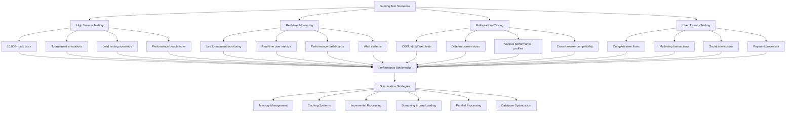

# ⚡ **Punto 18: Performance y Optimización**

## 📋 **Objetivos de Aprendizaje**

Al completar este punto, serás capaz de:
- ✅ Optimizar generación de reportes para grandes volúmenes de tests
- ✅ Implementar sistemas de caching inteligente y eficiente
- ✅ Desarrollar reportes incrementales para CI/CD pipelines
- ✅ Aplicar técnicas avanzadas de performance específicas para gaming
- ✅ Gestionar memoria y recursos en aplicaciones de testing masivo
- ✅ Implementar lazy loading y streaming para reportes grandes

---

## 🎯 **1. Performance Challenges en Gaming Test Reporting**

### **Scenarios de Gaming que Requieren Performance Optimization**



### **Performance Metrics for Pokemon TCG Platform**

```typescript
// Métricas específicas para optimización de performance gaming
interface PokemonTCGPerformanceMetrics {
  testExecution: {
    cardTestsPerSecond: number;
    memoryUsagePerTest: number;
    concurrentTestLimit: number;
    databaseQueriesPerTest: number;
  };
  
  reportGeneration: {
    htmlGenerationTime: number;
    jsonProcessingTime: number;
    chartRenderingTime: number;
    fileWriteTime: number;
  };
  
  dataProcessing: {
    aggregationTime: number;
    filteringPerformance: number;
    sortingEfficiency: number;
    searchResponseTime: number;
  };
  
  gamingSpecific: {
    cardImageLoadTime: number;
    deckBuildingAnalysisTime: number;
    tournamentDataProcessing: number;
    userJourneyCalculationTime: number;
  };
  
  systemResources: {
    cpuUsagePercentage: number;
    memoryConsumption: number;
    diskIOOperations: number;
    networkBandwidthUsage: number;
  };
  
  userExperience: {
    reportLoadTime: number;
    interactionResponseTime: number;
    dashboardRefreshTime: number;
    exportDownloadTime: number;
  };
}
```

---

## 🚀 **2. Optimización de Test Execution**

### **High-Performance Test Runner para Gaming**

```javascript
// reporters/pokemon-tcg-performance/src/optimized-test-runner.js
class OptimizedGameTestRunner {
  constructor(options = {}) {
    this.options = {
      maxConcurrency: options.maxConcurrency || 10,
      memoryThreshold: options.memoryThreshold || 500, // MB
      cacheSize: options.cacheSize || 1000, // items
      batchSize: options.batchSize || 100,
      streamingEnabled: options.streamingEnabled || true,
      ...options
    };
    
    // Performance monitoring
    this.performanceMonitor = new PerformanceMonitor();
    
    // Memory management
    this.memoryManager = new MemoryManager(this.options.memoryThreshold);
    
    // Caching system
    this.cache = new IntelligentCache(this.options.cacheSize);
    
    // Streaming processor
    this.streamProcessor = new StreamProcessor();
    
    // Database connection pool
    this.dbPool = new DatabasePool({
      maxConnections: 20,
      idleTimeout: 30000,
      acquireTimeout: 60000
    });
    
    // Gaming-specific optimizations
    this.gameOptimizer = new GameSpecificOptimizer();
    
    this.initializeRunner();
  }

  initializeRunner() {
    console.log('⚡ Initializing High-Performance Gaming Test Runner...');
    
    // Setup performance monitoring
    this.setupPerformanceMonitoring();
    
    // Initialize memory management
    this.initializeMemoryManagement();
    
    // Setup intelligent caching
    this.setupIntelligentCaching();
    
    // Configure streaming processing
    this.configureStreamingProcessing();
    
    // Initialize gaming optimizations
    this.initializeGamingOptimizations();
    
    console.log('✅ High-Performance Runner initialized');
  }

  async runOptimizedTestSuite(testSuite) {
    console.log(`🚀 Running optimized test suite: ${testSuite.name}`);
    
    try {
      // Performance baseline
      const startMetrics = await this.performanceMonitor.captureBaseline();
      
      // Pre-processing optimization
      const optimizedSuite = await this.optimizeTestSuite(testSuite);
      
      // Parallel execution with intelligent batching
      const results = await this.executeInOptimizedBatches(optimizedSuite);
      
      // Real-time processing with streaming
      const processedResults = await this.streamProcessResults(results);
      
      // Gaming-specific post-processing
      const gamingEnhancedResults = await this.enhanceWithGamingMetrics(processedResults);
      
      // Performance analysis
      const endMetrics = await this.performanceMonitor.captureMetrics();
      const performanceAnalysis = this.analyzePerformanceDelta(startMetrics, endMetrics);
      
      return {
        results: gamingEnhancedResults,
        performance: performanceAnalysis,
        optimization: this.generateOptimizationReport(performanceAnalysis)
      };
      
    } catch (error) {
      console.error('❌ Error in optimized test execution:', error);
      await this.handleOptimizationError(error);
      throw error;
    }
  }

  async optimizeTestSuite(testSuite) {
    console.log('🔧 Optimizing test suite for performance...');
    
    // Analyze test dependencies
    const dependencyGraph = await this.analyzeDependencies(testSuite);
    
    // Optimize execution order
    const optimizedOrder = this.optimizeExecutionOrder(dependencyGraph);
    
    // Group tests for batch processing
    const batchGroups = this.createOptimalBatches(optimizedOrder);
    
    // Pre-load gaming assets
    await this.preloadGamingAssets(testSuite);
    
    // Warm up caches
    await this.warmUpCaches(testSuite);
    
    return {
      originalSuite: testSuite,
      optimizedOrder,
      batchGroups,
      optimization: {
        dependencyOptimization: true,
        assetPreloading: true,
        cacheWarming: true,
        batchGrouping: true
      }
    };
  }

  async executeInOptimizedBatches(optimizedSuite) {
    const { batchGroups } = optimizedSuite;
    const allResults = [];
    
    console.log(`📦 Executing ${batchGroups.length} optimized batches...`);
    
    for (let i = 0; i < batchGroups.length; i++) {
      const batch = batchGroups[i];
      
      console.log(`⚡ Processing batch ${i + 1}/${batchGroups.length} (${batch.length} tests)`);
      
      // Memory check before batch
      const memoryOk = await this.memoryManager.checkMemoryHealth();
      if (!memoryOk) {
        await this.memoryManager.performCleanup();
      }
      
      // Execute batch with concurrency control
      const batchResults = await this.executeBatchWithConcurrency(batch);
      
      // Stream results immediately for real-time processing
      await this.streamProcessor.processBatch(batchResults);
      
      // Cache results for future use
      await this.cache.storeBatchResults(batchResults);
      
      allResults.push(...batchResults);
      
      // Gaming-specific optimizations between batches
      await this.gameOptimizer.optimizeBetweenBatches();
      
      // Progress reporting
      this.reportBatchProgress(i + 1, batchGroups.length, batchResults);
    }
    
    return allResults;
  }

  async executeBatchWithConcurrency(batch) {
    const concurrencyLimit = this.calculateOptimalConcurrency();
    const chunks = this.chunkArray(batch, concurrencyLimit);
    const results = [];
    
    for (const chunk of chunks) {
      const chunkPromises = chunk.map(test => this.executeOptimizedTest(test));
      const chunkResults = await Promise.all(chunkPromises);
      results.push(...chunkResults);
      
      // Allow garbage collection between chunks
      if (global.gc) {
        global.gc();
      }
    }
    
    return results;
  }

  async executeOptimizedTest(test) {
    const testStartTime = Date.now();
    
    try {
      // Check cache first
      const cachedResult = await this.cache.getCachedResult(test);
      if (cachedResult && this.isCacheValid(cachedResult, test)) {
        return this.enrichCachedResult(cachedResult, test);
      }
      
      // Gaming context optimization
      const gamingContext = await this.gameOptimizer.optimizeForTest(test);
      
      // Resource allocation
      const resources = await this.allocateOptimalResources(test);
      
      // Execute test with optimizations
      const result = await this.executeWithOptimizations(test, gamingContext, resources);
      
      // Gaming-specific enhancements
      const enhancedResult = await this.enhanceWithGamingData(result, gamingContext);
      
      // Cache result for future use
      await this.cache.storeResult(test, enhancedResult);
      
      // Clean up resources
      await this.releaseResources(resources);
      
      return enhancedResult;
      
    } catch (error) {
      console.error(`❌ Error executing optimized test: ${test.title}`, error);
      return this.createErrorResult(test, error, Date.now() - testStartTime);
    }
  }
}

// Memory Management System
class MemoryManager {
  constructor(thresholdMB) {
    this.thresholdBytes = thresholdMB * 1024 * 1024;
    this.cleanupCallbacks = [];
    this.monitoringInterval = null;
    
    this.startMonitoring();
  }

  startMonitoring() {
    this.monitoringInterval = setInterval(() => {
      this.checkAndCleanup();
    }, 10000); // Check every 10 seconds
  }

  async checkMemoryHealth() {
    const memUsage = process.memoryUsage();
    const isHealthy = memUsage.heapUsed < this.thresholdBytes;
    
    if (!isHealthy) {
      console.warn(`⚠️ Memory usage high: ${(memUsage.heapUsed / 1024 / 1024).toFixed(2)}MB`);
    }
    
    return isHealthy;
  }

  async performCleanup() {
    console.log('🧹 Performing memory cleanup...');
    
    // Execute registered cleanup callbacks
    for (const callback of this.cleanupCallbacks) {
      try {
        await callback();
      } catch (error) {
        console.error('Error in cleanup callback:', error);
      }
    }
    
    // Force garbage collection if available
    if (global.gc) {
      global.gc();
    }
    
    // Clear large objects from memory
    this.clearLargeObjects();
    
    const afterCleanup = process.memoryUsage();
    console.log(`✅ Cleanup complete. Memory: ${(afterCleanup.heapUsed / 1024 / 1024).toFixed(2)}MB`);
  }

  registerCleanupCallback(callback) {
    this.cleanupCallbacks.push(callback);
  }

  clearLargeObjects() {
    // Clear any large cached objects
    // Implementation specific to your application
  }
}

// Intelligent Caching System
class IntelligentCache {
  constructor(maxSize) {
    this.maxSize = maxSize;
    this.cache = new Map();
    this.accessCount = new Map();
    this.lastAccess = new Map();
    this.hitRate = { hits: 0, misses: 0 };
    
    this.setupCacheOptimization();
  }

  setupCacheOptimization() {
    // Periodic cache optimization
    setInterval(() => {
      this.optimizeCache();
    }, 60000); // Every minute
  }

  async getCachedResult(test) {
    const key = this.generateCacheKey(test);
    
    if (this.cache.has(key)) {
      this.hitRate.hits++;
      this.accessCount.set(key, (this.accessCount.get(key) || 0) + 1);
      this.lastAccess.set(key, Date.now());
      
      return this.cache.get(key);
    }
    
    this.hitRate.misses++;
    return null;
  }

  async storeResult(test, result) {
    const key = this.generateCacheKey(test);
    
    // Check if we need to evict items
    if (this.cache.size >= this.maxSize) {
      this.evictLeastUseful();
    }
    
    this.cache.set(key, {
      result,
      timestamp: Date.now(),
      testHash: this.calculateTestHash(test)
    });
    
    this.accessCount.set(key, 1);
    this.lastAccess.set(key, Date.now());
  }

  generateCacheKey(test) {
    // Create intelligent cache key based on test characteristics
    const testContent = JSON.stringify({
      title: test.title,
      file: test.file,
      // Gaming-specific cache key components
      cardContext: test.cardContext,
      userJourney: test.userJourney,
      gameFeature: test.gameFeature
    });
    
    return this.hashString(testContent);
  }

  calculateTestHash(test) {
    // Calculate hash of test content to detect changes
    return this.hashString(test.fn?.toString() || '');
  }

  evictLeastUseful() {
    let leastUsefulKey = null;
    let lowestScore = Infinity;
    
    for (const [key, _] of this.cache) {
      const accessCount = this.accessCount.get(key) || 0;
      const lastAccess = this.lastAccess.get(key) || 0;
      const age = Date.now() - lastAccess;
      
      // Calculate usefulness score (lower = less useful)
      const score = accessCount / (age / 1000); // accesses per second
      
      if (score < lowestScore) {
        lowestScore = score;
        leastUsefulKey = key;
      }
    }
    
    if (leastUsefulKey) {
      this.cache.delete(leastUsefulKey);
      this.accessCount.delete(leastUsefulKey);
      this.lastAccess.delete(leastUsefulKey);
    }
  }

  optimizeCache() {
    const hitRate = this.hitRate.hits / (this.hitRate.hits + this.hitRate.misses);
    console.log(`📊 Cache hit rate: ${(hitRate * 100).toFixed(2)}%`);
    
    // Remove stale entries
    const now = Date.now();
    const staleThreshold = 30 * 60 * 1000; // 30 minutes
    
    for (const [key, data] of this.cache) {
      if (now - data.timestamp > staleThreshold) {
        this.cache.delete(key);
        this.accessCount.delete(key);
        this.lastAccess.delete(key);
      }
    }
  }

  hashString(str) {
    let hash = 0;
    for (let i = 0; i < str.length; i++) {
      const char = str.charCodeAt(i);
      hash = ((hash << 5) - hash) + char;
      hash = hash & hash; // Convert to 32-bit integer
    }
    return hash.toString();
  }
}

module.exports = {
  OptimizedGameTestRunner,
  MemoryManager,
  IntelligentCache
};
```

---

## 📊 **3. Streaming Report Generation**

### **High-Performance Streaming Reporter**

```javascript
// reporters/pokemon-tcg-performance/src/streaming-reporter.js
class StreamingReporter {
  constructor(options = {}) {
    this.options = {
      chunkSize: options.chunkSize || 1000,
      compressionEnabled: options.compressionEnabled || true,
      realTimeUpdates: options.realTimeUpdates || true,
      bufferSize: options.bufferSize || 10 * 1024 * 1024, // 10MB
      ...options
    };
    
    this.buffer = new StreamingBuffer(this.options.bufferSize);
    this.compressor = new CompressionEngine();
    this.realTimeEngine = new RealTimeEngine();
    
    this.setupStreaming();
  }

  setupStreaming() {
    console.log('🌊 Setting up streaming report generation...');
    
    // Setup streaming buffer
    this.buffer.onFlush = (data) => this.processBufferedData(data);
    
    // Configure compression
    if (this.options.compressionEnabled) {
      this.compressor.initialize();
    }
    
    // Setup real-time updates
    if (this.options.realTimeUpdates) {
      this.realTimeEngine.initialize();
    }
    
    console.log('✅ Streaming reporter ready');
  }

  async generateStreamingReport(testStream) {
    console.log('🌊 Starting streaming report generation...');
    
    const reportMetadata = {
      startTime: Date.now(),
      totalTests: 0,
      processedTests: 0,
      chunks: []
    };
    
    // Create output streams
    const outputStreams = await this.createOutputStreams();
    
    try {
      // Process test stream in chunks
      await this.processTestStream(testStream, outputStreams, reportMetadata);
      
      // Finalize all streams
      await this.finalizeStreams(outputStreams, reportMetadata);
      
      // Generate final consolidated report
      const finalReport = await this.generateConsolidatedReport(reportMetadata);
      
      return finalReport;
      
    } catch (error) {
      console.error('❌ Error in streaming report generation:', error);
      await this.handleStreamingError(error, outputStreams);
      throw error;
    }
  }

  async createOutputStreams() {
    const fs = require('fs').promises;
    const path = require('path');
    const zlib = require('zlib');
    
    const outputDir = './reports/streaming';
    await fs.mkdir(outputDir, { recursive: true });
    
    const streams = {
      // JSON data stream for real-time processing
      jsonStream: this.createJSONStream(path.join(outputDir, 'data.json')),
      
      // HTML chunks for progressive loading
      htmlStream: this.createHTMLChunkStream(path.join(outputDir, 'html')),
      
      // Gaming metrics stream
      gamingStream: this.createGamingMetricsStream(path.join(outputDir, 'gaming.json')),
      
      // Performance metrics stream
      performanceStream: this.createPerformanceStream(path.join(outputDir, 'performance.json')),
      
      // Real-time WebSocket stream
      realTimeStream: this.createRealTimeStream()
    };
    
    return streams;
  }

  async processTestStream(testStream, outputStreams, metadata) {
    const processingPromises = [];
    let chunk = [];
    let chunkIndex = 0;
    
    for await (const test of testStream) {
      chunk.push(test);
      metadata.totalTests++;
      
      // Process chunk when it reaches desired size
      if (chunk.length >= this.options.chunkSize) {
        const chunkToProcess = [...chunk];
        chunk = [];
        
        // Process chunk in parallel
        const chunkPromise = this.processChunk(
          chunkToProcess, 
          chunkIndex++, 
          outputStreams, 
          metadata
        );
        
        processingPromises.push(chunkPromise);
        
        // Limit concurrent chunk processing
        if (processingPromises.length >= 5) {
          await Promise.race(processingPromises);
          this.cleanupCompletedPromises(processingPromises);
        }
      }
      
      // Real-time updates
      if (this.options.realTimeUpdates) {
        await this.realTimeEngine.broadcastTestUpdate(test);
      }
    }
    
    // Process remaining tests in final chunk
    if (chunk.length > 0) {
      const finalChunkPromise = this.processChunk(
        chunk, 
        chunkIndex, 
        outputStreams, 
        metadata
      );
      processingPromises.push(finalChunkPromise);
    }
    
    // Wait for all chunks to complete
    await Promise.all(processingPromises);
  }

  async processChunk(tests, chunkIndex, outputStreams, metadata) {
    console.log(`📦 Processing chunk ${chunkIndex} (${tests.length} tests)...`);
    
    const chunkStartTime = Date.now();
    
    try {
      // Gaming-specific processing
      const gamingAnalysis = await this.analyzeGamingChunk(tests);
      
      // Performance analysis
      const performanceAnalysis = await this.analyzePerformanceChunk(tests);
      
      // Business impact analysis
      const businessAnalysis = await this.analyzeBusinessChunk(tests);
      
      // Generate chunk data
      const chunkData = {
        chunkIndex,
        timestamp: Date.now(),
        tests: tests.length,
        gaming: gamingAnalysis,
        performance: performanceAnalysis,
        business: businessAnalysis,
        summary: this.generateChunkSummary(tests, gamingAnalysis, performanceAnalysis)
      };
      
      // Write to streams
      await this.writeToStreams(chunkData, outputStreams);
      
      // Update metadata
      metadata.processedTests += tests.length;
      metadata.chunks.push({
        index: chunkIndex,
        testsCount: tests.length,
        processingTime: Date.now() - chunkStartTime,
        timestamp: Date.now()
      });
      
      // Report progress
      this.reportChunkProgress(chunkIndex, metadata);
      
      console.log(`✅ Chunk ${chunkIndex} processed (${Date.now() - chunkStartTime}ms)`);
      
    } catch (error) {
      console.error(`❌ Error processing chunk ${chunkIndex}:`, error);
      throw error;
    }
  }

  async analyzeGamingChunk(tests) {
    const gamingAnalysis = {
      cardOperations: { count: 0, averageTime: 0, errors: 0 },
      deckBuilding: { count: 0, averageTime: 0, errors: 0 },
      tournaments: { count: 0, averageTime: 0, errors: 0 },
      socialFeatures: { count: 0, averageTime: 0, errors: 0 },
      monetization: { count: 0, averageTime: 0, errors: 0 },
      
      featureDistribution: {},
      userJourneyMetrics: {},
      performanceByFeature: {},
      
      overallGamingHealth: 0
    };
    
    // Analyze each test for gaming context
    for (const test of tests) {
      const gamingContext = this.extractGamingContext(test);
      
      // Update feature-specific metrics
      this.updateFeatureMetrics(gamingAnalysis, test, gamingContext);
      
      // Update user journey metrics
      this.updateUserJourneyMetrics(gamingAnalysis, test, gamingContext);
      
      // Update performance metrics by feature
      this.updatePerformanceByFeature(gamingAnalysis, test, gamingContext);
    }
    
    // Calculate overall gaming health score
    gamingAnalysis.overallGamingHealth = this.calculateGamingHealthScore(gamingAnalysis);
    
    return gamingAnalysis;
  }

  async writeToStreams(chunkData, outputStreams) {
    const writePromises = [];
    
    // Write to JSON stream
    writePromises.push(
      outputStreams.jsonStream.write(JSON.stringify(chunkData) + '\n')
    );
    
    // Write gaming metrics
    writePromises.push(
      outputStreams.gamingStream.write(JSON.stringify(chunkData.gaming) + '\n')
    );
    
    // Write performance metrics
    writePromises.push(
      outputStreams.performanceStream.write(JSON.stringify(chunkData.performance) + '\n')
    );
    
    // Generate and write HTML chunk
    const htmlChunk = await this.generateHTMLChunk(chunkData);
    writePromises.push(
      outputStreams.htmlStream.writeChunk(chunkData.chunkIndex, htmlChunk)
    );
    
    // Broadcast real-time updates
    if (outputStreams.realTimeStream) {
      writePromises.push(
        outputStreams.realTimeStream.broadcast({
          type: 'chunk_processed',
          data: chunkData.summary
        })
      );
    }
    
    await Promise.all(writePromises);
  }

  async generateHTMLChunk(chunkData) {
    const { tests, gaming, performance, business } = chunkData;
    
    return `
<div class="chunk-container" data-chunk="${chunkData.chunkIndex}">
  <div class="chunk-header">
    <h3>Test Chunk ${chunkData.chunkIndex}</h3>
    <div class="chunk-meta">
      <span class="test-count">${tests} tests</span>
      <span class="timestamp">${new Date(chunkData.timestamp).toLocaleTimeString()}</span>
    </div>
  </div>
  
  <div class="chunk-metrics">
    <div class="gaming-metrics">
      <h4>🎮 Gaming Metrics</h4>
      <div class="metric-grid">
        <div class="metric-item">
          <span class="label">Gaming Health:</span>
          <span class="value ${this.getHealthClass(gaming.overallGamingHealth)}">
            ${gaming.overallGamingHealth}%
          </span>
        </div>
        <div class="metric-item">
          <span class="label">Card Operations:</span>
          <span class="value">${gaming.cardOperations.count}</span>
        </div>
        <div class="metric-item">
          <span class="label">Deck Building:</span>
          <span class="value">${gaming.deckBuilding.count}</span>
        </div>
        <div class="metric-item">
          <span class="label">Tournament Tests:</span>
          <span class="value">${gaming.tournaments.count}</span>
        </div>
      </div>
    </div>
    
    <div class="performance-metrics">
      <h4>⚡ Performance Metrics</h4>
      <div class="metric-grid">
        <div class="metric-item">
          <span class="label">Avg Response Time:</span>
          <span class="value">${performance.averageResponseTime}ms</span>
        </div>
        <div class="metric-item">
          <span class="label">Memory Usage:</span>
          <span class="value">${performance.memoryUsage}MB</span>
        </div>
        <div class="metric-item">
          <span class="label">CPU Usage:</span>
          <span class="value">${performance.cpuUsage}%</span>
        </div>
      </div>
    </div>
  </div>
  
  <div class="chunk-summary">
    ${this.generateChunkSummaryHTML(chunkData.summary)}
  </div>
</div>
`;
  }
}

// Real-Time Engine for Live Updates
class RealTimeEngine {
  constructor() {
    this.connections = new Set();
    this.server = null;
    this.updateQueue = [];
    this.isProcessingQueue = false;
  }

  initialize() {
    const WebSocket = require('ws');
    
    this.server = new WebSocket.Server({ port: 8080 });
    
    this.server.on('connection', (ws) => {
      console.log('🔗 New real-time connection established');
      
      this.connections.add(ws);
      
      // Send initial state
      ws.send(JSON.stringify({
        type: 'connection_established',
        timestamp: Date.now()
      }));
      
      ws.on('close', () => {
        console.log('🔌 Real-time connection closed');
        this.connections.delete(ws);
      });
      
      ws.on('error', (error) => {
        console.error('WebSocket error:', error);
        this.connections.delete(ws);
      });
    });
    
    // Start processing update queue
    this.startUpdateProcessor();
    
    console.log('🌐 Real-time engine initialized on port 8080');
  }

  async broadcastTestUpdate(test) {
    const update = {
      type: 'test_update',
      data: {
        title: test.title,
        state: test.state,
        duration: test.duration,
        timestamp: Date.now(),
        gamingContext: test.gamingContext
      }
    };
    
    this.updateQueue.push(update);
  }

  async broadcast(message) {
    this.updateQueue.push(message);
  }

  startUpdateProcessor() {
    setInterval(() => {
      this.processUpdateQueue();
    }, 100); // Process every 100ms
  }

  processUpdateQueue() {
    if (this.isProcessingQueue || this.updateQueue.length === 0) {
      return;
    }
    
    this.isProcessingQueue = true;
    
    try {
      const updates = this.updateQueue.splice(0, 10); // Process up to 10 updates
      
      for (const connection of this.connections) {
        if (connection.readyState === 1) { // WebSocket.OPEN
          for (const update of updates) {
            connection.send(JSON.stringify(update));
          }
        }
      }
    } catch (error) {
      console.error('Error processing update queue:', error);
    } finally {
      this.isProcessingQueue = false;
    }
  }
}

module.exports = {
  StreamingReporter,
  RealTimeEngine
};
```

---

## ⚡ **4. Database Performance Optimization**

### **High-Performance Database Layer**

```javascript
// reporters/pokemon-tcg-performance/src/database-optimizer.js
class DatabaseOptimizer {
  constructor(options = {}) {
    this.options = {
      connectionPoolSize: options.connectionPoolSize || 20,
      queryTimeout: options.queryTimeout || 30000,
      batchSize: options.batchSize || 1000,
      cacheEnabled: options.cacheEnabled || true,
      indexOptimization: options.indexOptimization || true,
      ...options
    };
    
    this.connectionPool = null;
    this.queryCache = new Map();
    this.preparedStatements = new Map();
    this.performanceMetrics = new Map();
    
    this.initializeDatabase();
  }

  async initializeDatabase() {
    console.log('🗄️ Initializing high-performance database layer...');
    
    // Setup connection pool
    await this.setupConnectionPool();
    
    // Create optimized indexes
    await this.createOptimizedIndexes();
    
    // Setup query caching
    this.setupQueryCaching();
    
    // Prepare common statements
    await this.prepareCommonStatements();
    
    // Setup performance monitoring
    this.setupPerformanceMonitoring();
    
    console.log('✅ Database optimizer initialized');
  }

  async setupConnectionPool() {
    const sqlite3 = require('sqlite3').verbose();
    const { Database } = require('sqlite3');
    
    // Create connection pool for SQLite
    this.connectionPool = {
      connections: [],
      available: [],
      busy: [],
      maxSize: this.options.connectionPoolSize
    };
    
    for (let i = 0; i < this.options.connectionPoolSize; i++) {
      const db = new Database('./test_results.db', (err) => {
        if (err) {
          console.error(`Error creating database connection ${i}:`, err);
        }
      });
      
      // Optimize SQLite settings for performance
      await this.optimizeSQLiteConnection(db);
      
      this.connectionPool.connections.push(db);
      this.connectionPool.available.push(db);
    }
  }

  async optimizeSQLiteConnection(db) {
    return new Promise((resolve, reject) => {
      // Performance optimizations for SQLite
      const optimizations = [
        'PRAGMA synchronous = NORMAL',        // Balance safety and speed
        'PRAGMA cache_size = 10000',          // 10MB cache
        'PRAGMA temp_store = MEMORY',         // Keep temp tables in memory
        'PRAGMA mmap_size = 268435456',       // 256MB memory mapping
        'PRAGMA optimize',                    // Run optimization
        'PRAGMA journal_mode = WAL',          // Write-Ahead Logging
        'PRAGMA foreign_keys = ON'            // Enable foreign keys
      ];
      
      let completed = 0;
      
      optimizations.forEach(pragma => {
        db.run(pragma, (err) => {
          if (err) {
            console.warn(`Warning applying ${pragma}:`, err.message);
          }
          
          completed++;
          if (completed === optimizations.length) {
            resolve();
          }
        });
      });
    });
  }

  async createOptimizedIndexes() {
    if (!this.options.indexOptimization) return;
    
    const db = await this.getConnection();
    
    try {
      const indexes = [
        // Gaming-specific indexes
        'CREATE INDEX IF NOT EXISTS idx_test_results_feature ON test_results(gaming_feature)',
        'CREATE INDEX IF NOT EXISTS idx_test_results_journey ON test_results(user_journey)', 
        'CREATE INDEX IF NOT EXISTS idx_test_results_timestamp ON test_results(timestamp)',
        'CREATE INDEX IF NOT EXISTS idx_test_results_duration ON test_results(duration)',
        'CREATE INDEX IF NOT EXISTS idx_test_results_state ON test_results(state)',
        
        // Performance indexes
        'CREATE INDEX IF NOT EXISTS idx_test_results_performance ON test_results(performance_score)',
        'CREATE INDEX IF NOT EXISTS idx_test_results_memory ON test_results(memory_usage)',
        
        // Business indexes
        'CREATE INDEX IF NOT EXISTS idx_test_results_business_impact ON test_results(business_impact_score)',
        
        // Composite indexes for common queries
        'CREATE INDEX IF NOT EXISTS idx_test_results_feature_state ON test_results(gaming_feature, state)',
        'CREATE INDEX IF NOT EXISTS idx_test_results_timestamp_feature ON test_results(timestamp, gaming_feature)',
        
        // Gaming metrics indexes
        'CREATE INDEX IF NOT EXISTS idx_gaming_metrics_feature ON gaming_metrics(feature_name)',
        'CREATE INDEX IF NOT EXISTS idx_gaming_metrics_timestamp ON gaming_metrics(timestamp)'
      ];
      
      for (const indexSQL of indexes) {
        await this.executeQuery(db, indexSQL);
      }
      
      console.log('✅ Optimized indexes created');
      
    } finally {
      this.releaseConnection(db);
    }
  }

  async batchInsertTestResults(testResults) {
    console.log(`📦 Batch inserting ${testResults.length} test results...`);
    
    const db = await this.getConnection();
    
    try {
      // Begin transaction for better performance
      await this.executeQuery(db, 'BEGIN TRANSACTION');
      
      // Prepare batch insert statement
      const stmt = await this.getPreparedStatement(
        'INSERT_TEST_RESULT',
        `INSERT INTO test_results (
          title, state, duration, timestamp, 
          gaming_feature, user_journey, performance_score,
          memory_usage, business_impact_score, error_message,
          gaming_context, performance_data, business_data
        ) VALUES (?, ?, ?, ?, ?, ?, ?, ?, ?, ?, ?, ?, ?)`
      );
      
      // Batch insert in chunks for optimal performance
      const chunks = this.chunkArray(testResults, this.options.batchSize);
      
      for (let i = 0; i < chunks.length; i++) {
        const chunk = chunks[i];
        
        console.log(`Processing chunk ${i + 1}/${chunks.length} (${chunk.length} items)`);
        
        const insertPromises = chunk.map(result => 
          this.executeStatement(stmt, [
            result.title,
            result.state,
            result.duration,
            result.timestamp,
            result.gamingContext?.feature,
            result.gamingContext?.userJourney,
            result.performanceAnalysis?.score,
            result.performance?.memoryUsage?.heapUsed,
            result.businessImpact?.overallScore,
            result.error?.message,
            JSON.stringify(result.gamingContext),
            JSON.stringify(result.performance),
            JSON.stringify(result.businessImpact)
          ])
        );
        
        await Promise.all(insertPromises);
      }
      
      // Commit transaction
      await this.executeQuery(db, 'COMMIT');
      
      console.log(`✅ Batch insert completed: ${testResults.length} results`);
      
    } catch (error) {
      // Rollback on error
      await this.executeQuery(db, 'ROLLBACK');
      console.error('❌ Error in batch insert:', error);
      throw error;
      
    } finally {
      this.releaseConnection(db);
    }
  }

  async getGamingAnalytics(filters = {}) {
    const cacheKey = `gaming_analytics_${JSON.stringify(filters)}`;
    
    // Check cache first
    if (this.queryCache.has(cacheKey)) {
      const cached = this.queryCache.get(cacheKey);
      if (Date.now() - cached.timestamp < 60000) { // 1 minute cache
        return cached.data;
      }
    }
    
    const db = await this.getConnection();
    
    try {
      let whereClause = 'WHERE 1=1';
      const params = [];
      
      if (filters.feature) {
        whereClause += ' AND gaming_feature = ?';
        params.push(filters.feature);
      }
      
      if (filters.dateFrom) {
        whereClause += ' AND timestamp >= ?';
        params.push(filters.dateFrom);
      }
      
      if (filters.dateTo) {
        whereClause += ' AND timestamp <= ?';
        params.push(filters.dateTo);
      }
      
      const query = `
        SELECT 
          gaming_feature,
          COUNT(*) as total_tests,
          SUM(CASE WHEN state = 'passed' THEN 1 ELSE 0 END) as passed_tests,
          SUM(CASE WHEN state = 'failed' THEN 1 ELSE 0 END) as failed_tests,
          AVG(duration) as avg_duration,
          AVG(performance_score) as avg_performance,
          AVG(business_impact_score) as avg_business_impact,
          MIN(timestamp) as first_test,
          MAX(timestamp) as last_test
        FROM test_results 
        ${whereClause}
        GROUP BY gaming_feature
        ORDER BY total_tests DESC
      `;
      
      const results = await this.executeQuery(db, query, params);
      
      const analytics = {
        featureAnalytics: results,
        overallMetrics: await this.calculateOverallMetrics(db, whereClause, params),
        performanceTrends: await this.getPerformanceTrends(db, whereClause, params),
        userJourneyAnalytics: await this.getUserJourneyAnalytics(db, whereClause, params)
      };
      
      // Cache results
      this.queryCache.set(cacheKey, {
        data: analytics,
        timestamp: Date.now()
      });
      
      return analytics;
      
    } finally {
      this.releaseConnection(db);
    }
  }

  async calculateOverallMetrics(db, whereClause, params) {
    const query = `
      SELECT 
        COUNT(*) as total_tests,
        SUM(CASE WHEN state = 'passed' THEN 1 ELSE 0 END) as total_passed,
        SUM(CASE WHEN state = 'failed' THEN 1 ELSE 0 END) as total_failed,
        AVG(duration) as avg_duration,
        AVG(performance_score) as avg_performance_score,
        AVG(business_impact_score) as avg_business_impact,
        AVG(memory_usage) as avg_memory_usage
      FROM test_results 
      ${whereClause}
    `;
    
    const results = await this.executeQuery(db, query, params);
    const metrics = results[0];
    
    return {
      totalTests: metrics.total_tests,
      successRate: (metrics.total_passed / metrics.total_tests * 100).toFixed(2),
      averageDuration: metrics.avg_duration?.toFixed(2),
      averagePerformanceScore: metrics.avg_performance_score?.toFixed(2),
      averageBusinessImpact: metrics.avg_business_impact?.toFixed(2),
      averageMemoryUsage: metrics.avg_memory_usage?.toFixed(2)
    };
  }

  // Connection pool management
  async getConnection() {
    return new Promise((resolve, reject) => {
      const checkForConnection = () => {
        if (this.connectionPool.available.length > 0) {
          const db = this.connectionPool.available.pop();
          this.connectionPool.busy.push(db);
          resolve(db);
        } else {
          // Wait and try again
          setTimeout(checkForConnection, 10);
        }
      };
      
      checkForConnection();
    });
  }

  releaseConnection(db) {
    const busyIndex = this.connectionPool.busy.indexOf(db);
    if (busyIndex !== -1) {
      this.connectionPool.busy.splice(busyIndex, 1);
      this.connectionPool.available.push(db);
    }
  }

  async executeQuery(db, sql, params = []) {
    return new Promise((resolve, reject) => {
      const startTime = Date.now();
      
      const callback = (err, result) => {
        const duration = Date.now() - startTime;
        
        // Track query performance
        this.trackQueryPerformance(sql, duration, err);
        
        if (err) {
          reject(err);
        } else {
          resolve(result);
        }
      };
      
      if (sql.trim().toLowerCase().startsWith('select')) {
        db.all(sql, params, callback);
      } else {
        db.run(sql, params, callback);
      }
    });
  }

  trackQueryPerformance(sql, duration, error) {
    const queryType = sql.trim().split(' ')[0].toUpperCase();
    
    if (!this.performanceMetrics.has(queryType)) {
      this.performanceMetrics.set(queryType, {
        count: 0,
        totalDuration: 0,
        errors: 0,
        averageDuration: 0
      });
    }
    
    const metrics = this.performanceMetrics.get(queryType);
    metrics.count++;
    metrics.totalDuration += duration;
    
    if (error) {
      metrics.errors++;
    }
    
    metrics.averageDuration = metrics.totalDuration / metrics.count;
    
    // Log slow queries
    if (duration > 1000) {
      console.warn(`🐌 Slow query detected (${duration}ms): ${sql.substring(0, 100)}...`);
    }
  }
}

module.exports = DatabaseOptimizer;
```

---

## 📝 **5. Ejercicios Prácticos**

### **Ejercicio 1: Memory Optimization**
```javascript
// 🎯 Objetivo: Optimizar uso de memoria en test execution

class MemoryOptimizedRunner {
  constructor() {
    this.memoryThreshold = 500 * 1024 * 1024; // 500MB
    this.cleanupInterval = 30000; // 30 seconds
  }
  
  async runWithMemoryOptimization(tests) {
    // Implement memory monitoring
    // Batch processing with cleanup
    // Garbage collection strategies
  }
  
  performMemoryCleanup() {
    // Clear unnecessary objects
    // Force garbage collection
    // Optimize object references
  }
}
```

### **Ejercicio 2: Caching Strategy**
```javascript
// 🎯 Objetivo: Implementar caching inteligente

class IntelligentCacheSystem {
  constructor() {
    this.cache = new Map();
    this.accessPatterns = new Map();
    this.hitRates = new Map();
  }
  
  getCached(key) {
    // Implement cache retrieval
    // Track access patterns
    // Update hit rates
  }
  
  optimizeCache() {
    // Analyze access patterns
    // Evict least useful items
    // Predict future needs
  }
}
```

### **Ejercicio 3: Streaming Implementation**
```javascript
// 🎯 Objetivo: Crear sistema de streaming para reportes grandes

class StreamingProcessor {
  async processLargeDataset(dataStream) {
    // Implement chunked processing
    // Real-time output generation
    // Progress tracking
  }
  
  generateStreamingReport(chunks) {
    // Progressive report building
    // Incremental updates
    // Memory-efficient processing
  }
}
```

---

## 🧪 **6. Validación y Testing**

### **Performance Benchmarks para Gaming**

```javascript
// Performance benchmarks específicos para Pokemon TCG
const performanceBenchmarks = {
  cardTests: {
    target: '< 2000ms per test',
    acceptable: '< 3000ms per test',
    poor: '> 5000ms per test'
  },
  
  tournamentSimulation: {
    target: '< 5000ms for complete simulation',
    acceptable: '< 8000ms for complete simulation', 
    poor: '> 12000ms for complete simulation'
  },
  
  deckBuildingAnalysis: {
    target: '< 1500ms for analysis',
    acceptable: '< 2500ms for analysis',
    poor: '> 4000ms for analysis'
  },
  
  reportGeneration: {
    target: '< 10000ms for 1000 tests',
    acceptable: '< 20000ms for 1000 tests',
    poor: '> 30000ms for 1000 tests'
  },
  
  memoryUsage: {
    target: '< 200MB for 1000 tests',
    acceptable: '< 400MB for 1000 tests',
    poor: '> 600MB for 1000 tests'
  }
};
```

---

## 📚 **7. Preguntas de Entrevista**

### **Nivel Básico**
1. **¿Cuáles son las principales bottlenecks en test reporting performance?**
2. **¿Cómo implementarías caching en un sistema de reporting?**
3. **¿Qué estrategias usarías para manejar large datasets en testing?**

### **Nivel Intermedio**
4. **¿Cómo diseñarías un sistema de streaming para reportes en tiempo real?**
5. **¿Qué técnicas de memory management aplicarías en test runners?**
6. **¿Cómo optimizarías database queries para gaming analytics?**

### **Nivel Avanzado**
7. **¿Cómo implementarías incremental reporting en CI/CD pipelines?**
8. **¿Qué approach usarías para distributed test execution y reporting?**
9. **¿Cómo diseñarías auto-scaling para test reporting infrastructure?**

### **Respuestas Clave**

**Pregunta 1:** Principales bottlenecks: Data aggregation en memoria, generación de HTML/JSON, database I/O operations, image/asset processing, y falta de paralelización. En gaming: processing de gaming context, análisis de user journeys, y cálculo de business metrics.

**Pregunta 4:** Diseñaría:
- Chunked processing con WebSocket updates
- Progressive report building con lazy loading
- Real-time data streaming con compression
- Incremental updates para dashboards
- Buffer management para memory efficiency

**Pregunta 7:** Implementaría:
- Delta processing solo para tests cambiados
- Artifact caching entre builds
- Progressive report updates
- Parallel processing de chunks independientes
- Smart merging de resultados históricos con nuevos

---

## 🎯 **Resumen del Punto 18**

### **Conceptos Clave Dominados:**
✅ **High-performance test execution** con memory management avanzado  
✅ **Intelligent caching systems** con gaming-specific optimizations  
✅ **Streaming report generation** para large datasets  
✅ **Database optimization** para gaming analytics  
✅ **Real-time processing** con WebSocket updates  

### **Habilidades Técnicas Adquiridas:**
- Memory management y garbage collection optimization
- Intelligent caching con access pattern analysis
- Streaming processing para large datasets
- Database performance optimization para gaming analytics
- Real-time reporting con WebSocket connections

### **🚀 Próximo Paso:**
Ahora estás listo para el **Punto 19: Ecosistema y Comunidad**, donde exploraremos la creación de ecosistemas de testing, community building, y open source contributions en el mundo gaming.

---

**🏆 ¡Felicitaciones! Has dominado la optimización de performance para sistemas de testing y reporting. Tu plataforma Pokémon TCG ahora puede manejar miles de tests eficientemente con reporting en tiempo real.**