# 🌍 **Punto 19: Ecosistema y Comunidad**

## 📋 **Objetivos de Aprendizaje**

Al completar este punto, serás capaz de:
- ✅ Construir y liderar ecosistemas de testing en la industria gaming
- ✅ Crear y mantener proyectos open source para gaming testing
- ✅ Establecer estándares y best practices para la comunidad
- ✅ Mentorear y educar a la próxima generación de gaming QA engineers
- ✅ Organizar y participar en eventos y conferencias de testing
- ✅ Desarrollar certificaciones y programas de capacitación especializados

---

## 🎯 **1. Gaming Testing Ecosystem Overview**

### **Mapa del Ecosistema Gaming Testing**

```mermaid
graph TB
    A[Gaming Testing Ecosystem] --> B[Open Source Projects]
    A --> C[Standards & Frameworks]
    A --> D[Community & Education]
    A --> E[Industry Partnerships]
    A --> F[Innovation & Research]
    
    B --> B1[Testing Frameworks]
    B --> B2[Reporting Tools]
    B --> B3[Gaming Libraries]
    B --> B4[Performance Tools]
    B --> B5[AI/ML Testing Tools]
    
    B1 --> B1a[Pokemon TCG Test Framework]
    B1 --> B1b[Game Engine Testing]
    B1 --> B1c[Mobile Gaming Tools]
    B1 --> B1d[VR/AR Testing Suite]
    
    B2 --> B2a[Gaming Reporters]
    B2 --> B2b[Analytics Dashboards]
    B2 --> B2c[Player Journey Tracking]
    B2 --> B2d[Monetization Metrics]
    
    C --> C1[Testing Standards]
    C --> C2[Quality Metrics]
    C --> C3[Certification Programs]
    C --> C4[Best Practices Guides]
    
    C1 --> C1a[Gaming UX Testing Standards]
    C1 --> C1b[Performance Benchmarks]
    C1 --> C1c[Accessibility Guidelines]
    C1 --> C1d[Security Testing Protocols]
    
    D --> D1[Community Forums]
    D --> D2[Educational Programs]
    D --> D3[Mentorship Networks]
    D --> D4[Conference & Events]
    
    D1 --> D1a[Gaming QA Discord]
    D1 --> D1b[Stack Overflow Tags]
    D1 --> D1c[Reddit Communities]
    D1 --> D1d[LinkedIn Groups]
    
    E --> E1[Game Studios]
    E --> E2[Technology Partners]
    E --> E3[Educational Institutions]
    E --> E4[Certification Bodies]
    
    F --> F1[AI-Powered Testing]
    F --> F2[Automated Game Testing]
    F3[Cloud Gaming Testing]
    F --> F4[Blockchain Gaming QA]
    
    F --> F3
```



### **Pokemon TCG Community Impact Model**

```typescript
// Modelo de impacto comunitario para Pokemon TCG Testing Ecosystem
interface PokemonTCGCommunityImpact {
  openSource: {
    frameworks: PokemonTCGTestingFramework[];
    reporters: CustomReporter[];
    tools: GamingTestingTool[];
    libraries: UtilityLibrary[];
    
    contributions: {
      totalProjects: number;
      activeContributors: number;
      downloads: number;
      starCount: number;
      communityFeedback: CommunityFeedback;
    };
  };
  
  education: {
    courses: EducationalCourse[];
    certifications: CertificationProgram[];
    workshops: Workshop[];
    mentorship: MentorshipProgram[];
    
    impact: {
      studentsReached: number;
      certificationsIssued: number;
      careerTransitions: number;
      industryAdoption: number;
    };
  };
  
  standards: {
    establishedStandards: GamingTestingStandard[];
    adoptionRate: number;
    industryPartnerships: Partnership[];
    qualityMetrics: QualityMetric[];
    
    influence: {
      companiesAdopting: number;
      standardsImplemented: number;
      qualityImprovements: MetricImprovement[];
      industryRecognition: Recognition[];
    };
  };
  
  innovation: {
    researchProjects: ResearchProject[];
    patents: Patent[];
    publications: Publication[];
    conferences: ConferenceContribution[];
    
    advancement: {
      technologicalBreakthroughs: number;
      industryInnovations: number;
      academicCitations: number;
      commercialAdoptions: number;
    };
  };
  
  community: {
    forums: CommunityForum[];
    events: CommunityEvent[];
    networks: ProfessionalNetwork[];
    collaborations: Collaboration[];
    
    growth: {
      activeMember: number;
      monthlyEngagement: number;
      knowledgeSharing: number;
      problemsSolved: number;
    };
  };
}
```

---

## 🚀 **2. Open Source Gaming Testing Framework**

### **Pokemon TCG Testing Framework - Open Source Project**

```javascript
// pokemon-tcg-testing-framework/src/index.js
/**
 * Pokemon TCG Testing Framework
 * Open Source Gaming Testing Framework designed specifically for TCG applications
 * 
 * @author Pokemon TCG Testing Community
 * @license MIT
 * @version 2.0.0
 */

class PokemonTCGTestingFramework {
  constructor(options = {}) {
    this.name = 'Pokemon TCG Testing Framework';
    this.version = '2.0.0';
    this.description = 'Comprehensive testing framework for Trading Card Game applications';
    
    this.options = {
      // Community-driven default configurations
      enableGamingAnalytics: options.enableGamingAnalytics ?? true,
      enablePerformanceTracking: options.enablePerformanceTracking ?? true,
      enableBusinessMetrics: options.enableBusinessMetrics ?? true,
      enableCommunityReporting: options.enableCommunityReporting ?? true,
      
      // Open source specific features
      contributionTracking: options.contributionTracking ?? true,
      communityFeedback: options.communityFeedback ?? true,
      openTelemetry: options.openTelemetry ?? true,
      
      ...options
    };
    
    // Community modules
    this.modules = {
      core: new CoreTestingModule(this.options),
      gaming: new GamingSpecificModule(this.options),
      community: new CommunityModule(this.options),
      analytics: new OpenAnalyticsModule(this.options),
      reporting: new CommunityReportingModule(this.options),
      contributions: new ContributionTrackingModule(this.options)
    };
    
    this.initializeFramework();
  }

  initializeFramework() {
    console.log(`🎮 Initializing ${this.name} v${this.version}`);
    console.log('🌍 Community-driven gaming testing framework');
    
    // Initialize community features
    this.initializeCommunityFeatures();
    
    // Setup contribution tracking
    this.setupContributionTracking();
    
    // Enable open telemetry
    this.enableOpenTelemetry();
    
    // Connect to community networks
    this.connectToCommunityNetworks();
    
    console.log('✅ Framework initialized with community features');
  }

  initializeCommunityFeatures() {
    // Gaming-specific test patterns contributed by community
    this.registerCommunityTestPatterns();
    
    // Community-contributed assertions
    this.loadCommunityAssertions();
    
    // Open source utilities
    this.loadOpenSourceUtilities();
    
    // Community plugins
    this.loadCommunityPlugins();
  }

  registerCommunityTestPatterns() {
    const communityPatterns = [
      // Card Management Patterns
      {
        name: 'CardCollectionTest',
        description: 'Test pattern for card collection functionality',
        contributor: 'community',
        pattern: {
          setup: () => this.setupCardCollection(),
          execute: (actions) => this.executeCardActions(actions),
          verify: (expectations) => this.verifyCardState(expectations),
          cleanup: () => this.cleanupCardData()
        },
        usageExample: `
          describe('Card Collection', () => {
            it('should add card to collection', async () => {
              await tcgFramework.patterns.CardCollectionTest({
                action: 'addCard',
                card: { id: 'pikachu-1', rarity: 'common' },
                expectedCollection: { size: 1, hasCard: 'pikachu-1' }
              });
            });
          });
        `
      },
      
      // User Journey Patterns
      {
        name: 'PlayerOnboardingTest',
        description: 'Complete player onboarding journey test',
        contributor: 'pokemon-community-guild',
        pattern: {
          steps: [
            'registration',
            'emailVerification', 
            'profileSetup',
            'firstCardPack',
            'tutorialCompletion'
          ],
          assertions: [
            'userCreated',
            'emailConfirmed',
            'profileComplete',
            'cardsReceived',
            'tutorialPassed'
          ]
        }
      },
      
      // Tournament Patterns
      {
        name: 'TournamentFlowTest',
        description: 'End-to-end tournament participation test',
        contributor: 'competitive-gaming-testers',
        pattern: {
          phases: [
            'registration',
            'deckValidation',
            'matchmaking',
            'battleExecution',
            'resultRecording',
            'rewardDistribution'
          ]
        }
      },
      
      // Monetization Patterns
      {
        name: 'PaymentFlowTest',
        description: 'Comprehensive payment and monetization testing',
        contributor: 'fintech-gaming-alliance',
        pattern: {
          scenarios: [
            'cardPackPurchase',
            'premiumSubscription',
            'inAppPurchases',
            'refundProcessing'
          ]
        }
      }
    ];
    
    communityPatterns.forEach(pattern => {
      this.modules.core.registerPattern(pattern);
      console.log(`📦 Loaded community pattern: ${pattern.name} by ${pattern.contributor}`);
    });
  }

  loadCommunityAssertions() {
    const communityAssertions = {
      // Gaming-specific assertions
      shouldHaveCard: (collection, cardId) => {
        return collection.cards.some(card => card.id === cardId);
      },
      
      shouldHaveValidDeck: (deck) => {
        return deck.cards.length >= 60 && 
               deck.energyCards.length >= 20 &&
               this.validateDeckLegality(deck);
      },
      
      shouldCompleteUserJourney: (journey) => {
        return journey.steps.every(step => step.completed) &&
               journey.duration < journey.expectedMaxDuration;
      },
      
      shouldMeetPerformanceThreshold: (metrics, thresholds) => {
        return Object.keys(thresholds).every(key => 
          metrics[key] <= thresholds[key]
        );
      },
      
      shouldHaveBusinessImpact: (metrics) => {
        return metrics.userEngagement > 0.7 &&
               metrics.revenueGeneration > 0 &&
               metrics.retentionRate > 0.8;
      }
    };
    
    // Register community assertions
    Object.entries(communityAssertions).forEach(([name, assertion]) => {
      global[name] = assertion;
      console.log(`✅ Loaded community assertion: ${name}`);
    });
  }

  setupContributionTracking() {
    if (!this.options.contributionTracking) return;
    
    this.contributionTracker = {
      // Track framework usage
      trackUsage: (feature, context) => {
        this.modules.contributions.recordUsage(feature, context);
      },
      
      // Track community contributions
      trackContribution: (type, details) => {
        this.modules.contributions.recordContribution(type, details);
      },
      
      // Generate contribution reports
      generateContributionReport: () => {
        return this.modules.contributions.generateReport();
      },
      
      // Submit feedback to community
      submitFeedback: (feedback) => {
        return this.modules.community.submitFeedback(feedback);
      }
    };
  }

  enableOpenTelemetry() {
    if (!this.options.openTelemetry) return;
    
    // Open telemetry for community insights
    this.telemetry = {
      // Framework performance metrics
      recordPerformance: (operation, duration, context) => {
        this.modules.analytics.recordMetric('performance', {
          operation,
          duration,
          context,
          timestamp: Date.now(),
          frameworkVersion: this.version
        });
      },
      
      // Error tracking for community improvement
      recordError: (error, context) => {
        this.modules.analytics.recordMetric('error', {
          error: error.message,
          stack: error.stack,
          context,
          timestamp: Date.now(),
          frameworkVersion: this.version
        });
      },
      
      // Feature usage analytics
      recordFeatureUsage: (feature, parameters) => {
        this.modules.analytics.recordMetric('feature_usage', {
          feature,
          parameters,
          timestamp: Date.now(),
          frameworkVersion: this.version
        });
      },
      
      // Community insights
      generateCommunityInsights: async () => {
        return await this.modules.analytics.generateInsights();
      }
    };
  }

  connectToCommunityNetworks() {
    this.communityConnections = {
      // Discord community integration
      discord: {
        webhook: process.env.DISCORD_WEBHOOK_URL,
        notifications: ['test_failures', 'performance_issues', 'new_contributions']
      },
      
      // GitHub integration
      github: {
        repository: 'pokemon-tcg-testing-framework',
        issueTracking: true,
        contributionGuidelines: true,
        communityDiscussions: true
      },
      
      // Stack Overflow integration
      stackoverflow: {
        tags: ['pokemon-tcg-testing', 'gaming-qa', 'tcg-automation'],
        monitoring: true,
        answerContributions: true
      },
      
      // Reddit community
      reddit: {
        subreddits: ['r/GameTesting', 'r/PokemonTCG', 'r/QualityAssurance'],
        sharing: ['insights', 'best_practices', 'case_studies']
      }
    };
  }

  // Public API for community contributions
  contribute = {
    // Add new test pattern
    addTestPattern: (pattern) => {
      return this.modules.community.submitTestPattern(pattern);
    },
    
    // Add new assertion
    addAssertion: (name, assertion) => {
      return this.modules.community.submitAssertion(name, assertion);
    },
    
    // Add new reporter
    addReporter: (reporter) => {
      return this.modules.community.submitReporter(reporter);
    },
    
    // Add utility function
    addUtility: (name, utility) => {
      return this.modules.community.submitUtility(name, utility);
    },
    
    // Submit feedback
    feedback: (type, message, metadata = {}) => {
      return this.modules.community.submitFeedback({
        type,
        message,
        metadata,
        timestamp: Date.now(),
        frameworkVersion: this.version
      });
    }
  };

  // Community documentation generator
  generateCommunityDocs() {
    const docs = {
      gettingStarted: this.generateGettingStartedGuide(),
      contributionGuide: this.generateContributionGuide(),
      apiReference: this.generateAPIReference(),
      examples: this.generateExamples(),
      bestPractices: this.generateBestPractices(),
      troubleshooting: this.generateTroubleshootingGuide()
    };
    
    return docs;
  }

  generateGettingStartedGuide() {
    return `
# 🚀 Getting Started with Pokemon TCG Testing Framework

## Quick Start

\`\`\`bash
npm install pokemon-tcg-testing-framework
\`\`\`

\`\`\`javascript
const { PokemonTCGTestingFramework } = require('pokemon-tcg-testing-framework');

describe('My First Pokemon TCG Test', () => {
  let tcgFramework;
  
  before(() => {
    tcgFramework = new PokemonTCGTestingFramework({
      enableGamingAnalytics: true,
      enableCommunityReporting: true
    });
  });
  
  it('should test card collection', async () => {
    await tcgFramework.patterns.CardCollectionTest({
      action: 'addCard',
      card: { id: 'pikachu-base1', type: 'electric' },
      expectations: { collectionSize: 1 }
    });
  });
});
\`\`\`

## Community Features

- 🌍 **Open Source**: Contribute patterns, assertions, and utilities
- 📊 **Community Analytics**: Anonymous usage data helps improve framework
- 💬 **Community Support**: Join our Discord, Stack Overflow, and Reddit
- 🎓 **Learning Resources**: Free courses and certification programs
- 🤝 **Mentorship**: Connect with experienced gaming QA professionals

## Next Steps

1. Explore [Test Patterns](./patterns.md)
2. Learn about [Gaming Assertions](./assertions.md)
3. Join the [Community](./community.md)
4. Contribute [Your First Pattern](./contributing.md)
`;
  }

  generateContributionGuide() {
    return `
# 🤝 Contributing to Pokemon TCG Testing Framework

## Ways to Contribute

### 1. Test Patterns
Submit new test patterns for common gaming scenarios:
- Card game mechanics
- User journey flows
- Performance benchmarks
- Accessibility tests

### 2. Custom Assertions
Add gaming-specific assertions:
- Game state validations
- Performance thresholds
- Business metric checks
- User experience validations

### 3. Reporters
Create specialized reporters:
- Gaming-focused visualizations
- Business intelligence dashboards
- Performance monitoring
- Community insights

### 4. Documentation
Improve community resources:
- Tutorial content
- Best practices guides
- Case studies
- API documentation

## Contribution Process

1. **Discuss**: Join our Discord to discuss your idea
2. **Design**: Create a design document for review
3. **Implement**: Code your contribution with tests
4. **Review**: Submit PR for community review
5. **Merge**: Celebrate your contribution! 🎉

## Community Guidelines

- ✅ **Be Respectful**: Treat all community members with respect
- ✅ **Be Inclusive**: Welcome newcomers and diverse perspectives
- ✅ **Be Constructive**: Provide helpful feedback and suggestions
- ✅ **Be Open**: Share knowledge and learn from others
- ✅ **Be Gaming-Focused**: Keep contributions relevant to gaming testing

## Recognition

Contributors are recognized through:
- 🏆 **Hall of Fame**: Top contributors featured on website
- 🎖️ **Badges**: GitHub profile badges for contributions
- 📜 **Certificates**: Digital certificates for significant contributions
- 🎤 **Conference Talks**: Opportunities to present at gaming conferences
- 💼 **Career Opportunities**: Connect with hiring partners
`;
  }
}

// Community Module for managing community interactions
class CommunityModule {
  constructor(options) {
    this.options = options;
    this.contributions = new Map();
    this.feedback = [];
    this.communityMetrics = new CommunityMetrics();
  }

  async submitTestPattern(pattern) {
    // Validate pattern structure
    const validation = this.validateTestPattern(pattern);
    if (!validation.isValid) {
      throw new Error(`Invalid test pattern: ${validation.errors.join(', ')}`);
    }
    
    // Add contributor information
    const contributionId = this.generateContributionId();
    const contribution = {
      id: contributionId,
      type: 'test_pattern',
      pattern,
      contributor: pattern.contributor || 'anonymous',
      timestamp: Date.now(),
      status: 'pending_review'
    };
    
    // Store contribution
    this.contributions.set(contributionId, contribution);
    
    // Notify community
    await this.notifyCommunity('new_contribution', contribution);
    
    // Track metrics
    this.communityMetrics.recordContribution('test_pattern');
    
    return contributionId;
  }

  async submitFeedback(feedback) {
    const feedbackEntry = {
      id: this.generateFeedbackId(),
      ...feedback,
      timestamp: Date.now()
    };
    
    this.feedback.push(feedbackEntry);
    
    // Categorize feedback
    const category = this.categorizeFeedback(feedback);
    
    // Route to appropriate handlers
    await this.routeFeedback(feedbackEntry, category);
    
    // Track metrics
    this.communityMetrics.recordFeedback(category);
    
    return feedbackEntry.id;
  }

  validateTestPattern(pattern) {
    const errors = [];
    
    if (!pattern.name) errors.push('Pattern name is required');
    if (!pattern.description) errors.push('Pattern description is required');
    if (!pattern.pattern) errors.push('Pattern implementation is required');
    
    // Gaming-specific validations
    if (!pattern.gamingContext) {
      errors.push('Gaming context is required for community patterns');
    }
    
    return {
      isValid: errors.length === 0,
      errors
    };
  }

  async notifyCommunity(type, data) {
    const notifications = {
      new_contribution: async (contribution) => {
        await this.sendDiscordNotification(`🎉 New ${contribution.type} contributed by ${contribution.contributor}!`);
        await this.postToReddit('GameTesting', `New contribution: ${contribution.pattern?.name || contribution.type}`);
      },
      
      feedback_received: async (feedback) => {
        await this.sendDiscordNotification(`💬 New feedback received: ${feedback.type}`);
      },
      
      milestone_reached: async (milestone) => {
        await this.sendDiscordNotification(`🏆 Community milestone: ${milestone.description}!`);
        await this.postToReddit('PokemonTCG', `Framework milestone: ${milestone.description}`);
      }
    };
    
    const notificationHandler = notifications[type];
    if (notificationHandler) {
      await notificationHandler(data);
    }
  }
}

module.exports = {
  PokemonTCGTestingFramework,
  CommunityModule
};
```

---

## 🎓 **3. Educational Programs & Certification**

### **Pokemon TCG Testing Certification Program**

```javascript
// certification/pokemon-tcg-testing-certification.js
class PokemonTCGTestingCertification {
  constructor() {
    this.name = 'Certified Pokemon TCG Testing Professional (CPTCP)';
    this.version = '1.0';
    this.validityPeriod = 24; // months
    
    this.certificationLevels = {
      foundation: new FoundationLevel(),
      intermediate: new IntermediateLevel(),
      advanced: new AdvancedLevel(),
      expert: new ExpertLevel()
    };
    
    this.learningPaths = {
      qaEngineer: new QAEngineerPath(),
      automationSpecialist: new AutomationSpecialistPath(),
      performanceEngineer: new PerformanceEngineerPath(),
      testLead: new TestLeadPath(),
      consultant: new ConsultantPath()
    };
  }

  // Foundation Level Certification
  getFoundationCurriculum() {
    return {
      title: 'CPTCP Foundation Level',
      duration: '40 hours',
      prerequisites: 'Basic testing knowledge',
      
      modules: [
        {
          name: 'Gaming Industry Fundamentals',
          duration: '8 hours',
          topics: [
            'Gaming industry overview',
            'Trading card game mechanics',
            'Pokemon TCG business model',
            'Player psychology and engagement',
            'Monetization strategies'
          ],
          
          practicalExercises: [
            'Analyze Pokemon TCG user flow',
            'Identify key gaming metrics',
            'Design player journey tests',
            'Create business impact assessments'
          ]
        },
        
        {
          name: 'Gaming Testing Fundamentals',
          duration: '12 hours',
          topics: [
            'Gaming-specific testing approaches',
            'Test automation for games',
            'Performance testing for gaming',
            'User experience testing',
            'Accessibility in gaming'
          ],
          
          practicalExercises: [
            'Write gaming test cases',
            'Implement basic automation',
            'Conduct performance tests',
            'Perform UX evaluations'
          ]
        },
        
        {
          name: 'Pokemon TCG Testing Framework',
          duration: '12 hours',
          topics: [
            'Framework architecture',
            'Test patterns and assertions',
            'Reporting and analytics',
            'Community contributions',
            'Best practices'
          ],
          
          practicalExercises: [
            'Setup testing environment',
            'Write framework tests',
            'Generate gaming reports',
            'Contribute to community'
          ]
        },
        
        {
          name: 'Quality Metrics and Reporting',
          duration: '8 hours',
          topics: [
            'Gaming quality metrics',
            'Business impact measurement',
            'Stakeholder communication',
            'Continuous improvement',
            'Industry benchmarks'
          ],
          
          practicalExercises: [
            'Define quality metrics',
            'Create executive reports',
            'Present to stakeholders',
            'Implement improvements'
          ]
        }
      ],
      
      assessment: {
        type: 'practical_project',
        description: 'Complete end-to-end testing project for Pokemon TCG feature',
        requirements: [
          'Test plan creation',
          'Automation implementation',
          'Performance analysis',
          'Business impact report',
          'Community contribution'
        ],
        passingScore: 80
      },
      
      certification: {
        title: 'CPTCP Foundation',
        badge: 'foundation-badge.png',
        benefits: [
          'Industry recognition',
          'Access to community resources',
          'Career advancement opportunities',
          'Continuing education discounts'
        ]
      }
    };
  }

  // Advanced Level Certification
  getAdvancedCurriculum() {
    return {
      title: 'CPTCP Advanced Level',
      duration: '80 hours',
      prerequisites: 'CPTCP Foundation + 2 years gaming testing experience',
      
      modules: [
        {
          name: 'Advanced Gaming Test Architecture',
          duration: '20 hours',
          topics: [
            'Scalable test framework design',
            'Microservices testing for gaming',
            'Cloud-based testing infrastructure',
            'Performance optimization strategies',
            'Security testing for gaming platforms'
          ]
        },
        
        {
          name: 'AI/ML in Gaming Testing',
          duration: '20 hours',
          topics: [
            'Machine learning for test generation',
            'AI-powered test maintenance',
            'Predictive quality analytics',
            'Intelligent test selection',
            'Automated insight generation'
          ]
        },
        
        {
          name: 'Enterprise Gaming Testing',
          duration: '20 hours',
          topics: [
            'Enterprise integration patterns',
            'Compliance and governance',
            'Risk management in gaming',
            'Stakeholder management',
            'Global testing strategies'
          ]
        },
        
        {
          name: 'Innovation and Research',
          duration: '20 hours',
          topics: [
            'Emerging testing technologies',
            'Research methodology',
            'Innovation in gaming testing',
            'Publication and presentation',
            'Industry leadership'
          ]
        }
      ],
      
      capstoneProject: {
        description: 'Design and implement comprehensive testing strategy for major gaming platform',
        requirements: [
          'Architecture design document',
          'Implementation with advanced features',
          'Performance optimization results',
          'Business case presentation',
          'Open source contribution',
          'Conference presentation or publication'
        ],
        duration: '3 months',
        mentorship: 'Assigned industry expert mentor'
      }
    };
  }

  // Certification Assessment System
  createAssessment(level, candidate) {
    const assessmentTypes = {
      foundation: this.createFoundationAssessment,
      intermediate: this.createIntermediateAssessment,
      advanced: this.createAdvancedAssessment,
      expert: this.createExpertAssessment
    };
    
    return assessmentTypes[level](candidate);
  }

  createFoundationAssessment(candidate) {
    return {
      assessmentId: this.generateAssessmentId(),
      candidate: candidate,
      level: 'foundation',
      
      components: [
        {
          name: 'Theory Examination',
          type: 'multiple_choice',
          duration: 90, // minutes
          questions: 60,
          passingScore: 80,
          
          sections: [
            {
              name: 'Gaming Industry Knowledge',
              questions: 15,
              topics: ['industry_overview', 'business_models', 'player_psychology']
            },
            {
              name: 'Testing Fundamentals',
              questions: 20,
              topics: ['testing_principles', 'automation', 'performance']
            },
            {
              name: 'Framework Knowledge',
              questions: 15,
              topics: ['framework_usage', 'patterns', 'reporting']
            },
            {
              name: 'Quality Metrics',
              questions: 10,
              topics: ['metrics_definition', 'business_impact', 'reporting']
            }
          ]
        },
        
        {
          name: 'Practical Project',
          type: 'hands_on',
          duration: 8, // hours
          
          tasks: [
            {
              name: 'Test Plan Creation',
              description: 'Create comprehensive test plan for Pokemon TCG card management feature',
              timeLimit: 120, // minutes
              deliverables: ['test_plan.md', 'risk_assessment.md'],
              criteria: [
                'Completeness of test coverage',
                'Gaming-specific considerations',
                'Risk identification and mitigation',
                'Quality metrics definition'
              ]
            },
            
            {
              name: 'Test Automation',
              description: 'Implement automated tests using Pokemon TCG Testing Framework',
              timeLimit: 240, // minutes
              deliverables: ['test_suite.js', 'configuration.json'],
              criteria: [
                'Proper framework usage',
                'Gaming patterns implementation',
                'Error handling',
                'Code quality and documentation'
              ]
            },
            
            {
              name: 'Performance Analysis',
              description: 'Conduct performance testing and analysis',
              timeLimit: 120, // minutes
              deliverables: ['performance_report.md', 'metrics_analysis.json'],
              criteria: [
                'Relevant performance metrics',
                'Gaming-specific thresholds',
                'Business impact analysis',
                'Optimization recommendations'
              ]
            }
          ]
        },
        
        {
          name: 'Community Contribution',
          type: 'contribution',
          description: 'Make meaningful contribution to Pokemon TCG Testing Framework community',
          
          options: [
            {
              type: 'test_pattern',
              description: 'Submit new test pattern with documentation'
            },
            {
              type: 'documentation',
              description: 'Improve framework documentation or create tutorial'
            },
            {
              type: 'bug_fix',
              description: 'Identify and fix framework bug'
            },
            {
              type: 'feature_enhancement',
              description: 'Implement new framework feature'
            }
          ],
          
          criteria: [
            'Quality of contribution',
            'Community value',
            'Documentation quality',
            'Code standards compliance'
          ]
        }
      ],
      
      evaluation: {
        passingCriteria: {
          theoryExam: 80, // minimum percentage
          practicalProject: 'all_tasks_passing',
          communityContribution: 'approved_by_community'
        },
        
        gradingRubric: {
          exceptional: '95-100%',
          proficient: '85-94%',
          adequate: '80-84%',
          needsImprovement: '<80%'
        }
      }
    };
  }
}

// Mentorship Program
class MentorshipProgram {
  constructor() {
    this.mentors = new Map();
    this.mentees = new Map();
    this.pairings = new Map();
    this.programs = new Map();
  }

  createMentorshipPrograms() {
    const programs = [
      {
        name: 'Career Transition Program',
        description: 'For professionals transitioning into gaming QA',
        duration: 6, // months
        
        structure: {
          phase1: {
            name: 'Foundation Building',
            duration: 2,
            activities: [
              'Gaming industry overview',
              'Technical skill assessment',
              'Learning path creation',
              'Goal setting'
            ]
          },
          
          phase2: {
            name: 'Skill Development',
            duration: 3,
            activities: [
              'Hands-on projects',
              'Framework training',
              'Portfolio development',
              'Interview preparation'
            ]
          },
          
          phase3: {
            name: 'Career Launch',
            duration: 1,
            activities: [
              'Job search strategy',
              'Network building',
              'Final project presentation',
              'Ongoing support planning'
            ]
          }
        },
        
        success_metrics: [
          'Technical competency achievement',
          'Portfolio completion',
          'Job placement rate',
          'Mentor satisfaction',
          'Long-term career progression'
        ]
      },
      
      {
        name: 'Technical Excellence Program',
        description: 'For advancing technical skills in gaming testing',
        duration: 4, // months
        
        focus_areas: [
          'Advanced automation techniques',
          'Performance optimization',
          'AI/ML integration',
          'Architecture design',
          'Innovation projects'
        ]
      },
      
      {
        name: 'Leadership Development Program',
        description: 'For developing testing leadership skills',
        duration: 6, // months
        
        competencies: [
          'Team management',
          'Strategic planning',
          'Stakeholder communication',
          'Process improvement',
          'Industry influence'
        ]
      }
    ];
    
    programs.forEach(program => {
      this.programs.set(program.name, program);
    });
  }

  matchMentorMentee(mentorId, menteeId) {
    const mentor = this.mentors.get(mentorId);
    const mentee = this.mentees.get(menteeId);
    
    if (!mentor || !mentee) {
      throw new Error('Invalid mentor or mentee ID');
    }
    
    // Compatibility scoring
    const compatibility = this.calculateCompatibility(mentor, mentee);
    
    if (compatibility.score < 0.7) {
      return {
        success: false,
        reason: 'Low compatibility score',
        suggestions: compatibility.improvements
      };
    }
    
    // Create pairing
    const pairing = {
      id: this.generatePairingId(),
      mentor: mentorId,
      mentee: menteeId,
      startDate: Date.now(),
      program: mentee.program,
      goals: mentee.goals,
      compatibility: compatibility,
      status: 'active'
    };
    
    this.pairings.set(pairing.id, pairing);
    
    // Setup initial meeting
    this.scheduleInitialMeeting(pairing);
    
    return {
      success: true,
      pairingId: pairing.id,
      compatibility: compatibility.score
    };
  }
}

module.exports = {
  PokemonTCGTestingCertification,
  MentorshipProgram
};
```

---

## 🌐 **4. Community Events & Conferences**

### **Gaming Testing Conference System**

```javascript
// events/gaming-testing-conference.js
class GamingTestingConference {
  constructor() {
    this.name = 'Global Gaming Testing Conference (GGTC)';
    this.description = 'Premier event for gaming testing professionals worldwide';
    
    this.events = new Map();
    this.speakers = new Map();
    this.attendees = new Map();
    this.sponsors = new Map();
  }

  createAnnualConference() {
    const conference = {
      name: 'GGTC 2025: Future of Gaming Testing',
      date: '2025-09-15',
      duration: 3, // days
      format: 'hybrid', // in-person + virtual
      location: {
        physical: 'San Francisco, CA',
        virtual: 'ggtc-virtual-platform.com'
      },
      
      theme: 'AI-Powered Gaming Testing & Community Innovation',
      
      tracks: [
        {
          name: 'Technical Innovation',
          description: 'Latest testing technologies and methodologies',
          sessions: [
            {
              title: 'AI in Gaming Test Automation',
              speaker: 'Dr. Sarah Chen, OpenAI Gaming Research',
              type: 'keynote',
              duration: 60,
              topics: ['machine_learning', 'test_generation', 'intelligent_maintenance']
            },
            
            {
              title: 'Pokemon TCG Testing Framework: Community Success Story',
              speaker: 'Gaming Testing Community Leaders',
              type: 'case_study',
              duration: 45,
              topics: ['open_source', 'community_building', 'industry_adoption']
            },
            
            {
              title: 'Performance Testing for Cloud Gaming',
              speaker: 'Mark Rodriguez, Google Stadia',
              type: 'technical_session',
              duration: 45,
              topics: ['cloud_testing', 'latency_optimization', 'scale_testing']
            }
          ]
        },
        
        {
          name: 'Community & Career',
          description: 'Building careers and communities in gaming testing',
          sessions: [
            {
              title: 'Building Inclusive Gaming Testing Teams',
              speaker: 'Lisa Park, EA Sports',
              type: 'workshop',
              duration: 90,
              topics: ['diversity', 'inclusion', 'team_building']
            },
            
            {
              title: 'Open Source Gaming Testing: Impact and Opportunities',
              speaker: 'Community Panel',
              type: 'panel',
              duration: 60,
              topics: ['open_source', 'collaboration', 'innovation']
            }
          ]
        },
        
        {
          name: 'Industry Trends',
          description: 'Future directions in gaming and testing',
          sessions: [
            {
              title: 'VR/AR Testing: New Frontiers',
              speaker: 'Alex Kim, Meta Reality Labs',
              type: 'technical_session',
              duration: 45,
              topics: ['vr_testing', 'ar_testing', 'immersive_experiences']
            },
            
            {
              title: 'Blockchain Gaming: Testing Challenges and Solutions',
              speaker: 'Token Gaming Collective',
              type: 'panel',
              duration: 60,
              topics: ['blockchain', 'nft_testing', 'crypto_gaming']
            }
          ]
        }
      ],
      
      workshops: [
        {
          title: 'Pokemon TCG Testing Framework Deep Dive',
          duration: 240, // 4 hours
          instructor: 'Framework Core Team',
          maxAttendees: 50,
          prerequisites: 'Basic testing knowledge',
          
          agenda: [
            'Framework architecture overview',
            'Hands-on test creation',
            'Advanced patterns and assertions',
            'Community contribution workshop',
            'Q&A and networking'
          ],
          
          outcomes: [
            'Proficiency in framework usage',
            'First community contribution',
            'Network with framework maintainers',
            'Certification preparation'
          ]
        },
        
        {
          title: 'AI-Powered Test Generation for Gaming',
          duration: 180, // 3 hours
          instructor: 'Dr. Emily Watson, Gaming AI Research',
          maxAttendees: 30,
          
          agenda: [
            'Introduction to AI in testing',
            'Machine learning for test case generation',
            'Implementing AI test assistants',
            'Hands-on lab with gaming examples',
            'Future trends discussion'
          ]
        }
      ],
      
      networking: [
        {
          name: 'Community Contributors Dinner',
          description: 'Recognition dinner for open source contributors',
          type: 'exclusive',
          criteria: 'Community contribution history'
        },
        
        {
          name: 'Career Fair',
          description: 'Connect with gaming companies hiring testing professionals',
          type: 'open',
          companies: ['EA', 'Ubisoft', 'Blizzard', 'Riot Games', 'Epic Games']
        },
        
        {
          name: 'Start-up Showcase',
          description: 'Gaming testing tool startups present innovations',
          type: 'open',
          format: 'pitch_presentations'
        }
      ],
      
      awards: [
        {
          name: 'Innovation in Gaming Testing Award',
          description: 'Recognizing breakthrough innovations',
          categories: ['tool', 'methodology', 'research', 'open_source']
        },
        
        {
          name: 'Community Impact Award',
          description: 'Honoring community builders and mentors',
          criteria: ['contribution_volume', 'mentorship_impact', 'community_growth']
        },
        
        {
          name: 'Rising Star Award',
          description: 'Recognizing emerging talent in gaming testing',
          criteria: ['innovation', 'potential', 'community_engagement']
        }
      ]
    };
    
    return conference;
  }

  // Community Meetup Organization
  organizeMeetups() {
    const meetupProgram = {
      name: 'Global Gaming Testing Meetups',
      frequency: 'monthly',
      format: 'local_chapters',
      
      chapters: [
        {
          location: 'San Francisco Bay Area',
          organizers: ['Sarah Johnson', 'Mike Chen'],
          venue: 'Google Campus',
          averageAttendance: 85,
          
          regularPrograms: [
            'Technical presentations',
            'Hands-on workshops',
            'Career networking',
            'Framework updates',
            'Industry insights'
          ]
        },
        
        {
          location: 'London',
          organizers: ['Emma Thompson', 'James Wilson'],
          venue: 'King\'s College London',
          averageAttendance: 65,
          
          specialFocus: [
            'European gaming industry',
            'Regulatory compliance testing',
            'Multilingual game testing',
            'Cultural adaptation testing'
          ]
        },
        
        {
          location: 'Tokyo',
          organizers: ['Hiroshi Tanaka', 'Yuki Sato'],
          venue: 'Nintendo Development Center',
          averageAttendance: 120,
          
          specialFocus: [
            'Mobile gaming testing',
            'Japanese gaming culture',
            'Advanced automation techniques',
            'Performance optimization'
          ]
        },
        
        {
          location: 'Virtual Global Chapter',
          organizers: ['Community Volunteers'],
          platform: 'Virtual Conference Platform',
          averageAttendance: 300,
          
          advantages: [
            'Global accessibility',
            'No travel costs',
            'Recording availability',
            'Multiple timezone sessions'
          ]
        }
      ],
      
      impactMetrics: {
        totalMembers: 15000,
        monthlyActiveParticipants: 2500,
        careersAdvanced: 450,
        communityContributions: 180,
        knowledgeShareSessions: 96
      }
    };
    
    return meetupProgram;
  }
}

module.exports = GamingTestingConference;
```

---

## 📝 **5. Ejercicios Prácticos**

### **Ejercicio 1: Community Contribution**
```javascript
// 🎯 Objetivo: Crear contribución real al framework

class CommunityContributionProject {
  async createTestPattern() {
    // Identify gaming testing gap
    // Design test pattern solution
    // Implement with documentation
    // Submit to community for review
  }
  
  async improveDocumentation() {
    // Analyze documentation gaps
    // Create comprehensive guides
    // Add practical examples
    // Submit improvements
  }
}
```

### **Ejercicio 2: Mentorship Program**
```javascript
// 🎯 Objetivo: Diseñar programa de mentorship

class MentorshipDesign {
  designProgram() {
    // Define target audiences
    // Create curriculum structure
    // Establish success metrics
    // Plan community integration
  }
  
  implementMatching() {
    // Compatibility algorithms
    // Progress tracking systems
    // Feedback mechanisms
    // Success measurement
  }
}
```

### **Ejercicio 3: Conference Planning**
```javascript
// 🎯 Objetivo: Organizar evento comunitario

class ConferenceOrganization {
  planEvent() {
    // Define conference objectives
    // Create program structure
    // Organize speaker lineup
    // Plan networking opportunities
  }
  
  measureImpact() {
    // Track attendance metrics
    // Measure knowledge transfer
    // Assess community growth
    // Evaluate business impact
  }
}
```

---

## 🧪 **6. Validación y Testing**

### **Community Impact Metrics**

```javascript
// Métricas para medir impacto comunitario
const communityImpactMetrics = {
  // Open Source Impact
  openSource: {
    projectsCreated: 15,
    totalDownloads: 125000,
    activeContributors: 89,
    communityStars: 2340,
    forksCreated: 456,
    issuesResolved: 234
  },
  
  // Educational Impact
  education: {
    coursesCreated: 8,
    studentsEnrolled: 3200,
    certificationsIssued: 567,
    careerTransitions: 89,
    mentorshipPairs: 156
  },
  
  // Industry Adoption
  industry: {
    companiesAdopting: 34,
    enterpriseImplementations: 12,
    industryPartnerships: 8,
    standardsInfluenced: 3
  },
  
  // Community Growth
  community: {
    totalMembers: 15000,
    monthlyActiveUsers: 2500,
    forumPosts: 8900,
    questionsAnswered: 1200,
    eventsOrganized: 48
  }
};
```

---

## 📚 **7. Preguntas de Entrevista**

### **Nivel Básico**
1. **¿Cómo contribuirías a un proyecto open source de gaming testing?**
2. **¿Qué elementos son importantes en community building para testing?**
3. **¿Cómo medirías el éxito de un programa educativo en testing?**

### **Nivel Intermedio**
4. **¿Cómo diseñarías un programa de certificación para gaming testing?**
5. **¿Qué estrategias usarías para mantener engagement en una comunidad técnica?**
6. **¿Cómo organizarías una conferencia de gaming testing?**

### **Nivel Avanzado**
7. **¿Cómo crearías estándares de industria para gaming testing?**
8. **¿Qué approach usarías para escalarlo globalmente una comunidad de testing?**
9. **¿Cómo medirías y maximizarías el impacto de open source contributions?**

### **Respuestas Clave**

**Pregunta 1:** Contribuiría identificando gaps en testing gaming, creando test patterns reutilizables, mejorando documentación, respondiendo preguntas de la comunidad, y submitting bug fixes. Para gaming específicamente: patterns para card games, performance benchmarks, y gaming UX assertions.

**Pregunta 4:** Diseñaría:
- Multiple levels (Foundation, Intermediate, Advanced, Expert)
- Hands-on practical assessments con gaming scenarios reales
- Community contribution requirements
- Mentorship integration
- Industry partnerships para job placement
- Continuous learning paths con emerging technologies

**Pregunta 7:** Crearía estándares a través de:
- Industry working groups con major gaming companies
- Research collaboration con academic institutions
- Open source reference implementations
- Certification programs para adoption
- Conference presentations y publications
- Government y regulatory body engagement

---

## 🎯 **Resumen del Punto 19**

### **Conceptos Clave Dominados:**
✅ **Open Source Gaming Testing Framework** desarrollo y community management  
✅ **Educational Programs & Certification** diseño de curriculum y assessment  
✅ **Community Building** estrategias para growth y engagement  
✅ **Industry Standards** creación y adoption de best practices  
✅ **Global Events & Conferences** organización y impact measurement  

### **Habilidades Técnicas Adquiridas:**
- Open source project leadership y community management
- Educational program design y certification development
- Conference organization y event management
- Industry standards creation y adoption strategies
- Global community building y mentorship programs

### **🚀 Próximo Paso:**
Ahora estás listo para el **Punto 20: Futuro y Tendencias** - ¡el punto final! Donde exploraremos AI/ML en testing, emerging technologies, y el futuro de la industria gaming testing.

---

**🏆 ¡Felicitaciones! Has dominado el ecosistema y community building para gaming testing. Estás preparado para liderar y transformar la industria gaming testing a nivel global.**