# 🔮 **Punto 20: Futuro y Tendencias - FINAL**

## 📋 **Objetivos de Aprendizaje**

Al completar este punto FINAL, serás capaz de:
- ✅ Implementar AI/ML avanzado en gaming testing y reporting
- ✅ Prepararte para tecnologías emergentes (VR/AR, Blockchain, Metaverse)
- ✅ Liderar la evolución de testing en la industria gaming
- ✅ Desarrollar estrategias de carrera para el futuro del testing
- ✅ Anticipar y adoptar nuevas tecnologías antes que la competencia
- ✅ Crear roadmaps tecnológicos y de carrera para los próximos 10 años

---

## 🎯 **1. AI/ML Revolution in Gaming Testing**

### **Mapa del Futuro AI-Powered Gaming Testing**

```mermaid
graph TB
    A[AI/ML Gaming Testing 2025-2035] --> B[Intelligent Test Generation]
    A --> C[Predictive Quality Analytics]
    A --> D[Autonomous Testing Systems]
    A --> E[Natural Language Testing]
    A --> F[AI-Powered User Experience]
    
    B --> B1[AI Test Case Generation]
    B --> B2[Smart Test Data Creation]
    B --> B3[Intelligent Test Maintenance]
    B --> B4[Adaptive Test Coverage]
    
    B1 --> B1a[Pokemon Card Behavior AI]
    B1 --> B1b[Tournament Strategy Testing]
    B1 --> B1c[Player Journey Optimization]
    B1 --> B1d[Monetization Path Analysis]
    
    C --> C1[Failure Prediction Models]
    C --> C2[Performance Forecasting]
    C --> C3[Quality Risk Assessment]
    C --> C4[Business Impact Prediction]
    
    D --> D1[Self-Healing Tests]
    D --> D2[Autonomous CI/CD]
    D --> D3[Smart Environment Management]
    D --> D4[Intelligent Resource Allocation]
    
    E --> E1[Natural Language Test Creation]
    E --> E2[Voice-Driven Testing]
    E --> E3[AI Documentation Generation]
    E --> E4[Intelligent Test Explanation]
    
    F --> F1[AI Player Behavior Simulation]
    F --> F2[Emotional Response Testing]
    F --> F3[Personalization Testing]
    F --> F4[Accessibility AI Enhancement]
    
    B1a --> G[Future Pokemon TCG Testing]
    B1b --> G
    B1c --> G
    B1d --> G
    C1 --> G
    C2 --> G
    C3 --> G
    C4 --> G
    D1 --> G
    D2 --> G
    D3 --> G
    D4 --> G
    E1 --> G
    E2 --> G
    E3 --> G
    E4 --> G
    F1 --> G
    F2 --> G
    F3 --> G
    F4 --> G
    
    G --> H[Next-Gen Gaming QA Professional]
```



### **AI-Powered Pokemon TCG Testing System**

```javascript
// ai-testing-system/pokemon-tcg-ai-tester.js
/**
 * AI-Powered Pokemon TCG Testing System
 * Next-generation testing framework with advanced AI capabilities
 * 
 * @version 3.0.0-alpha
 * @future 2025-2035
 */

class PokemonTCGAITestingSystem {
  constructor(options = {}) {
    this.name = 'Pokemon TCG AI Testing System';
    this.version = '3.0.0-alpha';
    this.aiCapabilities = [
      'intelligent_test_generation',
      'predictive_analytics',
      'autonomous_maintenance',
      'natural_language_interface',
      'emotional_ai_testing'
    ];
    
    // AI/ML Components
    this.aiModules = {
      testGenerator: new AITestGenerator(),
      qualityPredictor: new QualityPredictionEngine(),
      autonomousManager: new AutonomousTestManager(),
      nlProcessor: new NaturalLanguageProcessor(),
      emotionalAI: new EmotionalResponseAI(),
      playerSimulator: new AIPlayerSimulator(),
      performanceOracle: new AIPerformanceOracle()
    };
    
    // Future Technology Integration
    this.emergingTech = {
      quantumComputing: new QuantumTestingInterface(),
      blockchainValidation: new BlockchainTestValidator(),
      vrArTesting: new VRARTestingEngine(),
      metaverseTesting: new MetaverseTestOrchestrator(),
      brainComputerInterface: new BCITestingSystem()
    };
    
    this.initialize();
  }

  async initialize() {
    console.log('🤖 Initializing AI-Powered Pokemon TCG Testing System...');
    
    // Initialize AI models
    await this.initializeAIModels();
    
    // Setup predictive analytics
    await this.setupPredictiveAnalytics();
    
    // Configure autonomous systems
    await this.configureAutonomousSystems();
    
    // Initialize emerging tech interfaces
    await this.initializeEmergingTech();
    
    console.log('✅ AI Testing System ready for the future!');
  }

  async initializeAIModels() {
    console.log('🧠 Initializing AI models...');
    
    // Load pre-trained models for Pokemon TCG
    await this.aiModules.testGenerator.loadModel('pokemon-tcg-test-patterns-v2.model');
    await this.aiModules.qualityPredictor.loadModel('gaming-quality-prediction-v3.model');
    await this.aiModules.playerSimulator.loadModel('player-behavior-simulation-v4.model');
    
    // Initialize neural networks for gaming-specific tasks
    this.neuralNetworks = {
      cardBalanceAnalyzer: new CardBalanceNeuralNetwork(),
      userExperienceOptimizer: new UXOptimizationNetwork(),
      monetizationPredictor: new MonetizationPredictionNetwork(),
      churnPreventionAI: new ChurnPreventionAI(),
      performanceAnomalyDetector: new PerformanceAnomalyAI()
    };
    
    // Train models on historical Pokemon TCG data
    await this.trainModelsOnHistoricalData();
  }

  async generateIntelligentTests(requirements) {
    console.log('🎯 Generating intelligent tests with AI...');
    
    const aiTestSuite = await this.aiModules.testGenerator.generateAdvancedSuite({
      gameContext: 'pokemon_tcg',
      requirements,
      
      // AI-driven test creation parameters
      creativity: 0.8, // How creative should AI be (0-1)
      coverage: 0.95,  // Target coverage percentage
      complexity: 'adaptive', // Adjust complexity based on system state
      
      // Gaming-specific AI parameters
      playerBehaviorModeling: true,
      cardInteractionAnalysis: true,
      economicBalanceValidation: true,
      emotionalResponseTesting: true,
      
      // Future-oriented testing
      emergingTechCompatibility: true,
      scalabilityForMetaverse: true,
      blockchainReadiness: true
    });
    
    return {
      generatedTests: aiTestSuite.tests,
      aiInsights: aiTestSuite.insights,
      confidenceScore: aiTestSuite.confidence,
      futureProofing: aiTestSuite.futureCompatibility,
      
      // Advanced AI features
      adaptiveExecutionPlan: aiTestSuite.adaptivePlan,
      predictedOutcomes: aiTestSuite.predictions,
      intelligentMaintenance: aiTestSuite.maintenanceStrategy
    };
  }

  async runPredictiveQualityAnalysis(codebase, testHistory) {
    console.log('🔮 Running predictive quality analysis...');
    
    const predictions = await this.aiModules.qualityPredictor.analyze({
      currentCodebase: codebase,
      testExecutionHistory: testHistory,
      businessMetrics: await this.getBusinessMetrics(),
      playerFeedback: await this.getPlayerFeedback(),
      
      // Gaming-specific prediction factors
      seasonalPatterns: await this.getSeasonalGamePatterns(),
      competitiveMetaChanges: await this.getMetaEvolution(),
      playerEngagementTrends: await this.getEngagementTrends(),
      monetizationPatterns: await this.getMonetizationData()
    });
    
    return {
      // Quality predictions for next 30 days
      qualityForecast: {
        overall: predictions.overallQuality,
        byFeature: predictions.featureQuality,
        riskAreas: predictions.riskAreas,
        improvementOpportunities: predictions.opportunities
      },
      
      // Gaming-specific predictions
      gamingPredictions: {
        playerSatisfactionForecast: predictions.playerSatisfaction,
        churnRiskAssessment: predictions.churnRisk,
        monetizationImpact: predictions.monetizationForecast,
        competitivePosition: predictions.competitiveAnalysis
      },
      
      // Actionable recommendations
      recommendations: {
        immediateActions: predictions.urgentActions,
        strategicInitiatives: predictions.strategicActions,
        resourceAllocation: predictions.resourceRecommendations,
        timeline: predictions.implementationTimeline
      },
      
      // Future readiness assessment
      futureReadiness: {
        emergingTechCompatibility: predictions.techCompatibility,
        scalabilityForGrowth: predictions.scalabilityAssessment,
        adaptabilityScore: predictions.adaptabilityMetrics
      }
    };
  }

  async enableAutonomousTestingMode() {
    console.log('🤖 Enabling autonomous testing mode...');
    
    const autonomousSystem = {
      // Self-healing test capabilities
      selfHealing: {
        enabled: true,
        confidence_threshold: 0.85,
        autofix_categories: [
          'locator_changes',
          'timing_issues',
          'data_variations',
          'environment_fluctuations'
        ],
        
        // Gaming-specific self-healing
        gaming_autofix: [
          'card_data_updates',
          'ui_layout_changes',
          'game_balance_adjustments',
          'seasonal_content_changes'
        ]
      },
      
      // Intelligent test selection
      smartExecution: {
        risk_based_selection: true,
        impact_analysis: true,
        resource_optimization: true,
        
        // AI-driven prioritization
        prioritization_factors: [
          'business_criticality',
          'failure_probability',
          'user_impact',
          'code_change_analysis',
          'historical_patterns'
        ]
      },
      
      // Autonomous environment management
      environmentAI: {
        auto_provisioning: true,
        resource_scaling: true,
        failure_recovery: true,
        performance_optimization: true,
        
        // Gaming environment specifics
        gaming_optimizations: [
          'card_database_management',
          'asset_preloading',
          'player_session_simulation',
          'tournament_environment_prep'
        ]
      },
      
      // Continuous learning and adaptation
      continuousLearning: {
        pattern_recognition: true,
        failure_analysis: true,
        success_amplification: true,
        strategy_evolution: true
      }
    };
    
    // Start autonomous operations
    await this.aiModules.autonomousManager.activate(autonomousSystem);
    
    return {
      status: 'autonomous_mode_active',
      capabilities: autonomousSystem,
      monitoring: await this.setupAutonomousMonitoring(),
      fallback: await this.configureHumanFallback()
    };
  }

  async createNaturalLanguageTestInterface() {
    console.log('💬 Creating natural language test interface...');
    
    const nlInterface = {
      // Voice-driven test creation
      voiceCommands: {
        "Create tests for Pokemon card trading": async () => {
          return await this.generateCardTradingTests();
        },
        
        "Test tournament matchmaking performance": async () => {
          return await this.generateTournamentPerformanceTests();
        },
        
        "Validate payment flow for card packs": async () => {
          return await this.generatePaymentFlowTests();
        },
        
        "Check accessibility for colorblind players": async () => {
          return await this.generateAccessibilityTests('colorblind');
        }
      },
      
      // Natural language test descriptions
      nlTestGeneration: {
        parser: new AdvancedNLParser(),
        intentRecognition: new IntentRecognitionAI(),
        contextUnderstanding: new ContextualAI(),
        
        // Gaming-specific language understanding
        gamingVocabulary: [
          'card mechanics', 'player actions', 'game states',
          'tournament flows', 'monetization paths', 'social features'
        ]
      },
      
      // AI-powered test explanation
      intelligentDocumentation: {
        autoGeneration: true,
        multiLanguage: true,
        adaptiveComplexity: true,
        
        // Gaming context explanations
        gamingExplanations: [
          'card_interaction_logic',
          'tournament_rules_validation',
          'economic_balance_testing',
          'player_experience_optimization'
        ]
      }
    };
    
    return nlInterface;
  }

  async simulateAdvancedPlayerBehavior() {
    console.log('👥 Simulating advanced player behavior with AI...');
    
    const playerSimulations = {
      // Different player archetypes
      playerTypes: {
        casual: await this.aiModules.playerSimulator.createCasualPlayer(),
        competitive: await this.aiModules.playerSimulator.createCompetitivePlayer(),
        collector: await this.aiModules.playerSimulator.createCollectorPlayer(),
        social: await this.aiModules.playerSimulator.createSocialPlayer(),
        whale: await this.aiModules.playerSimulator.createWhalePlayer()
      },
      
      // Emotional response simulation
      emotionalTesting: {
        frustrationThresholds: await this.aiModules.emotionalAI.modelFrustration(),
        excitementTriggers: await this.aiModules.emotionalAI.modelExcitement(),
        engagementPatterns: await this.aiModules.emotionalAI.modelEngagement(),
        churnIndicators: await this.aiModules.emotionalAI.modelChurnBehavior()
      },
      
      // Advanced behavior patterns
      complexBehaviors: {
        multiSessionJourneys: true,
        socialInteractions: true,
        economicDecisions: true,
        learningAdaptation: true,
        
        // Gaming-specific behaviors
        deckBuildingStrategies: await this.simulateDeckBuildingAI(),
        tournamentParticipation: await this.simulateTournamentAI(),
        cardTradingBehavior: await this.simulateCardTradingAI(),
        communityEngagement: await this.simulateCommunityAI()
      }
    };
    
    return playerSimulations;
  }
}

// AI Test Generator for Gaming
class AITestGenerator {
  constructor() {
    this.models = new Map();
    this.patterns = new GamingPatternLibrary();
    this.creativity = new CreativityEngine();
  }

  async generateAdvancedSuite(parameters) {
    const { gameContext, requirements, creativity, coverage } = parameters;
    
    // Generate base test structure using AI
    const baseStructure = await this.generateBaseStructure(gameContext, requirements);
    
    // Apply creativity to generate novel test scenarios
    const creativeTests = await this.creativity.generateNovelScenarios(baseStructure, creativity);
    
    // Optimize for coverage
    const optimizedTests = await this.optimizeForCoverage(creativeTests, coverage);
    
    // Add gaming-specific enhancements
    const gamingEnhancedTests = await this.addGamingEnhancements(optimizedTests);
    
    // Generate adaptive execution strategies
    const adaptiveStrategies = await this.generateAdaptiveStrategies(gamingEnhancedTests);
    
    return {
      tests: gamingEnhancedTests,
      insights: await this.generateTestInsights(gamingEnhancedTests),
      confidence: await this.calculateConfidence(gamingEnhancedTests),
      futureCompatibility: await this.assessFutureCompatibility(gamingEnhancedTests),
      adaptivePlan: adaptiveStrategies,
      predictions: await this.predictTestOutcomes(gamingEnhancedTests),
      maintenanceStrategy: await this.generateMaintenanceStrategy(gamingEnhancedTests)
    };
  }

  async generateBaseStructure(gameContext, requirements) {
    // Use transformer models to understand requirements
    const requirement_embedding = await this.models.get('requirement_analyzer').encode(requirements);
    
    // Generate test structure using gaming-aware AI
    const structure = await this.models.get('structure_generator').generate({
      context: gameContext,
      requirements: requirement_embedding,
      
      // Gaming-specific structure elements
      gameElements: [
        'user_interface_flows',
        'game_mechanics_validation',
        'data_integrity_checks',
        'performance_benchmarks',
        'business_logic_tests'
      ],
      
      // Pokemon TCG specific elements
      tcgElements: [
        'card_interaction_tests',
        'deck_validation_tests',
        'tournament_flow_tests',
        'trading_mechanism_tests',
        'collection_management_tests'
      ]
    });
    
    return structure;
  }

  async generateNovelScenarios(baseStructure, creativityLevel) {
    // Use generative AI to create novel test scenarios
    const novelScenarios = await this.creativity.generateScenarios({
      base: baseStructure,
      creativity: creativityLevel,
      
      // Gaming creativity parameters
      gamingInnovation: {
        playerBehaviorVariations: true,
        edgeCaseExploration: true,
        crossFeatureInteractions: true,
        emergentGameplayTesting: true
      },
      
      // Pokemon TCG specific creativity
      tcgInnovation: {
        cardCombinationTesting: true,
        strategyValidation: true,
        balanceBreakingScenarios: true,
        communityFeatureInnovation: true
      }
    });
    
    return novelScenarios;
  }
}

module.exports = {
  PokemonTCGAITestingSystem,
  AITestGenerator
};
```

---

## 🥽 **2. Emerging Technologies Integration**

### **VR/AR/Metaverse Testing Framework**

```javascript
// emerging-tech/metaverse-testing-framework.js
class MetaverseTestingFramework {
  constructor() {
    this.name = 'Pokemon TCG Metaverse Testing Framework';
    this.supportedPlatforms = [
      'oculus_quest',
      'hololens',
      'magic_leap',
      'apple_vision_pro',
      'meta_horizon',
      'roblox_metaverse',
      'fortnite_creative',
      'minecraft_worlds'
    ];
    
    this.testingCapabilities = {
      spatial: new SpatialTestingEngine(),
      haptic: new HapticFeedbackTester(),
      social: new SocialVRTester(),
      performance: new VRPerformanceTester(),
      accessibility: new VRAccessibilityTester(),
      presence: new PresenceValidationTester()
    };
  }

  async testPokemonTCGInMetaverse() {
    console.log('🥽 Testing Pokemon TCG in Metaverse environments...');
    
    const metaverseTests = {
      // Virtual card table testing
      virtualCardTable: {
        spatialAccuracy: await this.testSpatialCardPlacement(),
        handGestureRecognition: await this.testHandGestures(),
        cardInteractionPhysics: await this.testVirtualCardPhysics(),
        multiplayerSynchronization: await this.testMultiplayerVRSync(),
        
        // Pokemon-specific VR features
        pokemonVisualization: await this.test3DPokemonModels(),
        battleAnimations: await this.testVRBattleEffects(),
        cardCollectionDisplay: await this.testVirtualCollection(),
        tournamentSpaces: await this.testVirtualTournaments()
      },
      
      // Social VR features
      socialVR: {
        avatarInteractions: await this.testAvatarCommunication(),
        voiceChat: await this.testSpatialAudio(),
        emotiveExpressions: await this.testEmotiveAvatars(),
        communitySpaces: await this.testCommunityGathering(),
        
        // Gaming social features
        spectatorMode: await this.testVRSpectating(),
        coaching: await this.testVRCoaching(),
        celebrations: await this.testVictoryAnimations(),
        friendsLobby: await this.testSocialLobby()
      },
      
      // Performance in VR/AR
      vrPerformance: {
        frameRate: await this.testVRFrameRate(),
        latency: await this.testVRLatency(),
        batteryLife: await this.testVRBatteryConsumption(),
        thermalManagement: await this.testVRThermals(),
        
        // Gaming performance specifics
        cardRenderingPerformance: await this.testCardRenderingInVR(),
        animationSmoothness: await this.testAnimationPerformance(),
        audioSpatializationPerformance: await this.testAudioPerformance(),
        networkingInVR: await this.testVRNetworking()
      },
      
      // Accessibility in VR/AR
      vrAccessibility: {
        motionLimitations: await this.testLimitedMobilityAccess(),
        visualImpairments: await this.testVRVisualAccessibility(),
        hearingImpairments: await this.testVRAudioAccessibility(),
        cognitiveAccessibility: await this.testVRCognitiveLoad(),
        
        // Gaming accessibility
        adaptiveControls: await this.testAdaptiveVRControls(),
        difficultyAdjustments: await this.testVRDifficultyScaling(),
        assistiveTechnologies: await this.testVRAssistiveTech(),
        comfortSettings: await this.testVRComfortOptions()
      }
    };
    
    return metaverseTests;
  }

  async testSpatialCardPlacement() {
    return {
      test: 'Spatial Card Placement Accuracy',
      scenarios: [
        {
          name: 'Precise card positioning on virtual table',
          validation: 'Cards snap to correct grid positions',
          tolerance: '±2mm in virtual space',
          passed: true
        },
        {
          name: 'Card stacking physics',
          validation: 'Cards stack naturally without clipping',
          physics: 'Realistic collision detection',
          passed: true
        },
        {
          name: 'Hand-eye coordination calibration',
          validation: 'User can accurately place cards where intended',
          calibration: 'Per-user hand tracking calibration',
          passed: true
        }
      ],
      
      metrics: {
        placementAccuracy: '98.5%',
        userSatisfaction: '94%',
        learningCurve: '3.2 minutes average',
        physicsRealism: '96%'
      }
    };
  }

  async testVRBattleEffects() {
    return {
      test: 'Virtual Reality Battle Effects',
      scenarios: [
        {
          name: 'Pokemon attack animations in 3D space',
          effects: ['Thunderbolt lighting', 'Fire blast particles', 'Water gun splash'],
          validation: 'Effects don\'t cause motion sickness',
          comfortRating: 9.2
        },
        {
          name: 'Environmental battle effects',
          effects: ['Stadium lighting changes', 'Crowd reactions', 'Weather effects'],
          validation: 'Immersive without being distracting',
          immersionScore: 9.5
        }
      ],
      
      performanceImpact: {
        fpsDropDuringEffects: '< 5%',
        thermalIncrease: '< 3°C',
        batteryImpact: '< 10% additional drain'
      }
    };
  }
}

// Blockchain Gaming Test Framework
class BlockchainGamingTestFramework {
  constructor() {
    this.name = 'Pokemon TCG Blockchain Testing Framework';
    this.blockchains = ['ethereum', 'polygon', 'solana', 'cardano', 'flow'];
    this.nftStandards = ['ERC-721', 'ERC-1155', 'SPL-Token'];
    
    this.testingAreas = {
      smartContracts: new SmartContractTester(),
      nftFunctionality: new NFTFunctionalityTester(),
      decentralizedStorage: new IPFSTester(),
      crossChainInterop: new CrossChainTester(),
      gameEconomics: new TokenEconomicsTester()
    };
  }

  async testBlockchainTCGFeatures() {
    console.log('⛓️ Testing blockchain Pokemon TCG features...');
    
    const blockchainTests = {
      // NFT Card Testing
      nftCards: {
        minting: await this.testCardMinting(),
        ownership: await this.testCardOwnership(),
        trading: await this.testP2PCardTrading(),
        marketplace: await this.testNFTMarketplace(),
        metadata: await this.testCardMetadata(),
        
        // Pokemon-specific NFT features
        evolutionMechanics: await this.testNFTEvolution(),
        breedingSystem: await this.testCardBreeding(),
        rarityVerification: await this.testRarityProof(),
        authenticity: await this.testCardAuthenticity()
      },
      
      // Decentralized Tournament System
      tournaments: {
        registration: await this.testDecentralizedRegistration(),
        matchmaking: await this.testBlockchainMatchmaking(),
        resultVerification: await this.testResultConsensus(),
        prizeDistribution: await this.testAutomaticPrizes(),
        
        // Gaming tournament specifics
        antiCheating: await this.testCheatPrevention(),
        fairness: await this.testTournamentFairness(),
        transparency: await this.testResultTransparency(),
        governance: await this.testCommunityGovernance()
      },
      
      // Token Economics
      tokenEconomics: {
        gameToken: await this.testGameTokenMechanics(),
        stakingRewards: await this.testStakingSystem(),
        liquidityPools: await this.testLiquidityMechanics(),
        deflationary: await this.testDeflatinaryMechanics(),
        
        // Gaming economics
        playToEarn: await this.testPlayToEarnMechanics(),
        cardBurning: await this.testCardBurningEconomics(),
        seasonalTokens: await this.testSeasonalEconomics(),
        communityTreasury: await this.testDAOTreasury()
      },
      
      // Cross-Chain Functionality
      crossChain: {
        bridging: await this.testCrosschainBridging(),
        multiChainAssets: await this.testMultiChainCards(),
        interoperability: await this.testGameInteroperability(),
        
        // Gaming cross-chain features
        universalCards: await this.testUniversalCardOwnership(),
        crossGameCompatibility: await this.testCrossGameAssets(),
        metaverseIntegration: await this.testMetaverseCompatibility()
      }
    };
    
    return blockchainTests;
  }

  async testCardMinting() {
    return {
      test: 'NFT Card Minting Process',
      scenarios: [
        {
          name: 'Standard card minting',
          gasOptimization: 'Optimized for low gas fees',
          batchMinting: 'Support for pack opening (multiple cards)',
          randomness: 'Verifiable random card generation',
          validation: 'All cards minted with correct metadata'
        },
        {
          name: 'Rare card minting with provenance',
          rarity: 'Holographic/Shiny variants',
          provenance: 'Full ownership history tracked',
          verification: 'Cryptographic proof of authenticity',
          validation: 'Rare cards have verifiable scarcity'
        }
      ],
      
      performance: {
        mintingCost: '$2.50 average per pack',
        gasEfficiency: '85% optimized',
        transactionSpeed: '15 seconds average',
        failureRate: '< 0.1%'
      }
    };
  }
}

// Quantum Computing Testing Interface
class QuantumTestingInterface {
  constructor() {
    this.name = 'Pokemon TCG Quantum Testing Interface';
    this.quantumProviders = ['IBM Quantum', 'Google Quantum AI', 'Microsoft Azure Quantum'];
    this.algorithms = ['Grover', 'Shor', 'Quantum Annealing'];
  }

  async testQuantumEnhancedFeatures() {
    console.log('⚛️ Testing quantum-enhanced gaming features...');
    
    const quantumTests = {
      // Quantum Random Number Generation
      quantumRandomness: {
        cardPackGeneration: await this.testQuantumCardPacks(),
        tournamentSeeding: await this.testQuantumSeeding(),
        matchmaking: await this.testQuantumMatchmaking(),
        
        verification: {
          trulyRandom: true,
          unpredictable: true,
          cryptographicallySecure: true,
          quantumProven: true
        }
      },
      
      // Quantum Cryptography for Gaming
      quantumSecurity: {
        cardAuthenticity: await this.testQuantumCardVerification(),
        playerIdentity: await this.testQuantumIdentity(),
        cheatPrevention: await this.testQuantumAntiCheat(),
        
        security: {
          quantumResistant: true,
          futureProof: '50+ years',
          unbreakable: true,
          postQuantumCrypto: true
        }
      },
      
      // Quantum AI for Gaming
      quantumAI: {
        playerBehaviorPrediction: await this.testQuantumPlayerAI(),
        gameBalancing: await this.testQuantumBalancing(),
        strategicAnalysis: await this.testQuantumStrategy(),
        
        capabilities: {
          exponentialSpeedup: true,
          complexOptimization: true,
          parallelProcessing: 'Quantum superposition',
          advancedPatternRecognition: true
        }
      }
    };
    
    return quantumTests;
  }
}

module.exports = {
  MetaverseTestingFramework,
  BlockchainGamingTestFramework,
  QuantumTestingInterface
};
```

---

## 🚀 **3. Future Career Development & Industry Evolution**

### **Gaming Testing Career Roadmap 2025-2035**

```javascript
// career-development/future-gaming-qa-roadmap.js
class FutureGamingQARoadmap {
  constructor() {
    this.name = 'Gaming QA Professional Development Roadmap 2025-2035';
    this.careerLevels = new Map();
    this.emergingRoles = new Map();
    this.skillEvolution = new Map();
    
    this.setupCareerProgression();
  }

  setupCareerProgression() {
    // Define future career levels and required skills
    const careerLevels = [
      {
        level: 'AI-Augmented QA Engineer (2025-2027)',
        description: 'QA engineers who leverage AI to enhance testing efficiency',
        
        requiredSkills: [
          'AI/ML model integration',
          'Prompt engineering for testing',
          'AI test result interpretation',
          'Human-AI collaboration',
          'AI tool customization'
        ],
        
        technologies: [
          'GPT-based test generation',
          'Computer vision for UI testing',
          'NLP for requirement analysis',
          'Predictive analytics platforms',
          'AI debugging assistants'
        ],
        
        responsibilities: [
          'Design AI-enhanced test strategies',
          'Train and fine-tune testing models',
          'Validate AI-generated test results',
          'Collaborate with AI systems',
          'Mentor traditional QA engineers'
        ],
        
        salaryRange: '$85,000 - $135,000',
        demandOutlook: 'Very High',
        
        pokemonTCGContext: {
          aiApplications: [
            'AI-generated card interaction tests',
            'Predictive player behavior analysis',
            'Automated tournament balance validation',
            'AI-powered accessibility testing'
          ]
        }
      },
      
      {
        level: 'Metaverse QA Specialist (2026-2030)',
        description: 'Specialists in testing immersive 3D gaming environments',
        
        requiredSkills: [
          'VR/AR testing methodologies',
          'Spatial computing validation',
          'Haptic feedback testing',
          'Social VR testing',
          'Metaverse performance optimization',
          'Cross-platform compatibility',
          'Presence and immersion measurement'
        ],
        
        technologies: [
          'Unity/Unreal testing frameworks',
          'Oculus/Meta development tools',
          'Apple Vision Pro testing suite',
          'WebXR testing platforms',
          'Spatial audio testing tools',
          'Motion tracking validation systems'
        ],
        
        responsibilities: [
          'Test immersive gaming experiences',
          'Validate spatial interactions',
          'Ensure comfort and accessibility',
          'Test cross-platform compatibility',
          'Measure presence and engagement'
        ],
        
        salaryRange: '$95,000 - $155,000',
        demandOutlook: 'High',
        
        pokemonTCGContext: {
          metaverseFeatures: [
            'Virtual card table interactions',
            '3D Pokemon battle visualizations',
            'Social VR tournament spaces',
            'Haptic feedback for card handling'
          ]
        }
      },
      
      {
        level: 'Quantum Gaming QA Architect (2028-2035)',
        description: 'Pioneers in quantum-enhanced gaming testing',
        
        requiredSkills: [
          'Quantum computing principles',
          'Quantum algorithm testing',
          'Post-quantum cryptography',
          'Quantum random number validation',
          'Quantum AI testing',
          'Quantum security auditing'
        ],
        
        technologies: [
          'IBM Qiskit testing',
          'Google Cirq frameworks',
          'Microsoft Q# testing',
          'Quantum simulators',
          'Quantum cryptography tools',
          'Quantum machine learning platforms'
        ],
        
        responsibilities: [
          'Design quantum test architectures',
          'Validate quantum-enhanced features',
          'Test quantum security implementations',
          'Research quantum gaming applications',
          'Lead quantum testing initiatives'
        ],
        
        salaryRange: '$150,000 - $250,000',
        demandOutlook: 'Emerging/Specialized',
        
        pokemonTCGContext: {
          quantumApplications: [
            'Quantum-random card generation',
            'Quantum-secured tournaments',
            'Quantum AI for game balancing',
            'Quantum-encrypted player data'
          ]
        }
      },
      
      {
        level: 'Empathetic AI Gaming QA Lead (2027-2035)',
        description: 'Leaders who focus on emotional and psychological aspects of gaming',
        
        requiredSkills: [
          'Emotional AI understanding',
          'Player psychology testing',
          'Empathetic design validation',
          'Mental health impact assessment',
          'Inclusive gaming testing',
          'Neurological response testing'
        ],
        
        technologies: [
          'Emotion recognition systems',
          'EEG testing equipment',
          'Biometric monitoring tools',
          'Psychological assessment platforms',
          'Accessibility testing suites',
          'Mental health monitoring tools'
        ],
        
        responsibilities: [
          'Test emotional impact of games',
          'Validate inclusive design',
          'Assess mental health implications',
          'Design empathetic test strategies',
          'Lead responsible gaming initiatives'
        ],
        
        salaryRange: '$120,000 - $180,000',
        demandOutlook: 'Growing',
        
        pokemonTCGContext: {
          empathicTesting: [
            'Player frustration threshold testing',
            'Addiction prevention validation',
            'Inclusive community feature testing',
            'Emotional response to card collection'
          ]
        }
      },
      
      {
        level: 'Blockchain Gaming QA Validator (2025-2032)',
        description: 'Specialists in decentralized gaming and Web3 testing',
        
        requiredSkills: [
          'Smart contract testing',
          'NFT functionality validation',
          'DeFi gaming mechanics',
          'Cross-chain testing',
          'Token economics validation',
          'DAO governance testing'
        ],
        
        technologies: [
          'Solidity testing frameworks',
          'Web3 testing tools',
          'IPFS validation systems',
          'Metamask testing suites',
          'Multi-chain testing platforms',
          'DeFi protocol testers'
        ],
        
        responsibilities: [
          'Test blockchain game mechanics',
          'Validate NFT implementations',
          'Test token economic systems',
          'Ensure security of smart contracts',
          'Validate cross-chain functionality'
        ],
        
        salaryRange: '$110,000 - $170,000',
        demandOutlook: 'High',
        
        pokemonTCGContext: {
          blockchainFeatures: [
            'NFT Pokemon card trading',
            'Decentralized tournament systems',
            'Token-based reward mechanisms',
            'Cross-game asset compatibility'
          ]
        }
      }
    ];
    
    careerLevels.forEach(level => {
      this.careerLevels.set(level.level, level);
    });
  }

  generatePersonalizedCareerPlan(currentSkills, interests, timeframe) {
    console.log('🎯 Generating personalized career development plan...');
    
    const careerPlan = {
      currentAssessment: this.assessCurrentSkills(currentSkills),
      targetRole: this.identifyTargetRole(interests, timeframe),
      skillGaps: this.identifySkillGaps(currentSkills, interests),
      learningPath: this.createLearningPath(currentSkills, interests, timeframe),
      
      // Detailed development roadmap
      phases: [
        {
          phase: 'Foundation Building (Months 1-6)',
          focus: 'Core emerging technology understanding',
          milestones: [
            'Complete AI/ML fundamentals course',
            'Build first AI-enhanced test project',
            'Contribute to open source AI testing tools',
            'Get certified in emerging technology testing'
          ],
          
          skillDevelopment: [
            'AI/ML basics for testing',
            'Prompt engineering fundamentals',
            'Basic VR/AR development understanding',
            'Blockchain fundamentals for gaming'
          ]
        },
        
        {
          phase: 'Specialization Development (Months 7-18)',
          focus: 'Deep dive into chosen specialization',
          milestones: [
            'Lead AI testing project at work',
            'Speak at gaming testing conference',
            'Publish research or case study',
            'Mentor junior team members'
          ],
          
          skillDevelopment: [
            'Advanced AI model integration',
            'Specialized testing frameworks',
            'Industry thought leadership',
            'Team and project leadership'
          ]
        },
        
        {
          phase: 'Innovation Leadership (Months 19-36)',
          focus: 'Industry innovation and thought leadership',
          milestones: [
            'Create new testing methodology',
            'Establish industry partnerships',
            'Lead innovation initiatives',
            'Shape industry standards'
          ],
          
          skillDevelopment: [
            'Research and development',
            'Strategic innovation planning',
            'Industry relationship building',
            'Standards development'
          ]
        }
      ],
      
      // Pokemon TCG specific opportunities
      pokemonTCGOpportunities: {
        currentProjects: [
          'AI-enhanced Pokemon card balance testing',
          'VR Pokemon battle experience validation',
          'Blockchain Pokemon trading system testing'
        ],
        
        futureOpportunities: [
          'Lead Pokemon TCG metaverse testing',
          'Develop quantum-random card generation testing',
          'Create empathetic AI for player experience testing'
        ]
      },
      
      // Success metrics and tracking
      successMetrics: {
        skillAcquisition: 'Track skill mastery levels',
        projectImpact: 'Measure project success and innovation',
        industryRecognition: 'Conference talks, publications, awards',
        careerProgression: 'Role advancement and salary growth',
        communityContribution: 'Open source and community involvement'
      }
    };
    
    return careerPlan;
  }

  predictIndustryTrends() {
    console.log('🔮 Predicting gaming testing industry trends...');
    
    return {
      // Short-term trends (2025-2027)
      shortTerm: {
        aiIntegration: {
          trend: 'Widespread AI adoption in testing',
          impact: 'High',
          readiness: 'Teams need AI literacy',
          timeline: '12-18 months',
          
          pokemonTCGImpact: [
            'AI-generated Pokemon behavior tests',
            'Automated tournament balance validation',
            'Intelligent player journey optimization'
          ]
        },
        
        noCodeTesting: {
          trend: 'No-code/low-code testing platforms',
          impact: 'Medium-High',
          readiness: 'Democratization of testing',
          timeline: '18-24 months',
          
          pokemonTCGImpact: [
            'Business stakeholders creating tests',
            'Faster test creation for new features',
            'Reduced technical barriers'
          ]
        }
      },
      
      // Medium-term trends (2027-2030)
      mediumTerm: {
        metaverseTesting: {
          trend: 'Immersive testing becomes standard',
          impact: 'High',
          readiness: 'New skills and tools needed',
          timeline: '2-4 years',
          
          pokemonTCGImpact: [
            'VR Pokemon tournament testing',
            'Spatial Pokemon interaction validation',
            'Social VR community testing'
          ]
        },
        
        quantumComputing: {
          trend: 'Quantum computing applications emerge',
          impact: 'Revolutionary but niche',
          readiness: 'Early adopter advantage',
          timeline: '3-5 years',
          
          pokemonTCGImpact: [
            'Quantum-secure tournament systems',
            'Quantum-enhanced AI testing',
            'Unbreakable card authenticity'
          ]
        }
      },
      
      // Long-term trends (2030-2035)
      longTerm: {
        consciousAI: {
          trend: 'AI systems with consciousness-like capabilities',
          impact: 'Transformational',
          readiness: 'Ethical and technical preparation needed',
          timeline: '5-8 years',
          
          pokemonTCGImpact: [
            'AI Pokemon with personality testing',
            'Conscious AI game masters',
            'Ethical AI interaction validation'
          ]
        },
        
        neurralInterface: {
          trend: 'Brain-computer interface gaming',
          impact: 'Revolutionary',
          readiness: 'Entirely new testing paradigms',
          timeline: '7-10 years',
          
          pokemonTCGImpact: [
            'Thought-controlled Pokemon battles',
            'Neural response testing',
            'Mental performance optimization'
          ]
        }
      }
    };
  }
}

// Future Skills Development Framework
class FutureSkillsFramework {
  constructor() {
    this.skillCategories = {
      technical: new TechnicalSkillsTracker(),
      cognitive: new CognitiveSkillsTracker(),
      emotional: new EmotionalSkillsTracker(),
      creative: new CreativeSkillsTracker(),
      leadership: new LeadershipSkillsTracker()
    };
  }

  generateFutureSkillsMap() {
    return {
      // Essential future skills for gaming QA
      coreFutureSkills: {
        aiCollaboration: {
          description: 'Working effectively with AI systems',
          importance: 'Critical',
          timeline: 'Immediate',
          
          subSkills: [
            'AI prompt engineering',
            'AI result interpretation',
            'Human-AI workflow design',
            'AI tool customization',
            'AI ethics and bias detection'
          ],
          
          learningResources: [
            'OpenAI API documentation',
            'Google AI courses',
            'Microsoft AI fundamentals',
            'Anthropic prompt engineering guides'
          ]
        },
        
        empathicDesign: {
          description: 'Understanding and testing for human emotions and psychology',
          importance: 'High',
          timeline: '1-2 years',
          
          subSkills: [
            'Player psychology understanding',
            'Emotional impact assessment',
            'Inclusive design principles',
            'Mental health awareness',
            'Accessibility advocacy'
          ],
          
          learningResources: [
            'UX psychology courses',
            'Accessibility certification programs',
            'Mental health first aid training',
            'Inclusive design workshops'
          ]
        },
        
        systemsThinking: {
          description: 'Understanding complex interconnected systems',
          importance: 'High',
          timeline: '2-3 years',
          
          subSkills: [
            'Cross-platform thinking',
            'Ecosystem analysis',
            'Emergent behavior prediction',
            'Holistic quality assessment',
            'Long-term impact analysis'
          ]
        },
        
        quantumLiteracy: {
          description: 'Basic understanding of quantum computing principles',
          importance: 'Medium',
          timeline: '3-5 years',
          
          subSkills: [
            'Quantum computing basics',
            'Quantum algorithm understanding',
            'Post-quantum cryptography',
            'Quantum advantage recognition',
            'Quantum security implications'
          ]
        }
      },
      
      // Skill development strategies
      developmentStrategies: {
        continuousLearning: {
          daily: 'Stay updated with AI/gaming news',
          weekly: 'Experiment with new testing tools',
          monthly: 'Complete online courses or certifications',
          quarterly: 'Attend conferences or workshops',
          annually: 'Reassess and update skill portfolio'
        },
        
        practicalApplication: {
          personalProjects: 'Build AI testing tools for Pokemon TCG',
          openSource: 'Contribute to gaming testing frameworks',
          workplace: 'Pilot new technologies in current role',
          community: 'Share knowledge through talks and articles'
        },
        
        networkBuilding: {
          online: 'Join AI and gaming testing communities',
          events: 'Attend gaming and AI conferences',
          mentorship: 'Find mentors in emerging technologies',
          collaboration: 'Partner with researchers and innovators'
        }
      }
    };
  }
}

module.exports = {
  FutureGamingQARoadmap,
  FutureSkillsFramework
};
```

---

## 📝 **4. Ejercicios Prácticos FINALES**

### **Ejercicio 1: AI Testing Implementation**
```javascript
// 🎯 Objetivo: Implementar AI en testing real

class AITestingImplementation {
  async implementAITestGeneration() {
    // Integrate with OpenAI API
    // Create gaming-specific prompts
    // Generate test cases automatically
    // Validate AI-generated tests
  }
  
  async createPredictiveAnalytics() {
    // Analyze historical test data
    // Build prediction models
    // Implement failure forecasting
    // Create early warning systems
  }
}
```

### **Ejercicio 2: Emerging Tech Preparation**
```javascript
// 🎯 Objetivo: Prepararse para tecnologías emergentes

class EmergingTechPreparation {
  async prepareForVRTesting() {
    // Study VR development basics
    // Setup VR testing environment
    // Create VR test scenarios
    // Plan VR testing strategy
  }
  
  async exploreBlockchainTesting() {
    // Learn blockchain fundamentals
    // Setup Web3 testing tools
    // Test smart contracts
    // Validate NFT functionality
  }
}
```

### **Ejercicio 3: Career Development Plan**
```javascript
// 🎯 Objetivo: Crear plan de desarrollo profesional

class CareerDevelopmentPlan {
  createPersonalRoadmap() {
    // Assess current skills
    // Identify target roles
    // Plan learning path
    // Set measurable goals
  }
  
  buildFutureSkills() {
    // AI/ML fundamentals
    // Emerging tech literacy
    // Leadership development
    // Industry networking
  }
}
```

---

## 🧪 **5. Validación y Testing FINAL**

### **Future Readiness Assessment**

```javascript
// Assessment completo del futuro del testing
const futureReadinessMetrics = {
  // AI Integration Readiness
  aiReadiness: {
    currentAIUsage: '25% of teams using AI tools',
    aiLiteracy: '60% have basic AI understanding',
    aiImplementation: '15% have AI-integrated workflows',
    futureTarget: '90% AI-augmented testing by 2027'
  },
  
  // Technology Adoption
  emergingTechAdoption: {
    vrArExperience: '20% have VR/AR testing experience',
    blockchainKnowledge: '35% understand blockchain basics',
    quantumAwareness: '10% know quantum computing principles',
    metaverseReadiness: '25% prepared for metaverse testing'
  },
  
  // Skill Evolution
  skillEvolution: {
    traditionalSkills: 'Still important but not sufficient',
    hybridSkills: 'Technical + emotional intelligence critical',
    futureSkills: 'AI collaboration, empathy, systems thinking',
    learningAgility: 'Continuous learning essential'
  },
  
  // Industry Transformation
  industryTransformation: {
    automationLevel: '70% of repetitive testing automated',
    aiAugmentation: '50% of QA roles AI-augmented',
    newRoles: '30% new roles created by technology',
    skillDemand: 'High demand for future-ready professionals'
  }
};
```

---

## 📚 **6. Preguntas de Entrevista FINALES**

### **Nivel Visionario**
1. **¿Cómo evolucionará el rol del QA engineer en los próximos 10 años?**
2. **¿Qué impacto tendrá la AI en la calidad del software gaming?**
3. **¿Cómo te prepararías para testing en el metaverse?**

### **Nivel Estratégico**
4. **¿Cómo diseñarías una estrategia de adopción de AI en testing?**
5. **¿Qué consideraciones éticas hay en AI-powered testing?**
6. **¿Cómo crearías un equipo de testing future-ready?**

### **Nivel Innovador**
7. **¿Cómo aplicarías quantum computing al testing de games?**
8. **¿Qué nuevas metodologías de testing emergerán en la próxima década?**
9. **¿Cómo medirías el ROI de inversiones en future technologies?**

### **Respuestas Clave**

**Pregunta 1:** El QA engineer evolucionará de manual tester a AI collaborator y empathetic validator. Se enfocará más en creatividad, strategy, y human experience validation, mientras AI maneja tareas repetitivas. Gaming QA específicamente requerirá understanding de player psychology, emerging technologies, y ecosystem thinking.

**Pregunta 4:** Estrategia de adopción AI:
- Phase 1: Education y skill building en AI fundamentals
- Phase 2: Pilot projects con low-risk applications
- Phase 3: Integration gradual en workflows existentes
- Phase 4: Full AI-augmented testing ecosystem
- Focus en human-AI collaboration, no replacement

**Pregunta 7:** Quantum computing applications:
- Quantum-random test data generation para true randomness
- Quantum cryptography testing para ultra-secure gaming
- Quantum algorithms para complex optimization problems
- Quantum machine learning para advanced pattern recognition
- Quantum simulation para game physics validation

---

## 🎯 **RESUMEN FINAL DEL PUNTO 20**

### **🏆 CONCEPTOS CLAVE DOMINADOS:**
✅ **AI/ML Revolution** - Advanced AI integration en testing workflows  
✅ **Emerging Technologies** - VR/AR, Blockchain, Quantum computing testing  
✅ **Future Career Development** - Roadmaps para próximos 10 años  
✅ **Industry Evolution** - Transformation del testing landscape  
✅ **Innovation Leadership** - Strategies para liderar el cambio  

### **🚀 HABILIDADES FUTURAS ADQUIRIDAS:**
- AI collaboration y prompt engineering para testing
- Emerging technology integration strategies
- Future-oriented career planning y skill development
- Industry trend analysis y prediction capabilities
- Innovation leadership en gaming testing

---

## 🎉 **¡FELICITACIONES! CURRICULUM COMPLETADO AL 100%**

```
🏆 RUTA DE APRENDIZAJE TESTING Y REPORTES - COMPLETADO 🏆

Nivel 1: Fundamentos ✅ (3/3)
Nivel 2: Reportes y Visualización ✅ (3/3) 
Nivel 3: Implementación Práctica ✅ (3/3)
Nivel 4: Automatización y CI/CD ✅ (3/3)
Nivel 5: Integración Empresarial ✅ (3/3)
Nivel 6: Temas Avanzados ✅ (3/3)
Nivel 7: Expertise y Especialización ✅ (2/2)

TOTAL: 20/20 puntos completados (100% MASTER)
```

### **🌟 HAS ALCANZADO EL NIVEL DE MASTER EN:**
- Testing automation y reporting para gaming
- Business intelligence y stakeholder management
- AI/ML integration en quality assurance
- Emerging technologies preparation
- Community building y open source leadership
- Future-ready professional development

### **🎮 TU PLATAFORMA POKEMON TCG AHORA TIENE:**
- Sistema de testing enterprise-grade
- Reporting avanzado con gaming analytics
- AI-powered quality assurance
- Community-driven development
- Future-ready architecture
- Industry-leading best practices

---

**🏆 ¡ERES OFICIALMENTE UN EXPERTO MASTER EN GAMING TESTING Y REPORTING! Has completado un journey increíble de 20 puntos que te posiciona como líder en la industria gaming. ¡Estás preparado para transformar cualquier organización y liderar el futuro del testing!** 🎉🚀